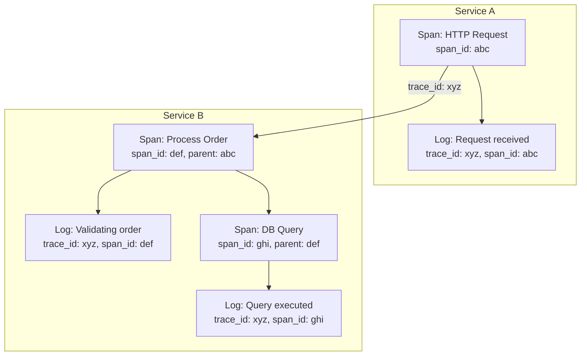

# How to Configure Log Correlation with Traces

Author: [nawazdhandala](https://www.github.com/nawazdhandala)

Tags: Log Correlation, Distributed Tracing, OpenTelemetry, Observability, Traces, Spans, Context Propagation

Description: Learn how to correlate logs with distributed traces for complete request visibility. This guide covers trace context injection, OpenTelemetry integration, and techniques for connecting logs to traces across microservices.

---

> When a request fails in a distributed system, you need to see both what happened (traces) and why it happened (logs). Correlating logs with traces lets you click from a span directly to all related log entries, making debugging dramatically faster.

Without correlation, you have two separate views of the same request. With correlation, you have one complete story. A trace shows you the request flow across services; correlated logs show you the details at each step.

---

## Understanding Trace Context

Distributed traces use context propagation to link operations across services:

**Trace ID**: A unique identifier for the entire request journey across all services. All operations in the same request share this ID.

**Span ID**: A unique identifier for a specific operation within the trace. Each service, database call, or function creates a new span.

**Parent Span ID**: Links child operations to their parent, creating the trace tree structure.



---

## Injecting Trace Context into Logs

Configure your logger to automatically include trace context:

```typescript
// correlation/logger.ts
// Logger with automatic trace context injection

import winston from 'winston';
import { trace, context, SpanContext } from '@opentelemetry/api';

// Custom format that injects trace context
const traceContextFormat = winston.format((info) => {
  const span = trace.getActiveSpan();

  if (span) {
    const spanContext = span.spanContext();
    info.trace_id = spanContext.traceId;
    info.span_id = spanContext.spanId;
    info.trace_flags = spanContext.traceFlags;

    // Include parent span if available
    const parentSpan = trace.getSpan(context.active());
    if (parentSpan && parentSpan !== span) {
      info.parent_span_id = parentSpan.spanContext().spanId;
    }
  }

  return info;
});

// Create logger with trace correlation
const logger = winston.createLogger({
  level: process.env.LOG_LEVEL || 'info',
  format: winston.format.combine(
    winston.format.timestamp(),
    traceContextFormat(),
    winston.format.json()
  ),
  defaultMeta: {
    service: process.env.SERVICE_NAME || 'unknown'
  },
  transports: [
    new winston.transports.Console()
  ]
});

export { logger };

// Usage - trace context is automatically included
// logger.info('Processing order', { orderId: '123' });
// Output:
// {
//   "timestamp": "2024-01-15T10:23:45.123Z",
//   "level": "info",
//   "message": "Processing order",
//   "orderId": "123",
//   "trace_id": "abc123def456...",
//   "span_id": "span789...",
//   "service": "order-service"
// }
```

---

## OpenTelemetry Integration

Set up OpenTelemetry with log correlation:

```typescript
// correlation/telemetry.ts
// OpenTelemetry setup with log correlation

import { NodeSDK } from '@opentelemetry/sdk-node';
import { Resource } from '@opentelemetry/resources';
import { SemanticResourceAttributes } from '@opentelemetry/semantic-conventions';
import { getNodeAutoInstrumentations } from '@opentelemetry/auto-instrumentations-node';
import { OTLPTraceExporter } from '@opentelemetry/exporter-trace-otlp-http';
import { OTLPLogExporter } from '@opentelemetry/exporter-logs-otlp-http';
import { BatchSpanProcessor } from '@opentelemetry/sdk-trace-base';
import { BatchLogRecordProcessor } from '@opentelemetry/sdk-logs';
import { WinstonInstrumentation } from '@opentelemetry/instrumentation-winston';

const traceExporter = new OTLPTraceExporter({
  url: process.env.OTEL_EXPORTER_OTLP_ENDPOINT + '/v1/traces'
});

const logExporter = new OTLPLogExporter({
  url: process.env.OTEL_EXPORTER_OTLP_ENDPOINT + '/v1/logs'
});

const sdk = new NodeSDK({
  resource: new Resource({
    [SemanticResourceAttributes.SERVICE_NAME]: process.env.SERVICE_NAME,
    [SemanticResourceAttributes.SERVICE_VERSION]: process.env.SERVICE_VERSION,
    [SemanticResourceAttributes.DEPLOYMENT_ENVIRONMENT]: process.env.NODE_ENV
  }),
  spanProcessor: new BatchSpanProcessor(traceExporter),
  logRecordProcessor: new BatchLogRecordProcessor(logExporter),
  instrumentations: [
    getNodeAutoInstrumentations({
      '@opentelemetry/instrumentation-fs': { enabled: false }
    }),
    new WinstonInstrumentation({
      // Automatically inject trace context into Winston logs
      logHook: (span, record) => {
        record['resource.service.name'] = process.env.SERVICE_NAME;
      }
    })
  ]
});

sdk.start();

// Graceful shutdown
process.on('SIGTERM', () => {
  sdk.shutdown()
    .then(() => console.log('Telemetry shut down'))
    .catch((error) => console.error('Error shutting down telemetry', error))
    .finally(() => process.exit(0));
});

export { sdk };
```

---

## Python Log Correlation

Implement correlation in Python applications:

```python
# correlation/logger.py
# Python logging with trace correlation

import logging
import json
from opentelemetry import trace
from opentelemetry.sdk.trace import TracerProvider
from opentelemetry.sdk.trace.export import BatchSpanProcessor
from opentelemetry.exporter.otlp.proto.http.trace_exporter import OTLPSpanExporter
from opentelemetry.instrumentation.logging import LoggingInstrumentor

# Initialize OpenTelemetry
trace.set_tracer_provider(TracerProvider())
tracer_provider = trace.get_tracer_provider()

# Configure OTLP exporter
otlp_exporter = OTLPSpanExporter(
    endpoint=os.environ.get("OTEL_EXPORTER_OTLP_ENDPOINT", "http://localhost:4318") + "/v1/traces"
)
tracer_provider.add_span_processor(BatchSpanProcessor(otlp_exporter))

# Instrument logging to automatically add trace context
LoggingInstrumentor().instrument(set_logging_format=True)


class TraceContextFilter(logging.Filter):
    """Filter that adds trace context to log records."""

    def filter(self, record):
        span = trace.get_current_span()

        if span.is_recording():
            ctx = span.get_span_context()
            record.trace_id = format(ctx.trace_id, '032x')
            record.span_id = format(ctx.span_id, '016x')
            record.trace_flags = ctx.trace_flags
        else:
            record.trace_id = '0' * 32
            record.span_id = '0' * 16
            record.trace_flags = 0

        return True


class JsonFormatter(logging.Formatter):
    """JSON formatter with trace context."""

    def format(self, record):
        log_record = {
            'timestamp': self.formatTime(record),
            'level': record.levelname,
            'message': record.getMessage(),
            'logger': record.name,
            'trace_id': getattr(record, 'trace_id', '0' * 32),
            'span_id': getattr(record, 'span_id', '0' * 16),
            'service': os.environ.get('SERVICE_NAME', 'unknown')
        }

        # Add exception info if present
        if record.exc_info:
            log_record['exception'] = self.formatException(record.exc_info)

        # Add extra fields
        for key, value in record.__dict__.items():
            if key not in ['name', 'msg', 'args', 'created', 'filename',
                           'funcName', 'levelname', 'levelno', 'lineno',
                           'module', 'msecs', 'pathname', 'process',
                           'processName', 'relativeCreated', 'stack_info',
                           'thread', 'threadName', 'exc_info', 'exc_text',
                           'trace_id', 'span_id', 'trace_flags', 'message']:
                log_record[key] = value

        return json.dumps(log_record)


def setup_logging():
    """Configure logging with trace correlation."""
    logger = logging.getLogger()
    logger.setLevel(logging.INFO)

    # Add trace context filter
    trace_filter = TraceContextFilter()
    logger.addFilter(trace_filter)

    # Configure handler with JSON formatter
    handler = logging.StreamHandler()
    handler.setFormatter(JsonFormatter())
    logger.addHandler(handler)

    return logger


# Usage
logger = setup_logging()

tracer = trace.get_tracer(__name__)

with tracer.start_as_current_span("process_order") as span:
    logger.info("Processing order", extra={"order_id": "123"})
    # Log automatically includes trace_id and span_id
```

---

## Context Propagation Across Services

Ensure trace context flows between services:

```typescript
// correlation/propagation.ts
// HTTP client with trace context propagation

import { trace, context, propagation, SpanKind } from '@opentelemetry/api';
import axios, { AxiosInstance, AxiosRequestConfig } from 'axios';

class TracedHttpClient {
  private client: AxiosInstance;
  private tracer = trace.getTracer('http-client');

  constructor(baseURL: string) {
    this.client = axios.create({ baseURL });

    // Add request interceptor to inject trace context
    this.client.interceptors.request.use((config) => {
      const span = trace.getActiveSpan();

      if (span) {
        // Inject trace context into headers
        const headers: Record<string, string> = {};
        propagation.inject(context.active(), headers);

        config.headers = {
          ...config.headers,
          ...headers
        };

        // Log the outgoing request with trace context
        logger.debug('Outgoing HTTP request', {
          method: config.method,
          url: config.url,
          trace_id: span.spanContext().traceId
        });
      }

      return config;
    });
  }

  async get<T>(url: string, config?: AxiosRequestConfig): Promise<T> {
    return this.tracer.startActiveSpan(
      `HTTP GET ${url}`,
      { kind: SpanKind.CLIENT },
      async (span) => {
        try {
          const response = await this.client.get<T>(url, config);
          span.setAttributes({
            'http.status_code': response.status,
            'http.url': url
          });
          return response.data;
        } catch (error) {
          span.recordException(error as Error);
          throw error;
        } finally {
          span.end();
        }
      }
    );
  }

  async post<T>(url: string, data: unknown, config?: AxiosRequestConfig): Promise<T> {
    return this.tracer.startActiveSpan(
      `HTTP POST ${url}`,
      { kind: SpanKind.CLIENT },
      async (span) => {
        try {
          const response = await this.client.post<T>(url, data, config);
          span.setAttributes({
            'http.status_code': response.status,
            'http.url': url
          });
          return response.data;
        } catch (error) {
          span.recordException(error as Error);
          throw error;
        } finally {
          span.end();
        }
      }
    );
  }
}

// Server-side: Extract trace context from incoming requests
import { Request, Response, NextFunction } from 'express';

function traceContextMiddleware(req: Request, res: Response, next: NextFunction) {
  // Extract trace context from headers
  const extractedContext = propagation.extract(context.active(), req.headers);

  // Run the request handler within the extracted context
  context.with(extractedContext, () => {
    const tracer = trace.getTracer('http-server');

    const span = tracer.startSpan(`${req.method} ${req.path}`, {
      kind: SpanKind.SERVER,
      attributes: {
        'http.method': req.method,
        'http.url': req.url,
        'http.target': req.path
      }
    });

    // Make span available for logging
    context.with(trace.setSpan(context.active(), span), () => {
      logger.info('Incoming request', {
        method: req.method,
        path: req.path
      });

      res.on('finish', () => {
        span.setAttributes({ 'http.status_code': res.statusCode });
        span.end();
      });

      next();
    });
  });
}
```

---

## Querying Correlated Data

Query logs and traces together in your observability platform:

```typescript
// correlation/query.ts
// Query service for correlated logs and traces

interface CorrelatedView {
  trace: Trace;
  spans: Span[];
  logs: LogEntry[];
}

class CorrelationQueryService {
  private traceStore: TraceStore;
  private logStore: LogStore;

  async getCorrelatedView(traceId: string): Promise<CorrelatedView> {
    // Fetch trace and its spans
    const trace = await this.traceStore.getTrace(traceId);
    const spans = await this.traceStore.getSpans(traceId);

    // Fetch all logs for this trace
    const logs = await this.logStore.query({
      filter: { trace_id: traceId },
      sort: { timestamp: 'asc' }
    });

    return { trace, spans, logs };
  }

  async getLogsForSpan(traceId: string, spanId: string): Promise<LogEntry[]> {
    return this.logStore.query({
      filter: {
        trace_id: traceId,
        span_id: spanId
      },
      sort: { timestamp: 'asc' }
    });
  }

  async findTracesWithErrors(timeRange: TimeRange): Promise<TraceWithLogs[]> {
    // Find logs with error level
    const errorLogs = await this.logStore.query({
      filter: {
        level: 'error',
        timestamp: { $gte: timeRange.start, $lte: timeRange.end }
      }
    });

    // Get unique trace IDs
    const traceIds = [...new Set(errorLogs.map(log => log.trace_id))];

    // Fetch correlated data for each trace
    const results: TraceWithLogs[] = [];

    for (const traceId of traceIds) {
      const view = await this.getCorrelatedView(traceId);
      results.push({
        ...view,
        errorLogs: view.logs.filter(log => log.level === 'error')
      });
    }

    return results;
  }

  // Find slow spans and their logs
  async findSlowOperations(
    minDurationMs: number,
    timeRange: TimeRange
  ): Promise<SpanWithLogs[]> {
    const slowSpans = await this.traceStore.querySpans({
      filter: {
        duration_ms: { $gte: minDurationMs },
        start_time: { $gte: timeRange.start, $lte: timeRange.end }
      }
    });

    const results: SpanWithLogs[] = [];

    for (const span of slowSpans) {
      const logs = await this.getLogsForSpan(span.trace_id, span.span_id);
      results.push({ span, logs });
    }

    return results;
  }
}
```

---

## Grafana and Loki Integration

Configure Grafana to link logs and traces:

```yaml
# grafana/datasources.yaml
apiVersion: 1

datasources:
  - name: Loki
    type: loki
    access: proxy
    url: http://loki:3100
    jsonData:
      derivedFields:
        # Link from log to trace
        - datasourceUid: tempo
          matcherRegex: '"trace_id":"([a-f0-9]+)"'
          name: TraceID
          url: '$${__value.raw}'
        # Link from log to span
        - datasourceUid: tempo
          matcherRegex: '"span_id":"([a-f0-9]+)"'
          name: SpanID
          url: '$${__value.raw}'

  - name: Tempo
    type: tempo
    access: proxy
    url: http://tempo:3200
    jsonData:
      tracesToLogs:
        datasourceUid: loki
        tags: ['service.name']
        mappedTags: [{ key: 'service.name', value: 'service' }]
        mapTagNamesEnabled: true
        spanStartTimeShift: '-1h'
        spanEndTimeShift: '1h'
        filterByTraceID: true
        filterBySpanID: true
```

---

## Troubleshooting Correlation Issues

Common issues and solutions:

```typescript
// correlation/debug.ts
// Debug utilities for correlation issues

class CorrelationDebugger {
  // Check if trace context is present
  static checkContext(): void {
    const span = trace.getActiveSpan();

    if (!span) {
      console.warn('No active span - logs will not have trace context');
      return;
    }

    const ctx = span.spanContext();
    console.log('Active trace context:', {
      traceId: ctx.traceId,
      spanId: ctx.spanId,
      traceFlags: ctx.traceFlags,
      isRecording: span.isRecording()
    });
  }

  // Verify headers contain trace context
  static checkHeaders(headers: Record<string, string>): void {
    const traceParent = headers['traceparent'];
    const traceState = headers['tracestate'];

    if (!traceParent) {
      console.warn('No traceparent header - context will not propagate');
      return;
    }

    // Parse W3C trace context
    const parts = traceParent.split('-');
    console.log('Trace context from headers:', {
      version: parts[0],
      traceId: parts[1],
      spanId: parts[2],
      flags: parts[3],
      traceState
    });
  }

  // Validate log has correlation
  static validateLog(log: Record<string, unknown>): boolean {
    const hasTraceId = typeof log.trace_id === 'string' && log.trace_id.length === 32;
    const hasSpanId = typeof log.span_id === 'string' && log.span_id.length === 16;

    if (!hasTraceId || !hasSpanId) {
      console.warn('Log missing correlation:', {
        hasTraceId,
        hasSpanId,
        log
      });
      return false;
    }

    return true;
  }
}

// Middleware to debug correlation in development
function debugCorrelationMiddleware(req: Request, res: Response, next: NextFunction) {
  if (process.env.NODE_ENV === 'development') {
    console.log('=== Correlation Debug ===');
    CorrelationDebugger.checkHeaders(req.headers as Record<string, string>);
    CorrelationDebugger.checkContext();
    console.log('========================');
  }
  next();
}
```

---

## Summary

Log correlation with traces provides complete visibility into distributed requests:

1. **Inject trace context** into all logs automatically
2. **Propagate context** across service boundaries via headers
3. **Use OpenTelemetry** for standardized correlation
4. **Configure your observability platform** to link logs and traces
5. **Query correlated data** to debug issues efficiently

When logs and traces are correlated, debugging transforms from searching through multiple systems to following a single story from request to response.

---

*Want automatic log-trace correlation without the setup complexity? [OneUptime](https://oneuptime.com) provides built-in correlation between logs, traces, and metrics using OpenTelemetry, so you can see the complete picture of every request.*
