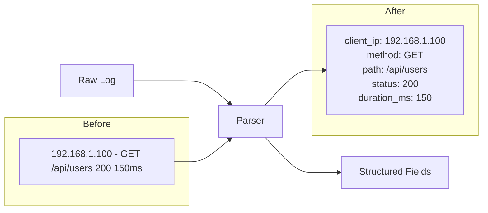

# How to Implement Log Parsing and Enrichment

Author: [nawazdhandala](https://www.github.com/nawazdhandala)

Tags: Log Parsing, Log Enrichment, Grok, Regex, Data Pipeline, Log Processing, Observability

Description: Learn how to implement log parsing and enrichment to transform raw logs into structured, queryable data. This guide covers parsing patterns, field extraction, data enrichment, and building efficient processing pipelines.

---

> Raw logs are often unstructured text that is difficult to search and analyze. Parsing extracts structured fields from log messages, while enrichment adds valuable context like geographic data, user information, or service metadata.

When a log entry reads "192.168.1.100 - GET /api/users 200 150ms", you cannot easily filter by response time or aggregate by status code. After parsing, each piece becomes a queryable field. After enrichment, you might also know the country of origin and the user's account tier.

---

## Understanding Log Parsing

Parsing transforms unstructured text into structured data:



---

## Regex-Based Parsing

Build parsers using regular expressions:

```typescript
// parsing/regex-parser.ts
// Regex-based log parsing

interface ParsedLog {
  raw: string;
  fields: Record<string, unknown>;
  parseTime?: number;
}

interface ParserRule {
  name: string;
  pattern: RegExp;
  fieldTypes?: Record<string, 'string' | 'number' | 'boolean' | 'date'>;
}

class RegexLogParser {
  private rules: ParserRule[] = [];

  addRule(rule: ParserRule): void {
    this.rules.push(rule);
  }

  parse(logLine: string): ParsedLog {
    const startTime = performance.now();

    for (const rule of this.rules) {
      const match = rule.pattern.exec(logLine);

      if (match && match.groups) {
        const fields = this.convertTypes(match.groups, rule.fieldTypes || {});

        return {
          raw: logLine,
          fields,
          parseTime: performance.now() - startTime
        };
      }
    }

    // No match - return raw
    return {
      raw: logLine,
      fields: { message: logLine },
      parseTime: performance.now() - startTime
    };
  }

  private convertTypes(
    groups: Record<string, string>,
    types: Record<string, string>
  ): Record<string, unknown> {
    const result: Record<string, unknown> = {};

    for (const [key, value] of Object.entries(groups)) {
      if (value === undefined) continue;

      const type = types[key] || 'string';

      switch (type) {
        case 'number':
          result[key] = parseFloat(value);
          break;
        case 'boolean':
          result[key] = value.toLowerCase() === 'true';
          break;
        case 'date':
          result[key] = new Date(value).toISOString();
          break;
        default:
          result[key] = value;
      }
    }

    return result;
  }
}

// Common log format patterns
const parser = new RegexLogParser();

// Apache/Nginx combined log format
parser.addRule({
  name: 'combined',
  pattern: /^(?<client_ip>\S+) (?<ident>\S+) (?<user>\S+) \[(?<timestamp>[^\]]+)\] "(?<method>\w+) (?<path>\S+) (?<protocol>\S+)" (?<status>\d+) (?<bytes>\d+) "(?<referrer>[^"]*)" "(?<user_agent>[^"]*)"/,
  fieldTypes: {
    status: 'number',
    bytes: 'number'
  }
});

// JSON log format
parser.addRule({
  name: 'json',
  pattern: /^(?<json>\{.*\})$/,
  // JSON parsing handled separately
});

// Syslog format
parser.addRule({
  name: 'syslog',
  pattern: /^(?<timestamp>\w{3}\s+\d+\s+\d+:\d+:\d+)\s+(?<hostname>\S+)\s+(?<program>\S+?)(?:\[(?<pid>\d+)\])?: (?<message>.*)$/,
  fieldTypes: {
    pid: 'number'
  }
});

// Application log format
parser.addRule({
  name: 'application',
  pattern: /^(?<timestamp>\d{4}-\d{2}-\d{2}[T ]\d{2}:\d{2}:\d{2}(?:\.\d+)?(?:Z|[+-]\d{2}:?\d{2})?)\s+(?<level>\w+)\s+(?:\[(?<component>[^\]]+)\])?\s*(?<message>.*)$/,
  fieldTypes: {
    timestamp: 'date'
  }
});
```

---

## Grok Pattern Parsing

Use Grok patterns for more readable parsing:

```typescript
// parsing/grok-parser.ts
// Grok-style pattern parsing

class GrokParser {
  private patterns: Map<string, string> = new Map();

  constructor() {
    this.loadDefaultPatterns();
  }

  private loadDefaultPatterns(): void {
    // Base patterns
    this.patterns.set('WORD', '\\w+');
    this.patterns.set('NOTSPACE', '\\S+');
    this.patterns.set('SPACE', '\\s+');
    this.patterns.set('DATA', '.*?');
    this.patterns.set('GREEDYDATA', '.*');
    this.patterns.set('INT', '[+-]?\\d+');
    this.patterns.set('NUMBER', '[+-]?(?:\\d+(?:\\.\\d+)?|\\.\\d+)');
    this.patterns.set('POSINT', '\\d+');

    // Network patterns
    this.patterns.set('IP', '(?:\\d{1,3}\\.){3}\\d{1,3}');
    this.patterns.set('IPV6', '(?:[0-9a-fA-F]{1,4}:){7}[0-9a-fA-F]{1,4}');
    this.patterns.set('HOSTNAME', '\\b(?:[0-9A-Za-z][0-9A-Za-z-]{0,62})(?:\\.(?:[0-9A-Za-z][0-9A-Za-z-]{0,62}))*(?:\\.?|\\b)');
    this.patterns.set('IPORHOST', '(?:%{IP}|%{HOSTNAME})');
    this.patterns.set('HOSTPORT', '%{IPORHOST}:%{POSINT}');

    // Date/time patterns
    this.patterns.set('MONTH', '(?:Jan|Feb|Mar|Apr|May|Jun|Jul|Aug|Sep|Oct|Nov|Dec)');
    this.patterns.set('MONTHDAY', '(?:0[1-9]|[12]\\d|3[01]|[1-9])');
    this.patterns.set('YEAR', '\\d{4}');
    this.patterns.set('HOUR', '(?:[01]\\d|2[0-3])');
    this.patterns.set('MINUTE', '[0-5]\\d');
    this.patterns.set('SECOND', '[0-5]\\d');
    this.patterns.set('TIME', '%{HOUR}:%{MINUTE}:%{SECOND}');
    this.patterns.set('TIMESTAMP_ISO8601', '%{YEAR}-%{MONTHDAY}-%{MONTHDAY}[T ]%{TIME}(?:\\.\\d+)?(?:Z|[+-]\\d{2}:?\\d{2})?');

    // HTTP patterns
    this.patterns.set('HTTPMETHOD', '(?:GET|POST|PUT|DELETE|PATCH|HEAD|OPTIONS|CONNECT|TRACE)');
    this.patterns.set('URIPATH', '(?:/[^\\s?#]*)?');
    this.patterns.set('URIQUERY', '(?:\\?[^\\s#]*)?');
    this.patterns.set('URIPARAM', '%{URIPATH}%{URIQUERY}');
    this.patterns.set('HTTPVERSION', 'HTTP/\\d+\\.\\d+');

    // Log level
    this.patterns.set('LOGLEVEL', '(?:DEBUG|INFO|WARN(?:ING)?|ERROR|FATAL|CRITICAL|TRACE)');

    // Common log format
    this.patterns.set('COMMONAPACHELOG', '%{IPORHOST:client_ip} %{NOTSPACE:ident} %{NOTSPACE:user} \\[%{DATA:timestamp}\\] "%{HTTPMETHOD:method} %{URIPARAM:path} %{HTTPVERSION:protocol}" %{INT:status} %{INT:bytes}');
    this.patterns.set('COMBINEDAPACHELOG', '%{COMMONAPACHELOG} "%{DATA:referrer}" "%{DATA:user_agent}"');
  }

  addPattern(name: string, pattern: string): void {
    this.patterns.set(name, pattern);
  }

  compile(grokPattern: string): RegExp {
    let regex = grokPattern;

    // Replace named captures: %{PATTERN:name}
    regex = regex.replace(/%\{(\w+):(\w+)\}/g, (_, patternName, captureName) => {
      const pattern = this.resolvePattern(patternName);
      return `(?<${captureName}>${pattern})`;
    });

    // Replace unnamed patterns: %{PATTERN}
    regex = regex.replace(/%\{(\w+)\}/g, (_, patternName) => {
      return this.resolvePattern(patternName);
    });

    return new RegExp(`^${regex}$`);
  }

  private resolvePattern(name: string): string {
    const pattern = this.patterns.get(name);
    if (!pattern) {
      throw new Error(`Unknown pattern: ${name}`);
    }

    // Recursively resolve nested patterns
    if (pattern.includes('%{')) {
      return this.compile(pattern).source.slice(1, -1); // Remove ^ and $
    }

    return pattern;
  }

  parse(grokPattern: string, input: string): Record<string, string> | null {
    const regex = this.compile(grokPattern);
    const match = regex.exec(input);

    if (match && match.groups) {
      return match.groups;
    }

    return null;
  }
}

// Usage
const grok = new GrokParser();

// Parse nginx logs
const nginxPattern = '%{COMBINEDAPACHELOG}';
const nginxLog = '192.168.1.100 - - [15/Jan/2024:10:23:45 +0000] "GET /api/users HTTP/1.1" 200 1234 "-" "Mozilla/5.0"';
const parsed = grok.parse(nginxPattern, nginxLog);
// { client_ip: '192.168.1.100', method: 'GET', path: '/api/users', status: '200', ... }

// Custom application log pattern
grok.addPattern('APPLOG', '%{TIMESTAMP_ISO8601:timestamp} %{LOGLEVEL:level} \\[%{WORD:service}\\] %{GREEDYDATA:message}');
const appLog = '2024-01-15T10:23:45.123Z INFO [user-service] User login successful';
const parsedApp = grok.parse('%{APPLOG}', appLog);
```

---

## Log Enrichment

Add context to parsed logs:

```typescript
// enrichment/enricher.ts
// Log enrichment pipeline

interface EnrichmentPlugin {
  name: string;
  enrich(log: ParsedLog): Promise<Record<string, unknown>>;
}

class LogEnricher {
  private plugins: EnrichmentPlugin[] = [];

  addPlugin(plugin: EnrichmentPlugin): void {
    this.plugins.push(plugin);
  }

  async enrich(log: ParsedLog): Promise<ParsedLog> {
    const enrichedFields = { ...log.fields };

    for (const plugin of this.plugins) {
      try {
        const additions = await plugin.enrich(log);
        Object.assign(enrichedFields, additions);
      } catch (error) {
        console.error(`Enrichment plugin ${plugin.name} failed:`, error);
      }
    }

    return {
      ...log,
      fields: enrichedFields
    };
  }
}

// GeoIP enrichment
class GeoIPEnrichment implements EnrichmentPlugin {
  name = 'geoip';
  private reader: maxmind.Reader<maxmind.CityResponse>;

  constructor(databasePath: string) {
    this.reader = maxmind.openSync(databasePath);
  }

  async enrich(log: ParsedLog): Promise<Record<string, unknown>> {
    const ip = log.fields.client_ip as string;
    if (!ip) return {};

    const result = this.reader.get(ip);
    if (!result) return {};

    return {
      geo: {
        country_code: result.country?.iso_code,
        country_name: result.country?.names?.en,
        region: result.subdivisions?.[0]?.names?.en,
        city: result.city?.names?.en,
        latitude: result.location?.latitude,
        longitude: result.location?.longitude,
        timezone: result.location?.time_zone
      }
    };
  }
}

// User agent parsing
class UserAgentEnrichment implements EnrichmentPlugin {
  name = 'user_agent';
  private parser = new UAParser();

  async enrich(log: ParsedLog): Promise<Record<string, unknown>> {
    const ua = log.fields.user_agent as string;
    if (!ua) return {};

    this.parser.setUA(ua);
    const result = this.parser.getResult();

    return {
      user_agent_parsed: {
        browser: {
          name: result.browser.name,
          version: result.browser.version
        },
        os: {
          name: result.os.name,
          version: result.os.version
        },
        device: {
          type: result.device.type || 'desktop',
          vendor: result.device.vendor,
          model: result.device.model
        },
        is_bot: this.isBot(ua)
      }
    };
  }

  private isBot(ua: string): boolean {
    const botPatterns = [
      /bot/i, /crawler/i, /spider/i, /scraper/i,
      /googlebot/i, /bingbot/i, /slurp/i
    ];
    return botPatterns.some(p => p.test(ua));
  }
}

// Service metadata enrichment
class ServiceMetadataEnrichment implements EnrichmentPlugin {
  name = 'service_metadata';
  private serviceRegistry: Map<string, ServiceInfo> = new Map();

  registerService(name: string, info: ServiceInfo): void {
    this.serviceRegistry.set(name, info);
  }

  async enrich(log: ParsedLog): Promise<Record<string, unknown>> {
    const service = log.fields.service as string;
    if (!service) return {};

    const info = this.serviceRegistry.get(service);
    if (!info) return {};

    return {
      service_metadata: {
        team: info.team,
        tier: info.tier,
        environment: info.environment,
        version: info.version,
        oncall: info.oncallEmail
      }
    };
  }
}

// Lookup enrichment from external source
class LookupEnrichment implements EnrichmentPlugin {
  name = 'lookup';
  private cache: Map<string, unknown> = new Map();
  private lookupFn: (key: string) => Promise<unknown>;
  private keyField: string;
  private outputField: string;

  constructor(config: {
    keyField: string;
    outputField: string;
    lookup: (key: string) => Promise<unknown>;
  }) {
    this.keyField = config.keyField;
    this.outputField = config.outputField;
    this.lookupFn = config.lookup;
  }

  async enrich(log: ParsedLog): Promise<Record<string, unknown>> {
    const key = log.fields[this.keyField] as string;
    if (!key) return {};

    // Check cache
    if (this.cache.has(key)) {
      return { [this.outputField]: this.cache.get(key) };
    }

    try {
      const value = await this.lookupFn(key);
      this.cache.set(key, value);
      return { [this.outputField]: value };
    } catch (error) {
      return {};
    }
  }
}

// Usage example
const enricher = new LogEnricher();
enricher.addPlugin(new GeoIPEnrichment('/usr/share/GeoIP/GeoLite2-City.mmdb'));
enricher.addPlugin(new UserAgentEnrichment());
enricher.addPlugin(new ServiceMetadataEnrichment());

// Add user lookup
enricher.addPlugin(new LookupEnrichment({
  keyField: 'user_id',
  outputField: 'user',
  lookup: async (userId) => {
    // Fetch from user service or database
    return { name: 'John Doe', tier: 'premium' };
  }
}));
```

---

## Processing Pipeline

Build an efficient processing pipeline:

```typescript
// pipeline/processor.ts
// Log processing pipeline

interface PipelineStage {
  name: string;
  process(logs: ParsedLog[]): Promise<ParsedLog[]>;
}

class LogProcessingPipeline {
  private stages: PipelineStage[] = [];
  private metrics: PipelineMetrics;

  addStage(stage: PipelineStage): void {
    this.stages.push(stage);
  }

  async process(logs: ParsedLog[]): Promise<ParsedLog[]> {
    let current = logs;

    for (const stage of this.stages) {
      const startTime = Date.now();

      try {
        current = await stage.process(current);
        this.metrics.recordStage(stage.name, Date.now() - startTime, current.length);
      } catch (error) {
        this.metrics.recordError(stage.name);
        throw error;
      }
    }

    return current;
  }
}

// Parsing stage
class ParsingStage implements PipelineStage {
  name = 'parsing';
  private parser: RegexLogParser;

  constructor(parser: RegexLogParser) {
    this.parser = parser;
  }

  async process(logs: ParsedLog[]): Promise<ParsedLog[]> {
    return logs.map(log => {
      if (log.fields.message && typeof log.fields.message === 'string') {
        const parsed = this.parser.parse(log.fields.message);
        return {
          ...log,
          fields: { ...log.fields, ...parsed.fields }
        };
      }
      return log;
    });
  }
}

// Filtering stage
class FilteringStage implements PipelineStage {
  name = 'filtering';
  private filters: ((log: ParsedLog) => boolean)[];

  constructor(filters: ((log: ParsedLog) => boolean)[]) {
    this.filters = filters;
  }

  async process(logs: ParsedLog[]): Promise<ParsedLog[]> {
    return logs.filter(log => {
      // Keep log if it passes all filters
      return this.filters.every(filter => filter(log));
    });
  }
}

// Enrichment stage
class EnrichmentStage implements PipelineStage {
  name = 'enrichment';
  private enricher: LogEnricher;

  constructor(enricher: LogEnricher) {
    this.enricher = enricher;
  }

  async process(logs: ParsedLog[]): Promise<ParsedLog[]> {
    // Process in batches for efficiency
    const batchSize = 100;
    const results: ParsedLog[] = [];

    for (let i = 0; i < logs.length; i += batchSize) {
      const batch = logs.slice(i, i + batchSize);
      const enriched = await Promise.all(
        batch.map(log => this.enricher.enrich(log))
      );
      results.push(...enriched);
    }

    return results;
  }
}

// Transformation stage
class TransformationStage implements PipelineStage {
  name = 'transformation';
  private transforms: ((log: ParsedLog) => ParsedLog)[];

  constructor(transforms: ((log: ParsedLog) => ParsedLog)[]) {
    this.transforms = transforms;
  }

  async process(logs: ParsedLog[]): Promise<ParsedLog[]> {
    return logs.map(log => {
      let current = log;
      for (const transform of this.transforms) {
        current = transform(current);
      }
      return current;
    });
  }
}

// Build pipeline
const pipeline = new LogProcessingPipeline();

pipeline.addStage(new ParsingStage(parser));

pipeline.addStage(new FilteringStage([
  // Drop health check logs
  (log) => !String(log.fields.path || '').includes('/health'),
  // Drop debug logs in production
  (log) => log.fields.level !== 'debug' || process.env.NODE_ENV !== 'production'
]));

pipeline.addStage(new EnrichmentStage(enricher));

pipeline.addStage(new TransformationStage([
  // Normalize log levels
  (log) => ({
    ...log,
    fields: {
      ...log.fields,
      level: String(log.fields.level || 'info').toLowerCase()
    }
  }),
  // Add processing timestamp
  (log) => ({
    ...log,
    fields: {
      ...log.fields,
      processed_at: new Date().toISOString()
    }
  })
]));
```

---

## Summary

Effective log parsing and enrichment transforms raw logs into actionable data:

1. **Choose the right parsing approach**: Regex for simple patterns, Grok for complex logs
2. **Build reusable parsers**: Create a library of patterns for common log formats
3. **Enrich with context**: Add geographic, user, and service metadata
4. **Process efficiently**: Use pipelines with batching and caching
5. **Handle failures gracefully**: Log parsing should not fail the entire pipeline

Good parsing and enrichment dramatically improves your ability to search, filter, and analyze logs. The investment in building robust parsers pays off in faster debugging and better insights.

---

*Want automatic log parsing without the configuration? [OneUptime](https://oneuptime.com) provides intelligent log parsing that automatically detects formats, extracts fields, and enriches your data with relevant context.*
