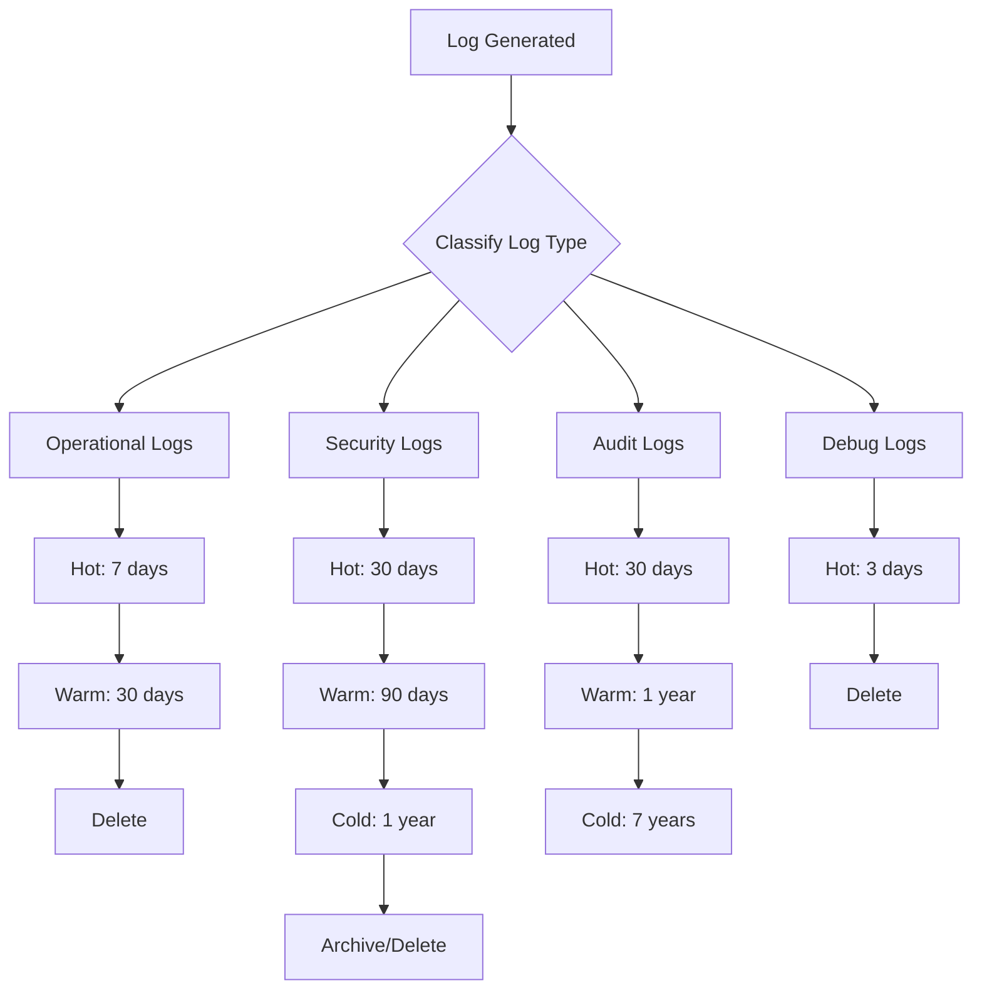

# How to Configure Log Retention Policies

Author: [nawazdhandala](https://www.github.com/nawazdhandala)

Tags: Log Retention, Compliance, Data Management, Storage, GDPR, SOC2, Log Management, DevOps

Description: Learn how to configure log retention policies that balance operational needs, storage costs, and compliance requirements. This guide covers retention strategies, tiered storage, and automated lifecycle management.

---

> Log retention policies define how long you keep logs and what happens to them over time. Get this wrong and you either waste money storing useless data or delete evidence you desperately need during an incident investigation.

The right retention period depends on many factors: regulatory requirements, operational needs, storage costs, and your team's debugging patterns. Most organizations need different retention periods for different log types.

---

## Factors Affecting Retention Decisions

Before setting retention policies, consider these factors:

**Compliance Requirements**: GDPR, HIPAA, SOC2, PCI-DSS, and industry regulations often mandate specific retention periods.

**Operational Needs**: How far back do you typically need to investigate? Most debugging happens within 7 days, but some issues take weeks to surface.

**Storage Costs**: Log storage can be expensive. Calculate the cost per GB per month for your logging infrastructure.

**Legal Hold Requirements**: Some data must be preserved for litigation or regulatory investigations.

**Data Privacy**: Some regulations require deletion after a certain period.



---

## Compliance-Based Retention Requirements

Different regulations have different requirements:

| Regulation | Log Type | Minimum Retention |
|------------|----------|-------------------|
| GDPR | Personal data logs | Delete when no longer needed |
| HIPAA | Healthcare access logs | 6 years |
| SOC2 | Security audit logs | 1 year minimum |
| PCI-DSS | Cardholder data access | 1 year, 3 months immediate |
| GLBA | Financial records | 6 years |
| SOX | Financial audit trails | 7 years |

Implement policies that meet the strictest applicable requirement:

```yaml
# retention-policy.yaml
# Log retention configuration by category

policies:
  # Security and audit logs - longest retention
  security_audit:
    description: "Security events, authentication, authorization"
    hot_retention_days: 30
    warm_retention_days: 365
    cold_retention_days: 2555  # 7 years
    compliance:
      - SOX
      - SOC2
      - PCI-DSS

  # Application operational logs
  application:
    description: "Application errors, warnings, info"
    hot_retention_days: 14
    warm_retention_days: 90
    cold_retention_days: 365
    compliance:
      - SOC2

  # Access and request logs
  access:
    description: "HTTP access logs, API requests"
    hot_retention_days: 7
    warm_retention_days: 30
    cold_retention_days: 90
    compliance:
      - PCI-DSS

  # Debug and trace logs
  debug:
    description: "Debug output, trace data"
    hot_retention_days: 3
    warm_retention_days: 0
    cold_retention_days: 0
    compliance: []

  # Personal data logs (GDPR)
  personal_data:
    description: "Logs containing PII"
    hot_retention_days: 7
    warm_retention_days: 23  # 30 days total
    cold_retention_days: 0
    compliance:
      - GDPR
    notes: "Must delete when no longer needed for stated purpose"
```

---

## Implementing Tiered Storage

Move logs through storage tiers as they age:

```typescript
// retention/tiered-storage.ts
// Tiered storage manager for logs

interface StorageTier {
  name: string;
  maxAgeDays: number;
  storageClass: string;
  compressed: boolean;
  indexed: boolean;
}

interface RetentionPolicy {
  logType: string;
  tiers: StorageTier[];
}

class TieredStorageManager {
  private policies: Map<string, RetentionPolicy> = new Map();

  definePolicy(policy: RetentionPolicy): void {
    this.policies.set(policy.logType, policy);
  }

  async applyPolicies(): Promise<void> {
    for (const [logType, policy] of this.policies) {
      await this.processLogType(logType, policy);
    }
  }

  private async processLogType(logType: string, policy: RetentionPolicy): Promise<void> {
    const now = new Date();

    for (let i = 0; i < policy.tiers.length; i++) {
      const currentTier = policy.tiers[i];
      const nextTier = policy.tiers[i + 1];

      if (nextTier) {
        // Move logs from current tier to next tier
        const cutoffDate = new Date(now.getTime() - currentTier.maxAgeDays * 24 * 60 * 60 * 1000);
        await this.migrateToTier(logType, currentTier, nextTier, cutoffDate);
      } else {
        // Delete logs older than the last tier's max age
        const cutoffDate = new Date(now.getTime() - currentTier.maxAgeDays * 24 * 60 * 60 * 1000);
        await this.deleteLogs(logType, cutoffDate);
      }
    }
  }

  private async migrateToTier(
    logType: string,
    fromTier: StorageTier,
    toTier: StorageTier,
    cutoffDate: Date
  ): Promise<void> {
    console.log(`Migrating ${logType} logs older than ${cutoffDate.toISOString()} from ${fromTier.name} to ${toTier.name}`);

    // Implementation depends on your storage backend
    // Example: Move from hot Elasticsearch to warm S3

    if (toTier.compressed && !fromTier.compressed) {
      // Compress during migration
    }

    if (!toTier.indexed && fromTier.indexed) {
      // Remove from index during migration
    }
  }

  private async deleteLogs(logType: string, olderThan: Date): Promise<void> {
    console.log(`Deleting ${logType} logs older than ${olderThan.toISOString()}`);
    // Implementation depends on your storage backend
  }
}

// Configure policies
const manager = new TieredStorageManager();

manager.definePolicy({
  logType: 'application',
  tiers: [
    {
      name: 'hot',
      maxAgeDays: 7,
      storageClass: 'elasticsearch-hot',
      compressed: false,
      indexed: true
    },
    {
      name: 'warm',
      maxAgeDays: 30,
      storageClass: 'elasticsearch-warm',
      compressed: true,
      indexed: true
    },
    {
      name: 'cold',
      maxAgeDays: 365,
      storageClass: 's3-glacier',
      compressed: true,
      indexed: false
    }
  ]
});
```

---

## Elasticsearch Index Lifecycle Management

Use ILM for automated retention in Elasticsearch:

```json
{
  "policy": {
    "phases": {
      "hot": {
        "min_age": "0ms",
        "actions": {
          "rollover": {
            "max_primary_shard_size": "50gb",
            "max_age": "1d"
          },
          "set_priority": {
            "priority": 100
          }
        }
      },
      "warm": {
        "min_age": "7d",
        "actions": {
          "shrink": {
            "number_of_shards": 1
          },
          "forcemerge": {
            "max_num_segments": 1
          },
          "allocate": {
            "require": {
              "data": "warm"
            }
          },
          "set_priority": {
            "priority": 50
          }
        }
      },
      "cold": {
        "min_age": "30d",
        "actions": {
          "allocate": {
            "require": {
              "data": "cold"
            }
          },
          "set_priority": {
            "priority": 0
          },
          "searchable_snapshot": {
            "snapshot_repository": "logs-repository"
          }
        }
      },
      "frozen": {
        "min_age": "90d",
        "actions": {
          "searchable_snapshot": {
            "snapshot_repository": "logs-repository",
            "force_merge_index": true
          }
        }
      },
      "delete": {
        "min_age": "365d",
        "actions": {
          "delete": {}
        }
      }
    }
  }
}
```

Apply the policy to an index template:

```bash
# Create the ILM policy
curl -X PUT "localhost:9200/_ilm/policy/logs-retention-policy" \
  -H "Content-Type: application/json" \
  -d @ilm-policy.json

# Create index template that uses the policy
curl -X PUT "localhost:9200/_index_template/logs-template" \
  -H "Content-Type: application/json" \
  -d '{
    "index_patterns": ["logs-*"],
    "template": {
      "settings": {
        "index.lifecycle.name": "logs-retention-policy",
        "index.lifecycle.rollover_alias": "logs"
      }
    }
  }'
```

---

## AWS S3 Lifecycle Policies

Configure S3 lifecycle rules for log archives:

```json
{
  "Rules": [
    {
      "ID": "MoveToGlacierAfter90Days",
      "Filter": {
        "Prefix": "logs/application/"
      },
      "Status": "Enabled",
      "Transitions": [
        {
          "Days": 30,
          "StorageClass": "STANDARD_IA"
        },
        {
          "Days": 90,
          "StorageClass": "GLACIER"
        },
        {
          "Days": 365,
          "StorageClass": "DEEP_ARCHIVE"
        }
      ],
      "Expiration": {
        "Days": 2555
      }
    },
    {
      "ID": "DeleteDebugLogsAfter7Days",
      "Filter": {
        "Prefix": "logs/debug/"
      },
      "Status": "Enabled",
      "Expiration": {
        "Days": 7
      }
    },
    {
      "ID": "AuditLogsCompliance",
      "Filter": {
        "Prefix": "logs/audit/"
      },
      "Status": "Enabled",
      "Transitions": [
        {
          "Days": 90,
          "StorageClass": "GLACIER"
        }
      ],
      "Expiration": {
        "Days": 2555
      },
      "NoncurrentVersionExpiration": {
        "NoncurrentDays": 30
      }
    }
  ]
}
```

Apply via AWS CLI:

```bash
aws s3api put-bucket-lifecycle-configuration \
  --bucket my-logs-bucket \
  --lifecycle-configuration file://lifecycle-policy.json
```

---

## Legal Hold and Preservation

Implement legal hold capabilities for litigation:

```typescript
// retention/legal-hold.ts
// Legal hold management for log preservation

interface LegalHold {
  id: string;
  name: string;
  reason: string;
  createdAt: Date;
  createdBy: string;
  filters: {
    startDate?: Date;
    endDate?: Date;
    logTypes?: string[];
    users?: string[];
    keywords?: string[];
  };
  status: 'active' | 'released';
}

class LegalHoldManager {
  private holds: Map<string, LegalHold> = new Map();
  private holdIndex: Map<string, Set<string>> = new Map();  // logId -> holdIds

  createHold(hold: LegalHold): void {
    this.holds.set(hold.id, hold);
    console.log(`Legal hold created: ${hold.name} (${hold.id})`);

    // In a real implementation, mark matching logs as preserved
    this.applyHoldToMatchingLogs(hold);
  }

  releaseHold(holdId: string, releasedBy: string): void {
    const hold = this.holds.get(holdId);
    if (hold) {
      hold.status = 'released';
      console.log(`Legal hold released: ${hold.name} by ${releasedBy}`);

      // Check if logs can now be deleted
      this.reEvaluatePreservation(holdId);
    }
  }

  isLogPreserved(logId: string): boolean {
    const holdIds = this.holdIndex.get(logId);
    if (!holdIds || holdIds.size === 0) return false;

    // Check if any active holds apply
    for (const holdId of holdIds) {
      const hold = this.holds.get(holdId);
      if (hold?.status === 'active') {
        return true;
      }
    }

    return false;
  }

  private applyHoldToMatchingLogs(hold: LegalHold): void {
    // In a real implementation, query your log storage
    // and mark matching logs as preserved
  }

  private reEvaluatePreservation(releasedHoldId: string): void {
    // Check all logs that were under this hold
    // If no other active holds apply, they can be deleted per normal policy
  }
}

// Usage example
const holdManager = new LegalHoldManager();

holdManager.createHold({
  id: 'LH-2024-001',
  name: 'Customer Dispute Investigation',
  reason: 'Legal investigation into service dispute',
  createdAt: new Date(),
  createdBy: 'legal@company.com',
  filters: {
    startDate: new Date('2024-01-01'),
    endDate: new Date('2024-03-31'),
    users: ['user-12345'],
    logTypes: ['access', 'application']
  },
  status: 'active'
});
```

---

## Monitoring Retention Compliance

Track retention policy effectiveness:

```typescript
// retention/monitoring.ts
// Retention compliance monitoring

interface RetentionMetrics {
  logType: string;
  totalSize: number;
  countByAge: Record<string, number>;
  oldestLog: Date;
  newestLog: Date;
  policyViolations: PolicyViolation[];
}

interface PolicyViolation {
  type: 'overdue_deletion' | 'premature_deletion' | 'missing_archive';
  description: string;
  severity: 'warning' | 'critical';
  logType: string;
  affectedCount: number;
}

class RetentionMonitor {
  async checkCompliance(): Promise<RetentionMetrics[]> {
    const metrics: RetentionMetrics[] = [];

    // Check each log type
    const logTypes = ['application', 'security', 'audit', 'access'];

    for (const logType of logTypes) {
      const typeMetrics = await this.analyzeLogType(logType);
      metrics.push(typeMetrics);
    }

    return metrics;
  }

  private async analyzeLogType(logType: string): Promise<RetentionMetrics> {
    // Query your log storage for metrics
    // This is a placeholder implementation

    return {
      logType,
      totalSize: 0,
      countByAge: {
        '0-7d': 1000000,
        '7-30d': 500000,
        '30-90d': 200000,
        '90d+': 50000
      },
      oldestLog: new Date(),
      newestLog: new Date(),
      policyViolations: []
    };
  }

  async reportViolations(): Promise<void> {
    const metrics = await this.checkCompliance();

    for (const metric of metrics) {
      for (const violation of metric.policyViolations) {
        if (violation.severity === 'critical') {
          // Send alert
          console.error(`CRITICAL: ${violation.description}`);
        } else {
          console.warn(`WARNING: ${violation.description}`);
        }
      }
    }
  }
}

// Scheduled job to check compliance daily
async function runRetentionComplianceCheck(): Promise<void> {
  const monitor = new RetentionMonitor();

  const metrics = await monitor.checkCompliance();

  // Log summary
  for (const metric of metrics) {
    console.log(`${metric.logType}: ${metric.totalSize} bytes, oldest: ${metric.oldestLog}`);
  }

  // Alert on violations
  await monitor.reportViolations();
}
```

---

## Summary

Effective log retention requires balancing multiple concerns:

1. **Know your compliance requirements**: Different regulations mandate different retention periods
2. **Implement tiered storage**: Move logs through hot, warm, cold tiers as they age
3. **Automate lifecycle management**: Use ILM, S3 lifecycle policies, or custom automation
4. **Support legal holds**: Be able to preserve logs regardless of retention policy
5. **Monitor compliance**: Track policy adherence and alert on violations

Start with conservative retention periods and adjust based on actual usage patterns. It is easier to delete data you do not need than to recover data you deleted too early.

---

*Managing retention across multiple systems? [OneUptime](https://oneuptime.com) provides built-in log retention management with configurable policies, compliance reporting, and automatic tiered storage to help you meet your requirements without the operational overhead.*
