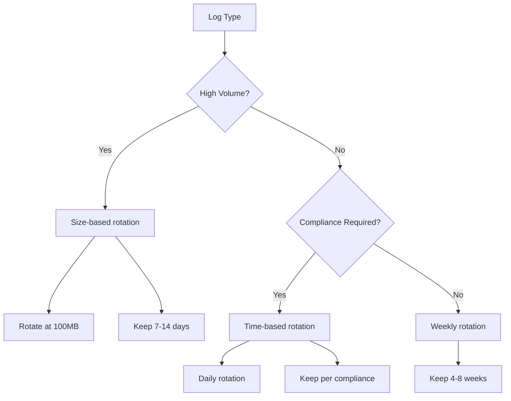

# How to Configure Log Rotation Strategies

Author: [nawazdhandala](https://www.github.com/nawazdhandala)

Tags: Log Rotation, Logging, DevOps, Linux, System Administration, Disk Management, Logrotate

Description: Learn how to configure effective log rotation strategies to manage disk space, maintain performance, and ensure compliance. This guide covers logrotate configuration, application-level rotation, and best practices for production systems.

---

> Log rotation prevents your disks from filling up while ensuring you retain logs long enough for debugging and compliance. Without proper rotation, a busy application can consume gigabytes of disk space within hours.

Every production system generates logs. Web servers, databases, applications, and system services all write to log files continuously. Log rotation automatically manages these files by compressing old logs, deleting expired ones, and creating new files for fresh data.

---

## Why Log Rotation Matters

Consider a web server handling 1,000 requests per minute. If each request generates 500 bytes of logs, you produce 30KB per second, 2.5GB per day, or 75GB per month from a single server. Multiply this across a fleet of servers and you quickly understand why log rotation is essential.

Beyond disk space, unrotated logs cause:

- **Performance degradation**: Large files are slow to write and search
- **Failed writes**: Full disks cause application errors
- **Compliance violations**: Retaining logs too long or not long enough
- **Debugging difficulties**: Searching through massive files takes forever

---

## Configuring Logrotate on Linux

Logrotate is the standard tool for log rotation on Linux systems. It runs daily via cron and processes configuration files to rotate logs.

### Basic Configuration

```bash
# /etc/logrotate.d/myapp
# Log rotation configuration for application logs

/var/log/myapp/*.log {
    # Rotate logs daily
    daily

    # Keep 14 rotated files
    rotate 14

    # Compress rotated logs to save space
    compress

    # Delay compression by one rotation cycle
    # Allows time for any process still writing to finish
    delaycompress

    # Don't error if log file is missing
    missingok

    # Don't rotate if the file is empty
    notifempty

    # Create new log file with these permissions after rotation
    create 0640 appuser appgroup

    # Add date extension to rotated files
    dateext
    dateformat -%Y%m%d

    # Run these commands after rotation
    postrotate
        # Signal application to reopen log files
        systemctl reload myapp > /dev/null 2>&1 || true
    endscript
}
```

### Size-Based Rotation

```bash
# /etc/logrotate.d/myapp-size
# Rotate based on file size instead of time

/var/log/myapp/access.log {
    # Rotate when file exceeds 100MB
    size 100M

    # Keep 10 rotated files
    rotate 10

    compress
    delaycompress
    missingok
    notifempty

    create 0640 appuser appgroup

    # Can combine with maxage to delete old files
    maxage 30
}
```

### Multiple Log Files with Different Policies

```bash
# /etc/logrotate.d/myapp-multi
# Different rotation policies for different log types

# Application access logs - high volume, shorter retention
/var/log/myapp/access.log {
    daily
    rotate 7
    compress
    delaycompress
    missingok
    notifempty
    create 0640 appuser appgroup

    postrotate
        /usr/bin/systemctl reload myapp > /dev/null 2>&1 || true
    endscript
}

# Application error logs - lower volume, longer retention
/var/log/myapp/error.log {
    weekly
    rotate 52
    compress
    delaycompress
    missingok
    notifempty
    create 0640 appuser appgroup

    postrotate
        /usr/bin/systemctl reload myapp > /dev/null 2>&1 || true
    endscript
}

# Audit logs - compliance requirement for 1 year retention
/var/log/myapp/audit.log {
    monthly
    rotate 12
    compress
    delaycompress
    missingok
    notifempty
    create 0600 root root

    # Copy and truncate instead of moving
    # Ensures no gap in audit logging
    copytruncate
}
```

---

## Application-Level Log Rotation

Many logging libraries support built-in rotation, which can be more reliable than external rotation tools.

### Node.js with Winston

```javascript
// logger.js
// Winston logger with built-in rotation

const winston = require('winston');
require('winston-daily-rotate-file');

// Create rotating file transport
const fileRotateTransport = new winston.transports.DailyRotateFile({
  // File name pattern with date placeholder
  filename: '/var/log/myapp/app-%DATE%.log',

  // Date pattern for file naming
  datePattern: 'YYYY-MM-DD',

  // Compress rotated files
  zippedArchive: true,

  // Maximum size before rotation (can use k, m, g suffixes)
  maxSize: '100m',

  // Maximum number of files to keep
  maxFiles: '14d',  // Keep 14 days of logs

  // Create symlink to current log file
  createSymlink: true,
  symlinkName: 'app-current.log'
});

// Handle rotation events
fileRotateTransport.on('rotate', (oldFilename, newFilename) => {
  console.log(`Log rotated: ${oldFilename} -> ${newFilename}`);
});

fileRotateTransport.on('archive', (zipFilename) => {
  console.log(`Log archived: ${zipFilename}`);
});

const logger = winston.createLogger({
  level: process.env.LOG_LEVEL || 'info',
  format: winston.format.combine(
    winston.format.timestamp(),
    winston.format.json()
  ),
  transports: [
    fileRotateTransport,
    new winston.transports.Console({
      format: winston.format.combine(
        winston.format.colorize(),
        winston.format.simple()
      )
    })
  ]
});

module.exports = logger;
```

### Python with Logging

```python
# logger.py
# Python logging with rotation

import logging
from logging.handlers import RotatingFileHandler, TimedRotatingFileHandler
import os

def setup_logger(name, log_dir='/var/log/myapp'):
    """Configure logger with both size and time-based rotation."""

    # Ensure log directory exists
    os.makedirs(log_dir, exist_ok=True)

    logger = logging.getLogger(name)
    logger.setLevel(logging.DEBUG)

    # Formatter for all handlers
    formatter = logging.Formatter(
        '{"timestamp": "%(asctime)s", "level": "%(levelname)s", '
        '"logger": "%(name)s", "message": "%(message)s"}'
    )

    # Size-based rotation for high-volume logs
    # Rotates when file reaches 50MB, keeps 10 backup files
    size_handler = RotatingFileHandler(
        filename=os.path.join(log_dir, 'app.log'),
        maxBytes=50 * 1024 * 1024,  # 50MB
        backupCount=10,
        encoding='utf-8'
    )
    size_handler.setLevel(logging.INFO)
    size_handler.setFormatter(formatter)

    # Time-based rotation for audit logs
    # Rotates at midnight, keeps 365 days
    time_handler = TimedRotatingFileHandler(
        filename=os.path.join(log_dir, 'audit.log'),
        when='midnight',
        interval=1,
        backupCount=365,
        encoding='utf-8'
    )
    time_handler.setLevel(logging.INFO)
    time_handler.setFormatter(formatter)

    # Debug file with aggressive rotation
    debug_handler = RotatingFileHandler(
        filename=os.path.join(log_dir, 'debug.log'),
        maxBytes=10 * 1024 * 1024,  # 10MB
        backupCount=3,
        encoding='utf-8'
    )
    debug_handler.setLevel(logging.DEBUG)
    debug_handler.setFormatter(formatter)

    # Console handler for development
    console_handler = logging.StreamHandler()
    console_handler.setLevel(logging.INFO)
    console_handler.setFormatter(formatter)

    # Add all handlers
    logger.addHandler(size_handler)
    logger.addHandler(time_handler)
    logger.addHandler(debug_handler)
    logger.addHandler(console_handler)

    return logger

# Usage
logger = setup_logger('myapp')
logger.info('Application started')
```

### Java with Logback

```xml
<!-- logback.xml -->
<!-- Logback configuration with rolling file appenders -->

<configuration>
    <property name="LOG_DIR" value="/var/log/myapp" />
    <property name="APP_NAME" value="myapp" />

    <!-- Size and time based rolling policy -->
    <appender name="FILE" class="ch.qos.logback.core.rolling.RollingFileAppender">
        <file>${LOG_DIR}/${APP_NAME}.log</file>

        <rollingPolicy class="ch.qos.logback.core.rolling.SizeAndTimeBasedRollingPolicy">
            <!-- Daily rollover with compression -->
            <fileNamePattern>${LOG_DIR}/archive/${APP_NAME}.%d{yyyy-MM-dd}.%i.log.gz</fileNamePattern>

            <!-- Each file max 100MB -->
            <maxFileSize>100MB</maxFileSize>

            <!-- Keep 30 days of history -->
            <maxHistory>30</maxHistory>

            <!-- Total size cap for all archives -->
            <totalSizeCap>10GB</totalSizeCap>
        </rollingPolicy>

        <encoder>
            <pattern>%d{ISO8601} [%thread] %-5level %logger{36} - %msg%n</pattern>
        </encoder>
    </appender>

    <!-- Async appender for better performance -->
    <appender name="ASYNC_FILE" class="ch.qos.logback.classic.AsyncAppender">
        <queueSize>500</queueSize>
        <discardingThreshold>0</discardingThreshold>
        <appender-ref ref="FILE" />
    </appender>

    <!-- Error logs with longer retention -->
    <appender name="ERROR_FILE" class="ch.qos.logback.core.rolling.RollingFileAppender">
        <file>${LOG_DIR}/${APP_NAME}-error.log</file>
        <filter class="ch.qos.logback.classic.filter.ThresholdFilter">
            <level>ERROR</level>
        </filter>

        <rollingPolicy class="ch.qos.logback.core.rolling.TimeBasedRollingPolicy">
            <fileNamePattern>${LOG_DIR}/archive/${APP_NAME}-error.%d{yyyy-MM-dd}.log.gz</fileNamePattern>
            <maxHistory>90</maxHistory>
        </rollingPolicy>

        <encoder>
            <pattern>%d{ISO8601} [%thread] %-5level %logger{36} - %msg%n</pattern>
        </encoder>
    </appender>

    <root level="INFO">
        <appender-ref ref="ASYNC_FILE" />
        <appender-ref ref="ERROR_FILE" />
    </root>
</configuration>
```

---

## Container Log Rotation

Docker and Kubernetes require different rotation strategies.

### Docker JSON File Driver

```json
{
  "log-driver": "json-file",
  "log-opts": {
    "max-size": "100m",
    "max-file": "5",
    "compress": "true"
  }
}
```

Apply to individual containers:

```bash
docker run \
  --log-driver json-file \
  --log-opt max-size=50m \
  --log-opt max-file=3 \
  myapp:latest
```

### Kubernetes Log Rotation

Configure kubelet for log rotation:

```yaml
# /var/lib/kubelet/config.yaml
apiVersion: kubelet.config.k8s.io/v1beta1
kind: KubeletConfiguration
containerLogMaxSize: "100Mi"
containerLogMaxFiles: 5
```

---

## Rotation Strategies by Log Type

Different logs need different strategies:



| Log Type | Strategy | Retention | Compression |
|----------|----------|-----------|-------------|
| Access logs | Size + daily | 7-14 days | Yes |
| Error logs | Daily | 30-90 days | Yes |
| Audit logs | Daily | 1-7 years | Yes |
| Debug logs | Size | 1-3 days | Optional |
| Security logs | Daily | 90+ days | Yes |

---

## Testing and Validation

Test your rotation configuration before deploying:

```bash
# Test logrotate configuration for syntax errors
logrotate -d /etc/logrotate.d/myapp

# Force rotation to test configuration
logrotate -f /etc/logrotate.d/myapp

# Check rotation status
cat /var/lib/logrotate/status

# Monitor disk usage
du -sh /var/log/myapp/*

# Watch for rotation events
watch -n 60 'ls -lh /var/log/myapp/'
```

Create a monitoring script:

```bash
#!/bin/bash
# check-log-rotation.sh
# Monitor log rotation health

LOG_DIR="/var/log/myapp"
MAX_SINGLE_FILE_MB=200
MAX_TOTAL_GB=10

# Check for oversized single files
oversized=$(find "$LOG_DIR" -name "*.log" -size +${MAX_SINGLE_FILE_MB}M)
if [ -n "$oversized" ]; then
    echo "WARNING: Oversized log files found:"
    echo "$oversized"
fi

# Check total log directory size
total_size=$(du -sb "$LOG_DIR" | cut -f1)
max_bytes=$((MAX_TOTAL_GB * 1024 * 1024 * 1024))

if [ "$total_size" -gt "$max_bytes" ]; then
    echo "WARNING: Total log size exceeds ${MAX_TOTAL_GB}GB"
    du -sh "$LOG_DIR"
fi

# Check for rotation failures
if [ -f /var/lib/logrotate/status ]; then
    last_rotation=$(grep "$LOG_DIR" /var/lib/logrotate/status | head -1)
    echo "Last rotation: $last_rotation"
fi
```

---

## Summary

Effective log rotation requires matching your strategy to your log types:

1. **Size-based rotation** for high-volume, predictable logs
2. **Time-based rotation** for compliance and audit requirements
3. **Combined strategies** for the best of both approaches
4. **Application-level rotation** for more reliable file handling
5. **Container-native rotation** for Docker and Kubernetes environments

Start with conservative retention periods and adjust based on actual usage. Monitor disk space trends and rotation success to catch problems before they cause outages.

---

*Managing log rotation across many systems? [OneUptime](https://oneuptime.com) handles log ingestion and retention automatically, so you can focus on analyzing logs instead of managing files.*
