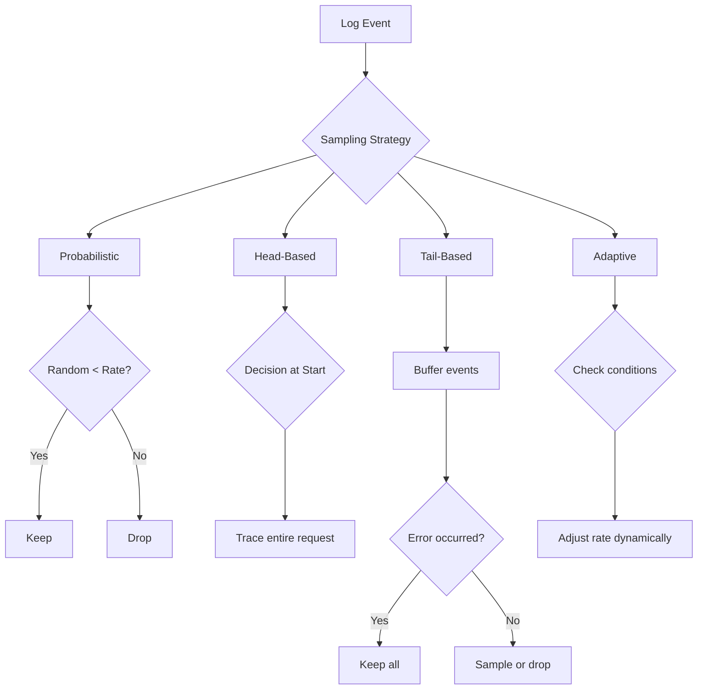

# How to Implement Log Sampling for High-Volume Systems

Author: [nawazdhandala](https://www.github.com/nawazdhandala)

Tags: Log Sampling, High Volume Logging, Observability, Performance, Cost Optimization, Distributed Systems

Description: Learn how to implement log sampling strategies for high-volume systems. This guide covers probabilistic sampling, head-based and tail-based sampling, adaptive algorithms, and techniques to reduce logging costs while maintaining visibility.

---

> When your system generates millions of log events per minute, collecting everything becomes prohibitively expensive and often unnecessary. Log sampling lets you maintain observability while dramatically reducing costs.

A high-traffic API might generate 10,000 requests per second. At 500 bytes per log entry, that is 5MB per second or 430GB per day from a single endpoint. Storing and indexing all that data costs money and slows down queries. Smart sampling can reduce this by 90-99% while preserving the ability to debug issues.

---

## Understanding Sampling Strategies

Different sampling approaches suit different needs:

**Probabilistic Sampling**: Keep a random percentage of all logs. Simple but may miss rare events.

**Head-Based Sampling**: Decide whether to log at the start of a request. Consistent within a request but may miss errors.

**Tail-Based Sampling**: Decide after the request completes. Can prioritize errors but requires buffering.

**Adaptive Sampling**: Adjust sampling rate based on current conditions. Balances cost and visibility.



---

## Probabilistic Sampling

The simplest approach samples a fixed percentage of logs:

```typescript
// samplers/probabilistic.ts
// Simple probabilistic log sampler

class ProbabilisticSampler {
  private sampleRate: number;

  constructor(sampleRate: number) {
    // sampleRate should be between 0 and 1
    // 0.1 means keep 10% of logs
    this.sampleRate = Math.max(0, Math.min(1, sampleRate));
  }

  shouldSample(): boolean {
    return Math.random() < this.sampleRate;
  }

  // Sample with consistent hashing for related logs
  shouldSampleByKey(key: string): boolean {
    // Hash the key to get consistent sampling for related events
    const hash = this.hashCode(key);
    const threshold = Math.floor(this.sampleRate * 0xFFFFFFFF);
    return (hash & 0xFFFFFFFF) < threshold;
  }

  private hashCode(str: string): number {
    let hash = 0;
    for (let i = 0; i < str.length; i++) {
      const char = str.charCodeAt(i);
      hash = ((hash << 5) - hash) + char;
      hash = hash & hash;
    }
    return hash;
  }
}

// Usage in logger
class SampledLogger {
  private sampler: ProbabilisticSampler;
  private baseLogger: Logger;

  constructor(baseLogger: Logger, sampleRate: number) {
    this.baseLogger = baseLogger;
    this.sampler = new ProbabilisticSampler(sampleRate);
  }

  debug(message: string, attributes?: Record<string, unknown>): void {
    // Sample debug logs aggressively
    if (this.sampler.shouldSample()) {
      this.baseLogger.debug(message, {
        ...attributes,
        _sampled: true,
        _sample_rate: 0.01
      });
    }
  }

  info(message: string, attributes?: Record<string, unknown>): void {
    // Sample info logs moderately
    if (this.sampler.shouldSample()) {
      this.baseLogger.info(message, {
        ...attributes,
        _sampled: true,
        _sample_rate: 0.1
      });
    }
  }

  // Never sample errors - always log them
  error(message: string, error?: Error, attributes?: Record<string, unknown>): void {
    this.baseLogger.error(message, error, {
      ...attributes,
      _sampled: false
    });
  }
}
```

---

## Head-Based Sampling

Decide at the start of a request whether to log the entire trace:

```typescript
// samplers/head-based.ts
// Head-based sampling for distributed tracing

import { AsyncLocalStorage } from 'async_hooks';

interface SamplingContext {
  traceId: string;
  shouldSample: boolean;
  sampleRate: number;
}

class HeadBasedSampler {
  private storage = new AsyncLocalStorage<SamplingContext>();
  private defaultRate: number;
  private ratesByEndpoint: Map<string, number>;

  constructor(defaultRate: number = 0.1) {
    this.defaultRate = defaultRate;
    this.ratesByEndpoint = new Map();
  }

  // Set custom rates for specific endpoints
  setEndpointRate(endpoint: string, rate: number): void {
    this.ratesByEndpoint.set(endpoint, rate);
  }

  // Start a new sampling context for a request
  startRequest<T>(traceId: string, endpoint: string, fn: () => T): T {
    const rate = this.ratesByEndpoint.get(endpoint) || this.defaultRate;
    const shouldSample = Math.random() < rate;

    const context: SamplingContext = {
      traceId,
      shouldSample,
      sampleRate: rate
    };

    return this.storage.run(context, fn);
  }

  // Check if current request should be sampled
  shouldLog(): boolean {
    const context = this.storage.getStore();
    return context?.shouldSample ?? true;
  }

  // Get current context for logging
  getContext(): SamplingContext | undefined {
    return this.storage.getStore();
  }
}

// Express middleware implementation
import { Request, Response, NextFunction } from 'express';

const sampler = new HeadBasedSampler(0.1);

// Configure endpoint-specific rates
sampler.setEndpointRate('/health', 0.001);    // Health checks: 0.1%
sampler.setEndpointRate('/api/search', 0.05); // Search: 5%
sampler.setEndpointRate('/api/orders', 0.5);  // Orders: 50%

export function samplingMiddleware(req: Request, res: Response, next: NextFunction): void {
  const traceId = req.headers['x-trace-id'] as string || generateTraceId();
  const endpoint = req.route?.path || req.path;

  sampler.startRequest(traceId, endpoint, () => {
    // Add sampling decision to request for downstream use
    (req as any).samplingContext = sampler.getContext();
    next();
  });
}

// Logger that respects sampling decisions
class HeadSampledLogger {
  private sampler: HeadBasedSampler;
  private baseLogger: Logger;

  constructor(baseLogger: Logger, sampler: HeadBasedSampler) {
    this.baseLogger = baseLogger;
    this.sampler = sampler;
  }

  log(level: string, message: string, attributes?: Record<string, unknown>): void {
    const context = this.sampler.getContext();

    // Always log if no context or if sampled
    if (!context || context.shouldSample) {
      this.baseLogger[level](message, {
        ...attributes,
        trace_id: context?.traceId,
        _sampled: true,
        _sample_rate: context?.sampleRate
      });
    }

    // Always log errors regardless of sampling
    if (level === 'error') {
      this.baseLogger.error(message, {
        ...attributes,
        trace_id: context?.traceId,
        _sampled: false
      });
    }
  }
}
```

---

## Tail-Based Sampling

Buffer logs and decide after the request completes:

```typescript
// samplers/tail-based.ts
// Tail-based sampling with error prioritization

interface BufferedLog {
  timestamp: Date;
  level: string;
  message: string;
  attributes: Record<string, unknown>;
}

class TailBasedSampler {
  private buffers: Map<string, BufferedLog[]> = new Map();
  private maxBufferSize: number;
  private sampleRate: number;

  constructor(sampleRate: number = 0.1, maxBufferSize: number = 1000) {
    this.sampleRate = sampleRate;
    this.maxBufferSize = maxBufferSize;
  }

  // Buffer a log entry
  buffer(traceId: string, log: BufferedLog): void {
    if (!this.buffers.has(traceId)) {
      this.buffers.set(traceId, []);
    }

    const buffer = this.buffers.get(traceId)!;

    // Prevent unbounded growth
    if (buffer.length < this.maxBufferSize) {
      buffer.push(log);
    }
  }

  // Finalize and decide what to emit
  finalize(traceId: string, hasError: boolean): BufferedLog[] {
    const buffer = this.buffers.get(traceId) || [];
    this.buffers.delete(traceId);

    // Always emit if there was an error
    if (hasError) {
      return buffer;
    }

    // Otherwise, apply sampling
    if (Math.random() < this.sampleRate) {
      return buffer;
    }

    // Dropped - return empty
    return [];
  }

  // Clean up stale buffers (for requests that never completed)
  cleanup(maxAgeMs: number = 60000): void {
    const now = Date.now();

    for (const [traceId, buffer] of this.buffers.entries()) {
      if (buffer.length > 0) {
        const firstLog = buffer[0];
        if (now - firstLog.timestamp.getTime() > maxAgeMs) {
          this.buffers.delete(traceId);
        }
      }
    }
  }
}

// Express implementation with tail-based sampling
class TailSampledRequestHandler {
  private sampler: TailBasedSampler;
  private logger: Logger;

  constructor(logger: Logger, sampleRate: number) {
    this.logger = logger;
    this.sampler = new TailBasedSampler(sampleRate);

    // Periodically clean up stale buffers
    setInterval(() => this.sampler.cleanup(), 30000);
  }

  // Create a request-scoped logger
  createRequestLogger(traceId: string): RequestLogger {
    return {
      debug: (message: string, attrs?: Record<string, unknown>) => {
        this.sampler.buffer(traceId, {
          timestamp: new Date(),
          level: 'debug',
          message,
          attributes: attrs || {}
        });
      },

      info: (message: string, attrs?: Record<string, unknown>) => {
        this.sampler.buffer(traceId, {
          timestamp: new Date(),
          level: 'info',
          message,
          attributes: attrs || {}
        });
      },

      error: (message: string, attrs?: Record<string, unknown>) => {
        this.sampler.buffer(traceId, {
          timestamp: new Date(),
          level: 'error',
          message,
          attributes: { ...attrs, _is_error: true }
        });
      },

      finalize: (hasError: boolean) => {
        const logs = this.sampler.finalize(traceId, hasError);

        // Emit all buffered logs
        for (const log of logs) {
          this.logger[log.level](log.message, {
            ...log.attributes,
            trace_id: traceId,
            _sampled: true
          });
        }
      }
    };
  }
}

// Usage in Express
function tailSamplingMiddleware(handler: TailSampledRequestHandler) {
  return (req: Request, res: Response, next: NextFunction) => {
    const traceId = req.headers['x-trace-id'] as string || generateTraceId();
    const requestLogger = handler.createRequestLogger(traceId);

    // Attach logger to request
    (req as any).logger = requestLogger;

    // Track if error occurred
    let hasError = false;

    res.on('finish', () => {
      hasError = res.statusCode >= 500;
      requestLogger.finalize(hasError);
    });

    next();
  };
}
```

---

## Adaptive Sampling

Adjust sampling rate based on current conditions:

```typescript
// samplers/adaptive.ts
// Adaptive sampling based on system load and error rates

interface AdaptiveConfig {
  minRate: number;           // Minimum sampling rate
  maxRate: number;           // Maximum sampling rate
  targetRps: number;         // Target logs per second
  errorBoostFactor: number;  // Multiplier when errors increase
  adjustmentInterval: number; // How often to adjust (ms)
}

class AdaptiveSampler {
  private config: AdaptiveConfig;
  private currentRate: number;
  private logCount: number = 0;
  private errorCount: number = 0;
  private lastAdjustment: number = Date.now();

  constructor(config: Partial<AdaptiveConfig> = {}) {
    this.config = {
      minRate: config.minRate || 0.001,
      maxRate: config.maxRate || 1.0,
      targetRps: config.targetRps || 1000,
      errorBoostFactor: config.errorBoostFactor || 10,
      adjustmentInterval: config.adjustmentInterval || 10000
    };

    this.currentRate = this.config.maxRate;

    // Periodic rate adjustment
    setInterval(() => this.adjustRate(), this.config.adjustmentInterval);
  }

  shouldSample(isError: boolean = false): boolean {
    this.logCount++;

    if (isError) {
      this.errorCount++;
      // Always sample errors with boosted probability
      return Math.random() < Math.min(1, this.currentRate * this.config.errorBoostFactor);
    }

    return Math.random() < this.currentRate;
  }

  getCurrentRate(): number {
    return this.currentRate;
  }

  private adjustRate(): void {
    const elapsed = (Date.now() - this.lastAdjustment) / 1000;
    const currentRps = this.logCount / elapsed;
    const errorRate = this.errorCount / Math.max(1, this.logCount);

    // Calculate new rate based on current throughput
    let newRate = this.currentRate;

    if (currentRps > this.config.targetRps * 1.2) {
      // Too many logs, reduce rate
      newRate = this.currentRate * (this.config.targetRps / currentRps);
    } else if (currentRps < this.config.targetRps * 0.8) {
      // Room for more logs, increase rate
      newRate = this.currentRate * 1.1;
    }

    // Boost rate if error rate is high
    if (errorRate > 0.01) {
      newRate = Math.min(this.config.maxRate, newRate * (1 + errorRate * 10));
    }

    // Clamp to configured bounds
    this.currentRate = Math.max(
      this.config.minRate,
      Math.min(this.config.maxRate, newRate)
    );

    // Reset counters
    this.logCount = 0;
    this.errorCount = 0;
    this.lastAdjustment = Date.now();
  }
}

// Usage with metrics
class AdaptiveLogger {
  private sampler: AdaptiveSampler;
  private baseLogger: Logger;
  private metricsClient: MetricsClient;

  constructor(baseLogger: Logger, metricsClient: MetricsClient) {
    this.baseLogger = baseLogger;
    this.metricsClient = metricsClient;
    this.sampler = new AdaptiveSampler({
      minRate: 0.01,
      maxRate: 1.0,
      targetRps: 5000
    });

    // Export sampling metrics
    setInterval(() => {
      this.metricsClient.gauge('logging.sample_rate', this.sampler.getCurrentRate());
    }, 10000);
  }

  log(level: string, message: string, attributes?: Record<string, unknown>): void {
    const isError = level === 'error';

    if (this.sampler.shouldSample(isError)) {
      this.baseLogger[level](message, {
        ...attributes,
        _sampled: true,
        _sample_rate: this.sampler.getCurrentRate()
      });

      this.metricsClient.increment('logging.sampled');
    } else {
      this.metricsClient.increment('logging.dropped');
    }
  }
}
```

---

## Priority-Based Sampling

Sample based on log importance:

```typescript
// samplers/priority.ts
// Priority-based sampling with rules

interface SamplingRule {
  name: string;
  matcher: (log: LogEntry) => boolean;
  rate: number;
  priority: number;  // Higher priority rules are checked first
}

class PrioritySampler {
  private rules: SamplingRule[] = [];
  private defaultRate: number;

  constructor(defaultRate: number = 0.1) {
    this.defaultRate = defaultRate;
  }

  addRule(rule: SamplingRule): void {
    this.rules.push(rule);
    // Sort by priority descending
    this.rules.sort((a, b) => b.priority - a.priority);
  }

  shouldSample(log: LogEntry): { sample: boolean; rule: string; rate: number } {
    // Check rules in priority order
    for (const rule of this.rules) {
      if (rule.matcher(log)) {
        const sample = Math.random() < rule.rate;
        return { sample, rule: rule.name, rate: rule.rate };
      }
    }

    // Default sampling
    const sample = Math.random() < this.defaultRate;
    return { sample, rule: 'default', rate: this.defaultRate };
  }
}

// Configure sampling rules
const sampler = new PrioritySampler(0.1);

// Always sample errors
sampler.addRule({
  name: 'errors',
  matcher: (log) => log.level === 'error' || log.level === 'fatal',
  rate: 1.0,
  priority: 100
});

// High rate for slow requests
sampler.addRule({
  name: 'slow_requests',
  matcher: (log) => (log.attributes?.duration_ms as number) > 1000,
  rate: 0.9,
  priority: 90
});

// Medium rate for warnings
sampler.addRule({
  name: 'warnings',
  matcher: (log) => log.level === 'warn',
  rate: 0.5,
  priority: 80
});

// Low rate for health checks
sampler.addRule({
  name: 'health_checks',
  matcher: (log) => (log.attributes?.path as string)?.includes('/health'),
  rate: 0.001,
  priority: 70
});

// Very low rate for debug logs
sampler.addRule({
  name: 'debug',
  matcher: (log) => log.level === 'debug',
  rate: 0.01,
  priority: 10
});
```

---

## Compensating for Sampling in Analysis

When analyzing sampled data, account for the sampling rate:

```typescript
// Analysis helper for sampled logs
function estimateActualCount(sampledCount: number, sampleRate: number): number {
  return sampledCount / sampleRate;
}

// Example query adjustment
const sampledErrors = 100;
const sampleRate = 0.1;
const estimatedTotalErrors = estimateActualCount(sampledErrors, sampleRate);
// estimatedTotalErrors = 1000

// Store sample rate with logs for accurate analysis
logger.info('Request processed', {
  duration_ms: 150,
  _sample_rate: 0.1,  // Always include this
  _sampled: true
});
```

---

## Summary

Log sampling is essential for high-volume systems. Choose your strategy based on your needs:

1. **Probabilistic**: Simple, good for uniform traffic
2. **Head-based**: Consistent tracing, simple implementation
3. **Tail-based**: Catches errors, requires buffering
4. **Adaptive**: Responds to conditions, more complex
5. **Priority-based**: Granular control, rule maintenance

Always include the sample rate in emitted logs so analysis can account for dropped data. Monitor your sampling metrics to ensure you are not dropping important events.

---

*Need intelligent log sampling without the implementation complexity? [OneUptime](https://oneuptime.com) provides built-in log management with smart retention policies and sampling, so you get the visibility you need at a predictable cost.*
