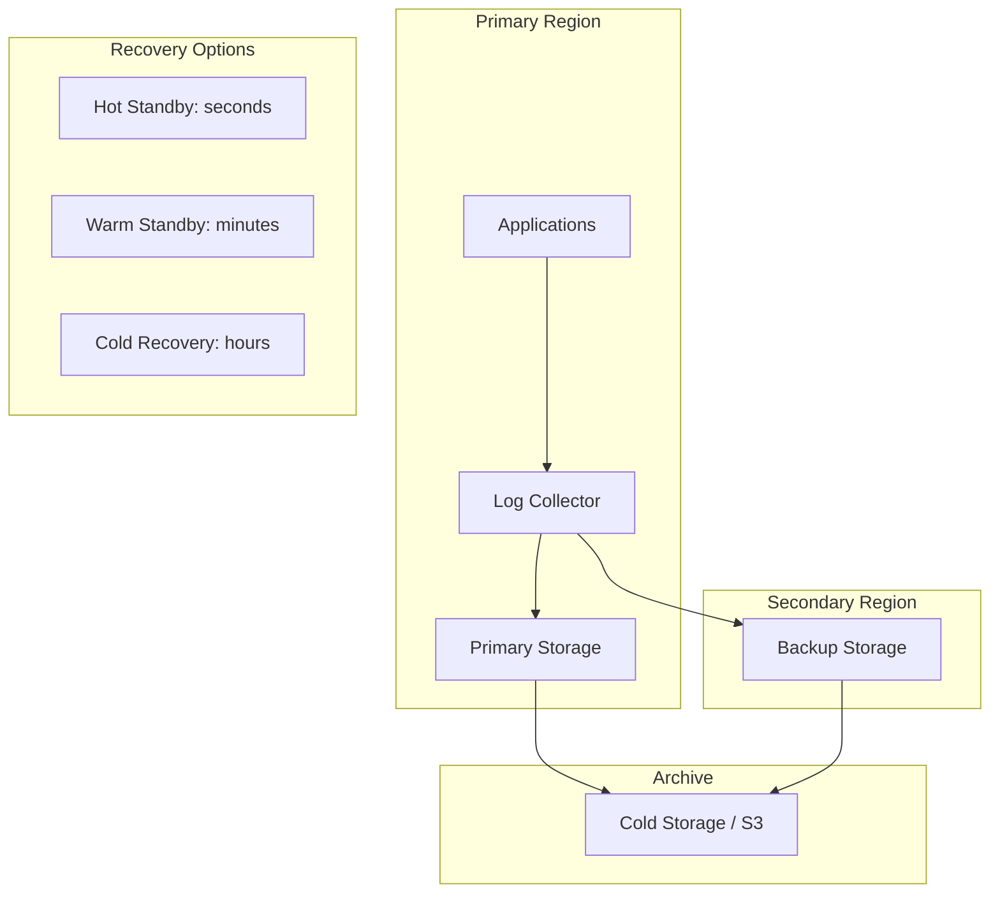

# How to Configure Log Shipping for Disaster Recovery

Author: [nawazdhandala](https://www.github.com/nawazdhandala)

Tags: Log Shipping, Disaster Recovery, Backup, Replication, High Availability, Business Continuity, DevOps

Description: Learn how to configure log shipping for disaster recovery to ensure log availability during outages. This guide covers replication strategies, backup configurations, recovery procedures, and testing disaster recovery plans.

---

> Logs are critical for understanding what happened during an incident. If your logging infrastructure fails during a disaster, you lose the ability to diagnose problems at the worst possible time. Log shipping ensures your logs survive even when your primary infrastructure does not.

Disaster recovery for logs is not just about backup and restore. It is about maintaining continuous access to recent logs during an outage and being able to recover historical logs afterward.

---

## Disaster Recovery Strategies

Different strategies for different requirements:



| Strategy | RTO | RPO | Cost |
|----------|-----|-----|------|
| Hot standby | Seconds | Zero | High |
| Warm standby | Minutes | Minutes | Medium |
| Cold backup | Hours | Hours | Low |
| Archive only | Days | 24 hours | Very low |

---

## Hot Standby Configuration

Configure real-time replication to a standby cluster:

```typescript
// dr/hot-standby.ts
// Hot standby replication for near-zero RPO

interface ReplicationConfig {
  primary: ClusterConfig;
  secondary: ClusterConfig;
  syncMode: 'async' | 'semi-sync' | 'sync';
  maxLagSeconds: number;
}

class HotStandbyReplicator {
  private config: ReplicationConfig;
  private replicationLag: number = 0;
  private isHealthy: boolean = true;

  constructor(config: ReplicationConfig) {
    this.config = config;
    this.startHealthCheck();
  }

  async write(logs: LogEntry[]): Promise<WriteResult> {
    const primaryResult = await this.writeToPrimary(logs);

    if (this.config.syncMode === 'sync') {
      // Synchronous: Wait for secondary confirmation
      const secondaryResult = await this.writeToSecondary(logs);
      return {
        success: primaryResult.success && secondaryResult.success,
        primaryAck: primaryResult.success,
        secondaryAck: secondaryResult.success
      };
    } else if (this.config.syncMode === 'semi-sync') {
      // Semi-sync: Write to primary, async to secondary with timeout
      const secondaryPromise = this.writeToSecondary(logs);
      const timeoutPromise = this.timeout(1000);

      await Promise.race([secondaryPromise, timeoutPromise]);

      return {
        success: primaryResult.success,
        primaryAck: primaryResult.success,
        secondaryAck: 'pending'
      };
    } else {
      // Async: Fire and forget to secondary
      this.writeToSecondary(logs).catch(err => {
        console.error('Async replication failed:', err);
      });

      return {
        success: primaryResult.success,
        primaryAck: primaryResult.success,
        secondaryAck: 'async'
      };
    }
  }

  private async writeToPrimary(logs: LogEntry[]): Promise<{ success: boolean }> {
    try {
      await this.config.primary.client.write(logs);
      return { success: true };
    } catch (error) {
      console.error('Primary write failed:', error);
      return { success: false };
    }
  }

  private async writeToSecondary(logs: LogEntry[]): Promise<{ success: boolean }> {
    try {
      await this.config.secondary.client.write(logs);
      return { success: true };
    } catch (error) {
      console.error('Secondary write failed:', error);
      return { success: false };
    }
  }

  private startHealthCheck(): void {
    setInterval(async () => {
      try {
        // Check replication lag
        const primarySeq = await this.config.primary.client.getLatestSequence();
        const secondarySeq = await this.config.secondary.client.getLatestSequence();

        this.replicationLag = primarySeq - secondarySeq;
        this.isHealthy = this.replicationLag <= this.config.maxLagSeconds;

        if (!this.isHealthy) {
          console.warn(`Replication lag: ${this.replicationLag}s exceeds threshold`);
        }
      } catch (error) {
        console.error('Health check failed:', error);
        this.isHealthy = false;
      }
    }, 10000);
  }

  getStatus(): ReplicationStatus {
    return {
      healthy: this.isHealthy,
      lagSeconds: this.replicationLag,
      mode: this.config.syncMode
    };
  }

  private timeout(ms: number): Promise<void> {
    return new Promise(resolve => setTimeout(resolve, ms));
  }
}

// Elasticsearch cross-cluster replication
const elasticsearchCCR = {
  // Follow index from remote cluster
  createFollowIndex: async (leader: string, follower: string) => {
    await esClient.ccr.follow({
      index: follower,
      body: {
        remote_cluster: 'dr-cluster',
        leader_index: leader,
        settings: {
          'index.number_of_replicas': 1
        }
      }
    });
  },

  // Check replication status
  getFollowStats: async (follower: string) => {
    return esClient.ccr.followStats({ index: follower });
  },

  // Promote follower to leader during failover
  promoteFollower: async (follower: string) => {
    // Pause following
    await esClient.ccr.pauseFollow({ index: follower });
    // Unfollow to make writable
    await esClient.ccr.unfollow({ index: follower });
  }
};
```

---

## Warm Standby Configuration

Ship logs to secondary storage with acceptable delay:

```typescript
// dr/warm-standby.ts
// Warm standby with buffered shipping

interface ShipperConfig {
  source: LogStorage;
  destination: LogStorage;
  batchSize: number;
  shipIntervalSeconds: number;
  bufferPath: string;
}

class WarmStandbyShipper {
  private config: ShipperConfig;
  private buffer: DiskBuffer;
  private lastShippedPosition: number = 0;
  private running: boolean = false;

  constructor(config: ShipperConfig) {
    this.config = config;
    this.buffer = new DiskBuffer(config.bufferPath);
  }

  async start(): Promise<void> {
    this.running = true;
    await this.loadCheckpoint();

    while (this.running) {
      try {
        await this.shipBatch();
        await this.sleep(this.config.shipIntervalSeconds * 1000);
      } catch (error) {
        console.error('Shipping error:', error);
        await this.sleep(5000); // Backoff on error
      }
    }
  }

  stop(): void {
    this.running = false;
  }

  private async shipBatch(): Promise<void> {
    // Read from source
    const logs = await this.config.source.readFrom(
      this.lastShippedPosition,
      this.config.batchSize
    );

    if (logs.length === 0) {
      return;
    }

    try {
      // Write to destination
      await this.config.destination.write(logs);

      // Update checkpoint
      this.lastShippedPosition += logs.length;
      await this.saveCheckpoint();

      console.log(`Shipped ${logs.length} logs, position: ${this.lastShippedPosition}`);
    } catch (error) {
      // Buffer locally on failure
      await this.buffer.write(logs);
      console.warn(`Destination unavailable, buffered ${logs.length} logs`);
    }
  }

  private async drainBuffer(): Promise<void> {
    while (this.buffer.hasData()) {
      const logs = await this.buffer.read(this.config.batchSize);

      try {
        await this.config.destination.write(logs);
        await this.buffer.acknowledge(logs.length);
      } catch (error) {
        console.error('Failed to drain buffer:', error);
        break;
      }
    }
  }

  private async loadCheckpoint(): Promise<void> {
    try {
      const checkpoint = await fs.promises.readFile(
        `${this.config.bufferPath}/checkpoint`,
        'utf-8'
      );
      this.lastShippedPosition = parseInt(checkpoint, 10);
    } catch {
      this.lastShippedPosition = 0;
    }
  }

  private async saveCheckpoint(): Promise<void> {
    await fs.promises.writeFile(
      `${this.config.bufferPath}/checkpoint`,
      String(this.lastShippedPosition)
    );
  }

  private sleep(ms: number): Promise<void> {
    return new Promise(resolve => setTimeout(resolve, ms));
  }

  getStatus(): ShipperStatus {
    return {
      lastShippedPosition: this.lastShippedPosition,
      bufferSize: this.buffer.size(),
      running: this.running
    };
  }
}
```

---

## Cold Backup Strategy

Periodic backups to durable storage:

```typescript
// dr/cold-backup.ts
// Scheduled backup to S3/GCS

interface BackupConfig {
  source: LogStorage;
  destination: {
    type: 's3' | 'gcs';
    bucket: string;
    prefix: string;
    region?: string;
  };
  schedule: string; // Cron expression
  retention: {
    daily: number;
    weekly: number;
    monthly: number;
  };
}

class ColdBackupManager {
  private config: BackupConfig;
  private s3: AWS.S3;

  constructor(config: BackupConfig) {
    this.config = config;
    this.s3 = new AWS.S3({ region: config.destination.region });
  }

  async runBackup(): Promise<BackupResult> {
    const timestamp = new Date();
    const backupId = `backup-${timestamp.toISOString().replace(/[:.]/g, '-')}`;

    console.log(`Starting backup: ${backupId}`);

    try {
      // Create snapshot of source
      const snapshot = await this.createSnapshot(backupId);

      // Upload to S3
      await this.uploadSnapshot(snapshot, backupId);

      // Record backup metadata
      await this.recordBackup(backupId, timestamp, snapshot.size);

      // Apply retention policy
      await this.applyRetention();

      return {
        success: true,
        backupId,
        size: snapshot.size,
        duration: Date.now() - timestamp.getTime()
      };
    } catch (error) {
      console.error('Backup failed:', error);
      return {
        success: false,
        backupId,
        error: (error as Error).message
      };
    }
  }

  private async createSnapshot(backupId: string): Promise<Snapshot> {
    // For Elasticsearch
    if (this.config.source.type === 'elasticsearch') {
      const response = await esClient.snapshot.create({
        repository: 'backup-repo',
        snapshot: backupId,
        wait_for_completion: true,
        body: {
          indices: 'logs-*',
          include_global_state: false
        }
      });

      return {
        id: backupId,
        location: response.body.snapshot.snapshot,
        size: response.body.snapshot.total_shards
      };
    }

    // Generic file-based backup
    const tempPath = `/tmp/${backupId}`;
    await this.config.source.exportToFile(tempPath);

    const stats = await fs.promises.stat(tempPath);

    return {
      id: backupId,
      location: tempPath,
      size: stats.size
    };
  }

  private async uploadSnapshot(snapshot: Snapshot, backupId: string): Promise<void> {
    const key = `${this.config.destination.prefix}/${backupId}.tar.gz`;

    // Compress and upload
    const compressed = await this.compress(snapshot.location);

    await this.s3.upload({
      Bucket: this.config.destination.bucket,
      Key: key,
      Body: compressed,
      StorageClass: 'STANDARD_IA'
    }).promise();

    console.log(`Uploaded backup to s3://${this.config.destination.bucket}/${key}`);
  }

  private async applyRetention(): Promise<void> {
    const backups = await this.listBackups();
    const now = new Date();

    const toDelete: string[] = [];

    for (const backup of backups) {
      const age = now.getTime() - backup.timestamp.getTime();
      const ageDays = age / (24 * 60 * 60 * 1000);

      // Determine retention period based on backup type
      if (backup.type === 'daily' && ageDays > this.config.retention.daily) {
        toDelete.push(backup.key);
      } else if (backup.type === 'weekly' && ageDays > this.config.retention.weekly * 7) {
        toDelete.push(backup.key);
      } else if (backup.type === 'monthly' && ageDays > this.config.retention.monthly * 30) {
        toDelete.push(backup.key);
      }
    }

    if (toDelete.length > 0) {
      await this.s3.deleteObjects({
        Bucket: this.config.destination.bucket,
        Delete: {
          Objects: toDelete.map(Key => ({ Key }))
        }
      }).promise();

      console.log(`Deleted ${toDelete.length} expired backups`);
    }
  }

  async restore(backupId: string, targetDate?: Date): Promise<RestoreResult> {
    console.log(`Restoring backup: ${backupId}`);

    // Download from S3
    const key = `${this.config.destination.prefix}/${backupId}.tar.gz`;

    const download = await this.s3.getObject({
      Bucket: this.config.destination.bucket,
      Key: key
    }).promise();

    // Decompress
    const tempPath = `/tmp/restore-${backupId}`;
    await this.decompress(download.Body as Buffer, tempPath);

    // Restore to source
    await this.config.source.importFromFile(tempPath);

    return {
      success: true,
      backupId,
      restoredAt: new Date()
    };
  }

  private async compress(path: string): Promise<Buffer> {
    return new Promise((resolve, reject) => {
      const chunks: Buffer[] = [];
      const gzip = zlib.createGzip();

      const input = fs.createReadStream(path);
      input.pipe(gzip);

      gzip.on('data', chunk => chunks.push(chunk));
      gzip.on('end', () => resolve(Buffer.concat(chunks)));
      gzip.on('error', reject);
    });
  }

  private async decompress(data: Buffer, outputPath: string): Promise<void> {
    return new Promise((resolve, reject) => {
      const gunzip = zlib.createGunzip();
      const output = fs.createWriteStream(outputPath);

      gunzip.pipe(output);
      gunzip.write(data);
      gunzip.end();

      output.on('finish', resolve);
      output.on('error', reject);
    });
  }
}
```

---

## Failover Procedures

Automated and manual failover processes:

```typescript
// dr/failover.ts
// Failover management

interface FailoverConfig {
  primary: ClusterConfig;
  secondary: ClusterConfig;
  healthCheckInterval: number;
  failureThreshold: number;
  autoFailover: boolean;
}

class FailoverManager {
  private config: FailoverConfig;
  private consecutiveFailures: number = 0;
  private currentPrimary: 'primary' | 'secondary' = 'primary';
  private failoverInProgress: boolean = false;

  constructor(config: FailoverConfig) {
    this.config = config;
    this.startHealthMonitoring();
  }

  private startHealthMonitoring(): void {
    setInterval(async () => {
      const primaryHealthy = await this.checkHealth(this.config.primary);

      if (!primaryHealthy) {
        this.consecutiveFailures++;
        console.warn(`Primary health check failed (${this.consecutiveFailures}/${this.config.failureThreshold})`);

        if (this.consecutiveFailures >= this.config.failureThreshold) {
          if (this.config.autoFailover) {
            await this.initiateFailover();
          } else {
            console.error('Manual failover required - primary is unhealthy');
            this.alertOnCall();
          }
        }
      } else {
        this.consecutiveFailures = 0;
      }
    }, this.config.healthCheckInterval);
  }

  private async checkHealth(cluster: ClusterConfig): Promise<boolean> {
    try {
      const response = await cluster.client.health();
      return response.status === 'green' || response.status === 'yellow';
    } catch {
      return false;
    }
  }

  async initiateFailover(): Promise<FailoverResult> {
    if (this.failoverInProgress) {
      return { success: false, reason: 'Failover already in progress' };
    }

    this.failoverInProgress = true;
    console.log('Initiating failover to secondary');

    try {
      // Step 1: Verify secondary is healthy
      const secondaryHealthy = await this.checkHealth(this.config.secondary);
      if (!secondaryHealthy) {
        throw new Error('Secondary cluster is not healthy');
      }

      // Step 2: Promote secondary
      await this.promoteSecondary();

      // Step 3: Update DNS/load balancer
      await this.updateRouting(this.config.secondary);

      // Step 4: Notify
      this.notifyFailover();

      this.currentPrimary = 'secondary';
      this.consecutiveFailures = 0;

      return {
        success: true,
        newPrimary: 'secondary',
        timestamp: new Date()
      };
    } catch (error) {
      console.error('Failover failed:', error);
      return {
        success: false,
        reason: (error as Error).message
      };
    } finally {
      this.failoverInProgress = false;
    }
  }

  async initiateFailback(): Promise<FailoverResult> {
    if (this.currentPrimary === 'primary') {
      return { success: false, reason: 'Already on primary' };
    }

    console.log('Initiating failback to primary');

    try {
      // Step 1: Verify primary is healthy
      const primaryHealthy = await this.checkHealth(this.config.primary);
      if (!primaryHealthy) {
        throw new Error('Primary cluster is not healthy');
      }

      // Step 2: Sync any missing data
      await this.syncDataToPrimary();

      // Step 3: Update routing
      await this.updateRouting(this.config.primary);

      // Step 4: Re-establish replication
      await this.reestablishReplication();

      this.currentPrimary = 'primary';

      return {
        success: true,
        newPrimary: 'primary',
        timestamp: new Date()
      };
    } catch (error) {
      console.error('Failback failed:', error);
      return {
        success: false,
        reason: (error as Error).message
      };
    }
  }

  private async promoteSecondary(): Promise<void> {
    // Elasticsearch-specific promotion
    const indices = await this.config.secondary.client.cat.indices({ format: 'json' });

    for (const index of indices) {
      if (index.index.startsWith('logs-')) {
        // Unfollow to make writable
        await this.config.secondary.client.ccr.unfollow({ index: index.index });
      }
    }
  }

  private async updateRouting(target: ClusterConfig): Promise<void> {
    // Update load balancer or DNS
    // This depends on your infrastructure
    console.log(`Routing traffic to ${target.name}`);
  }

  private async syncDataToPrimary(): Promise<void> {
    // Copy any data written to secondary during outage back to primary
    console.log('Syncing data back to primary');
  }

  private async reestablishReplication(): Promise<void> {
    // Set up CCR from primary to secondary again
    console.log('Re-establishing replication');
  }

  private notifyFailover(): void {
    // Send alerts via PagerDuty, Slack, etc.
    console.log('Sending failover notifications');
  }

  private alertOnCall(): void {
    console.log('Alerting on-call engineer');
  }
}
```

---

## Testing Disaster Recovery

Regular testing ensures DR works when needed:

```typescript
// dr/testing.ts
// DR testing framework

interface DRTestConfig {
  testType: 'backup-restore' | 'failover' | 'full-simulation';
  schedule: string;
  notifyOnFailure: string[];
}

class DRTestRunner {
  async runBackupRestoreTest(): Promise<TestResult> {
    console.log('Starting backup-restore test');

    const testData = this.generateTestData();
    const testId = `dr-test-${Date.now()}`;

    try {
      // Step 1: Write test data
      await this.writeTestData(testData, testId);

      // Step 2: Create backup
      const backupManager = new ColdBackupManager(backupConfig);
      const backupResult = await backupManager.runBackup();

      if (!backupResult.success) {
        throw new Error('Backup failed');
      }

      // Step 3: Delete test data from primary
      await this.deleteTestData(testId);

      // Step 4: Restore from backup
      const restoreResult = await backupManager.restore(backupResult.backupId);

      if (!restoreResult.success) {
        throw new Error('Restore failed');
      }

      // Step 5: Verify data integrity
      const verified = await this.verifyTestData(testData, testId);

      return {
        success: verified,
        testType: 'backup-restore',
        duration: Date.now() - parseInt(testId.split('-')[2]),
        details: {
          backupSize: backupResult.size,
          recordsVerified: testData.length
        }
      };
    } catch (error) {
      return {
        success: false,
        testType: 'backup-restore',
        error: (error as Error).message
      };
    } finally {
      // Cleanup
      await this.deleteTestData(testId);
    }
  }

  async runFailoverTest(): Promise<TestResult> {
    console.log('Starting failover test');

    try {
      const failoverManager = new FailoverManager(failoverConfig);

      // Step 1: Verify initial state
      const initialPrimary = failoverManager.getCurrentPrimary();

      // Step 2: Initiate failover
      const failoverResult = await failoverManager.initiateFailover();

      if (!failoverResult.success) {
        throw new Error('Failover failed');
      }

      // Step 3: Verify secondary is serving traffic
      const canWrite = await this.testWriteCapability();
      const canRead = await this.testReadCapability();

      if (!canWrite || !canRead) {
        throw new Error('Secondary not functioning correctly');
      }

      // Step 4: Failback
      const failbackResult = await failoverManager.initiateFailback();

      if (!failbackResult.success) {
        throw new Error('Failback failed');
      }

      return {
        success: true,
        testType: 'failover',
        details: {
          failoverTime: failoverResult.duration,
          failbackTime: failbackResult.duration
        }
      };
    } catch (error) {
      return {
        success: false,
        testType: 'failover',
        error: (error as Error).message
      };
    }
  }

  private generateTestData(): LogEntry[] {
    return Array.from({ length: 1000 }, (_, i) => ({
      timestamp: new Date().toISOString(),
      level: 'info',
      service: 'dr-test',
      message: `Test log entry ${i}`,
      test_id: true
    }));
  }
}
```

---

## Summary

Effective disaster recovery for logs requires:

1. **Choose the right strategy**: Match RTO/RPO requirements to cost tolerance
2. **Implement replication**: Hot standby for critical systems, warm/cold for others
3. **Automate backups**: Regular, verified backups to durable storage
4. **Plan failover**: Both automated and manual procedures
5. **Test regularly**: Untested DR plans fail when needed most

Remember that DR is not just about technology. It is about procedures, documentation, and regular practice. The best DR system is one your team knows how to use under pressure.

---

*Need disaster recovery without the operational burden? [OneUptime](https://oneuptime.com) provides built-in multi-region replication and automatic backups for your log data, with one-click recovery and 99.99% availability SLA.*
