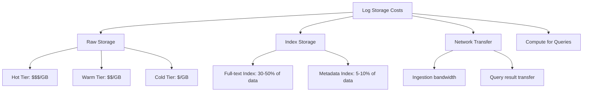

# How to Configure Log Storage Optimization

Author: [nawazdhandala](https://www.github.com/nawazdhandala)

Tags: Log Storage, Optimization, Compression, Elasticsearch, Cost Reduction, Performance, Data Management

Description: Learn how to optimize log storage for cost and performance. This guide covers compression techniques, index optimization, tiered storage, deduplication, and strategies to reduce storage costs while maintaining query performance.

---

> Log storage costs can spiral out of control as your infrastructure grows. A single busy application can generate gigabytes of logs daily. Optimizing storage is essential for keeping costs manageable while maintaining the ability to search and analyze your data.

The goal is not just to reduce storage size but to balance cost, query performance, and retention requirements. Different optimization strategies have different trade-offs.

---

## Understanding Log Storage Costs

Before optimizing, understand where costs come from:



Typical cost breakdown:
- **Raw data storage**: 40-50% of total cost
- **Index storage**: 20-30% of total cost
- **Compute and queries**: 20-30% of total cost
- **Network transfer**: 5-10% of total cost

---

## Compression Strategies

Reduce storage size through compression:

```typescript
// storage/compression.ts
// Log compression utilities

import zlib from 'zlib';
import { promisify } from 'util';

const gzip = promisify(zlib.gzip);
const gunzip = promisify(zlib.gunzip);
const brotliCompress = promisify(zlib.brotliCompress);
const brotliDecompress = promisify(zlib.brotliDecompress);

interface CompressionResult {
  compressed: Buffer;
  originalSize: number;
  compressedSize: number;
  ratio: number;
  algorithm: string;
}

class LogCompressor {
  // Compare compression algorithms and choose best
  async compressWithBestAlgorithm(data: string): Promise<CompressionResult> {
    const original = Buffer.from(data);
    const results: CompressionResult[] = [];

    // Try gzip (fast, good compression)
    const gzipped = await gzip(original, { level: 6 });
    results.push({
      compressed: gzipped,
      originalSize: original.length,
      compressedSize: gzipped.length,
      ratio: gzipped.length / original.length,
      algorithm: 'gzip'
    });

    // Try brotli (slower, better compression for text)
    const brotli = await brotliCompress(original, {
      params: {
        [zlib.constants.BROTLI_PARAM_QUALITY]: 6
      }
    });
    results.push({
      compressed: brotli,
      originalSize: original.length,
      compressedSize: brotli.length,
      ratio: brotli.length / original.length,
      algorithm: 'brotli'
    });

    // Return best compression ratio
    return results.reduce((best, current) =>
      current.ratio < best.ratio ? current : best
    );
  }

  // Compress batch of logs
  async compressBatch(logs: LogEntry[]): Promise<CompressionResult> {
    // Newline-delimited JSON for streaming decompression
    const ndjson = logs.map(log => JSON.stringify(log)).join('\n');
    return this.compressWithBestAlgorithm(ndjson);
  }

  // Dictionary-based compression for repeated patterns
  async compressWithDictionary(logs: LogEntry[], dictionary: Buffer): Promise<Buffer> {
    const data = Buffer.from(logs.map(log => JSON.stringify(log)).join('\n'));

    return new Promise((resolve, reject) => {
      const deflate = zlib.createDeflate({
        dictionary,
        level: 6
      });

      const chunks: Buffer[] = [];
      deflate.on('data', chunk => chunks.push(chunk));
      deflate.on('end', () => resolve(Buffer.concat(chunks)));
      deflate.on('error', reject);

      deflate.write(data);
      deflate.end();
    });
  }

  // Build dictionary from sample logs
  buildDictionary(sampleLogs: LogEntry[], maxSize: number = 32768): Buffer {
    // Extract common substrings
    const text = sampleLogs.map(log => JSON.stringify(log)).join('\n');

    // Use frequency analysis to find common patterns
    const patterns = this.findCommonPatterns(text);

    // Build dictionary from most common patterns
    let dictionary = '';
    for (const pattern of patterns) {
      if (dictionary.length + pattern.length > maxSize) break;
      dictionary += pattern;
    }

    return Buffer.from(dictionary);
  }

  private findCommonPatterns(text: string): string[] {
    const patterns: Map<string, number> = new Map();

    // Find repeated substrings of various lengths
    for (let len = 8; len <= 64; len++) {
      for (let i = 0; i <= text.length - len; i++) {
        const substr = text.substring(i, i + len);
        patterns.set(substr, (patterns.get(substr) || 0) + 1);
      }
    }

    // Sort by frequency * length (bytes saved)
    return [...patterns.entries()]
      .filter(([_, count]) => count > 1)
      .sort(([a, countA], [b, countB]) =>
        (countB * b.length) - (countA * a.length)
      )
      .slice(0, 1000)
      .map(([pattern]) => pattern);
  }
}

// Compression benchmarks for different log types
async function benchmarkCompression(logs: LogEntry[]): Promise<void> {
  const compressor = new LogCompressor();

  // Test different scenarios
  const scenarios = [
    { name: 'Raw JSON', data: JSON.stringify(logs) },
    { name: 'NDJSON', data: logs.map(l => JSON.stringify(l)).join('\n') },
    { name: 'Message only', data: logs.map(l => l.message).join('\n') }
  ];

  for (const scenario of scenarios) {
    const original = Buffer.from(scenario.data);
    const gzipped = await gzip(original);
    const brotli = await brotliCompress(original);

    console.log(`${scenario.name}:`);
    console.log(`  Original: ${original.length} bytes`);
    console.log(`  Gzip: ${gzipped.length} bytes (${(gzipped.length / original.length * 100).toFixed(1)}%)`);
    console.log(`  Brotli: ${brotli.length} bytes (${(brotli.length / original.length * 100).toFixed(1)}%)`);
  }
}
```

---

## Elasticsearch Index Optimization

Optimize Elasticsearch indices for log storage:

```json
{
  "settings": {
    "index": {
      "number_of_shards": 1,
      "number_of_replicas": 1,

      "codec": "best_compression",

      "refresh_interval": "30s",

      "translog": {
        "durability": "async",
        "sync_interval": "30s"
      },

      "merge": {
        "scheduler": {
          "max_thread_count": 1
        }
      },

      "mapping": {
        "total_fields": {
          "limit": 1000
        }
      },

      "sort.field": "@timestamp",
      "sort.order": "desc"
    }
  },
  "mappings": {
    "dynamic": "strict",
    "_source": {
      "enabled": true,
      "excludes": ["raw_message"]
    },
    "properties": {
      "@timestamp": {
        "type": "date"
      },
      "level": {
        "type": "keyword"
      },
      "service": {
        "type": "keyword"
      },
      "message": {
        "type": "text",
        "index": false,
        "doc_values": false
      },
      "message_hash": {
        "type": "keyword",
        "doc_values": true
      },
      "trace_id": {
        "type": "keyword"
      },
      "span_id": {
        "type": "keyword"
      },
      "http": {
        "properties": {
          "method": { "type": "keyword" },
          "status": { "type": "short" },
          "path": { "type": "keyword" },
          "duration_ms": { "type": "integer" }
        }
      },
      "attributes": {
        "type": "flattened"
      }
    }
  }
}
```

Index lifecycle policy for optimization:

```json
{
  "policy": {
    "phases": {
      "hot": {
        "min_age": "0ms",
        "actions": {
          "rollover": {
            "max_primary_shard_size": "30gb",
            "max_age": "1d"
          }
        }
      },
      "warm": {
        "min_age": "3d",
        "actions": {
          "shrink": {
            "number_of_shards": 1
          },
          "forcemerge": {
            "max_num_segments": 1
          },
          "readonly": {}
        }
      },
      "cold": {
        "min_age": "14d",
        "actions": {
          "searchable_snapshot": {
            "snapshot_repository": "logs-snapshots",
            "force_merge_index": true
          }
        }
      },
      "delete": {
        "min_age": "90d",
        "actions": {
          "delete": {}
        }
      }
    }
  }
}
```

---

## Field Optimization

Reduce storage by optimizing field types and indexing:

```typescript
// storage/field-optimization.ts
// Field optimization strategies

interface FieldOptimization {
  field: string;
  original: string;
  optimized: string;
  savings: string;
}

const fieldOptimizations: FieldOptimization[] = [
  {
    field: 'timestamp',
    original: 'ISO string (24 bytes)',
    optimized: 'epoch_millis (8 bytes)',
    savings: '67%'
  },
  {
    field: 'log level',
    original: 'text "WARNING" (7 bytes)',
    optimized: 'byte enum (1 byte)',
    savings: '86%'
  },
  {
    field: 'IP address',
    original: 'string "192.168.1.100" (14 bytes)',
    optimized: 'ip type (4 bytes)',
    savings: '71%'
  },
  {
    field: 'UUID',
    original: 'string with dashes (36 bytes)',
    optimized: 'binary (16 bytes)',
    savings: '56%'
  }
];

// Schema optimizer
class SchemaOptimizer {
  optimizeLogEntry(entry: Record<string, unknown>): Record<string, unknown> {
    const optimized: Record<string, unknown> = {};

    for (const [key, value] of Object.entries(entry)) {
      optimized[key] = this.optimizeField(key, value);
    }

    return optimized;
  }

  private optimizeField(key: string, value: unknown): unknown {
    // Timestamps to epoch
    if (key.includes('time') || key.includes('date')) {
      if (typeof value === 'string') {
        return new Date(value).getTime();
      }
    }

    // Log levels to integers
    if (key === 'level') {
      const levels: Record<string, number> = {
        trace: 0, debug: 1, info: 2, warn: 3, error: 4, fatal: 5
      };
      return levels[String(value).toLowerCase()] ?? 2;
    }

    // Booleans to 0/1
    if (typeof value === 'boolean') {
      return value ? 1 : 0;
    }

    // Truncate long strings
    if (typeof value === 'string' && value.length > 1000) {
      return value.substring(0, 1000) + '...[truncated]';
    }

    return value;
  }
}

// Field selection for hot vs cold storage
interface FieldTierConfig {
  hot: string[];       // Fields always indexed
  warm: string[];      // Fields indexed but compressed
  cold: string[];      // Fields stored but not indexed
  drop: string[];      // Fields not stored at all
}

const logFieldTiers: FieldTierConfig = {
  hot: [
    '@timestamp', 'level', 'service', 'trace_id',
    'http.status', 'http.method', 'error.type'
  ],
  warm: [
    'message', 'http.path', 'http.duration_ms',
    'user.id', 'span_id'
  ],
  cold: [
    'http.headers', 'http.body', 'stack_trace',
    'request.params', 'response.body'
  ],
  drop: [
    'raw_message', 'debug_info', 'internal_metadata'
  ]
};
```

---

## Deduplication

Remove duplicate log entries:

```typescript
// storage/deduplication.ts
// Log deduplication strategies

import crypto from 'crypto';

interface DeduplicationConfig {
  // Fields to use for identifying duplicates
  hashFields: string[];
  // Time window for deduplication
  windowSeconds: number;
  // Keep first or last occurrence
  keepStrategy: 'first' | 'last';
}

class LogDeduplicator {
  private config: DeduplicationConfig;
  private seen: Map<string, { count: number; firstSeen: number; lastSeen: number }> = new Map();
  private cleanupInterval: NodeJS.Timer;

  constructor(config: DeduplicationConfig) {
    this.config = config;

    // Periodically clean old entries
    this.cleanupInterval = setInterval(() => this.cleanup(), 60000);
  }

  process(logs: LogEntry[]): { unique: LogEntry[]; duplicates: number } {
    const unique: LogEntry[] = [];
    let duplicates = 0;

    for (const log of logs) {
      const hash = this.hashLog(log);
      const now = Date.now();
      const existing = this.seen.get(hash);

      if (existing) {
        // Check if within deduplication window
        const windowStart = now - this.config.windowSeconds * 1000;

        if (existing.lastSeen > windowStart) {
          // Duplicate within window
          duplicates++;
          existing.count++;
          existing.lastSeen = now;

          if (this.config.keepStrategy === 'last') {
            // Replace with newer entry
            const idx = unique.findIndex(u => this.hashLog(u) === hash);
            if (idx >= 0) {
              unique[idx] = this.addDuplicateCount(log, existing.count);
            }
          }
          continue;
        }
      }

      // New or outside window
      this.seen.set(hash, { count: 1, firstSeen: now, lastSeen: now });
      unique.push(log);
    }

    return { unique, duplicates };
  }

  private hashLog(log: LogEntry): string {
    const hashInput = this.config.hashFields
      .map(field => this.getFieldValue(log, field))
      .join('|');

    return crypto.createHash('md5').update(hashInput).digest('hex');
  }

  private getFieldValue(log: LogEntry, field: string): string {
    const value = field.split('.').reduce((obj, key) => obj?.[key], log as any);
    return String(value ?? '');
  }

  private addDuplicateCount(log: LogEntry, count: number): LogEntry {
    return {
      ...log,
      _dedupe: {
        count,
        note: `${count} similar logs within ${this.config.windowSeconds}s window`
      }
    };
  }

  private cleanup(): void {
    const cutoff = Date.now() - this.config.windowSeconds * 2 * 1000;

    for (const [hash, entry] of this.seen) {
      if (entry.lastSeen < cutoff) {
        this.seen.delete(hash);
      }
    }
  }

  getStats(): { uniqueHashes: number; totalDuplicates: number } {
    let totalDuplicates = 0;

    for (const entry of this.seen.values()) {
      totalDuplicates += entry.count - 1;
    }

    return {
      uniqueHashes: this.seen.size,
      totalDuplicates
    };
  }
}

// Usage
const deduplicator = new LogDeduplicator({
  hashFields: ['service', 'level', 'message', 'error.type'],
  windowSeconds: 60,
  keepStrategy: 'first'
});

// Process incoming logs
const incoming = [...logs];
const { unique, duplicates } = deduplicator.process(incoming);
console.log(`Processed ${incoming.length} logs: ${unique.length} unique, ${duplicates} duplicates`);
```

---

## Tiered Storage Architecture

Implement cost-effective tiered storage:

```typescript
// storage/tiered-storage.ts
// Tiered storage implementation

interface StorageTier {
  name: string;
  maxAgeDays: number;
  storage: StorageBackend;
  indexed: boolean;
  compressed: boolean;
  costPerGBMonth: number;
}

interface StorageBackend {
  write(logs: LogEntry[]): Promise<void>;
  read(query: LogQuery): Promise<LogEntry[]>;
  delete(before: Date): Promise<number>;
  getSize(): Promise<number>;
}

class TieredStorageManager {
  private tiers: StorageTier[];

  constructor(tiers: StorageTier[]) {
    // Sort by age (newest first)
    this.tiers = tiers.sort((a, b) => a.maxAgeDays - b.maxAgeDays);
  }

  async write(logs: LogEntry[]): Promise<void> {
    // Write to hot tier
    const hotTier = this.tiers[0];
    await hotTier.storage.write(logs);
  }

  async query(query: LogQuery): Promise<LogEntry[]> {
    const results: LogEntry[] = [];

    // Determine which tiers to query based on time range
    const tiersToQuery = this.getTiersForTimeRange(query.timeRange);

    for (const tier of tiersToQuery) {
      const tierResults = await tier.storage.read(query);
      results.push(...tierResults);
    }

    return results;
  }

  async runLifecycle(): Promise<LifecycleResult> {
    const result: LifecycleResult = {
      movedRecords: 0,
      deletedRecords: 0,
      freedBytes: 0
    };

    const now = new Date();

    for (let i = 0; i < this.tiers.length - 1; i++) {
      const currentTier = this.tiers[i];
      const nextTier = this.tiers[i + 1];

      // Find logs to move
      const cutoff = new Date(now.getTime() - currentTier.maxAgeDays * 24 * 60 * 60 * 1000);

      const logsToMove = await currentTier.storage.read({
        timeRange: { end: cutoff }
      });

      if (logsToMove.length > 0) {
        // Compress if moving to compressed tier
        const processedLogs = nextTier.compressed
          ? await this.compressLogs(logsToMove)
          : logsToMove;

        // Write to next tier
        await nextTier.storage.write(processedLogs);

        // Delete from current tier
        const deleted = await currentTier.storage.delete(cutoff);
        result.movedRecords += deleted;
      }
    }

    // Delete from coldest tier
    const coldestTier = this.tiers[this.tiers.length - 1];
    const deleteCutoff = new Date(now.getTime() - coldestTier.maxAgeDays * 24 * 60 * 60 * 1000);
    result.deletedRecords = await coldestTier.storage.delete(deleteCutoff);

    return result;
  }

  private getTiersForTimeRange(timeRange: TimeRange): StorageTier[] {
    const now = new Date();
    const queryStart = timeRange.start;

    return this.tiers.filter(tier => {
      const tierStart = new Date(now.getTime() - tier.maxAgeDays * 24 * 60 * 60 * 1000);
      return queryStart <= tierStart;
    });
  }

  async getStorageCosts(): Promise<StorageCostReport> {
    const costs: TierCost[] = [];

    for (const tier of this.tiers) {
      const sizeBytes = await tier.storage.getSize();
      const sizeGB = sizeBytes / (1024 * 1024 * 1024);
      const monthlyCost = sizeGB * tier.costPerGBMonth;

      costs.push({
        tier: tier.name,
        sizeGB,
        costPerGBMonth: tier.costPerGBMonth,
        monthlyCost
      });
    }

    return {
      tiers: costs,
      totalMonthlyCost: costs.reduce((sum, c) => sum + c.monthlyCost, 0)
    };
  }
}

// Example configuration
const tierConfig: StorageTier[] = [
  {
    name: 'hot',
    maxAgeDays: 7,
    storage: new ElasticsearchBackend({ nodes: ['hot-es:9200'] }),
    indexed: true,
    compressed: false,
    costPerGBMonth: 0.50
  },
  {
    name: 'warm',
    maxAgeDays: 30,
    storage: new ElasticsearchBackend({ nodes: ['warm-es:9200'] }),
    indexed: true,
    compressed: true,
    costPerGBMonth: 0.10
  },
  {
    name: 'cold',
    maxAgeDays: 365,
    storage: new S3Backend({ bucket: 'logs-cold', storageClass: 'GLACIER' }),
    indexed: false,
    compressed: true,
    costPerGBMonth: 0.004
  }
];
```

---

## Summary

Effective log storage optimization requires multiple strategies:

1. **Compression**: Use appropriate algorithms for your data (Brotli for text, gzip for speed)
2. **Index optimization**: Only index fields you actually query
3. **Field optimization**: Use efficient data types and drop unnecessary fields
4. **Deduplication**: Remove redundant logs before storage
5. **Tiered storage**: Move data to cheaper storage as it ages

The right combination depends on your query patterns, retention requirements, and budget. Start by measuring your current costs and query patterns, then optimize the areas with the biggest impact.

---

*Want optimized log storage without the complexity? [OneUptime](https://oneuptime.com) provides automatic compression, tiered storage, and intelligent indexing to minimize your log storage costs while maintaining fast query performance.*
