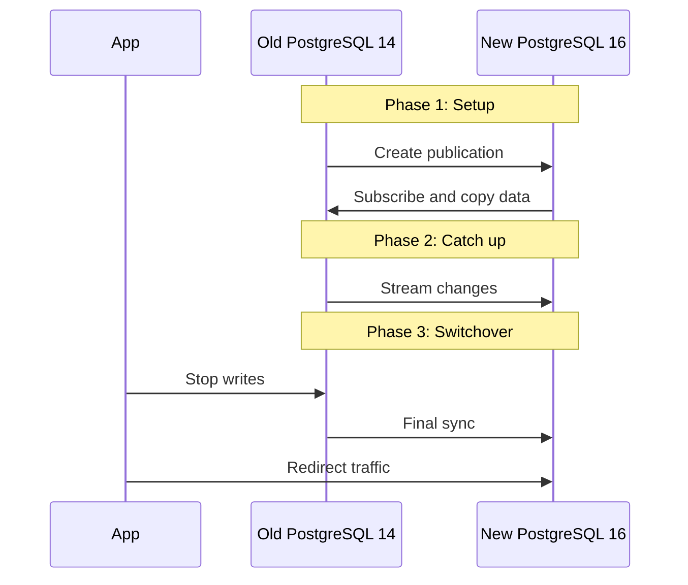

# How to Use Logical Replication in PostgreSQL

Author: [nawazdhandala](https://www.github.com/nawazdhandala)

Tags: PostgreSQL, Replication, High Availability, Database, Migration

Description: Learn how to set up and manage logical replication in PostgreSQL for selective table replication, zero-downtime migrations, and cross-version upgrades with practical examples.

---

Logical replication lets you selectively replicate data between PostgreSQL databases. Unlike streaming replication which copies the entire database at the physical level, logical replication works at the row level and lets you choose specific tables, filter rows, and even transform data during replication.

## Logical vs Physical Replication

Understanding when to use each approach:

**Physical (Streaming) Replication:**
- Replicates the entire cluster
- Replica must be the same PostgreSQL major version
- Replica is read-only
- Best for high availability failover

**Logical Replication:**
- Replicates selected tables
- Can work between different PostgreSQL versions
- Target can have additional tables and indexes
- Best for migrations, data distribution, and partial replication

## Prerequisites

Logical replication requires specific configuration on both publisher and subscriber.

### Publisher Configuration

Edit `postgresql.conf`:

```sql
-- Required settings on the publisher
ALTER SYSTEM SET wal_level = 'logical';
ALTER SYSTEM SET max_replication_slots = 10;
ALTER SYSTEM SET max_wal_senders = 10;
```

Restart PostgreSQL after changing wal_level:

```bash
sudo systemctl restart postgresql
```

Configure `pg_hba.conf` to allow replication connections:

```
# Allow replication from subscriber IP
host    replication     repl_user    10.0.0.50/32    scram-sha-256
host    all             repl_user    10.0.0.50/32    scram-sha-256
```

### Create a Replication User

```sql
-- Create user with replication privilege
CREATE USER repl_user WITH REPLICATION LOGIN PASSWORD 'secure_password';

-- Grant access to the database and tables
GRANT CONNECT ON DATABASE myapp TO repl_user;
GRANT USAGE ON SCHEMA public TO repl_user;
GRANT SELECT ON ALL TABLES IN SCHEMA public TO repl_user;
```

## Setting Up a Basic Publication

A publication defines which tables to replicate from the publisher.

### Replicate Specific Tables

```sql
-- Create a publication for specific tables
CREATE PUBLICATION orders_pub FOR TABLE orders, order_items, customers;

-- Verify the publication
SELECT * FROM pg_publication;
SELECT * FROM pg_publication_tables WHERE pubname = 'orders_pub';
```

### Replicate All Tables

```sql
-- Replicate all tables in the database
CREATE PUBLICATION all_tables_pub FOR ALL TABLES;
```

### Replicate with Row Filtering (PostgreSQL 15+)

```sql
-- Only replicate orders from a specific region
CREATE PUBLICATION us_orders_pub
FOR TABLE orders WHERE (region = 'US');

-- Filter by multiple conditions
CREATE PUBLICATION recent_orders_pub
FOR TABLE orders WHERE (created_at > '2025-01-01' AND status != 'cancelled');
```

### Column Filtering (PostgreSQL 15+)

```sql
-- Only replicate specific columns
CREATE PUBLICATION partial_customers_pub
FOR TABLE customers (id, name, email);
-- Excludes sensitive columns like payment_info, ssn
```

## Setting Up the Subscription

On the subscriber database, create the target tables first (they must have compatible schemas):

```sql
-- Create tables on subscriber (must match publisher schema)
CREATE TABLE orders (
    id SERIAL PRIMARY KEY,
    customer_id INTEGER,
    amount NUMERIC(10,2),
    region VARCHAR(50),
    created_at TIMESTAMP,
    status VARCHAR(20)
);

CREATE TABLE order_items (
    id SERIAL PRIMARY KEY,
    order_id INTEGER,
    product_id INTEGER,
    quantity INTEGER,
    price NUMERIC(10,2)
);

CREATE TABLE customers (
    id SERIAL PRIMARY KEY,
    name VARCHAR(100),
    email VARCHAR(255)
);
```

Create the subscription:

```sql
-- Connect to the publisher and start replicating
CREATE SUBSCRIPTION orders_sub
CONNECTION 'host=publisher.example.com port=5432 dbname=myapp user=repl_user password=secure_password'
PUBLICATION orders_pub;
```

The subscription will:
1. Copy existing data from the published tables
2. Start streaming changes in real-time

## Monitoring Replication Status

### Check Publication Status (Publisher)

```sql
-- View replication slots
SELECT
    slot_name,
    plugin,
    slot_type,
    active,
    pg_size_pretty(pg_wal_lsn_diff(pg_current_wal_lsn(), restart_lsn)) AS lag
FROM pg_replication_slots;

-- View connected subscribers
SELECT
    client_addr,
    state,
    sent_lsn,
    write_lsn,
    replay_lsn,
    pg_size_pretty(pg_wal_lsn_diff(sent_lsn, replay_lsn)) AS replay_lag
FROM pg_stat_replication;
```

### Check Subscription Status (Subscriber)

```sql
-- View subscription status
SELECT
    subname,
    subenabled,
    subconninfo,
    subslotname
FROM pg_subscription;

-- View replication workers
SELECT
    pid,
    relid::regclass AS table_name,
    received_lsn,
    last_msg_send_time,
    last_msg_receipt_time
FROM pg_stat_subscription;
```

## Handling Schema Changes

Logical replication does not automatically propagate DDL changes. You must apply schema changes to both publisher and subscriber.

### Safe Schema Change Process

```sql
-- Step 1: Add column on subscriber first (with default)
-- On subscriber:
ALTER TABLE orders ADD COLUMN shipping_method VARCHAR(50) DEFAULT 'standard';

-- Step 2: Add column on publisher
-- On publisher:
ALTER TABLE orders ADD COLUMN shipping_method VARCHAR(50) DEFAULT 'standard';

-- Step 3: Refresh the subscription to pick up new column
-- On subscriber:
ALTER SUBSCRIPTION orders_sub REFRESH PUBLICATION;
```

For dropping columns, reverse the order: drop on publisher first, then subscriber.

## Zero-Downtime Database Migration

Logical replication excels at migrations between PostgreSQL versions or servers:



### Migration Steps

```sql
-- On old server: Create publication
CREATE PUBLICATION migration_pub FOR ALL TABLES;

-- On new server: Create subscription
CREATE SUBSCRIPTION migration_sub
CONNECTION 'host=old-server.example.com port=5432 dbname=myapp user=repl_user password=secret'
PUBLICATION migration_pub;

-- Wait for initial sync to complete
SELECT * FROM pg_stat_subscription;

-- Monitor lag until it's near zero
SELECT
    slot_name,
    pg_size_pretty(pg_wal_lsn_diff(pg_current_wal_lsn(), confirmed_flush_lsn)) AS lag
FROM pg_replication_slots;
```

When lag is minimal:

```sql
-- On old server: Enable read-only mode
ALTER DATABASE myapp SET default_transaction_read_only = on;
SELECT pg_terminate_backend(pid) FROM pg_stat_activity WHERE datname = 'myapp';

-- Verify final sync on new server
-- Then update application connection strings to point to new server

-- Clean up on new server after migration
DROP SUBSCRIPTION migration_sub;
```

## Bi-Directional Replication

For multi-master setups (use with caution):

```sql
-- On server A: Create publication and subscription
CREATE PUBLICATION pub_a FOR TABLE shared_data;
CREATE SUBSCRIPTION sub_from_b
CONNECTION 'host=server-b.example.com ...'
PUBLICATION pub_b;

-- On server B: Create publication and subscription
CREATE PUBLICATION pub_b FOR TABLE shared_data;
CREATE SUBSCRIPTION sub_from_a
CONNECTION 'host=server-a.example.com ...'
PUBLICATION pub_a;
```

To prevent infinite loops, configure origin tracking:

```sql
-- On both servers
ALTER SUBSCRIPTION sub_from_a SET (origin = none);
ALTER SUBSCRIPTION sub_from_b SET (origin = none);
```

This tells each subscription to ignore changes that originated from the other subscription.

## Conflict Handling

Logical replication can fail on conflicts (unique constraint violations, missing rows for updates). Handle these proactively:

```sql
-- Skip a transaction causing conflicts
ALTER SUBSCRIPTION orders_sub DISABLE;

-- Find the problematic LSN
SELECT * FROM pg_stat_subscription;

-- Skip the transaction
SELECT pg_replication_origin_advance(
    'pg_' || (SELECT oid FROM pg_subscription WHERE subname = 'orders_sub'),
    'specific_lsn'::pg_lsn
);

-- Re-enable subscription
ALTER SUBSCRIPTION orders_sub ENABLE;
```

Better approach: design your schema to avoid conflicts:

```sql
-- Use UUIDs instead of sequences for distributed systems
CREATE TABLE orders (
    id UUID PRIMARY KEY DEFAULT gen_random_uuid(),
    ...
);
```

## Performance Tuning

### On the Publisher

```sql
-- More WAL senders if you have many subscribers
ALTER SYSTEM SET max_wal_senders = 20;

-- Longer slot retention for slow subscribers
ALTER SYSTEM SET wal_keep_size = '10GB';
```

### On the Subscriber

```sql
-- Parallel initial table copy (PostgreSQL 16+)
ALTER SUBSCRIPTION orders_sub
SET (streaming = 'parallel', binary = true);

-- More worker processes for applying changes
ALTER SYSTEM SET max_logical_replication_workers = 8;
ALTER SYSTEM SET max_sync_workers_per_subscription = 4;
```

## Cleaning Up

### Remove a Subscription

```sql
-- Disable first to stop replication workers
ALTER SUBSCRIPTION orders_sub DISABLE;

-- Drop the subscription
DROP SUBSCRIPTION orders_sub;
```

### Remove a Publication

```sql
-- Check if any active subscribers
SELECT * FROM pg_stat_replication WHERE application_name LIKE '%orders%';

-- Drop the publication
DROP PUBLICATION orders_pub;

-- Clean up orphaned replication slots
SELECT pg_drop_replication_slot('orders_sub')
WHERE NOT EXISTS (SELECT 1 FROM pg_stat_replication WHERE slot_name = 'orders_sub');
```

## Best Practices

1. **Monitor replication lag** continuously; falling behind causes WAL accumulation
2. **Test schema changes** in staging before production
3. **Use row filtering** to reduce unnecessary data transfer
4. **Set up alerts** for subscription failures
5. **Keep PostgreSQL versions reasonably close** (logical replication between very different versions may have subtle incompatibilities)
6. **Back up both sides** before major operations

Logical replication is a powerful tool for database operations that streaming replication cannot handle. Use it for migrations, data distribution, and selective synchronization while keeping in mind its operational complexity.
