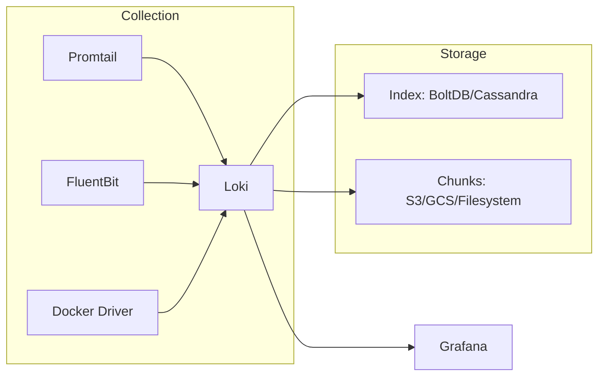

# How to Configure Loki for Log Aggregation

Author: [nawazdhandala](https://www.github.com/nawazdhandala)

Tags: Loki, Grafana, Log Aggregation, Promtail, LogQL, Observability, Kubernetes

Description: Learn how to configure Grafana Loki for cost-effective log aggregation. This guide covers installation, Promtail setup, LogQL queries, and production deployment patterns for scalable logging infrastructure.

---

> Grafana Loki is a horizontally scalable, highly available log aggregation system inspired by Prometheus. Unlike traditional log systems, Loki indexes only metadata (labels), making it significantly cheaper to operate at scale.

Loki takes a different approach to logging. Instead of indexing the full text of every log line, it stores compressed log chunks and indexes only the labels. This design choice dramatically reduces storage costs and operational complexity while still providing powerful query capabilities.

---

## Why Loki?

Loki offers several advantages over traditional logging solutions:

**Cost Effective**: By indexing only labels rather than full text, Loki uses 10-100x less index storage than Elasticsearch.

**Prometheus-like**: If you already use Prometheus and Grafana, Loki fits naturally into your stack with similar concepts and query patterns.

**Simple Operations**: No complex cluster management or JVM tuning. Loki runs efficiently with minimal configuration.

**Kubernetes Native**: Built with Kubernetes in mind, using the same service discovery and labeling patterns.



---

## Installing Loki

### Docker Compose Setup

Start with a simple Docker Compose configuration for development:

```yaml
# docker-compose.yml
# Loki stack for local development
version: '3.8'

services:
  loki:
    image: grafana/loki:2.9.0
    ports:
      - "3100:3100"
    command: -config.file=/etc/loki/local-config.yaml
    volumes:
      - ./loki-config.yaml:/etc/loki/local-config.yaml
      - loki_data:/loki
    networks:
      - loki

  promtail:
    image: grafana/promtail:2.9.0
    volumes:
      - ./promtail-config.yaml:/etc/promtail/config.yaml
      - /var/log:/var/log:ro
      - /var/lib/docker/containers:/var/lib/docker/containers:ro
    command: -config.file=/etc/promtail/config.yaml
    depends_on:
      - loki
    networks:
      - loki

  grafana:
    image: grafana/grafana:10.2.0
    ports:
      - "3000:3000"
    environment:
      - GF_AUTH_ANONYMOUS_ENABLED=true
      - GF_AUTH_ANONYMOUS_ORG_ROLE=Admin
    volumes:
      - grafana_data:/var/lib/grafana
      - ./grafana-datasources.yaml:/etc/grafana/provisioning/datasources/datasources.yaml
    depends_on:
      - loki
    networks:
      - loki

volumes:
  loki_data:
  grafana_data:

networks:
  loki:
```

---

## Loki Configuration

Configure Loki for your environment:

```yaml
# loki-config.yaml
# Loki server configuration

auth_enabled: false

server:
  http_listen_port: 3100
  grpc_listen_port: 9096

  # Logging configuration
  log_level: info

# Ingester configuration
ingester:
  # How long chunks stay in memory before flushing
  chunk_idle_period: 3m

  # Maximum chunk age before flushing
  max_chunk_age: 1h

  # Target chunk size (compressed)
  chunk_target_size: 1048576

  # Retain chunks in memory after flushing
  chunk_retain_period: 30s

  # Limit streams per user
  max_transfer_retries: 0

  lifecycler:
    ring:
      kvstore:
        store: inmemory
      replication_factor: 1

# Schema configuration
schema_config:
  configs:
    - from: 2024-01-01
      store: boltdb-shipper
      object_store: filesystem
      schema: v12
      index:
        prefix: index_
        period: 24h

# Storage configuration
storage_config:
  boltdb_shipper:
    active_index_directory: /loki/boltdb-shipper-active
    cache_location: /loki/boltdb-shipper-cache
    cache_ttl: 24h
    shared_store: filesystem

  filesystem:
    directory: /loki/chunks

# Compactor configuration
compactor:
  working_directory: /loki/boltdb-shipper-compactor
  shared_store: filesystem
  compaction_interval: 10m
  retention_enabled: true
  retention_delete_delay: 2h
  retention_delete_worker_count: 150

# Limits configuration
limits_config:
  # Reject old samples
  reject_old_samples: true
  reject_old_samples_max_age: 168h

  # Ingestion limits
  ingestion_rate_mb: 10
  ingestion_burst_size_mb: 20

  # Query limits
  max_entries_limit_per_query: 5000
  max_query_series: 500
  max_query_parallelism: 32

  # Retention period
  retention_period: 744h  # 31 days

# Chunk store configuration
chunk_store_config:
  max_look_back_period: 0s

# Table manager (for index retention)
table_manager:
  retention_deletes_enabled: true
  retention_period: 744h

# Query configuration
query_range:
  results_cache:
    cache:
      embedded_cache:
        enabled: true
        max_size_mb: 100
```

---

## Configuring Promtail

Promtail is Loki's log collection agent. Configure it to scrape logs from your systems:

```yaml
# promtail-config.yaml
# Promtail agent configuration

server:
  http_listen_port: 9080
  grpc_listen_port: 0

# Position file tracks where we are in each log file
positions:
  filename: /tmp/positions.yaml

# Loki server to push logs to
clients:
  - url: http://loki:3100/loki/api/v1/push
    # Batch configuration
    batchwait: 1s
    batchsize: 1048576

    # Retry configuration
    backoff_config:
      min_period: 500ms
      max_period: 5m
      max_retries: 10

    # Timeout
    timeout: 10s

# Scrape configurations
scrape_configs:
  # System logs
  - job_name: system
    static_configs:
      - targets:
          - localhost
        labels:
          job: varlogs
          host: ${HOSTNAME}
          __path__: /var/log/*.log

    pipeline_stages:
      # Parse syslog format
      - regex:
          expression: '^(?P<timestamp>\w+\s+\d+\s+\d+:\d+:\d+)\s+(?P<hostname>\w+)\s+(?P<program>[\w\-]+)(\[(?P<pid>\d+)\])?: (?P<message>.*)$'

      # Set timestamp
      - timestamp:
          source: timestamp
          format: "Jan 02 15:04:05"

      # Add extracted fields as labels
      - labels:
          program:
          hostname:

  # Application logs (JSON format)
  - job_name: application
    static_configs:
      - targets:
          - localhost
        labels:
          job: application
          environment: production
          __path__: /var/log/app/*.log

    pipeline_stages:
      # Parse JSON logs
      - json:
          expressions:
            level: level
            service: service
            message: message
            trace_id: trace_id

      # Add labels from JSON fields
      - labels:
          level:
          service:

      # Set timestamp from JSON
      - timestamp:
          source: timestamp
          format: RFC3339Nano

      # Set output message
      - output:
          source: message

  # Docker container logs
  - job_name: docker
    static_configs:
      - targets:
          - localhost
        labels:
          job: docker
          __path__: /var/lib/docker/containers/*/*.log

    pipeline_stages:
      # Parse Docker JSON log format
      - json:
          expressions:
            log: log
            stream: stream
            time: time

      # Extract container ID from path
      - regex:
          source: filename
          expression: '/var/lib/docker/containers/(?P<container_id>[^/]+)/'

      - labels:
          stream:
          container_id:

      - timestamp:
          source: time
          format: RFC3339Nano

      - output:
          source: log
```

---

## Kubernetes Deployment

Deploy Promtail as a DaemonSet in Kubernetes:

```yaml
# promtail-daemonset.yaml
apiVersion: apps/v1
kind: DaemonSet
metadata:
  name: promtail
  namespace: logging
spec:
  selector:
    matchLabels:
      app: promtail
  template:
    metadata:
      labels:
        app: promtail
    spec:
      serviceAccountName: promtail
      tolerations:
        - operator: Exists
      containers:
        - name: promtail
          image: grafana/promtail:2.9.0
          args:
            - -config.file=/etc/promtail/promtail.yaml
          env:
            - name: HOSTNAME
              valueFrom:
                fieldRef:
                  fieldPath: spec.nodeName
          ports:
            - containerPort: 3101
              name: http-metrics
          resources:
            limits:
              cpu: 200m
              memory: 128Mi
            requests:
              cpu: 50m
              memory: 64Mi
          volumeMounts:
            - name: config
              mountPath: /etc/promtail
            - name: varlog
              mountPath: /var/log
              readOnly: true
            - name: containers
              mountPath: /var/lib/docker/containers
              readOnly: true
            - name: pods
              mountPath: /var/log/pods
              readOnly: true
      volumes:
        - name: config
          configMap:
            name: promtail-config
        - name: varlog
          hostPath:
            path: /var/log
        - name: containers
          hostPath:
            path: /var/lib/docker/containers
        - name: pods
          hostPath:
            path: /var/log/pods
---
# Kubernetes-specific Promtail configuration
apiVersion: v1
kind: ConfigMap
metadata:
  name: promtail-config
  namespace: logging
data:
  promtail.yaml: |
    server:
      http_listen_port: 3101

    positions:
      filename: /tmp/positions.yaml

    clients:
      - url: http://loki.logging.svc:3100/loki/api/v1/push

    scrape_configs:
      - job_name: kubernetes-pods
        kubernetes_sd_configs:
          - role: pod

        pipeline_stages:
          - cri: {}
          - json:
              expressions:
                level: level
                msg: msg
          - labels:
              level:

        relabel_configs:
          # Keep only pods with logging enabled
          - source_labels: [__meta_kubernetes_pod_annotation_logging]
            action: keep
            regex: "true"

          # Set namespace label
          - source_labels: [__meta_kubernetes_namespace]
            target_label: namespace

          # Set pod name label
          - source_labels: [__meta_kubernetes_pod_name]
            target_label: pod

          # Set container name label
          - source_labels: [__meta_kubernetes_pod_container_name]
            target_label: container

          # Set app label from pod label
          - source_labels: [__meta_kubernetes_pod_label_app]
            target_label: app

          # Set log file path
          - replacement: /var/log/pods/*$1/*.log
            separator: /
            source_labels:
              - __meta_kubernetes_pod_uid
              - __meta_kubernetes_pod_container_name
            target_label: __path__
```

---

## LogQL Query Language

LogQL is Loki's query language. Learn the basics:

### Stream Selection

```logql
# Select logs from a specific job
{job="application"}

# Multiple label selectors
{job="application", environment="production"}

# Regex matching
{job=~"app.*", level=~"error|warn"}

# Negative matching
{job="application", level!="debug"}
```

### Log Pipeline

```logql
# Filter logs containing specific text
{job="application"} |= "error"

# Regex filter
{job="application"} |~ "user_id=\\d+"

# Exclude patterns
{job="application"} != "health check"

# Parse JSON and filter
{job="application"} | json | level="error"

# Parse with regex and extract fields
{job="nginx"} | regexp `(?P<ip>\d+\.\d+\.\d+\.\d+).*"(?P<method>\w+) (?P<path>[^ ]+)`

# Line format output
{job="application"} | json | line_format "{{.level}}: {{.message}}"
```

### Metric Queries

```logql
# Count errors per minute
sum(rate({job="application"} |= "error" [1m])) by (service)

# Count logs by level
sum by (level) (count_over_time({job="application"} | json [5m]))

# Calculate error rate percentage
sum(rate({job="application"} | json | level="error" [5m]))
/
sum(rate({job="application"} [5m]))
* 100

# 95th percentile of extracted duration
quantile_over_time(0.95, {job="application"} | json | unwrap duration [5m]) by (service)

# Top 5 endpoints by request count
topk(5, sum by (path) (count_over_time({job="nginx"} | regexp `"(?P<method>\w+) (?P<path>[^"]+)"` [1h])))
```

---

## Grafana Integration

Configure Grafana to use Loki as a datasource:

```yaml
# grafana-datasources.yaml
apiVersion: 1

datasources:
  - name: Loki
    type: loki
    access: proxy
    url: http://loki:3100
    isDefault: true
    editable: false
    jsonData:
      maxLines: 1000
      derivedFields:
        # Link to traces
        - datasourceUid: tempo
          matcherRegex: "trace_id=(\\w+)"
          name: TraceID
          url: "$${__value.raw}"
```

Create a dashboard for log analysis:

```json
{
  "panels": [
    {
      "title": "Log Volume",
      "type": "timeseries",
      "targets": [
        {
          "expr": "sum(rate({job=\"application\"} [5m])) by (level)",
          "legendFormat": "{{level}}"
        }
      ]
    },
    {
      "title": "Error Logs",
      "type": "logs",
      "targets": [
        {
          "expr": "{job=\"application\"} | json | level=\"error\"",
          "refId": "A"
        }
      ],
      "options": {
        "showTime": true,
        "showLabels": true,
        "wrapLogMessage": true
      }
    },
    {
      "title": "Top Error Messages",
      "type": "table",
      "targets": [
        {
          "expr": "topk(10, sum by (message) (count_over_time({job=\"application\"} | json | level=\"error\" [1h])))",
          "instant": true
        }
      ]
    }
  ]
}
```

---

## Production Deployment

For production, deploy Loki in microservices mode with separate components:

```yaml
# loki-distributed-config.yaml
# Distributed Loki configuration

auth_enabled: true

server:
  http_listen_port: 3100

# Use memberlist for ring
memberlist:
  join_members:
    - loki-memberlist

# Distributed ingester
ingester:
  lifecycler:
    ring:
      kvstore:
        store: memberlist
      replication_factor: 3

# S3 storage for production
storage_config:
  boltdb_shipper:
    active_index_directory: /loki/index
    shared_store: s3

  aws:
    s3: s3://your-bucket/loki
    region: us-east-1

  # Or use GCS
  # gcs:
  #   bucket_name: your-bucket

# Query scheduler for load distribution
query_scheduler:
  max_outstanding_requests_per_tenant: 2048

# Query frontend for caching
frontend:
  compress_responses: true
  log_queries_longer_than: 5s
```

---

## Summary

Loki provides a cost-effective approach to log aggregation that scales well for most use cases. Key points to remember:

1. Use labels wisely - high cardinality labels hurt performance
2. Design your pipeline stages for efficient parsing
3. Set appropriate retention periods based on storage costs
4. Use LogQL metric queries for alerting and dashboards
5. Deploy in microservices mode for production workloads

The Prometheus-inspired design means teams familiar with PromQL can quickly become productive with LogQL. Combined with Grafana, Loki provides a complete logging solution that integrates naturally with your existing observability stack.

---

*Looking for an easier path to log aggregation? [OneUptime](https://oneuptime.com) provides built-in log management that works alongside your metrics and traces, with no infrastructure to manage and automatic correlation across all your telemetry data.*
