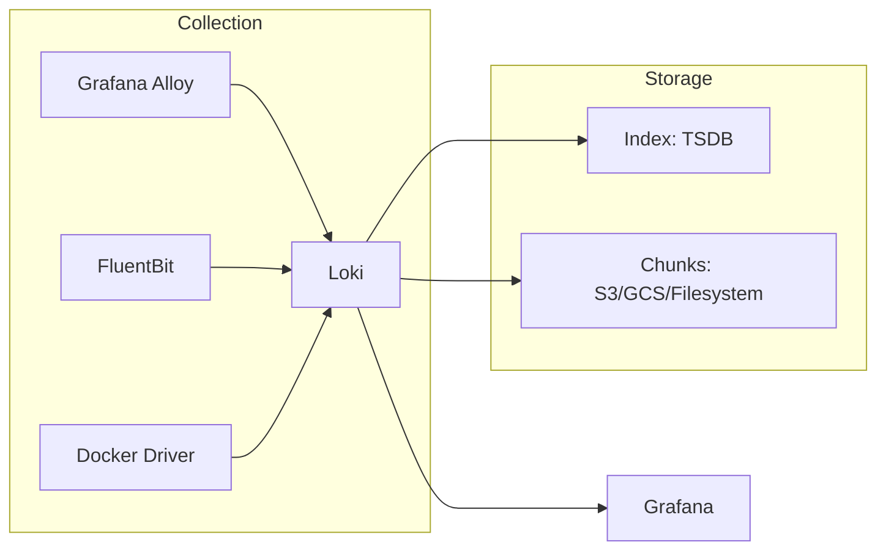

# How to Configure Loki for Log Aggregation

Author: [nawazdhandala](https://www.github.com/nawazdhandala)

Tags: Loki, Grafana, Log Aggregation, Promtail, LogQL, Observability, Kubernetes

Description: Learn how to configure Grafana Loki for cost-effective log aggregation.

---

> Grafana Loki is a horizontally scalable, highly available log aggregation system inspired by Prometheus. Unlike traditional log systems, Loki indexes only metadata (labels), making it significantly cheaper to operate at scale.

Loki takes a different approach to logging. Instead of indexing the full text of every log line, it stores compressed log chunks and indexes only the labels. This design choice dramatically reduces storage costs and operational complexity while still providing powerful query capabilities.

---

## Why Loki?

Loki offers several advantages over traditional logging solutions:

**Cost Effective**: By indexing only labels rather than full text, Loki keeps a small index and stores compressed log chunks in object storage or the filesystem.

**Prometheus-like**: If you already use Prometheus and Grafana, Loki fits naturally into your stack with similar concepts and query patterns.

**Simple Operations**: No complex cluster management or JVM tuning. Loki runs efficiently with minimal configuration.

**Kubernetes Native**: Built with Kubernetes in mind, using the same service discovery and labeling patterns.


```mermaid
flowchart LR
    subgraph Collection
        A[Grafana Alloy] --> B[Loki]
        C[FluentBit] --> B
        D[Docker Driver] --> B
    end

    subgraph Storage
        B --> E[Index: TSDB]
        B --> F[Chunks: S3/GCS/Filesystem]
    end

    B --> G[Grafana]
```

---

## Installing Loki

### Docker Compose Setup

Start with a simple Docker Compose configuration for development:

```yaml
# docker-compose.yml

# Loki stack for local development
version: '3.8'

services:
  loki:
    image: grafana/loki:3.7.0
    ports:
      - "3100:3100"
    command: -config.file=/etc/loki/local-config.yaml
    volumes:
      - ./loki-config.yaml:/etc/loki/local-config.yaml
      - loki_data:/loki
    networks:
      - loki

  alloy:
    image: grafana/alloy:v1.16.3
    volumes:
      - ./alloy-config.alloy:/etc/alloy/config.alloy
      - /var/log:/var/log:ro
      - /var/run/docker.sock:/var/run/docker.sock:ro
    command: run /etc/alloy/config.alloy --server.http.listen-addr=0.0.0.0:12345
    depends_on:
      - loki
    networks:
      - loki

  grafana:
    image: grafana/grafana:13.0.2
    ports:
      - "3000:3000"
    environment:
      - GF_AUTH_ANONYMOUS_ENABLED=true
      - GF_AUTH_ANONYMOUS_ORG_ROLE=Admin
    volumes:
      - grafana_data:/var/lib/grafana
      - ./grafana-datasources.yaml:/etc/grafana/provisioning/datasources/datasources.yaml
    depends_on:
      - loki
    networks:
      - loki

volumes:
  loki_data:
  grafana_data:

networks:
  loki:
```

---

## Loki Configuration

Configure Loki for your environment:

```yaml
# loki-config.yaml
# Loki server configuration

auth_enabled: false

server:
  http_listen_port: 3100
  log_level: info

common:
  path_prefix: /loki
  ring:
    instance_addr: 127.0.0.1
    kvstore:
      store: inmemory
  replication_factor: 1

# Schema configuration
schema_config:
  configs:
    - from: 2024-01-01
      store: tsdb
      object_store: filesystem
      schema: v13
      index:
        prefix: index_
        period: 24h

# Storage configuration
storage_config:
  filesystem:
    directory: /loki/chunks

  tsdb_shipper:
    active_index_directory: /loki/index
    cache_location: /loki/index_cache

# Compactor configuration
compactor:
  working_directory: /loki/compactor
  compaction_interval: 10m
  retention_enabled: true
  retention_delete_delay: 2h
  retention_delete_worker_count: 150
  delete_request_store: filesystem

# Limits configuration
limits_config:
  # Reject old samples
  reject_old_samples: true
  reject_old_samples_max_age: 168h

  # Ingestion limits
  ingestion_rate_mb: 10
  ingestion_burst_size_mb: 20

  # Query limits
  max_entries_limit_per_query: 5000
  max_query_series: 500
  max_query_parallelism: 32

  # Retention period
  retention_period: 744h  # 31 days

# Query configuration
query_range:
  results_cache:
    cache:
      embedded_cache:
        enabled: true
        max_size_mb: 100
```

---

## Configuring Grafana Alloy

Grafana Alloy is Grafana's supported agent for collecting logs and sending them to Loki. Configure it to scrape logs from your systems:

```alloy
// alloy-config.alloy
// Grafana Alloy log collection configuration

loki.write "local" {
  endpoint {
    url = "http://loki:3100/loki/api/v1/push"
  }
}

// System logs
loki.source.file "system" {
  targets = [
    {
      __path__ = "/var/log/*.log",
      job      = "varlogs",
      host     = sys.env("HOSTNAME"),
    },
  ]
  forward_to = [loki.process.system.receiver]

  file_match {
    enabled = true
  }
}

loki.process "system" {
  forward_to = [loki.write.local.receiver]

  // Parse syslog format
  stage.regex {
    expression = "^(?P<timestamp>\\w+\\s+\\d+\\s+\\d+:\\d+:\\d+)\\s+(?P<hostname>\\w+)\\s+(?P<program>[\\w-]+)(\\[(?P<pid>\\d+)\\])?: (?P<message>.*)$"
  }

  // Set timestamp
  stage.timestamp {
    source = "timestamp"
    format = "Jan 02 15:04:05"
  }

  // Add extracted fields as labels
  stage.labels {
    values = {
      program  = "",
      hostname = "",
    }
  }
}

// Application logs (JSON format)
loki.source.file "application" {
  targets = [
    {
      __path__     = "/var/log/app/*.log",
      job          = "application",
      environment  = "production",
    },
  ]
  forward_to = [loki.process.application.receiver]

  file_match {
    enabled = true
  }
}

loki.process "application" {
  forward_to = [loki.write.local.receiver]

  // Parse JSON logs
  stage.json {
    expressions = {
      level     = "level",
      service   = "service",
      message   = "message",
      timestamp = "timestamp",
      trace_id  = "trace_id",
    }
  }

  // Add labels from JSON fields
  stage.labels {
    values = {
      level   = "",
      service = "",
    }
  }

  // Set timestamp from JSON
  stage.timestamp {
    source = "timestamp"
    format = "RFC3339Nano"
  }

  // Set output message
  stage.output {
    source = "message"
  }
}

// Docker container logs
discovery.docker "containers" {
  host = "unix:///var/run/docker.sock"
}

discovery.relabel "docker_logs" {
  targets = discovery.docker.containers.targets

  rule {
    source_labels = ["__meta_docker_container_name"]
    regex         = "/(.*)"
    target_label  = "container"
  }
}

loki.source.docker "containers" {
  host          = "unix:///var/run/docker.sock"
  targets       = discovery.docker.containers.targets
  labels        = {"job" = "docker"}
  relabel_rules = discovery.relabel.docker_logs.rules
  forward_to    = [loki.write.local.receiver]
}
```

---

## Kubernetes Deployment

Deploy Grafana Alloy as a DaemonSet in Kubernetes:

```yaml
# alloy-daemonset.yaml
apiVersion: apps/v1
kind: DaemonSet
metadata:
  name: alloy
  namespace: logging
spec:
  selector:
    matchLabels:
      app: alloy
  template:
    metadata:
      labels:
        app: alloy
    spec:
      serviceAccountName: alloy
      tolerations:
        - operator: Exists
      containers:
        - name: alloy
          image: grafana/alloy:v1.16.3
          args:
            - run
            - /etc/alloy/config.alloy
            - --server.http.listen-addr=0.0.0.0:12345
          env:
            - name: HOSTNAME
              valueFrom:
                fieldRef:
                  fieldPath: spec.nodeName
          ports:
            - containerPort: 12345
              name: http-metrics
          resources:
            limits:
              cpu: 200m
              memory: 128Mi
            requests:
              cpu: 50m
              memory: 64Mi
          volumeMounts:
            - name: config
              mountPath: /etc/alloy
            - name: varlog
              mountPath: /var/log
              readOnly: true
            - name: pods
              mountPath: /var/log/pods
              readOnly: true
      volumes:
        - name: config
          configMap:
            name: alloy-config
        - name: varlog
          hostPath:
            path: /var/log
        - name: pods
          hostPath:
            path: /var/log/pods
---
# Kubernetes-specific Alloy configuration
apiVersion: v1
kind: ConfigMap
metadata:
  name: alloy-config
  namespace: logging
data:
  config.alloy: |
    loki.write "default" {
      endpoint {
        url = "http://loki.logging.svc:3100/loki/api/v1/push"
      }
    }

    discovery.kubernetes "pods" {
      role = "pod"

      selectors {
        role  = "pod"
        field = "spec.nodeName=" + sys.env("HOSTNAME")
      }
    }

    discovery.relabel "pod_logs" {
      targets = discovery.kubernetes.pods.targets

      # Keep only pods with logging enabled
      rule {
        source_labels = ["__meta_kubernetes_pod_annotation_logging"]
        action        = "keep"
        regex         = "true"
      }

      # Set namespace label
      rule {
        source_labels = ["__meta_kubernetes_namespace"]
        target_label  = "namespace"
      }

      # Set pod name label
      rule {
        source_labels = ["__meta_kubernetes_pod_name"]
        target_label  = "pod"
      }

      # Set container name label
      rule {
        source_labels = ["__meta_kubernetes_pod_container_name"]
        target_label  = "container"
      }

      # Set app label from pod label
      rule {
        source_labels = ["__meta_kubernetes_pod_label_app"]
        target_label  = "app"
      }

      # Set log file path
      rule {
        source_labels = ["__meta_kubernetes_pod_uid", "__meta_kubernetes_pod_container_name"]
        separator     = "/"
        target_label  = "__path__"
        replacement   = "/var/log/pods/*$1/*.log"
      }
    }

    loki.source.kubernetes "pod_logs" {
      targets    = discovery.relabel.pod_logs.output
      forward_to = [loki.process.pod_logs.receiver]
    }

    loki.process "pod_logs" {
      forward_to = [loki.write.default.receiver]

      stage.json {
        expressions = {
          level = "level",
          msg   = "msg",
        }
      }

      stage.labels {
        values = {
          level = "",
        }
      }
    }
```

---

## LogQL Query Language

LogQL is Loki's query language. Learn the basics:

### Stream Selection

```logql
# Select logs from a specific job
{job="application"}

# Multiple label selectors
{job="application", environment="production"}

# Regex matching
{job=~"app.*", level=~"error|warn"}

# Negative matching
{job="application", level!="debug"}
```

### Log Pipeline

```logql
# Filter logs containing specific text
{job="application"} |= "error"

# Regex filter
{job="application"} |~ "user_id=\\d+"

# Exclude patterns
{job="application"} != "health check"

# Parse JSON and filter
{job="application"} | json | level="error"

# Parse with regex and extract fields
{job="nginx"} | regexp `(?P<ip>\d+\.\d+\.\d+\.\d+).*"(?P<method>\w+) (?P<path>[^ ]+)`

# Line format output
{job="application"} | json | line_format "{{.level}}: {{.message}}"
```

### Metric Queries

```logql
# Count errors per minute
sum by (service) (rate({job="application"} |= "error" [1m]))

# Count logs by level
sum by (level) (count_over_time({job="application"} | json [5m]))

# Calculate error rate percentage
sum(rate({job="application"} | json | level="error" [5m]))
/
sum(rate({job="application"} [5m]))
* 100

# 95th percentile of extracted duration
quantile_over_time(0.95, {job="application"} | json | unwrap duration [5m]) by (service)

# Top 5 endpoints by request count
topk(5, sum by (path) (count_over_time({job="nginx"} | regexp `"(?P<method>\w+) (?P<path>[^"]+)"` [1h])))
```

---

## Grafana Integration

Configure Grafana to use Loki as a datasource:

```yaml
# grafana-datasources.yaml
apiVersion: 1

datasources:
  - name: Loki
    type: loki
    access: proxy
    url: http://loki:3100
    isDefault: true
    editable: false
    jsonData:
      maxLines: 1000
      derivedFields:
        # Link to traces
        - datasourceUid: tempo
          matcherRegex: "trace_id=(\\w+)"
          name: TraceID
          url: "$${__value.raw}"
```

Create a dashboard for log analysis:

```json
{
  "panels": [
    {
      "title": "Log Volume",
      "type": "timeseries",
      "targets": [
        {
          "expr": "sum by (level) (rate({job=\"application\"} [5m]))",
          "legendFormat": "{{level}}"
        }
      ]
    },
    {
      "title": "Error Logs",
      "type": "logs",
      "targets": [
        {
          "expr": "{job=\"application\"} | json | level=\"error\"",
          "refId": "A"
        }
      ],
      "options": {
        "showTime": true,
        "showLabels": true,
        "wrapLogMessage": true
      }
    },
    {
      "title": "Top Error Messages",
      "type": "table",
      "targets": [
        {
          "expr": "topk(10, sum by (message) (count_over_time({job=\"application\"} | json | level=\"error\" [1h])))",
          "instant": true
        }
      ]
    }
  ]
}
```

---

## Production Deployment

For production, deploy Loki in microservices mode with separate components:

```yaml
# loki-distributed-config.yaml
# Distributed Loki configuration

auth_enabled: true

server:
  http_listen_port: 3100

# Use memberlist for ring
memberlist:
  join_members:
    - loki-memberlist

# Distributed ingester
ingester:
  lifecycler:
    ring:
      kvstore:
        store: memberlist
      replication_factor: 3

# Schema configuration
schema_config:
  configs:
    - from: 2024-01-01
      store: tsdb
      object_store: s3
      schema: v13
      index:
        prefix: index_
        period: 24h

# S3 storage for production
storage_config:
  tsdb_shipper:
    active_index_directory: /loki/index
    cache_location: /loki/index_cache

  aws:
    bucketnames: your-bucket
    region: us-east-1

  # Or use GCS
  # gcs:
  #   bucket_name: your-bucket

# Query scheduler for load distribution
query_scheduler:
  max_outstanding_requests_per_tenant: 2048

# Query frontend for caching
frontend:
  compress_responses: true
  log_queries_longer_than: 5s
```

---

## Summary

Loki provides a cost-effective approach to log aggregation that scales well for most use cases. Key points to remember:

1. Use labels wisely - high cardinality labels hurt performance
2. Design your pipeline stages for efficient parsing
3. Set appropriate retention periods based on storage costs
4. Use LogQL metric queries for alerting and dashboards
5. Deploy in microservices mode for production workloads

The Prometheus-inspired design means teams familiar with PromQL can quickly become productive with LogQL. Combined with Grafana, Loki provides a complete logging solution that integrates naturally with your existing observability stack.

---

*Looking for an easier path to log aggregation? [OneUptime](https://oneuptime.com) provides built-in log management that works alongside your metrics and traces, with no infrastructure to manage and automatic correlation across all your telemetry data.*
