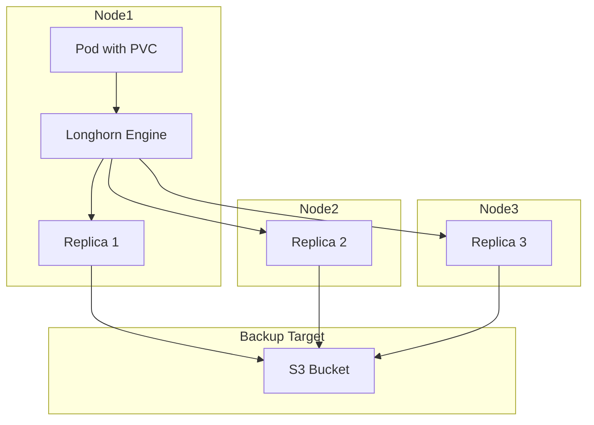

# How to Implement Longhorn for Kubernetes Storage

Author: [nawazdhandala](https://www.github.com/nawazdhandala)

Tags: Kubernetes, Longhorn, Storage, Persistent Volumes, DevOps

Description: Learn how to deploy and configure Longhorn for distributed block storage in Kubernetes, including installation, volume management, backup scheduling, and disaster recovery strategies.

---

Longhorn is a lightweight, distributed block storage system built specifically for Kubernetes. Developed by Rancher Labs and now a CNCF sandbox project, it provides replicated persistent volumes without the operational overhead of traditional storage clusters like Ceph. If you want reliable storage for stateful workloads without becoming a full-time storage administrator, Longhorn is worth considering.

This guide covers installation, volume provisioning, backup configuration, and recovery procedures.

## Why Longhorn?

Longhorn addresses common Kubernetes storage pain points:

1. **Simplicity:** No separate storage cluster to manage. Longhorn runs as pods on your existing nodes.
2. **Replication:** Each volume is replicated across multiple nodes for high availability.
3. **Built-in backups:** Native support for backing up volumes to S3 or NFS.
4. **UI-driven operations:** Web dashboard for volume management, snapshot creation, and disaster recovery.
5. **Incremental snapshots:** Fast, space-efficient snapshots with instant restore.

The tradeoff is that Longhorn only provides block storage (ReadWriteOnce). If you need shared filesystems (ReadWriteMany), you will need to pair it with NFS or look at other solutions.

## Prerequisites

Before installing Longhorn, ensure your cluster meets these requirements:

- Kubernetes 1.21 or higher
- Each node needs `open-iscsi` installed
- Nodes should have at least one dedicated disk or partition for storage (optional but recommended)
- Helm 3.x installed

Install iSCSI on all nodes:

```bash
# Ubuntu/Debian
sudo apt update && sudo apt install -y open-iscsi
sudo systemctl enable --now iscsid

# RHEL/CentOS/Fedora
sudo dnf install -y iscsi-initiator-utils
sudo systemctl enable --now iscsid

# Verify iSCSI is running
sudo systemctl status iscsid
```

## Installing Longhorn

The recommended installation method uses Helm:

```bash
# Add Longhorn Helm repository
helm repo add longhorn https://charts.longhorn.io
helm repo update

# Create namespace
kubectl create namespace longhorn-system

# Install Longhorn
helm install longhorn longhorn/longhorn \
    --namespace longhorn-system \
    --set defaultSettings.defaultDataPath="/var/lib/longhorn" \
    --set defaultSettings.replicaCount=3

# Wait for pods to be ready
kubectl -n longhorn-system get pods -w
```

Verify installation:

```bash
# Check all components are running
kubectl -n longhorn-system get pods

# Expected output:
# NAME                                        READY   STATUS    RESTARTS   AGE
# longhorn-driver-deployer-5f8b7d6c4-xk2pl   1/1     Running   0          5m
# longhorn-manager-7d9c8f5b4f-abc12          1/1     Running   0          5m
# longhorn-manager-7d9c8f5b4f-def34          1/1     Running   0          5m
# longhorn-ui-6b5f8c9d7-ghi56                1/1     Running   0          5m
# csi-attacher-7f6d5c8b9-jkl78               1/1     Running   0          5m
# csi-provisioner-8d7c6b5a4-mno90            1/1     Running   0          5m
```

## Accessing the Longhorn UI

Longhorn includes a web dashboard for visual management:

```bash
# Port-forward to access the UI
kubectl -n longhorn-system port-forward svc/longhorn-frontend 8080:80

# Open http://localhost:8080 in your browser
```

For production, expose via Ingress:

```yaml
# longhorn-ingress.yaml
apiVersion: networking.k8s.io/v1
kind: Ingress
metadata:
  name: longhorn-ui
  namespace: longhorn-system
  annotations:
    nginx.ingress.kubernetes.io/auth-type: basic
    nginx.ingress.kubernetes.io/auth-secret: longhorn-basic-auth
spec:
  rules:
    - host: longhorn.example.com
      http:
        paths:
          - path: /
            pathType: Prefix
            backend:
              service:
                name: longhorn-frontend
                port:
                  number: 80
```

## Longhorn Architecture



## Creating Persistent Volumes

Longhorn installs a StorageClass that you can use immediately:

```bash
# Check available storage classes
kubectl get storageclass

# Output:
# NAME                 PROVISIONER          RECLAIMPOLICY   VOLUMEBINDINGMODE
# longhorn (default)   driver.longhorn.io   Delete          Immediate
```

Create a PVC using Longhorn:

```yaml
# postgres-pvc.yaml
apiVersion: v1
kind: PersistentVolumeClaim
metadata:
  name: postgres-data
  namespace: production
spec:
  accessModes:
    - ReadWriteOnce
  storageClassName: longhorn
  resources:
    requests:
      storage: 50Gi
```

Use the PVC in a deployment:

```yaml
# postgres-deployment.yaml
apiVersion: apps/v1
kind: Deployment
metadata:
  name: postgres
  namespace: production
spec:
  replicas: 1
  selector:
    matchLabels:
      app: postgres
  template:
    metadata:
      labels:
        app: postgres
    spec:
      containers:
        - name: postgres
          image: postgres:15
          ports:
            - containerPort: 5432
          env:
            - name: POSTGRES_PASSWORD
              valueFrom:
                secretKeyRef:
                  name: postgres-credentials
                  key: password
          volumeMounts:
            - name: data
              mountPath: /var/lib/postgresql/data
      volumes:
        - name: data
          persistentVolumeClaim:
            claimName: postgres-data
```

## Custom Storage Classes

Create storage classes for different workload requirements:

```yaml
# longhorn-storageclass.yaml
apiVersion: storage.k8s.io/v1
kind: StorageClass
metadata:
  name: longhorn-ha
provisioner: driver.longhorn.io
allowVolumeExpansion: true
parameters:
  numberOfReplicas: "3"
  staleReplicaTimeout: "2880"
  fromBackup: ""
  fsType: "ext4"
  dataLocality: "best-effort"
---
apiVersion: storage.k8s.io/v1
kind: StorageClass
metadata:
  name: longhorn-single
provisioner: driver.longhorn.io
allowVolumeExpansion: true
parameters:
  numberOfReplicas: "1"
  staleReplicaTimeout: "2880"
  dataLocality: "strict-local"
```

Use `longhorn-single` for development environments where replication is unnecessary.

## Volume Snapshots

Create snapshots for point-in-time recovery:

```yaml
# snapshot.yaml
apiVersion: snapshot.storage.k8s.io/v1
kind: VolumeSnapshot
metadata:
  name: postgres-snapshot-20260125
  namespace: production
spec:
  volumeSnapshotClassName: longhorn-snapshot-vsc
  source:
    persistentVolumeClaimName: postgres-data
```

The VolumeSnapshotClass for Longhorn:

```yaml
# volumesnapshotclass.yaml
apiVersion: snapshot.storage.k8s.io/v1
kind: VolumeSnapshotClass
metadata:
  name: longhorn-snapshot-vsc
driver: driver.longhorn.io
deletionPolicy: Delete
parameters:
  type: snap
```

Restore from a snapshot:

```yaml
# pvc-from-snapshot.yaml
apiVersion: v1
kind: PersistentVolumeClaim
metadata:
  name: postgres-restored
  namespace: production
spec:
  storageClassName: longhorn
  dataSource:
    name: postgres-snapshot-20260125
    kind: VolumeSnapshot
    apiGroup: snapshot.storage.k8s.io
  accessModes:
    - ReadWriteOnce
  resources:
    requests:
      storage: 50Gi
```

## Configuring Backup Targets

Longhorn can back up volumes to S3-compatible storage or NFS:

```bash
# Configure S3 backup target via kubectl
kubectl -n longhorn-system create secret generic aws-credentials \
    --from-literal=AWS_ACCESS_KEY_ID=your-access-key \
    --from-literal=AWS_SECRET_ACCESS_KEY=your-secret-key
```

Then configure in Longhorn settings (UI or YAML):

```yaml
# longhorn-settings.yaml
apiVersion: longhorn.io/v1beta2
kind: Setting
metadata:
  name: backup-target
  namespace: longhorn-system
value: "s3://longhorn-backups@us-east-1/"
---
apiVersion: longhorn.io/v1beta2
kind: Setting
metadata:
  name: backup-target-credential-secret
  namespace: longhorn-system
value: "aws-credentials"
```

## Recurring Backup Jobs

Schedule automatic backups:

```yaml
# recurring-backup-job.yaml
apiVersion: longhorn.io/v1beta2
kind: RecurringJob
metadata:
  name: daily-backup
  namespace: longhorn-system
spec:
  cron: "0 2 * * *"
  task: "backup"
  groups:
    - default
  retain: 7
  concurrency: 2
  labels:
    backup-type: daily
```

Apply the job to volumes via labels:

```yaml
apiVersion: v1
kind: PersistentVolumeClaim
metadata:
  name: postgres-data
  namespace: production
  labels:
    recurring-job-group.longhorn.io/default: enabled
spec:
  # ... rest of PVC spec
```

## Disaster Recovery

Restore volumes from backups after cluster recreation:

```bash
# List available backups
kubectl -n longhorn-system get backup

# Create a volume from backup via UI or:
cat <<EOF | kubectl apply -f -
apiVersion: longhorn.io/v1beta2
kind: Volume
metadata:
  name: postgres-restored
  namespace: longhorn-system
spec:
  frontend: blockdev
  size: "53687091200"
  fromBackup: "s3://longhorn-backups@us-east-1/?backup=backup-abc123&volume=postgres-data"
  numberOfReplicas: 3
EOF
```

## Node Maintenance

Before taking a node offline for maintenance:

```bash
# Disable scheduling on the node
kubectl -n longhorn-system annotate node worker-01 \
    node.longhorn.io/disable-scheduling=true

# Drain workloads
kubectl drain worker-01 --ignore-daemonsets --delete-emptydir-data

# Longhorn will rebuild replicas on other nodes
# Monitor progress in the UI

# After maintenance, re-enable scheduling
kubectl -n longhorn-system annotate node worker-01 \
    node.longhorn.io/disable-scheduling-
kubectl uncordon worker-01
```

## Monitoring Longhorn

Longhorn exposes Prometheus metrics:

```yaml
# servicemonitor.yaml
apiVersion: monitoring.coreos.com/v1
kind: ServiceMonitor
metadata:
  name: longhorn
  namespace: longhorn-system
spec:
  selector:
    matchLabels:
      app: longhorn-manager
  endpoints:
    - port: manager
      interval: 30s
```

Key metrics:
- `longhorn_volume_actual_size_bytes`: Actual storage used
- `longhorn_volume_state`: Volume health state
- `longhorn_node_count_total`: Total nodes in the cluster
- `longhorn_volume_robustness`: Volume replication health

## Best Practices

1. **Dedicated storage disks:** Add separate disks for Longhorn data rather than sharing with the OS. Configure via UI or node annotations.

2. **Monitor replica health:** Set up alerts for degraded volumes. A volume with fewer healthy replicas than configured is at risk.

3. **Test restores:** Schedule quarterly restore drills. Create a test namespace, restore a backup, and verify data integrity.

4. **Size appropriately:** Longhorn volumes can be expanded but not shrunk. Start smaller and grow as needed.

5. **Use node selectors:** For mixed clusters, constrain Longhorn to nodes with appropriate storage using node selectors.

## Wrapping Up

Longhorn makes Kubernetes storage approachable for teams that do not want to operate Ceph or similar systems. The built-in UI, automatic replication, and native backup support cover most stateful workload needs. Start with the default settings, add backup targets for disaster recovery, and monitor volume health. The goal is storage that handles failures gracefully while you focus on your applications.
