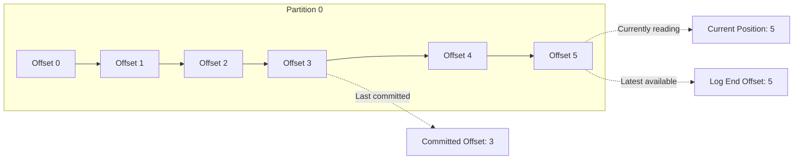

# How to Manage Consumer Offsets in Kafka

Author: [nawazdhandala](https://www.github.com/nawazdhandala)

Tags: Kafka, Consumer Offsets, Message Processing, Data Recovery, Operations

Description: A comprehensive guide to managing Kafka consumer offsets, including automatic vs manual commits, offset reset strategies, seeking to specific positions, and recovering from offset-related issues.

---

Consumer offsets track where each consumer group has read in each partition. Proper offset management is critical for ensuring exactly-once or at-least-once processing semantics. Get it wrong, and you either lose messages or process them multiple times. This guide covers offset management strategies and recovery procedures.

## Understanding Offsets

Every message in a Kafka partition has a unique, monotonically increasing offset. Consumers track their position by committing offsets.



- **Committed offset**: Last position successfully processed and saved
- **Current position**: Where the consumer is currently reading
- **Log end offset**: Latest message in the partition

## Automatic vs Manual Offset Commits

### Automatic Commits (Default)

Kafka periodically commits offsets in the background:

```java
Properties props = new Properties();
props.put(ConsumerConfig.BOOTSTRAP_SERVERS_CONFIG, "kafka:9092");
props.put(ConsumerConfig.GROUP_ID_CONFIG, "my-group");

// Auto-commit enabled by default
props.put(ConsumerConfig.ENABLE_AUTO_COMMIT_CONFIG, "true");

// Commit interval (default 5 seconds)
props.put(ConsumerConfig.AUTO_COMMIT_INTERVAL_MS_CONFIG, "5000");
```

**Problem**: If the application crashes after receiving messages but before the auto-commit interval, those messages are reprocessed on restart.

### Manual Commits (Recommended)

Commit after successfully processing messages:

```java
Properties props = new Properties();
props.put(ConsumerConfig.ENABLE_AUTO_COMMIT_CONFIG, "false");

try (KafkaConsumer<String, String> consumer = new KafkaConsumer<>(props)) {
    consumer.subscribe(Collections.singletonList("orders"));

    while (true) {
        ConsumerRecords<String, String> records = consumer.poll(Duration.ofMillis(100));

        for (ConsumerRecord<String, String> record : records) {
            // Process the message
            processMessage(record);
        }

        // Commit after processing all records in the batch
        if (!records.isEmpty()) {
            consumer.commitSync();
        }
    }
}
```

### Synchronous vs Asynchronous Commits

```java
// Synchronous: Blocks until commit succeeds or fails
// Safer but slower
consumer.commitSync();

// Asynchronous: Returns immediately, commits in background
// Faster but may lose commits on failure
consumer.commitAsync((offsets, exception) -> {
    if (exception != null) {
        System.err.println("Commit failed: " + exception.getMessage());
    }
});

// Hybrid approach: Async during processing, sync on shutdown
try {
    while (running) {
        ConsumerRecords<String, String> records = consumer.poll(Duration.ofMillis(100));
        processRecords(records);
        consumer.commitAsync();  // Fast, non-blocking
    }
} finally {
    consumer.commitSync();  // Ensure final commit before closing
    consumer.close();
}
```

## Fine-Grained Offset Control

Commit specific offsets rather than all consumed offsets:

```java
Map<TopicPartition, OffsetAndMetadata> offsetsToCommit = new HashMap<>();

for (ConsumerRecord<String, String> record : records) {
    processMessage(record);

    // Track offset for each partition
    TopicPartition tp = new TopicPartition(record.topic(), record.partition());

    // Commit offset + 1 (next offset to read)
    offsetsToCommit.put(tp, new OffsetAndMetadata(record.offset() + 1));
}

// Commit specific offsets
consumer.commitSync(offsetsToCommit);
```

Commit after each message for minimal reprocessing (slower but safer):

```java
for (ConsumerRecord<String, String> record : records) {
    processMessage(record);

    // Commit immediately after each message
    Map<TopicPartition, OffsetAndMetadata> offset = Collections.singletonMap(
        new TopicPartition(record.topic(), record.partition()),
        new OffsetAndMetadata(record.offset() + 1)
    );
    consumer.commitSync(offset);
}
```

## Offset Reset Strategies

When a consumer group has no committed offset (new group or expired offset), the reset strategy determines where to start:

```java
// Start from the earliest available message
props.put(ConsumerConfig.AUTO_OFFSET_RESET_CONFIG, "earliest");

// Start from the latest message (ignore historical data)
props.put(ConsumerConfig.AUTO_OFFSET_RESET_CONFIG, "latest");

// Throw exception if no offset exists (fail-fast)
props.put(ConsumerConfig.AUTO_OFFSET_RESET_CONFIG, "none");
```

## Seeking to Specific Positions

Override committed offsets to read from specific positions:

```java
// Assign partitions manually (required for seeking)
TopicPartition partition0 = new TopicPartition("orders", 0);
TopicPartition partition1 = new TopicPartition("orders", 1);
consumer.assign(Arrays.asList(partition0, partition1));

// Seek to beginning of partitions
consumer.seekToBeginning(Arrays.asList(partition0, partition1));

// Seek to end of partitions
consumer.seekToEnd(Arrays.asList(partition0, partition1));

// Seek to specific offset
consumer.seek(partition0, 1000);  // Start reading from offset 1000

// Seek to timestamp (find offset at or after given time)
Map<TopicPartition, Long> timestamps = new HashMap<>();
timestamps.put(partition0, Instant.parse("2026-01-25T00:00:00Z").toEpochMilli());

Map<TopicPartition, OffsetAndTimestamp> offsets =
    consumer.offsetsForTimes(timestamps);

for (Map.Entry<TopicPartition, OffsetAndTimestamp> entry : offsets.entrySet()) {
    if (entry.getValue() != null) {
        consumer.seek(entry.getKey(), entry.getValue().offset());
    }
}
```

## Resetting Offsets via CLI

Use the command-line tools to reset offsets for a consumer group:

```bash
# Preview what would be reset (dry-run)
kafka-consumer-groups.sh --bootstrap-server kafka:9092 \
    --group my-group \
    --topic orders \
    --reset-offsets \
    --to-earliest \
    --dry-run

# Execute the reset (group must be stopped)
kafka-consumer-groups.sh --bootstrap-server kafka:9092 \
    --group my-group \
    --topic orders \
    --reset-offsets \
    --to-earliest \
    --execute

# Reset to specific offset
kafka-consumer-groups.sh --bootstrap-server kafka:9092 \
    --group my-group \
    --topic orders:0 \
    --reset-offsets \
    --to-offset 1000 \
    --execute

# Reset to timestamp
kafka-consumer-groups.sh --bootstrap-server kafka:9092 \
    --group my-group \
    --topic orders \
    --reset-offsets \
    --to-datetime "2026-01-25T00:00:00.000" \
    --execute

# Shift offset by N (forward or backward)
kafka-consumer-groups.sh --bootstrap-server kafka:9092 \
    --group my-group \
    --topic orders \
    --reset-offsets \
    --shift-by -100 \
    --execute
```

## Viewing Current Offsets

Check committed offsets and lag:

```bash
# Describe consumer group offsets
kafka-consumer-groups.sh --bootstrap-server kafka:9092 \
    --group my-group \
    --describe

# Output:
# GROUP     TOPIC     PARTITION  CURRENT-OFFSET  LOG-END-OFFSET  LAG
# my-group  orders    0          15000           15050           50
# my-group  orders    1          12000           12000           0
```

Programmatically:

```java
AdminClient admin = AdminClient.create(props);

// Get committed offsets for a group
ListConsumerGroupOffsetsResult result =
    admin.listConsumerGroupOffsets("my-group");

Map<TopicPartition, OffsetAndMetadata> offsets =
    result.partitionsToOffsetAndMetadata().get();

for (Map.Entry<TopicPartition, OffsetAndMetadata> entry : offsets.entrySet()) {
    System.out.printf("%s: committed offset = %d%n",
        entry.getKey(), entry.getValue().offset());
}
```

## Offset Storage

Kafka stores offsets in an internal topic called `__consumer_offsets`:

```bash
# View offset topic configuration
kafka-topics.sh --bootstrap-server kafka:9092 \
    --describe \
    --topic __consumer_offsets

# Read offset commits (for debugging)
kafka-console-consumer.sh --bootstrap-server kafka:9092 \
    --topic __consumer_offsets \
    --formatter "kafka.coordinator.group.GroupMetadataManager\$OffsetsMessageFormatter" \
    --from-beginning
```

Configure offset retention:

```properties
# server.properties

# How long to retain offsets after consumer group becomes empty
offsets.retention.minutes=10080  # 7 days (default)

# Replication for __consumer_offsets topic
offsets.topic.replication.factor=3
```

## Handling Offset Errors

### OffsetOutOfRangeException

Occurs when committed offset is no longer available (data was deleted):

```java
try {
    consumer.poll(Duration.ofMillis(100));
} catch (OffsetOutOfRangeException e) {
    // Reset to earliest available offset
    Map<TopicPartition, Long> beginningOffsets =
        consumer.beginningOffsets(e.partitions());

    for (Map.Entry<TopicPartition, Long> entry : beginningOffsets.entrySet()) {
        consumer.seek(entry.getKey(), entry.getValue());
    }
}
```

### CommitFailedException

Occurs when consumer has left the group (session timeout):

```java
try {
    consumer.commitSync();
} catch (CommitFailedException e) {
    // Consumer was kicked from group
    // Rebalance happened, offsets may be stale
    System.err.println("Commit failed, likely rebalance: " + e.getMessage());
    // Messages will be reprocessed by new owner
}
```

## Offset Management Best Practices

1. **Use manual commits for important data**: Auto-commit can cause data loss or duplication
2. **Commit after processing, not before**: Ensures at-least-once semantics
3. **Use async commits during processing, sync on shutdown**: Balances performance and safety
4. **Monitor consumer lag**: Growing lag indicates processing falling behind
5. **Set appropriate offset retention**: Ensure offsets survive maintenance windows
6. **Test offset reset procedures**: Practice recovery before you need it
7. **Include offset in error logging**: Makes debugging easier

```java
// Production-ready offset management
public class RobustConsumer {

    public void consume() {
        try {
            while (running) {
                ConsumerRecords<String, String> records =
                    consumer.poll(Duration.ofMillis(100));

                for (ConsumerRecord<String, String> record : records) {
                    try {
                        processMessage(record);
                        trackOffset(record);
                    } catch (Exception e) {
                        logError(record, e);
                        // Decide: skip, retry, or fail
                    }
                }

                commitAsync();
            }
        } finally {
            commitSync();  // Final commit
            consumer.close();
        }
    }
}
```

---

Consumer offset management is the key to reliable message processing in Kafka. Use manual commits to control exactly when offsets are persisted, choose appropriate reset strategies for your use case, and practice offset reset procedures so you can recover quickly when needed. Monitor consumer lag as an early warning sign of processing issues, and always test your error handling paths before relying on them in production.
