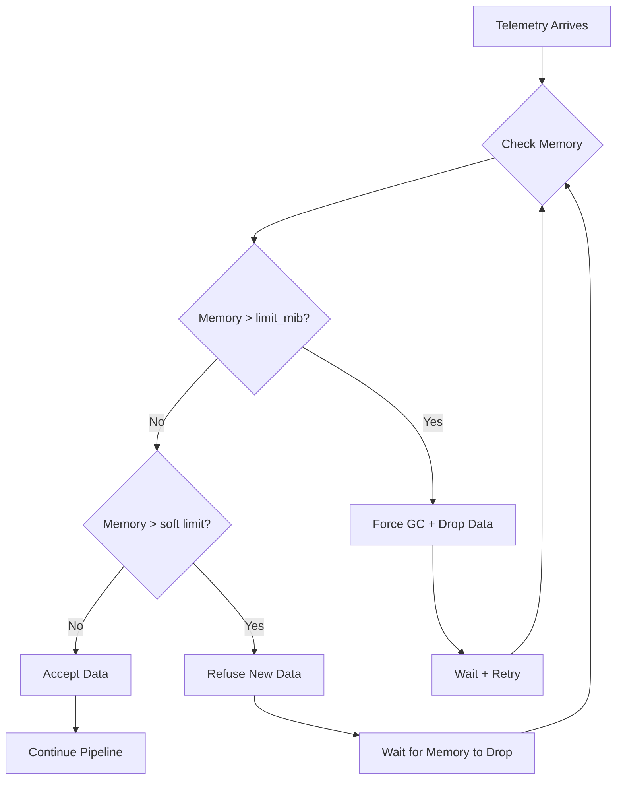

# How to Configure Memory Limiter in OpenTelemetry

Author: [nawazdhandala](https://www.github.com/nawazdhandala)

Tags: OpenTelemetry, Memory Limiter, Collector, Performance, Reliability, Resource Management, OOM Prevention

Description: Learn how to configure the memory limiter processor in OpenTelemetry Collector to prevent out-of-memory crashes while maintaining telemetry delivery.

---

The OpenTelemetry Collector can consume unbounded memory when receiving high volumes of telemetry or when backends are slow. Without protection, this leads to out-of-memory (OOM) kills, data loss, and service disruption. The memory limiter processor prevents these failures by tracking memory usage and taking action before the system runs out of resources.

## Why Memory Limiting Matters

Several scenarios can cause memory pressure in the collector:

- **Traffic spikes**: Sudden increases in telemetry volume
- **Backend outages**: Telemetry queues up when exporters cannot send
- **Large payloads**: Spans or logs with oversized attributes
- **Slow processing**: Tail sampling holding traces in memory
- **Resource contention**: Other processes competing for memory

Without a memory limiter, any of these scenarios can crash the collector, losing all buffered telemetry.

## Basic Configuration

The memory limiter processor should be the first processor in every pipeline:

```yaml
processors:
  memory_limiter:
    # How often to check memory usage
    check_interval: 5s

    # Maximum memory the collector should use (hard limit)
    limit_mib: 1800

    # Start dropping data when memory exceeds (limit_mib - spike_limit_mib)
    spike_limit_mib: 400

service:
  pipelines:
    traces:
      receivers: [otlp]
      processors: [memory_limiter, batch]  # memory_limiter first
      exporters: [otlphttp]
```

## Understanding the Parameters

### limit_mib

The maximum memory the collector should use. Set this below your container or system limit to leave headroom for garbage collection and other processes.

**Guideline**: Set to 80-90% of available memory.

```yaml
# Container with 2GB limit
memory_limiter:
  limit_mib: 1800  # 90% of 2GB

# Container with 4GB limit
memory_limiter:
  limit_mib: 3600  # 90% of 4GB
```

### spike_limit_mib

The buffer zone before the hard limit. When memory usage exceeds `limit_mib - spike_limit_mib`, the processor starts refusing data. This provides time to recover before hitting the hard limit.

**Guideline**: Set to 20-25% of limit_mib.

```yaml
memory_limiter:
  limit_mib: 2000
  spike_limit_mib: 500  # 25% of 2000
  # Soft limit = 2000 - 500 = 1500 MiB
```

### check_interval

How frequently to check memory usage. Shorter intervals provide faster response but add CPU overhead.

**Guideline**: 1-5 seconds for production, adjust based on traffic volatility.

```yaml
# High-traffic, volatile workload
memory_limiter:
  check_interval: 1s

# Steady traffic
memory_limiter:
  check_interval: 5s
```

## How the Memory Limiter Works

The processor follows this logic:



1. **Normal operation**: Memory below soft limit, data flows through
2. **Soft limit exceeded**: New data refused until memory drops
3. **Hard limit exceeded**: Garbage collection forced, data dropped if necessary

## Calculating Memory Requirements

Estimate your memory needs based on workload:

```
base_memory = 200 MiB (collector overhead)
receiver_memory = receivers * 50 MiB
processor_memory = varies by processor
exporter_queue = queue_size * avg_batch_size * avg_item_size
tail_sampling = num_traces * avg_trace_size

total = base + receiver + processor + exporter_queue + tail_sampling
```

Example calculation:

```
Base:                200 MiB
2 OTLP receivers:    100 MiB
Batch processor:      50 MiB
Export queue (5000):  500 MiB (5000 batches * 100KB avg)
Tail sampling:        500 MiB (50000 traces * 10KB avg)
---
Total:              1350 MiB

Set limit_mib:      1800 MiB (1350 + 30% headroom)
Set spike_limit:     450 MiB (25% of 1800)
```

## Configuration for Different Scenarios

### High-Throughput Gateway

```yaml
processors:
  memory_limiter:
    check_interval: 1s
    limit_mib: 3600      # 90% of 4GB container
    spike_limit_mib: 800

  batch:
    send_batch_size: 2048
    timeout: 5s

exporters:
  otlphttp:
    sending_queue:
      enabled: true
      queue_size: 10000  # Large queue for burst handling

service:
  pipelines:
    traces:
      processors: [memory_limiter, batch]
```

### Agent Collector (Sidecar)

```yaml
processors:
  memory_limiter:
    check_interval: 2s
    limit_mib: 400       # 80% of 512MB limit
    spike_limit_mib: 100

  batch:
    send_batch_size: 256
    timeout: 2s

service:
  pipelines:
    traces:
      processors: [memory_limiter, batch]
```

### Collector with Tail Sampling

Tail sampling holds traces in memory, requiring larger limits:

```yaml
processors:
  memory_limiter:
    check_interval: 5s
    limit_mib: 7200      # 90% of 8GB container
    spike_limit_mib: 1600

  tail_sampling:
    decision_wait: 10s
    num_traces: 100000   # Requires significant memory
    expected_new_traces_per_sec: 5000

service:
  pipelines:
    traces:
      processors: [memory_limiter, tail_sampling, batch]
```

## Monitoring Memory Usage

Track these metrics to understand memory behavior:

```yaml
service:
  telemetry:
    metrics:
      level: detailed
      address: 0.0.0.0:8888
```

Key metrics:

| Metric | Description |
|--------|-------------|
| `otelcol_process_runtime_heap_alloc_bytes` | Current heap allocation |
| `otelcol_process_runtime_total_alloc_bytes` | Total allocations over time |
| `otelcol_processor_refused_spans` | Spans refused by memory limiter |
| `otelcol_processor_accepted_spans` | Spans accepted |

Create alerts for:
- Memory usage approaching limit
- High refusal rate
- Increasing memory trend

### Prometheus Alert Example

```yaml
groups:
  - name: otel-collector-memory
    rules:
      - alert: CollectorHighMemory
        expr: otelcol_process_runtime_heap_alloc_bytes > 1500000000
        for: 5m
        labels:
          severity: warning
        annotations:
          summary: "Collector memory usage high"
          description: "Memory usage is {{ humanize $value }}"

      - alert: CollectorRefusingData
        expr: rate(otelcol_processor_refused_spans[5m]) > 0
        for: 2m
        labels:
          severity: critical
        annotations:
          summary: "Collector refusing telemetry"
          description: "Memory limiter is refusing data"
```

## Kubernetes Resource Configuration

Align Kubernetes limits with memory limiter settings:

```yaml
apiVersion: apps/v1
kind: Deployment
metadata:
  name: otel-collector
spec:
  template:
    spec:
      containers:
        - name: collector
          resources:
            requests:
              memory: 1Gi
              cpu: 500m
            limits:
              memory: 2Gi      # Container limit
              cpu: 2000m
```

Memory limiter config:
```yaml
processors:
  memory_limiter:
    limit_mib: 1800         # 90% of 2GB container limit
    spike_limit_mib: 400
```

## Handling Memory Pressure

When the memory limiter triggers, investigate:

### 1. Check for Traffic Spikes

```bash
# Query metrics for traffic patterns
curl -s localhost:8888/metrics | grep otelcol_receiver_accepted
```

### 2. Verify Backend Health

Export failures cause queue buildup:

```bash
curl -s localhost:8888/metrics | grep otelcol_exporter
```

### 3. Analyze Payload Sizes

Large payloads consume disproportionate memory:

```yaml
# Add transform processor to truncate large values
processors:
  transform:
    trace_statements:
      - context: span
        statements:
          - truncate_all(attributes, 1024)
```

### 4. Tune Queue Sizes

Reduce queue sizes if memory is constrained:

```yaml
exporters:
  otlphttp:
    sending_queue:
      queue_size: 2000  # Reduce from default 5000
```

## Best Practices

1. **Always use memory limiter**: It should be in every production pipeline

2. **Position first in pipeline**: Memory limiter must be the first processor

3. **Leave headroom**: Set limits below container/system limits

4. **Monitor refusals**: Frequent refusals indicate undersized resources or traffic issues

5. **Pair with other processors**: Combine with batch, filter, and transform to reduce memory pressure

6. **Test under load**: Verify configuration handles peak traffic

7. **Use persistent queues**: For critical data, persist queues to disk:

```yaml
extensions:
  file_storage:
    directory: /var/lib/otel/queue

exporters:
  otlphttp:
    sending_queue:
      storage: file_storage
```

## Complete Production Configuration

```yaml
extensions:
  health_check:
    endpoint: 0.0.0.0:13133
  file_storage:
    directory: /var/lib/otel/queue

receivers:
  otlp:
    protocols:
      grpc:
        endpoint: 0.0.0.0:4317
        max_recv_msg_size_mib: 16
      http:
        endpoint: 0.0.0.0:4318

processors:
  memory_limiter:
    check_interval: 5s
    limit_mib: 1800
    spike_limit_mib: 400

  batch:
    send_batch_size: 1024
    send_batch_max_size: 2048
    timeout: 5s

exporters:
  otlphttp:
    endpoint: "https://backend.example.com"
    retry_on_failure:
      enabled: true
      initial_interval: 5s
      max_interval: 30s
    sending_queue:
      enabled: true
      num_consumers: 10
      queue_size: 5000
      storage: file_storage

service:
  extensions: [health_check, file_storage]

  pipelines:
    traces:
      receivers: [otlp]
      processors: [memory_limiter, batch]
      exporters: [otlphttp]

    metrics:
      receivers: [otlp]
      processors: [memory_limiter, batch]
      exporters: [otlphttp]

    logs:
      receivers: [otlp]
      processors: [memory_limiter, batch]
      exporters: [otlphttp]

  telemetry:
    metrics:
      level: detailed
      address: 0.0.0.0:8888
```

## Conclusion

The memory limiter processor is essential for production OpenTelemetry Collector deployments. It prevents OOM crashes, maintains system stability, and provides graceful degradation under pressure. Configure it based on your container limits, monitor the refusal metrics, and tune based on actual workload patterns. Combined with proper queue configuration and persistent storage, the memory limiter ensures your observability pipeline remains reliable even during traffic spikes and backend issues.
