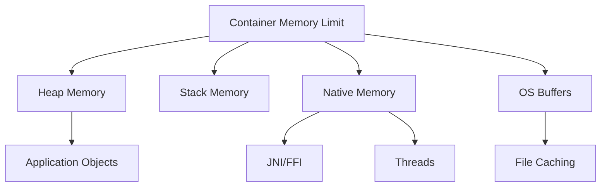

# How to Configure Memory Management in Production

Author: [nawazdhandala](https://www.github.com/nawazdhandala)

Tags: Memory Management, Performance, Production, JVM, Node.js, Python, Linux, Kubernetes

Description: Learn how to configure memory management for production applications. This guide covers memory limits, garbage collection tuning, memory leak detection, and monitoring across different runtime environments.

---

> Memory issues are one of the top causes of production outages. Out-of-memory (OOM) kills, memory leaks, and excessive garbage collection can bring down your application without warning. This guide shows you how to configure memory properly and avoid common pitfalls across different environments.

Proper memory management is about setting appropriate limits, tuning garbage collection, detecting leaks early, and monitoring usage patterns.

---

## Understanding Memory in Containers



Container memory limits include ALL memory used by the process, not just heap. This catches many developers off guard.

---

## Kubernetes Memory Configuration

### Setting Resource Limits

```yaml
# deployment.yaml
apiVersion: apps/v1
kind: Deployment
metadata:
  name: api-server
spec:
  template:
    spec:
      containers:
      - name: api
        image: api-server:latest
        resources:
          requests:
            # Minimum memory for scheduling
            # Set to expected baseline usage
            memory: "512Mi"
          limits:
            # Maximum memory before OOM kill
            # Set to peak expected usage + headroom
            memory: "1Gi"
        env:
          # Tell application about memory limit
          - name: MEMORY_LIMIT
            valueFrom:
              resourceFieldRef:
                resource: limits.memory
```

### Understanding OOMKilled

```bash
# Check if pod was OOM killed
kubectl describe pod api-server-xyz | grep -A5 "Last State"

# Output showing OOM kill
# Last State:     Terminated
#   Reason:       OOMKilled
#   Exit Code:    137
#   Started:      Mon, 25 Jan 2026 10:00:00 UTC
#   Finished:     Mon, 25 Jan 2026 14:30:00 UTC

# Check memory usage before crash
kubectl top pod api-server-xyz --containers
```

---

## JVM Memory Configuration

### Heap Sizing for Containers

```bash
# Modern JVM (11+) with container awareness
# JVM automatically detects container limits

java \
  -XX:+UseContainerSupport \
  -XX:MaxRAMPercentage=75.0 \
  -XX:InitialRAMPercentage=50.0 \
  -XX:MinRAMPercentage=50.0 \
  -jar app.jar

# For a 1GB container limit:
# MaxRAMPercentage=75% -> ~768MB max heap
# Leaves ~256MB for metaspace, threads, native memory

# Explicit heap sizing (if you know exact requirements)
java \
  -Xms512m \
  -Xmx768m \
  -XX:MaxMetaspaceSize=128m \
  -jar app.jar
```

### Garbage Collection Tuning

```bash
# G1GC (default in Java 11+, good for most workloads)
java \
  -XX:+UseG1GC \
  -XX:MaxGCPauseMillis=200 \
  -XX:G1HeapRegionSize=16m \
  -XX:InitiatingHeapOccupancyPercent=45 \
  -jar app.jar

# ZGC (Java 15+, low latency, good for large heaps)
java \
  -XX:+UseZGC \
  -XX:+ZGenerational \
  -Xmx4g \
  -jar app.jar

# Shenandoah (low latency alternative)
java \
  -XX:+UseShenandoahGC \
  -XX:ShenandoahGCHeuristics=compact \
  -jar app.jar
```

### GC Logging for Troubleshooting

```bash
# Enable GC logging (Java 11+)
java \
  -Xlog:gc*:file=/var/log/gc.log:time,uptime,level,tags:filecount=5,filesize=10m \
  -XX:+HeapDumpOnOutOfMemoryError \
  -XX:HeapDumpPath=/var/log/heapdump.hprof \
  -jar app.jar
```

### JVM Memory Calculator

```python
# jvm_memory.py
def calculate_jvm_memory(container_limit_mb: int) -> dict:
    """
    Calculate JVM memory settings based on container limit.

    Memory breakdown:
    - Heap: 50-75% of container limit
    - Metaspace: 64-256MB
    - Thread stacks: threads * 1MB
    - Native memory: 10-20% of heap
    - OS overhead: ~50MB
    """

    # Conservative allocation
    heap_max = int(container_limit_mb * 0.65)
    heap_min = int(heap_max * 0.5)
    metaspace = min(256, int(container_limit_mb * 0.1))

    # Validate - leave room for native memory
    non_heap = container_limit_mb - heap_max
    if non_heap < 256:
        heap_max = container_limit_mb - 256
        heap_min = int(heap_max * 0.5)

    return {
        'container_limit': f"{container_limit_mb}m",
        'xms': f"{heap_min}m",
        'xmx': f"{heap_max}m",
        'metaspace': f"{metaspace}m",
        'remaining': f"{container_limit_mb - heap_max - metaspace}m",
        'jvm_opts': f"-Xms{heap_min}m -Xmx{heap_max}m -XX:MaxMetaspaceSize={metaspace}m"
    }

# Examples
print(calculate_jvm_memory(512))
# {'xms': '166m', 'xmx': '332m', 'metaspace': '51m', ...}

print(calculate_jvm_memory(2048))
# {'xms': '665m', 'xmx': '1331m', 'metaspace': '204m', ...}
```

---

## Node.js Memory Configuration

### Heap Size Configuration

```bash
# Set max heap size (default is ~1.5GB)
# For a 2GB container, set to ~1.5GB
node --max-old-space-size=1536 app.js

# Environment variable approach
NODE_OPTIONS="--max-old-space-size=1536" node app.js
```

### Container-Aware Memory Settings

```javascript
// memory-config.js
const os = require('os');
const v8 = require('v8');

function getMemoryConfig() {
  // Get container memory limit (if available)
  const containerLimit = process.env.MEMORY_LIMIT
    ? parseInt(process.env.MEMORY_LIMIT) / (1024 * 1024)  // Convert to MB
    : null;

  // Get system memory
  const systemMemory = os.totalmem() / (1024 * 1024);

  // Effective limit
  const effectiveLimit = containerLimit || systemMemory;

  // V8 heap statistics
  const heapStats = v8.getHeapStatistics();

  return {
    containerLimitMB: containerLimit,
    systemMemoryMB: Math.round(systemMemory),
    effectiveLimitMB: Math.round(effectiveLimit),
    heapSizeLimitMB: Math.round(heapStats.heap_size_limit / (1024 * 1024)),
    heapUsedMB: Math.round(heapStats.used_heap_size / (1024 * 1024)),
    heapTotalMB: Math.round(heapStats.total_heap_size / (1024 * 1024)),
    externalMB: Math.round(heapStats.external_memory / (1024 * 1024))
  };
}

// Recommended heap size (75% of container limit)
function recommendedHeapSize(containerLimitMB) {
  return Math.floor(containerLimitMB * 0.75);
}

console.log(getMemoryConfig());
// Example output:
// {
//   containerLimitMB: 1024,
//   systemMemoryMB: 16384,
//   effectiveLimitMB: 1024,
//   heapSizeLimitMB: 768,
//   heapUsedMB: 45,
//   heapTotalMB: 52,
//   externalMB: 2
// }
```

### Memory Monitoring Middleware

```javascript
// memory-monitor.js
const v8 = require('v8');

class MemoryMonitor {
  constructor(options = {}) {
    this.warningThreshold = options.warningThreshold || 0.85;  // 85% of heap
    this.criticalThreshold = options.criticalThreshold || 0.95;
    this.checkInterval = options.checkInterval || 30000;  // 30 seconds
    this.onWarning = options.onWarning || console.warn;
    this.onCritical = options.onCritical || console.error;
  }

  start() {
    this.intervalId = setInterval(() => this.check(), this.checkInterval);
    return this;
  }

  stop() {
    if (this.intervalId) {
      clearInterval(this.intervalId);
    }
  }

  check() {
    const stats = v8.getHeapStatistics();
    const usedRatio = stats.used_heap_size / stats.heap_size_limit;

    if (usedRatio >= this.criticalThreshold) {
      this.onCritical({
        level: 'critical',
        usedMB: Math.round(stats.used_heap_size / (1024 * 1024)),
        limitMB: Math.round(stats.heap_size_limit / (1024 * 1024)),
        usedPercent: Math.round(usedRatio * 100)
      });

      // Force garbage collection if available
      if (global.gc) {
        global.gc();
      }
    } else if (usedRatio >= this.warningThreshold) {
      this.onWarning({
        level: 'warning',
        usedMB: Math.round(stats.used_heap_size / (1024 * 1024)),
        limitMB: Math.round(stats.heap_size_limit / (1024 * 1024)),
        usedPercent: Math.round(usedRatio * 100)
      });
    }

    return usedRatio;
  }

  getStats() {
    const stats = v8.getHeapStatistics();
    return {
      heapUsedMB: Math.round(stats.used_heap_size / (1024 * 1024)),
      heapTotalMB: Math.round(stats.total_heap_size / (1024 * 1024)),
      heapLimitMB: Math.round(stats.heap_size_limit / (1024 * 1024)),
      externalMB: Math.round(stats.external_memory / (1024 * 1024)),
      rss: Math.round(process.memoryUsage().rss / (1024 * 1024))
    };
  }
}

// Usage
const monitor = new MemoryMonitor({
  warningThreshold: 0.80,
  criticalThreshold: 0.90,
  onWarning: (info) => {
    console.warn('Memory warning:', info);
    // Send to monitoring system
  },
  onCritical: (info) => {
    console.error('Memory critical:', info);
    // Alert and potentially trigger graceful restart
  }
}).start();

// Express middleware to expose metrics
function memoryMetricsMiddleware(req, res, next) {
  res.locals.memoryStats = monitor.getStats();
  next();
}
```

---

## Python Memory Configuration

### Memory Limits in Python

```python
# memory_config.py
import resource
import sys
import gc

def set_memory_limit(limit_mb: int):
    """Set soft memory limit for the process"""
    limit_bytes = limit_mb * 1024 * 1024
    soft, hard = resource.getrlimit(resource.RLIMIT_AS)
    resource.setrlimit(resource.RLIMIT_AS, (limit_bytes, hard))

def get_memory_usage():
    """Get current memory usage"""
    import psutil
    process = psutil.Process()
    mem_info = process.memory_info()
    return {
        'rss_mb': mem_info.rss / (1024 * 1024),
        'vms_mb': mem_info.vms / (1024 * 1024),
        'percent': process.memory_percent()
    }

def optimize_gc():
    """Configure garbage collection for production"""
    # Disable automatic GC during critical sections
    # gc.disable()

    # Tune GC thresholds
    # Default is (700, 10, 10)
    # Higher thresholds = less frequent GC = more memory usage
    # Lower thresholds = more frequent GC = more CPU usage
    gc.set_threshold(1000, 15, 15)

    # Enable GC debugging (for troubleshooting only)
    # gc.set_debug(gc.DEBUG_STATS)

def force_gc():
    """Force garbage collection"""
    gc.collect()
    gc.collect()  # Second pass for cyclic references
    gc.collect()  # Third pass for weak references
```

### Memory-Efficient Data Structures

```python
# efficient_structures.py
import sys
from dataclasses import dataclass
from typing import NamedTuple

# Regular class - higher memory overhead
class UserClass:
    def __init__(self, id, name, email):
        self.id = id
        self.name = name
        self.email = email

# Slots - reduced memory (no __dict__)
class UserSlots:
    __slots__ = ['id', 'name', 'email']

    def __init__(self, id, name, email):
        self.id = id
        self.name = name
        self.email = email

# NamedTuple - immutable, low memory
class UserTuple(NamedTuple):
    id: int
    name: str
    email: str

# Compare memory usage
def compare_memory():
    users_class = [UserClass(i, f"User{i}", f"user{i}@example.com")
                   for i in range(10000)]
    users_slots = [UserSlots(i, f"User{i}", f"user{i}@example.com")
                   for i in range(10000)]
    users_tuple = [UserTuple(i, f"User{i}", f"user{i}@example.com")
                   for i in range(10000)]

    print(f"Regular class: {sys.getsizeof(users_class[0])} bytes per object")
    print(f"Slots class: {sys.getsizeof(users_slots[0])} bytes per object")
    print(f"NamedTuple: {sys.getsizeof(users_tuple[0])} bytes per object")

    # Typical results:
    # Regular class: 48 bytes + __dict__ overhead
    # Slots class: 48 bytes (no __dict__)
    # NamedTuple: 64 bytes (tuple overhead but immutable benefits)
```

---

## Linux Memory Configuration

### System-Level Settings

```bash
# /etc/sysctl.conf

# Overcommit settings
# 0 = heuristic (default)
# 1 = always overcommit
# 2 = never overcommit (strict)
vm.overcommit_memory = 0
vm.overcommit_ratio = 80

# Swappiness (0-100, lower = prefer RAM)
# For databases/caches, use low value
vm.swappiness = 10

# Dirty page settings
vm.dirty_ratio = 20
vm.dirty_background_ratio = 5

# OOM killer adjustments
# -1000 to 1000, lower = less likely to be killed
# Set per-process in /proc/[pid]/oom_score_adj
```

### Process-Level Limits

```bash
# /etc/security/limits.conf

# Memory limits for specific users/groups
# <user>  <type>  <item>    <value>
app_user  soft    as        4194304    # 4GB soft limit
app_user  hard    as        8388608    # 8GB hard limit
app_user  soft    memlock   unlimited  # For mlock
app_user  hard    memlock   unlimited
```

---

## Memory Leak Detection

### Node.js Heap Snapshots

```javascript
// heap-snapshot.js
const v8 = require('v8');
const fs = require('fs');
const path = require('path');

function takeHeapSnapshot(filename) {
  const snapshotPath = path.join('/tmp', filename || `heap-${Date.now()}.heapsnapshot`);
  const snapshotStream = v8.writeHeapSnapshot(snapshotPath);
  console.log(`Heap snapshot written to: ${snapshotPath}`);
  return snapshotPath;
}

// Expose endpoint for on-demand snapshots
app.get('/debug/heap-snapshot', (req, res) => {
  if (process.env.NODE_ENV !== 'production') {
    const path = takeHeapSnapshot();
    res.json({ path });
  } else {
    res.status(403).json({ error: 'Not available in production' });
  }
});

// Automatic snapshot on memory threshold
const memoryMonitor = new MemoryMonitor({
  criticalThreshold: 0.95,
  onCritical: (info) => {
    console.error('Critical memory, taking heap snapshot');
    takeHeapSnapshot(`critical-${Date.now()}.heapsnapshot`);
  }
});
```

### Python Memory Profiling

```python
# memory_profiler.py
import tracemalloc
import linecache
from typing import List, Tuple

class MemoryProfiler:
    """Production-safe memory profiler"""

    def __init__(self):
        self.snapshots: List[tracemalloc.Snapshot] = []

    def start(self, nframe: int = 25):
        """Start tracing memory allocations"""
        tracemalloc.start(nframe)

    def take_snapshot(self, label: str = None):
        """Take a memory snapshot"""
        snapshot = tracemalloc.take_snapshot()
        self.snapshots.append((label, snapshot))
        return snapshot

    def compare_snapshots(self, idx1: int = -2, idx2: int = -1,
                          top_n: int = 10) -> List[dict]:
        """Compare two snapshots to find memory growth"""
        if len(self.snapshots) < 2:
            return []

        old = self.snapshots[idx1][1]
        new = self.snapshots[idx2][1]

        diff = new.compare_to(old, 'lineno')

        results = []
        for stat in diff[:top_n]:
            results.append({
                'file': stat.traceback.format()[0] if stat.traceback else 'unknown',
                'size_diff_kb': stat.size_diff / 1024,
                'count_diff': stat.count_diff
            })

        return results

    def get_top_allocations(self, top_n: int = 10) -> List[dict]:
        """Get current top memory allocations"""
        snapshot = tracemalloc.take_snapshot()
        stats = snapshot.statistics('lineno')

        results = []
        for stat in stats[:top_n]:
            results.append({
                'file': str(stat.traceback),
                'size_kb': stat.size / 1024,
                'count': stat.count
            })

        return results

    def stop(self):
        """Stop tracing"""
        tracemalloc.stop()


# Usage
profiler = MemoryProfiler()
profiler.start()

# ... application runs ...

# Periodically take snapshots
profiler.take_snapshot('after_startup')
# ... more operations ...
profiler.take_snapshot('after_load_test')

# Compare to find leaks
diff = profiler.compare_snapshots()
for item in diff:
    print(f"{item['file']}: {item['size_diff_kb']:.2f} KB ({item['count_diff']} objects)")
```

---

## Prometheus Metrics for Memory

```python
# memory_metrics.py
from prometheus_client import Gauge, CollectorRegistry, generate_latest
import psutil
import os

# Define metrics
memory_rss = Gauge('process_memory_rss_bytes', 'Resident Set Size')
memory_vms = Gauge('process_memory_vms_bytes', 'Virtual Memory Size')
memory_percent = Gauge('process_memory_percent', 'Memory usage percentage')

# For JVM
jvm_heap_used = Gauge('jvm_heap_used_bytes', 'JVM heap used')
jvm_heap_max = Gauge('jvm_heap_max_bytes', 'JVM heap max')
jvm_gc_count = Gauge('jvm_gc_collection_count', 'GC collection count', ['gc'])
jvm_gc_time = Gauge('jvm_gc_collection_time_ms', 'GC collection time', ['gc'])

def update_memory_metrics():
    """Update Prometheus memory metrics"""
    process = psutil.Process(os.getpid())
    mem_info = process.memory_info()

    memory_rss.set(mem_info.rss)
    memory_vms.set(mem_info.vms)
    memory_percent.set(process.memory_percent())

# Call periodically or in request middleware
```

---

## Best Practices Summary

| Environment | Recommendation |
|-------------|----------------|
| Kubernetes | Set memory requests = expected usage, limits = peak + 20% headroom |
| JVM | Use MaxRAMPercentage=75, enable container support |
| Node.js | Set --max-old-space-size to 75% of container limit |
| Python | Use slots for data classes, profile with tracemalloc |
| Linux | Set vm.swappiness=10 for memory-intensive apps |

---

## Conclusion

Memory management in production requires:

1. **Right-sizing**: Set appropriate limits based on actual usage patterns
2. **GC tuning**: Choose the right garbage collector and tune for your workload
3. **Monitoring**: Track memory usage, GC pauses, and detect leaks early
4. **Testing**: Load test to find memory ceiling before production

Start conservative with memory limits, monitor actual usage, and adjust based on data. Over-provisioning wastes resources; under-provisioning causes OOM kills.

---

*Need to monitor memory usage across your services? [OneUptime](https://oneuptime.com) provides memory monitoring with alerts for high usage, leak detection, and GC metrics.*
