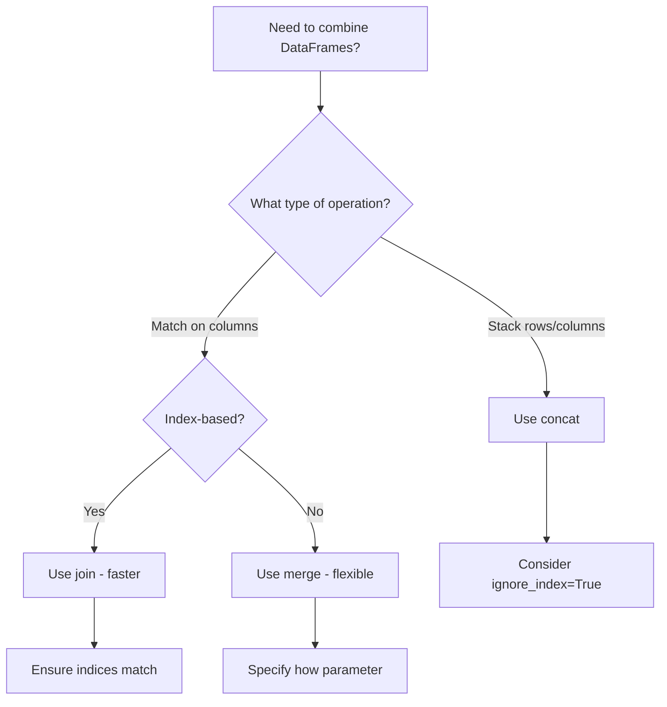

# How to Merge DataFrames in Pandas (Join, Merge, Concat)

Author: [nawazdhandala](https://www.github.com/nawazdhandala)

Tags: Python, Pandas, Data Science, DataFrame, Data Manipulation

Description: Master the differences between merge, join, and concat in pandas. Learn when to use each method with practical examples and performance tips.

---

Combining DataFrames is one of the most common operations in data analysis. Pandas offers three main methods: `merge()`, `join()`, and `concat()`. Each serves a different purpose, and knowing when to use which saves time and prevents bugs. This guide breaks down each method with clear examples.

## Overview of Combining Methods

| Method | Purpose | Key Feature |
|--------|---------|-------------|
| `merge()` | SQL-style joins on columns | Most flexible |
| `join()` | Join on index | Convenient for index-based joining |
| `concat()` | Stack DataFrames | Combine along an axis |

## Using merge() for SQL-Style Joins

The `merge()` function works like SQL joins. It combines DataFrames based on common columns or indices.

### Inner Join (Default)

Inner join returns only rows where keys exist in both DataFrames.

```python
import pandas as pd

# Sample DataFrames representing orders and customers
orders = pd.DataFrame({
    'order_id': [1, 2, 3, 4],
    'customer_id': [101, 102, 103, 104],
    'amount': [250, 150, 300, 200]
})

customers = pd.DataFrame({
    'customer_id': [101, 102, 105],
    'name': ['Alice', 'Bob', 'Eve']
})

# Inner join: only matching customer_ids appear
# Customer 103, 104 have no match in customers table
# Customer 105 has no orders
result = pd.merge(orders, customers, on='customer_id')

print(result)
# Output:
#    order_id  customer_id  amount   name
# 0         1          101     250  Alice
# 1         2          102     150    Bob
```

### Left Join

Left join keeps all rows from the left DataFrame, filling with NaN where no match exists.

```python
import pandas as pd

orders = pd.DataFrame({
    'order_id': [1, 2, 3, 4],
    'customer_id': [101, 102, 103, 104],
    'amount': [250, 150, 300, 200]
})

customers = pd.DataFrame({
    'customer_id': [101, 102, 105],
    'name': ['Alice', 'Bob', 'Eve']
})

# Left join: all orders kept, even without customer info
result = pd.merge(orders, customers, on='customer_id', how='left')

print(result)
# Output:
#    order_id  customer_id  amount   name
# 0         1          101     250  Alice
# 1         2          102     150    Bob
# 2         3          103     300    NaN
# 3         4          104     200    NaN
```

### Right and Outer Joins

```python
import pandas as pd

orders = pd.DataFrame({
    'order_id': [1, 2, 3],
    'customer_id': [101, 102, 103],
    'amount': [250, 150, 300]
})

customers = pd.DataFrame({
    'customer_id': [101, 102, 104],
    'name': ['Alice', 'Bob', 'Dave']
})

# Right join: all customers kept
right_result = pd.merge(orders, customers, on='customer_id', how='right')
print("Right join:")
print(right_result)
# Output:
#    order_id  customer_id  amount   name
# 0       1.0          101   250.0  Alice
# 1       2.0          102   150.0    Bob
# 2       NaN          104     NaN   Dave

# Outer join: all rows from both DataFrames
outer_result = pd.merge(orders, customers, on='customer_id', how='outer')
print("\nOuter join:")
print(outer_result)
# Output:
#    order_id  customer_id  amount   name
# 0       1.0          101   250.0  Alice
# 1       2.0          102   150.0    Bob
# 2       3.0          103   300.0    NaN
# 3       NaN          104     NaN   Dave
```

### Merging on Different Column Names

When the join columns have different names, use `left_on` and `right_on`.

```python
import pandas as pd

# Different column names for the same concept
orders = pd.DataFrame({
    'order_id': [1, 2, 3],
    'cust_id': [101, 102, 103],  # Named 'cust_id' here
    'amount': [250, 150, 300]
})

customers = pd.DataFrame({
    'customer_id': [101, 102, 103],  # Named 'customer_id' here
    'name': ['Alice', 'Bob', 'Charlie']
})

# Specify which columns to match
result = pd.merge(
    orders,
    customers,
    left_on='cust_id',
    right_on='customer_id'
)

print(result)
# Output includes both columns - you may want to drop one
# result = result.drop(columns=['customer_id'])
```

### Handling Duplicate Column Names

When both DataFrames have columns with the same name (other than the join key), pandas adds suffixes.

```python
import pandas as pd

# Both DataFrames have a 'status' column
orders = pd.DataFrame({
    'order_id': [1, 2],
    'customer_id': [101, 102],
    'status': ['shipped', 'pending']
})

customers = pd.DataFrame({
    'customer_id': [101, 102],
    'status': ['active', 'inactive']  # Same column name
})

# Custom suffixes to distinguish columns
result = pd.merge(
    orders,
    customers,
    on='customer_id',
    suffixes=('_order', '_customer')
)

print(result)
# Output:
#    order_id  customer_id status_order status_customer
# 0         1          101      shipped          active
# 1         2          102      pending        inactive
```

## Using join() for Index-Based Operations

The `join()` method is optimized for joining on indices. It is often faster than merge for index-based operations.

```python
import pandas as pd

# Create DataFrames with meaningful indices
orders = pd.DataFrame({
    'amount': [250, 150, 300],
    'product': ['Widget', 'Gadget', 'Gizmo']
}, index=[101, 102, 103])  # Index is customer_id

customers = pd.DataFrame({
    'name': ['Alice', 'Bob', 'Charlie'],
    'city': ['NYC', 'LA', 'Chicago']
}, index=[101, 102, 103])  # Index is customer_id

# Join on index - simpler syntax than merge
result = orders.join(customers)

print(result)
# Output:
#      amount product     name     city
# 101     250  Widget    Alice      NYC
# 102     150  Gadget      Bob       LA
# 103     300   Gizmo  Charlie  Chicago
```

### Joining with Different Index Names

```python
import pandas as pd

# DataFrame with customer_id as index
orders = pd.DataFrame({
    'amount': [250, 150]
}, index=pd.Index([101, 102], name='customer_id'))

# DataFrame with different index
customers = pd.DataFrame({
    'name': ['Alice', 'Bob'],
    'city': ['NYC', 'LA']
}, index=pd.Index([101, 102], name='cust_id'))

# Join still works - it matches by index position/value
result = orders.join(customers)
print(result)
```

### Joining Column to Index

You can join a column from one DataFrame to the index of another.

```python
import pandas as pd

# orders has customer_id as a column
orders = pd.DataFrame({
    'order_id': [1, 2, 3],
    'customer_id': [101, 102, 101],
    'amount': [250, 150, 300]
})

# customers has customer_id as index
customers = pd.DataFrame({
    'name': ['Alice', 'Bob'],
    'city': ['NYC', 'LA']
}, index=pd.Index([101, 102], name='customer_id'))

# Set the join column as index, then join
result = orders.set_index('customer_id').join(customers)
print(result)

# Or use merge which handles this automatically
result2 = pd.merge(orders, customers, left_on='customer_id', right_index=True)
print(result2)
```

## Using concat() to Stack DataFrames

The `concat()` function stacks DataFrames either vertically (axis=0) or horizontally (axis=1).

### Vertical Concatenation (Stacking Rows)

```python
import pandas as pd

# Monthly sales data stored in separate DataFrames
jan_sales = pd.DataFrame({
    'product': ['Widget', 'Gadget'],
    'sales': [100, 150],
    'month': ['Jan', 'Jan']
})

feb_sales = pd.DataFrame({
    'product': ['Widget', 'Gadget'],
    'sales': [120, 140],
    'month': ['Feb', 'Feb']
})

# Stack vertically - combine rows from both
combined = pd.concat([jan_sales, feb_sales], ignore_index=True)

print(combined)
# Output:
#   product  sales month
# 0  Widget    100   Jan
# 1  Gadget    150   Jan
# 2  Widget    120   Feb
# 3  Gadget    140   Feb
```

### Handling Mismatched Columns

```python
import pandas as pd

# DataFrames with different columns
df1 = pd.DataFrame({
    'A': [1, 2],
    'B': [3, 4]
})

df2 = pd.DataFrame({
    'A': [5, 6],
    'C': [7, 8]  # Different column
})

# concat fills missing columns with NaN
result = pd.concat([df1, df2], ignore_index=True)
print(result)
# Output:
#    A    B    C
# 0  1  3.0  NaN
# 1  2  4.0  NaN
# 2  5  NaN  7.0
# 3  6  NaN  8.0

# Use join='inner' to keep only common columns
result_inner = pd.concat([df1, df2], ignore_index=True, join='inner')
print(result_inner)
# Output:
#    A
# 0  1
# 1  2
# 2  5
# 3  6
```

### Horizontal Concatenation (Adding Columns)

```python
import pandas as pd

# Separate DataFrames for different attributes
names = pd.DataFrame({
    'name': ['Alice', 'Bob', 'Charlie']
})

ages = pd.DataFrame({
    'age': [25, 30, 35]
})

cities = pd.DataFrame({
    'city': ['NYC', 'LA', 'Chicago']
})

# Combine horizontally - add columns side by side
combined = pd.concat([names, ages, cities], axis=1)

print(combined)
# Output:
#       name  age     city
# 0    Alice   25      NYC
# 1      Bob   30       LA
# 2  Charlie   35  Chicago
```

### Adding Keys to Track Source

```python
import pandas as pd

# Track which DataFrame each row came from
df1 = pd.DataFrame({'value': [1, 2]})
df2 = pd.DataFrame({'value': [3, 4]})

# Keys create a MultiIndex showing the source
combined = pd.concat([df1, df2], keys=['first', 'second'])

print(combined)
# Output:
#               value
# first  0          1
#        1          2
# second 0          3
#        1          4

# Access data from specific source
print(combined.loc['first'])
```

## Performance Comparison



### Benchmarking Tips

```python
import pandas as pd
import numpy as np

# Create larger DataFrames for realistic benchmarking
np.random.seed(42)
n = 100000

left = pd.DataFrame({
    'key': np.random.randint(0, 10000, n),
    'value_left': np.random.randn(n)
})

right = pd.DataFrame({
    'key': np.random.randint(0, 10000, n),
    'value_right': np.random.randn(n)
})

# For index-based operations, set index first
left_indexed = left.set_index('key')
right_indexed = right.set_index('key')

# Time comparison (use %timeit in Jupyter)
# merge on column: ~50ms
# join on index: ~30ms (after index is set)

# Sorting can speed up merges
left_sorted = left.sort_values('key')
right_sorted = right.sort_values('key')
```

## Common Patterns and Gotchas

### Many-to-Many Joins

Be careful with many-to-many joins - they can explode row counts.

```python
import pandas as pd

# Both DataFrames have duplicate keys
orders = pd.DataFrame({
    'customer_id': [1, 1, 2],  # Customer 1 has 2 orders
    'order_id': ['A', 'B', 'C']
})

addresses = pd.DataFrame({
    'customer_id': [1, 1, 2],  # Customer 1 has 2 addresses
    'address': ['Home', 'Work', 'Home']
})

# Many-to-many produces cartesian product for duplicates
result = pd.merge(orders, addresses, on='customer_id')
print(result)
# Output: 5 rows! (2 orders x 2 addresses for customer 1, plus 1 for customer 2)
#    customer_id order_id address
# 0            1        A    Home
# 1            1        A    Work
# 2            1        B    Home
# 3            1        B    Work
# 4            2        C    Home

# Use validate parameter to catch this
# pd.merge(orders, addresses, on='customer_id', validate='one_to_one')  # Raises error
```

### Indicator Column

Track where each row came from in outer joins.

```python
import pandas as pd

left = pd.DataFrame({'key': [1, 2, 3], 'val': ['a', 'b', 'c']})
right = pd.DataFrame({'key': [2, 3, 4], 'val': ['x', 'y', 'z']})

result = pd.merge(left, right, on='key', how='outer', indicator=True)
print(result)
# Output:
#    key val_x val_y      _merge
# 0    1     a   NaN   left_only
# 1    2     b     x        both
# 2    3     c     y        both
# 3    4   NaN     z  right_only
```

## Summary

Choose your combining method based on the task:

- **merge()**: SQL-style joins on columns, most flexible, use for database-like operations
- **join()**: Index-based joining, faster when indices are already set up
- **concat()**: Stacking DataFrames vertically or horizontally, best for combining similar data

Always check row counts after joining to catch unexpected many-to-many joins. Use the `validate` parameter to enforce relationship constraints and `indicator` to debug outer joins.
