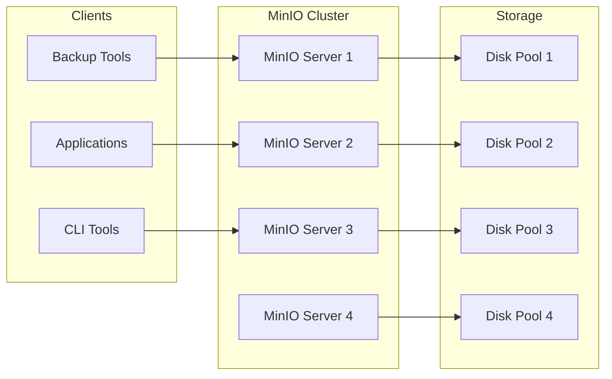

# How to Configure MinIO for Object Storage

Author: [nawazdhandala](https://www.github.com/nawazdhandala)

Tags: MinIO, Object Storage, S3, DevOps, Self-Hosted

Description: A practical guide to deploying MinIO as an S3-compatible object storage solution, covering single-node and distributed setups, bucket policies, lifecycle rules, and integration with backup tools.

---

MinIO is a high-performance, S3-compatible object storage system that you can run anywhere. Whether you need a local S3 endpoint for development, a backup target for Velero or Restic, or a production-grade storage layer for your applications, MinIO delivers the S3 API without cloud vendor lock-in.

This guide covers installation, configuration, bucket management, access policies, and common integration patterns.

## Why MinIO?

MinIO fills the gap between cloud object storage and local filesystems:

1. **S3-compatible API:** Any tool that works with AWS S3 works with MinIO.
2. **Run anywhere:** Single binary for Linux, macOS, Windows, Kubernetes, and Docker.
3. **Distributed mode:** Scale horizontally across multiple servers with erasure coding.
4. **No licensing fees:** Open-source under AGPL v3 with commercial options available.

The tradeoff is that you manage the infrastructure. There is no managed version unless you pay for MinIO Operator support.

## Installing MinIO

### Single Binary Installation

The fastest way to get started:

```bash
# Download MinIO server binary
wget https://dl.min.io/server/minio/release/linux-amd64/minio
chmod +x minio
sudo mv minio /usr/local/bin/

# Download MinIO client (mc) for management
wget https://dl.min.io/client/mc/release/linux-amd64/mc
chmod +x mc
sudo mv mc /usr/local/bin/

# Create data directory
sudo mkdir -p /data/minio
sudo chown -R $USER:$USER /data/minio
```

### Docker Installation

```bash
# Run MinIO in Docker
docker run -d \
  --name minio \
  -p 9000:9000 \
  -p 9001:9001 \
  -e MINIO_ROOT_USER=admin \
  -e MINIO_ROOT_PASSWORD=secretpassword \
  -v /data/minio:/data \
  minio/minio server /data --console-address ":9001"
```

### Kubernetes Deployment

```yaml
# minio-deployment.yaml
apiVersion: apps/v1
kind: Deployment
metadata:
  name: minio
  namespace: storage
spec:
  replicas: 1
  selector:
    matchLabels:
      app: minio
  template:
    metadata:
      labels:
        app: minio
    spec:
      containers:
        - name: minio
          image: minio/minio:latest
          args:
            - server
            - /data
            - --console-address
            - ":9001"
          env:
            - name: MINIO_ROOT_USER
              valueFrom:
                secretKeyRef:
                  name: minio-credentials
                  key: access-key
            - name: MINIO_ROOT_PASSWORD
              valueFrom:
                secretKeyRef:
                  name: minio-credentials
                  key: secret-key
          ports:
            - containerPort: 9000
              name: api
            - containerPort: 9001
              name: console
          volumeMounts:
            - name: data
              mountPath: /data
      volumes:
        - name: data
          persistentVolumeClaim:
            claimName: minio-pvc
---
apiVersion: v1
kind: Service
metadata:
  name: minio
  namespace: storage
spec:
  selector:
    app: minio
  ports:
    - port: 9000
      targetPort: 9000
      name: api
    - port: 9001
      targetPort: 9001
      name: console
```

## Starting MinIO Server

Run the server with environment variables for credentials:

```bash
# Set credentials via environment
export MINIO_ROOT_USER=admin
export MINIO_ROOT_PASSWORD=your-secure-password-here

# Start MinIO server
minio server /data/minio --console-address ":9001"

# Output:
# API: http://192.168.1.100:9000
# Console: http://192.168.1.100:9001
```

For production, create a systemd service:

```ini
# /etc/systemd/system/minio.service
[Unit]
Description=MinIO Object Storage
After=network.target

[Service]
User=minio
Group=minio
Environment="MINIO_ROOT_USER=admin"
Environment="MINIO_ROOT_PASSWORD=your-secure-password-here"
ExecStart=/usr/local/bin/minio server /data/minio --console-address ":9001"
Restart=always
RestartSec=10

[Install]
WantedBy=multi-user.target
```

```bash
# Create minio user
sudo useradd -r -s /sbin/nologin minio
sudo chown -R minio:minio /data/minio

# Enable and start
sudo systemctl daemon-reload
sudo systemctl enable minio
sudo systemctl start minio
```

## Configuring the MinIO Client

The `mc` command-line tool manages MinIO servers:

```bash
# Add your MinIO server as an alias
mc alias set local http://localhost:9000 admin your-secure-password-here

# Verify connection
mc admin info local

# List all configured aliases
mc alias list
```

## Creating and Managing Buckets

Buckets are the top-level containers for objects:

```bash
# Create a bucket
mc mb local/backups

# Create with object locking enabled (for compliance)
mc mb local/audit-logs --with-lock

# List all buckets
mc ls local

# Remove an empty bucket
mc rb local/test-bucket

# Remove bucket and all contents (careful!)
mc rb local/test-bucket --force
```

## Uploading and Downloading Objects

```bash
# Upload a file
mc cp ./backup.tar.gz local/backups/

# Upload a directory recursively
mc cp --recursive ./data/ local/backups/data/

# Download a file
mc cp local/backups/backup.tar.gz ./restored-backup.tar.gz

# Download a directory
mc cp --recursive local/backups/data/ ./restored-data/

# Sync a directory (only copy changed files)
mc mirror ./data/ local/backups/data/

# Stream data directly
cat backup.sql | mc pipe local/backups/backup.sql
```

## MinIO Architecture



## Access Policies and Users

Create users with specific permissions for different applications:

```bash
# Create a new user
mc admin user add local backupuser backup-secret-key

# Create a policy for backup access
cat > backup-policy.json <<EOF
{
    "Version": "2012-10-17",
    "Statement": [
        {
            "Effect": "Allow",
            "Action": [
                "s3:GetObject",
                "s3:PutObject",
                "s3:DeleteObject",
                "s3:ListBucket"
            ],
            "Resource": [
                "arn:aws:s3:::backups/*",
                "arn:aws:s3:::backups"
            ]
        }
    ]
}
EOF

# Add the policy to MinIO
mc admin policy create local backup-policy backup-policy.json

# Attach policy to user
mc admin policy attach local backup-policy --user backupuser

# List users
mc admin user list local

# List policies
mc admin policy list local
```

## Bucket Policies for Public Access

Make a bucket publicly readable (for static assets):

```bash
# Create a read-only public policy
cat > public-read.json <<EOF
{
    "Version": "2012-10-17",
    "Statement": [
        {
            "Effect": "Allow",
            "Principal": {"AWS": ["*"]},
            "Action": ["s3:GetObject"],
            "Resource": ["arn:aws:s3:::static-assets/*"]
        }
    ]
}
EOF

# Apply to bucket
mc anonymous set-json public-read.json local/static-assets
```

## Lifecycle Rules

Automatically delete or transition objects based on age:

```bash
# Create lifecycle rule to delete objects after 30 days
cat > lifecycle.json <<EOF
{
    "Rules": [
        {
            "ID": "expire-old-backups",
            "Status": "Enabled",
            "Filter": {
                "Prefix": ""
            },
            "Expiration": {
                "Days": 30
            }
        }
    ]
}
EOF

# Apply lifecycle rules to bucket
mc ilm import local/temp-backups < lifecycle.json

# View current lifecycle rules
mc ilm export local/temp-backups
```

## Distributed MinIO Setup

For production with high availability, run MinIO in distributed mode across multiple servers:

```bash
# On each of 4 servers, run:
export MINIO_ROOT_USER=admin
export MINIO_ROOT_PASSWORD=your-secure-password-here

minio server \
    http://minio1.example.com/data \
    http://minio2.example.com/data \
    http://minio3.example.com/data \
    http://minio4.example.com/data
```

Distributed mode provides:
- Erasure coding for data protection
- Automatic healing of corrupted objects
- Continued operation when nodes fail (up to half can be down)

## TLS Configuration

Enable HTTPS for secure communication:

```bash
# Place certificates in MinIO's certs directory
mkdir -p ~/.minio/certs
cp server.crt ~/.minio/certs/public.crt
cp server.key ~/.minio/certs/private.key

# MinIO automatically enables TLS when certificates are present
minio server /data/minio --console-address ":9001"
```

For self-signed certificates, add the CA to clients:

```bash
# Configure mc to trust custom CA
mc alias set local https://minio.example.com admin password --insecure
# Or add CA certificate:
cp ca.crt ~/.mc/certs/CAs/
```

## Integrating with Backup Tools

MinIO works seamlessly with S3-compatible backup tools.

### With Restic

```bash
export AWS_ACCESS_KEY_ID=backupuser
export AWS_SECRET_ACCESS_KEY=backup-secret-key
export RESTIC_REPOSITORY=s3:http://minio.example.com:9000/backups

restic init
restic backup /var/www
```

### With Velero

```bash
velero install \
    --provider aws \
    --plugins velero/velero-plugin-for-aws:v1.9.0 \
    --bucket velero-backups \
    --backup-location-config region=minio,s3ForcePathStyle=true,s3Url=http://minio.storage:9000 \
    --secret-file ./credentials-velero
```

### With Rclone

```bash
# Configure rclone
rclone config
# Choose: s3
# Provider: Minio
# Endpoint: http://minio.example.com:9000

# Sync files
rclone sync /data/files minio:my-bucket/files
```

## Monitoring MinIO

MinIO exposes Prometheus metrics:

```bash
# Enable metrics
mc admin prometheus generate local

# Scrape config for Prometheus
scrape_configs:
  - job_name: minio
    static_configs:
      - targets: ['minio.example.com:9000']
    metrics_path: /minio/v2/metrics/cluster
    scheme: http
```

Key metrics to monitor:
- `minio_bucket_usage_total_bytes`: Storage used per bucket
- `minio_s3_requests_total`: Request counts by operation
- `minio_s3_errors_total`: Error counts
- `minio_node_disk_free_bytes`: Available disk space

## Wrapping Up

MinIO brings S3-compatible object storage to any environment without cloud dependencies. Start with a single-node setup for development or backups, then scale to distributed mode when you need high availability. The S3 API compatibility means your backup tools, applications, and scripts work without modification. Just point them at MinIO instead of AWS and you own your storage infrastructure.
