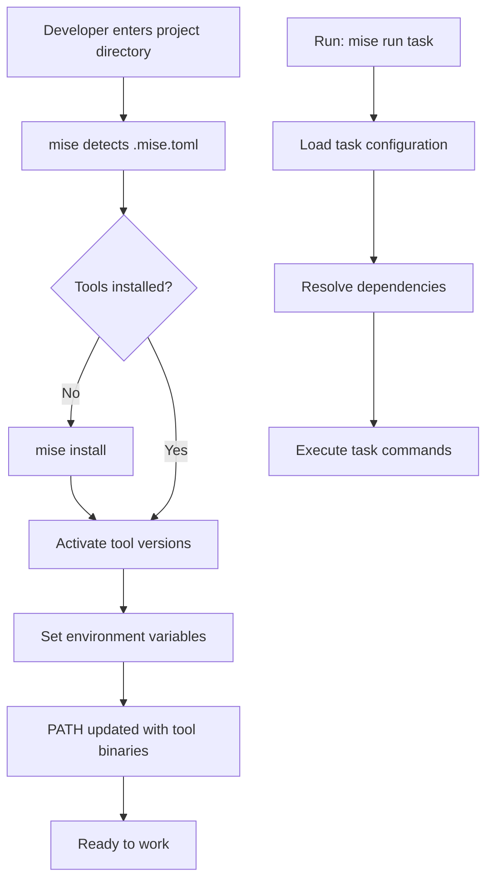

# How to Use mise for Tool Version Management

Author: [nawazdhandala](https://www.github.com/nawazdhandala)

Tags: mise, Version Management, Developer Experience, DevOps, Tooling

Description: Learn how to use mise (formerly rtx) to manage multiple runtime versions across projects, replacing tools like nvm, pyenv, and rbenv with a single, fast solution.

---

Managing multiple versions of Node.js, Python, Ruby, and other runtimes across projects is a common pain point. You might use nvm for Node, pyenv for Python, and rbenv for Ruby, each with its own configuration syntax and shell integration quirks. mise (pronounced "meez," French for "placed") consolidates all version management into a single tool that is faster and simpler than the alternatives.

## Why mise?

mise is a polyglot version manager written in Rust. It replaces asdf, nvm, pyenv, rbenv, and similar tools with one consistent interface. Key advantages:

- **Speed**: Written in Rust, mise is significantly faster than shell-based alternatives
- **Simplicity**: One tool, one configuration file format
- **Compatibility**: Reads existing `.nvmrc`, `.python-version`, and `.tool-versions` files
- **Tasks**: Built-in task runner for project scripts
- **Environment**: Manages environment variables alongside tool versions

## Installation

Install mise using your preferred method:

```bash
# macOS with Homebrew
brew install mise

# Linux/macOS with curl
curl https://mise.run | sh

# Cargo (Rust package manager)
cargo install mise

# After installation, activate in your shell
# Add to ~/.bashrc or ~/.zshrc
eval "$(mise activate bash)"  # or zsh, fish
```

Verify the installation:

```bash
mise --version
mise doctor  # Check for configuration issues
```

## Basic Usage

mise uses a `.mise.toml` file in your project root:

```toml
# .mise.toml - Project runtime configuration

# Specify exact versions for reproducibility
[tools]
node = "20.11.0"
python = "3.11.7"
go = "1.22.0"

# Or use version prefixes for flexibility
# node = "20"        # Latest 20.x
# python = "3.11"    # Latest 3.11.x
```

Install and activate tools:

```bash
# Install all tools defined in .mise.toml
mise install

# Check installed versions
mise list

# Use a specific tool version in the current session
mise use node@20.11.0

# Run a command with specific versions active
mise exec -- node --version
```

## Configuration Options

mise supports multiple configuration formats for compatibility:

```toml
# .mise.toml - Full configuration example

# Minimum mise version required
min_version = "2024.1.0"

# Tools with various version specifications
[tools]
# Exact version
node = "20.11.0"

# Latest minor version
python = "3.11"

# Multiple versions (first is default)
ruby = ["3.3.0", "3.2.2"]

# Version from environment variable
java = "{{env.JAVA_VERSION}}"

# Latest stable version
go = "latest"

# Specific release channel
rust = "stable"

[tools.terraform]
version = "1.7.0"
# Tool-specific settings

# Environment variables
[env]
NODE_ENV = "development"
DATABASE_URL = "postgresql://localhost/devdb"
# Reference other env vars
PATH = "./node_modules/.bin:{{env.PATH}}"

# Load variables from a file
_.file = ".env.local"

# Project-specific settings
[settings]
experimental = true
jobs = 4
```

## Compatibility with Existing Files

mise reads version files from other tools:

```bash
# .nvmrc (nvm)
20.11.0

# .python-version (pyenv)
3.11.7

# .tool-versions (asdf)
node 20.11.0
python 3.11.7
```

Configure reading order in `~/.config/mise/config.toml`:

```toml
# Global mise configuration

[settings]
# Look for these files in order
legacy_version_file = true
legacy_version_file_disable_tools = []

# Automatically install missing tools
auto_install = true

# Use verbose output
verbose = false

# Number of parallel jobs for installations
jobs = 4
```

## Task Runner

mise includes a task runner that replaces npm scripts and Makefiles:

```toml
# .mise.toml with tasks

[tools]
node = "20.11.0"
python = "3.11.7"

[env]
NODE_ENV = "development"

# Define tasks
[tasks.dev]
description = "Start development server"
run = "npm run dev"
# Ensure dependencies are installed first
depends = ["install"]

[tasks.install]
description = "Install dependencies"
run = """
npm ci
pip install -r requirements.txt
"""

[tasks.test]
description = "Run all tests"
run = [
  "npm test",
  "pytest tests/"
]
depends = ["install"]

[tasks.lint]
description = "Run linters"
run = """
eslint src/
black --check .
"""

[tasks.build]
description = "Build for production"
env = { NODE_ENV = "production" }
run = "npm run build"
depends = ["test", "lint"]

[tasks.db]
description = "Database operations"
# Task with arguments
run = "python scripts/db.py {{arg(name='command')}}"

[tasks."db:migrate"]
description = "Run database migrations"
run = "python scripts/db.py migrate"

[tasks."db:seed"]
description = "Seed the database"
run = "python scripts/db.py seed"
depends = ["db:migrate"]
```

Run tasks:

```bash
# List available tasks
mise tasks

# Run a task
mise run dev

# Run with arguments
mise run db migrate

# Run multiple tasks
mise run lint test

# Watch mode (re-run on file changes)
mise watch -t test
```

## Environment Management

mise can manage environment variables per directory:

```toml
# .mise.toml

[env]
# Static values
API_URL = "https://api.example.com"
DEBUG = "true"

# Reference other variables
DATABASE_NAME = "app_{{env.USER}}"

# Load from files
_.file = [".env", ".env.local"]

# Templates with tool paths
PATH = "{{env.HOME}}/.local/bin:{{env.PATH}}"

# Secrets (prompted on first use)
_.secret = ["API_KEY", "DATABASE_PASSWORD"]
```

Create environment-specific configurations:

```toml
# .mise.development.toml
[env]
NODE_ENV = "development"
LOG_LEVEL = "debug"
DATABASE_URL = "postgresql://localhost/app_dev"

# .mise.production.toml
[env]
NODE_ENV = "production"
LOG_LEVEL = "warn"
DATABASE_URL = "{{env.PROD_DATABASE_URL}}"
```

Activate by setting `MISE_ENV`:

```bash
MISE_ENV=production mise run deploy
```

## Project Structure

Here is how mise integrates into a typical project:

```
project/
├── .mise.toml           # Main configuration
├── .mise.local.toml     # Local overrides (gitignored)
├── .env                 # Shared environment
├── .env.local           # Local secrets (gitignored)
├── package.json
├── requirements.txt
└── src/
```

A workflow diagram:



## Team Workflow

Standardize tool versions across your team:

```toml
# .mise.toml - Committed to repository

[tools]
# Pin exact versions for CI reproducibility
node = "20.11.0"
python = "3.11.7"
terraform = "1.7.0"

[env]
# Non-sensitive defaults
NODE_ENV = "development"
LOG_FORMAT = "pretty"

[tasks.setup]
description = "Set up development environment"
run = """
mise install
npm ci
pip install -r requirements.txt
cp .env.example .env.local
echo "Setup complete! Edit .env.local with your secrets."
"""
```

Document in README:

```markdown
## Development Setup

1. Install mise: `curl https://mise.run | sh`
2. Activate mise: Add `eval "$(mise activate bash)"` to your shell config
3. Run setup: `mise run setup`
4. Start developing: `mise run dev`
```

## CI/CD Integration

Use mise in continuous integration:

```yaml
# .github/workflows/test.yml
name: Tests

on: [push, pull_request]

jobs:
  test:
    runs-on: ubuntu-latest
    steps:
      - uses: actions/checkout@v4

      - name: Install mise
        uses: jdx/mise-action@v2
        with:
          install: true

      - name: Install tools
        run: mise install

      - name: Run tests
        run: mise run test
```

For GitLab CI:

```yaml
# .gitlab-ci.yml
test:
  image: ubuntu:latest
  before_script:
    - curl https://mise.run | sh
    - eval "$(mise activate bash)"
    - mise install
  script:
    - mise run test
```

## Migrating from Other Tools

Migrate existing projects step by step:

```bash
# From nvm - mise reads .nvmrc automatically
# Optionally convert to .mise.toml
mise use node@$(cat .nvmrc)

# From pyenv - mise reads .python-version
mise use python@$(cat .python-version)

# From asdf - mise reads .tool-versions
# Keep the file or migrate
mise install  # Reads existing .tool-versions

# Generate .mise.toml from current environment
mise current --toml > .mise.toml
```

## Best Practices

1. **Pin exact versions**: Use exact versions in `.mise.toml` for team projects. This ensures everyone uses identical tool versions.

2. **Use tasks over npm scripts**: mise tasks work across languages and can define dependencies between tasks.

3. **Keep secrets local**: Use `.mise.local.toml` and `.env.local` for secrets. Add them to `.gitignore`.

4. **Document setup steps**: Include mise installation and setup commands in your README.

5. **Update regularly**: Run `mise upgrade` periodically to get the latest tool versions and mise features.

mise simplifies the complexity of multi-runtime development. Instead of remembering which version manager handles which language, you get one consistent interface that works everywhere. Your team spends less time configuring environments and more time writing code.
