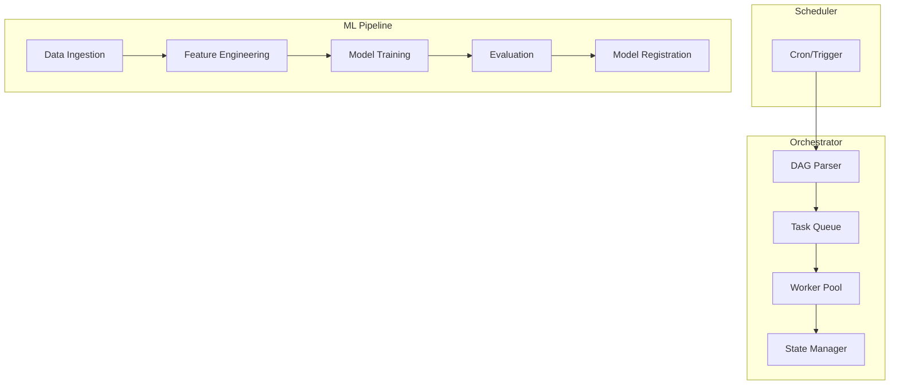

# How to Configure ML Pipeline Orchestration

Author: [nawazdhandala](https://www.github.com/nawazdhandala)

Tags: MLOps, Pipeline Orchestration, Airflow, Prefect, Machine Learning, DAG, Workflow

Description: Learn how to orchestrate ML pipelines using tools like Airflow and Prefect, covering DAG design, task dependencies, error handling, and scheduling for production ML workflows.

---

ML pipelines involve complex dependencies between data processing, feature engineering, training, and evaluation steps. Orchestration tools manage these dependencies, handle failures, and provide visibility into pipeline health. This guide covers implementing robust ML pipeline orchestration.

## Pipeline Orchestration Architecture



## Airflow Pipeline Implementation

### Basic DAG Structure

```python
# dags/ml_training_pipeline.py
from datetime import datetime, timedelta
from airflow import DAG
from airflow.operators.python import PythonOperator
from airflow.operators.bash import BashOperator
from airflow.utils.task_group import TaskGroup

# Default arguments for all tasks
default_args = {
    'owner': 'ml-team',
    'depends_on_past': False,
    'email_on_failure': True,
    'email_on_retry': False,
    'email': ['ml-alerts@company.com'],
    'retries': 2,
    'retry_delay': timedelta(minutes=5),
    'execution_timeout': timedelta(hours=2),
}

# DAG definition
dag = DAG(
    'ml_training_pipeline',
    default_args=default_args,
    description='Daily model training pipeline',
    schedule_interval='0 2 * * *',  # Run at 2 AM daily
    start_date=datetime(2026, 1, 1),
    catchup=False,  # Don't backfill
    max_active_runs=1,  # Only one run at a time
    tags=['ml', 'training'],
)

def extract_data(**context):
    """Extract data from source systems."""
    from datetime import datetime
    import pandas as pd

    # Get execution date for partitioning
    execution_date = context['execution_date']
    date_str = execution_date.strftime('%Y-%m-%d')

    # Extract data
    print(f"Extracting data for {date_str}")

    # Store reference in XCom for downstream tasks
    data_path = f"s3://data-lake/raw/{date_str}/transactions.parquet"
    context['ti'].xcom_push(key='data_path', value=data_path)

    return data_path

def validate_data(**context):
    """Validate extracted data quality."""
    import great_expectations as ge

    # Get data path from upstream
    data_path = context['ti'].xcom_pull(
        task_ids='extract_data',
        key='data_path'
    )

    # Run validation
    df = ge.read_parquet(data_path)

    # Define expectations
    results = df.expect_column_to_exist('customer_id')
    results = df.expect_column_values_to_not_be_null('customer_id')
    results = df.expect_column_values_to_be_between(
        'amount', min_value=0, max_value=1000000
    )

    if not results.success:
        raise ValueError("Data validation failed")

    return True

def compute_features(**context):
    """Compute features for training."""
    data_path = context['ti'].xcom_pull(
        task_ids='extract_data',
        key='data_path'
    )

    # Feature computation logic
    print(f"Computing features from {data_path}")

    feature_path = data_path.replace('raw', 'features')
    context['ti'].xcom_push(key='feature_path', value=feature_path)

    return feature_path

def train_model(**context):
    """Train the model."""
    import mlflow

    feature_path = context['ti'].xcom_pull(
        task_ids='compute_features',
        key='feature_path'
    )

    with mlflow.start_run() as run:
        # Training logic
        print(f"Training model with features from {feature_path}")

        # Log run ID for downstream
        context['ti'].xcom_push(key='run_id', value=run.info.run_id)

    return run.info.run_id

def evaluate_model(**context):
    """Evaluate trained model."""
    run_id = context['ti'].xcom_pull(
        task_ids='train_model',
        key='run_id'
    )

    # Load model and evaluate
    print(f"Evaluating model from run {run_id}")

    metrics = {
        'accuracy': 0.95,
        'precision': 0.93,
        'recall': 0.91
    }

    context['ti'].xcom_push(key='metrics', value=metrics)

    # Check if model meets threshold
    if metrics['accuracy'] < 0.90:
        raise ValueError("Model accuracy below threshold")

    return metrics

def register_model(**context):
    """Register model if evaluation passes."""
    import mlflow

    run_id = context['ti'].xcom_pull(
        task_ids='train_model',
        key='run_id'
    )

    metrics = context['ti'].xcom_pull(
        task_ids='evaluate_model',
        key='metrics'
    )

    # Register model
    model_uri = f"runs:/{run_id}/model"
    result = mlflow.register_model(model_uri, "fraud_detector")

    print(f"Registered model version {result.version}")

    return result.version

# Define tasks
with dag:
    extract = PythonOperator(
        task_id='extract_data',
        python_callable=extract_data,
    )

    validate = PythonOperator(
        task_id='validate_data',
        python_callable=validate_data,
    )

    features = PythonOperator(
        task_id='compute_features',
        python_callable=compute_features,
    )

    train = PythonOperator(
        task_id='train_model',
        python_callable=train_model,
    )

    evaluate = PythonOperator(
        task_id='evaluate_model',
        python_callable=evaluate_model,
    )

    register = PythonOperator(
        task_id='register_model',
        python_callable=register_model,
    )

    # Define dependencies
    extract >> validate >> features >> train >> evaluate >> register
```

### Task Groups for Complex Pipelines

```python
# dags/complex_pipeline.py
from airflow import DAG
from airflow.operators.python import PythonOperator
from airflow.utils.task_group import TaskGroup
from airflow.operators.dummy import DummyOperator

with DAG('complex_ml_pipeline', ...) as dag:

    start = DummyOperator(task_id='start')

    # Data preparation group
    with TaskGroup('data_preparation') as data_prep:
        extract_transactions = PythonOperator(
            task_id='extract_transactions',
            python_callable=extract_transactions_func,
        )

        extract_user_data = PythonOperator(
            task_id='extract_user_data',
            python_callable=extract_user_func,
        )

        join_data = PythonOperator(
            task_id='join_data',
            python_callable=join_data_func,
        )

        # Parallel extraction, then join
        [extract_transactions, extract_user_data] >> join_data

    # Feature engineering group
    with TaskGroup('feature_engineering') as feature_eng:
        compute_aggregates = PythonOperator(
            task_id='compute_aggregates',
            python_callable=compute_aggregates_func,
        )

        compute_embeddings = PythonOperator(
            task_id='compute_embeddings',
            python_callable=compute_embeddings_func,
        )

        merge_features = PythonOperator(
            task_id='merge_features',
            python_callable=merge_features_func,
        )

        [compute_aggregates, compute_embeddings] >> merge_features

    # Training group with multiple model variants
    with TaskGroup('model_training') as training:
        train_xgboost = PythonOperator(
            task_id='train_xgboost',
            python_callable=train_xgboost_func,
        )

        train_lightgbm = PythonOperator(
            task_id='train_lightgbm',
            python_callable=train_lightgbm_func,
        )

        select_best = PythonOperator(
            task_id='select_best_model',
            python_callable=select_best_func,
        )

        [train_xgboost, train_lightgbm] >> select_best

    end = DummyOperator(task_id='end')

    # Main flow
    start >> data_prep >> feature_eng >> training >> end
```

## Prefect Pipeline Implementation

Prefect offers a more Pythonic approach with better error handling.

```python
# flows/ml_training_flow.py
from prefect import flow, task
from prefect.tasks import task_input_hash
from datetime import timedelta
from typing import Dict, Any

@task(
    retries=3,
    retry_delay_seconds=60,
    cache_key_fn=task_input_hash,
    cache_expiration=timedelta(hours=24)
)
def extract_data(date: str) -> str:
    """Extract data for a given date."""
    print(f"Extracting data for {date}")

    # Extraction logic
    data_path = f"s3://data-lake/raw/{date}/transactions.parquet"

    return data_path

@task(retries=2)
def validate_data(data_path: str) -> bool:
    """Validate data quality."""
    import great_expectations as ge

    df = ge.read_parquet(data_path)

    # Validation checks
    results = df.expect_column_to_exist('customer_id')

    if not results.success:
        raise ValueError(f"Validation failed for {data_path}")

    return True

@task(retries=2, retry_delay_seconds=30)
def compute_features(data_path: str) -> str:
    """Compute features from raw data."""
    print(f"Computing features from {data_path}")

    feature_path = data_path.replace('raw', 'features')

    # Feature computation
    return feature_path

@task(
    retries=1,
    timeout_seconds=7200  # 2 hour timeout for training
)
def train_model(feature_path: str, hyperparams: Dict[str, Any]) -> str:
    """Train model with given hyperparameters."""
    import mlflow

    with mlflow.start_run() as run:
        mlflow.log_params(hyperparams)

        # Training logic
        print(f"Training with params: {hyperparams}")

        # Log metrics
        mlflow.log_metrics({
            'accuracy': 0.95,
            'f1_score': 0.92
        })

    return run.info.run_id

@task
def evaluate_model(run_id: str, threshold: float = 0.9) -> Dict[str, float]:
    """Evaluate model and check thresholds."""
    import mlflow

    # Load metrics from run
    run = mlflow.get_run(run_id)
    metrics = run.data.metrics

    if metrics.get('accuracy', 0) < threshold:
        raise ValueError(
            f"Model accuracy {metrics['accuracy']} below threshold {threshold}"
        )

    return metrics

@task
def register_model(run_id: str, model_name: str) -> str:
    """Register model in MLflow registry."""
    import mlflow

    model_uri = f"runs:/{run_id}/model"
    result = mlflow.register_model(model_uri, model_name)

    return result.version

@flow(name="ML Training Pipeline")
def ml_training_pipeline(
    date: str,
    model_name: str = "fraud_detector",
    hyperparams: Dict[str, Any] = None
):
    """
    Main ML training pipeline.

    Orchestrates data extraction, feature engineering,
    training, evaluation, and registration.
    """
    if hyperparams is None:
        hyperparams = {
            'learning_rate': 0.01,
            'max_depth': 6,
            'n_estimators': 100
        }

    # Execute pipeline
    data_path = extract_data(date)
    validate_data(data_path)
    feature_path = compute_features(data_path)
    run_id = train_model(feature_path, hyperparams)
    metrics = evaluate_model(run_id)
    version = register_model(run_id, model_name)

    return {
        'run_id': run_id,
        'version': version,
        'metrics': metrics
    }

# Deployment configuration
if __name__ == "__main__":
    from prefect.deployments import Deployment
    from prefect.server.schemas.schedules import CronSchedule

    deployment = Deployment.build_from_flow(
        flow=ml_training_pipeline,
        name="daily-training",
        schedule=CronSchedule(cron="0 2 * * *"),
        parameters={
            "date": "{{ execution_date.strftime('%Y-%m-%d') }}",
            "model_name": "fraud_detector"
        },
        work_pool_name="ml-pool",
        tags=["ml", "training", "production"]
    )

    deployment.apply()
```

### Dynamic Pipelines with Prefect

```python
# flows/dynamic_pipeline.py
from prefect import flow, task
from prefect.futures import wait
from typing import List

@task
def train_single_model(config: dict) -> dict:
    """Train a single model with given config."""
    model_type = config['model_type']
    params = config['params']

    print(f"Training {model_type} with {params}")

    # Training logic
    return {
        'model_type': model_type,
        'accuracy': 0.95,
        'run_id': 'run_123'
    }

@task
def select_best_model(results: List[dict]) -> dict:
    """Select the best model from training results."""
    best = max(results, key=lambda x: x['accuracy'])
    print(f"Best model: {best['model_type']} with accuracy {best['accuracy']}")
    return best

@flow
def hyperparameter_search_pipeline(
    feature_path: str,
    model_configs: List[dict]
):
    """
    Run parallel hyperparameter search.

    Trains multiple model configurations and selects the best.
    """
    # Submit all training tasks
    futures = []
    for config in model_configs:
        future = train_single_model.submit(config)
        futures.append(future)

    # Wait for all to complete
    wait(futures)

    # Gather results
    results = [f.result() for f in futures]

    # Select best
    best = select_best_model(results)

    return best

# Usage
configs = [
    {'model_type': 'xgboost', 'params': {'max_depth': 4, 'learning_rate': 0.1}},
    {'model_type': 'xgboost', 'params': {'max_depth': 6, 'learning_rate': 0.1}},
    {'model_type': 'lightgbm', 'params': {'num_leaves': 31, 'learning_rate': 0.1}},
    {'model_type': 'lightgbm', 'params': {'num_leaves': 63, 'learning_rate': 0.05}},
]

result = hyperparameter_search_pipeline(
    feature_path="s3://features/2026-01-25",
    model_configs=configs
)
```

## Error Handling and Alerting

```python
# flows/error_handling.py
from prefect import flow, task
from prefect.blocks.notifications import SlackWebhook
import traceback

@task
def risky_task():
    """A task that might fail."""
    import random
    if random.random() < 0.3:
        raise RuntimeError("Random failure!")
    return "success"

@flow
def pipeline_with_error_handling():
    """Pipeline with comprehensive error handling."""
    from prefect.context import get_run_context

    try:
        result = risky_task()
        return result

    except Exception as e:
        # Get run context for debugging info
        ctx = get_run_context()

        error_message = f"""
        Pipeline Failed!
        Flow: {ctx.flow.name}
        Run ID: {ctx.flow_run.id}
        Error: {str(e)}

        Traceback:
        {traceback.format_exc()}
        """

        # Send alert
        slack = SlackWebhook.load("ml-alerts")
        slack.notify(error_message)

        # Re-raise to mark flow as failed
        raise

# Airflow error callback
def on_failure_callback(context):
    """Called when an Airflow task fails."""
    from airflow.providers.slack.operators.slack_webhook import SlackWebhookOperator

    task_instance = context['task_instance']
    exception = context.get('exception')

    message = f"""
    :red_circle: Task Failed
    DAG: {task_instance.dag_id}
    Task: {task_instance.task_id}
    Execution Date: {context['execution_date']}
    Error: {str(exception)}
    Log URL: {task_instance.log_url}
    """

    slack_alert = SlackWebhookOperator(
        task_id='slack_alert',
        slack_webhook_conn_id='slack_webhook',
        message=message,
        channel='#ml-alerts'
    )

    return slack_alert.execute(context=context)
```

## Pipeline Monitoring

```python
# monitoring/pipeline_metrics.py
from prometheus_client import Counter, Histogram, Gauge
import time
from functools import wraps

# Define metrics
pipeline_runs = Counter(
    'ml_pipeline_runs_total',
    'Total pipeline runs',
    ['pipeline_name', 'status']
)

pipeline_duration = Histogram(
    'ml_pipeline_duration_seconds',
    'Pipeline duration in seconds',
    ['pipeline_name'],
    buckets=[60, 300, 600, 1800, 3600, 7200]
)

task_duration = Histogram(
    'ml_task_duration_seconds',
    'Task duration in seconds',
    ['pipeline_name', 'task_name']
)

active_pipelines = Gauge(
    'ml_active_pipelines',
    'Currently running pipelines',
    ['pipeline_name']
)

def track_pipeline(pipeline_name: str):
    """Decorator to track pipeline metrics."""
    def decorator(func):
        @wraps(func)
        def wrapper(*args, **kwargs):
            active_pipelines.labels(pipeline_name=pipeline_name).inc()
            start_time = time.time()

            try:
                result = func(*args, **kwargs)
                pipeline_runs.labels(
                    pipeline_name=pipeline_name,
                    status='success'
                ).inc()
                return result

            except Exception as e:
                pipeline_runs.labels(
                    pipeline_name=pipeline_name,
                    status='failure'
                ).inc()
                raise

            finally:
                duration = time.time() - start_time
                pipeline_duration.labels(pipeline_name=pipeline_name).observe(duration)
                active_pipelines.labels(pipeline_name=pipeline_name).dec()

        return wrapper
    return decorator

def track_task(pipeline_name: str, task_name: str):
    """Decorator to track task metrics."""
    def decorator(func):
        @wraps(func)
        def wrapper(*args, **kwargs):
            start_time = time.time()

            try:
                return func(*args, **kwargs)
            finally:
                duration = time.time() - start_time
                task_duration.labels(
                    pipeline_name=pipeline_name,
                    task_name=task_name
                ).observe(duration)

        return wrapper
    return decorator
```

## Summary

| Tool | Best For | Scheduling | Error Handling |
|------|----------|------------|----------------|
| **Airflow** | Complex DAGs, enterprise | Cron, sensors | Callbacks, retries |
| **Prefect** | Dynamic flows, Python-native | Cron, triggers | Native exceptions |
| **Kubeflow** | Kubernetes-native ML | Manual, scheduled | Container-level |
| **Dagster** | Data pipelines, testing | Cron, sensors | First-class errors |

ML pipeline orchestration requires handling the unique challenges of ML workflows: long-running training jobs, data dependencies, and model quality gates. Choose an orchestration tool that matches your team's expertise and infrastructure, then build in comprehensive error handling and monitoring from the start.
