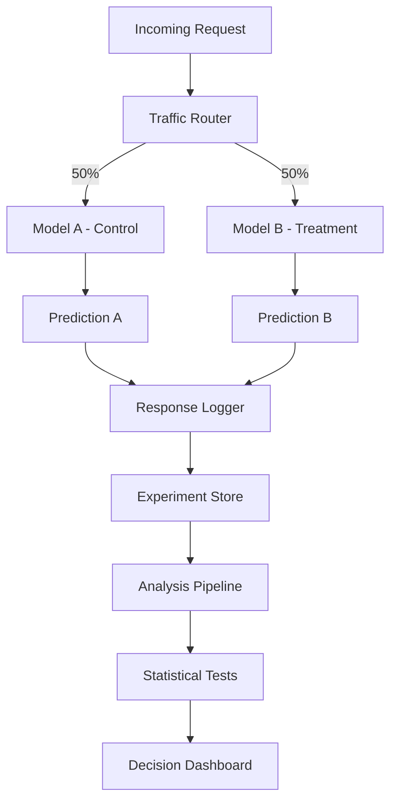

# How to Configure Model A/B Testing

Author: [nawazdhandala](https://www.github.com/nawazdhandala)

Tags: MLOps, A/B Testing, Machine Learning, Experimentation, Python, Statistics

Description: Learn how to set up A/B testing infrastructure for ML models, covering traffic splitting, metric collection, statistical analysis, and making data-driven decisions about model deployments.

---

Deploying a new ML model without proper testing is risky. A/B testing lets you compare model versions with real traffic, measuring actual business impact before committing to a full rollout. This guide covers implementing A/B testing infrastructure that gives you confidence in model deployment decisions.

## A/B Testing Architecture



## Traffic Splitting Implementation

### Hash-Based Assignment

Consistent assignment ensures users always see the same model version.

```python
# routing/experiment_router.py
import hashlib
from dataclasses import dataclass
from typing import Optional, Dict, Any
from enum import Enum

class ExperimentVariant(Enum):
    CONTROL = "control"
    TREATMENT = "treatment"

@dataclass
class Experiment:
    name: str
    control_model: str
    treatment_model: str
    traffic_percentage: float  # Percentage for treatment (0-100)
    enabled: bool = True

    def get_variant(self, user_id: str) -> ExperimentVariant:
        """
        Determine which variant a user should see.

        Uses consistent hashing so the same user always gets
        the same variant.
        """
        if not self.enabled:
            return ExperimentVariant.CONTROL

        # Create a hash from experiment name + user ID
        hash_input = f"{self.name}:{user_id}"
        hash_value = hashlib.md5(hash_input.encode()).hexdigest()

        # Convert first 8 hex chars to a number between 0-100
        bucket = int(hash_value[:8], 16) % 100

        if bucket < self.traffic_percentage:
            return ExperimentVariant.TREATMENT
        return ExperimentVariant.CONTROL

class ExperimentRouter:
    """
    Route requests to model variants based on experiment configuration.

    Supports multiple concurrent experiments with different traffic splits.
    """

    def __init__(self):
        self.experiments: Dict[str, Experiment] = {}
        self.models: Dict[str, Any] = {}  # model_name -> model instance

    def register_experiment(self, experiment: Experiment):
        """Register a new experiment."""
        self.experiments[experiment.name] = experiment

    def register_model(self, name: str, model):
        """Register a model for use in experiments."""
        self.models[name] = model

    def get_model_for_request(
        self,
        experiment_name: str,
        user_id: str
    ) -> tuple:
        """
        Get the appropriate model for a request.

        Returns:
            Tuple of (model, variant, experiment_name)
        """
        experiment = self.experiments.get(experiment_name)

        if not experiment:
            raise ValueError(f"Unknown experiment: {experiment_name}")

        variant = experiment.get_variant(user_id)

        if variant == ExperimentVariant.CONTROL:
            model_name = experiment.control_model
        else:
            model_name = experiment.treatment_model

        model = self.models.get(model_name)
        if not model:
            raise ValueError(f"Model not found: {model_name}")

        return model, variant, experiment_name

# Usage
router = ExperimentRouter()

# Register models
router.register_model("fraud_v1", fraud_model_v1)
router.register_model("fraud_v2", fraud_model_v2)

# Create experiment
experiment = Experiment(
    name="fraud_model_upgrade",
    control_model="fraud_v1",
    treatment_model="fraud_v2",
    traffic_percentage=10  # Start with 10% on new model
)
router.register_experiment(experiment)
```

### Multi-Armed Bandit Alternative

For faster convergence, use Thompson Sampling to automatically shift traffic toward better models.

```python
# routing/bandit_router.py
import numpy as np
from scipy import stats
from dataclasses import dataclass
from typing import Dict

@dataclass
class BanditArm:
    name: str
    model: Any
    successes: int = 0
    failures: int = 0

    @property
    def alpha(self) -> float:
        """Beta distribution alpha parameter."""
        return self.successes + 1

    @property
    def beta(self) -> float:
        """Beta distribution beta parameter."""
        return self.failures + 1

    def sample(self) -> float:
        """Sample from the posterior distribution."""
        return np.random.beta(self.alpha, self.beta)

class ThompsonSamplingRouter:
    """
    Route traffic using Thompson Sampling.

    Automatically allocates more traffic to better-performing models
    while maintaining exploration.
    """

    def __init__(self):
        self.arms: Dict[str, BanditArm] = {}

    def register_arm(self, name: str, model):
        """Register a model as a bandit arm."""
        self.arms[name] = BanditArm(name=name, model=model)

    def select_arm(self) -> BanditArm:
        """
        Select an arm using Thompson Sampling.

        Samples from each arm's posterior and selects the highest.
        """
        samples = {
            name: arm.sample()
            for name, arm in self.arms.items()
        }

        selected_name = max(samples, key=samples.get)
        return self.arms[selected_name]

    def record_outcome(self, arm_name: str, success: bool):
        """Record the outcome of a prediction."""
        arm = self.arms[arm_name]
        if success:
            arm.successes += 1
        else:
            arm.failures += 1

    def get_statistics(self) -> Dict[str, Dict]:
        """Get current statistics for all arms."""
        return {
            name: {
                "successes": arm.successes,
                "failures": arm.failures,
                "estimated_rate": arm.successes / (arm.successes + arm.failures + 1),
                "traffic_share": self._calculate_traffic_share(arm)
            }
            for name, arm in self.arms.items()
        }

    def _calculate_traffic_share(self, arm: BanditArm, n_samples: int = 10000) -> float:
        """Estimate expected traffic share for an arm."""
        wins = 0
        for _ in range(n_samples):
            samples = {name: a.sample() for name, a in self.arms.items()}
            if max(samples, key=samples.get) == arm.name:
                wins += 1
        return wins / n_samples
```

## Experiment Logging

Track all experiment interactions for analysis.

```python
# logging/experiment_logger.py
import json
from datetime import datetime
from dataclasses import dataclass, asdict
from typing import Optional, Any
import sqlite3

@dataclass
class ExperimentEvent:
    experiment_name: str
    variant: str
    user_id: str
    model_name: str
    prediction: float
    features: dict
    timestamp: datetime
    request_id: str

    # Outcomes (filled in later)
    actual_outcome: Optional[float] = None
    outcome_timestamp: Optional[datetime] = None

class ExperimentLogger:
    """
    Log experiment events for analysis.

    Stores predictions and later matches them with outcomes.
    """

    def __init__(self, db_path: str = "experiments.db"):
        self.conn = sqlite3.connect(db_path, check_same_thread=False)
        self._init_db()

    def _init_db(self):
        """Initialize database schema."""
        self.conn.execute("""
            CREATE TABLE IF NOT EXISTS experiment_events (
                request_id TEXT PRIMARY KEY,
                experiment_name TEXT,
                variant TEXT,
                user_id TEXT,
                model_name TEXT,
                prediction REAL,
                features TEXT,
                timestamp TEXT,
                actual_outcome REAL,
                outcome_timestamp TEXT
            )
        """)

        # Index for efficient queries
        self.conn.execute("""
            CREATE INDEX IF NOT EXISTS idx_experiment_variant
            ON experiment_events(experiment_name, variant)
        """)
        self.conn.commit()

    def log_prediction(self, event: ExperimentEvent):
        """Log a prediction event."""
        self.conn.execute(
            """
            INSERT INTO experiment_events
            (request_id, experiment_name, variant, user_id, model_name,
             prediction, features, timestamp)
            VALUES (?, ?, ?, ?, ?, ?, ?, ?)
            """,
            (
                event.request_id,
                event.experiment_name,
                event.variant,
                event.user_id,
                event.model_name,
                event.prediction,
                json.dumps(event.features),
                event.timestamp.isoformat()
            )
        )
        self.conn.commit()

    def record_outcome(self, request_id: str, outcome: float):
        """Record the actual outcome for a prediction."""
        self.conn.execute(
            """
            UPDATE experiment_events
            SET actual_outcome = ?, outcome_timestamp = ?
            WHERE request_id = ?
            """,
            (outcome, datetime.now().isoformat(), request_id)
        )
        self.conn.commit()

    def get_experiment_data(
        self,
        experiment_name: str,
        min_timestamp: Optional[datetime] = None
    ) -> list:
        """Get all events for an experiment."""
        query = """
            SELECT * FROM experiment_events
            WHERE experiment_name = ?
            AND actual_outcome IS NOT NULL
        """
        params = [experiment_name]

        if min_timestamp:
            query += " AND timestamp > ?"
            params.append(min_timestamp.isoformat())

        cursor = self.conn.execute(query, params)
        columns = [desc[0] for desc in cursor.description]

        return [dict(zip(columns, row)) for row in cursor.fetchall()]
```

## Statistical Analysis

Analyze experiment results with proper statistical methods.

```python
# analysis/experiment_analyzer.py
import numpy as np
from scipy import stats
from dataclasses import dataclass
from typing import List, Dict

@dataclass
class ExperimentResults:
    control_mean: float
    treatment_mean: float
    control_std: float
    treatment_std: float
    control_n: int
    treatment_n: int
    relative_lift: float
    p_value: float
    confidence_interval: tuple
    is_significant: bool
    power: float

class ExperimentAnalyzer:
    """
    Analyze A/B test results with statistical rigor.

    Calculates significance, confidence intervals, and power.
    """

    def __init__(self, alpha: float = 0.05):
        self.alpha = alpha

    def analyze_binary_metric(
        self,
        control_conversions: int,
        control_total: int,
        treatment_conversions: int,
        treatment_total: int
    ) -> ExperimentResults:
        """
        Analyze a binary metric (conversion rate, click rate, etc.)
        using a two-proportion z-test.
        """
        # Calculate rates
        control_rate = control_conversions / control_total
        treatment_rate = treatment_conversions / treatment_total

        # Pooled proportion
        pooled = (control_conversions + treatment_conversions) / (
            control_total + treatment_total
        )

        # Standard error
        se = np.sqrt(
            pooled * (1 - pooled) * (1/control_total + 1/treatment_total)
        )

        # Z-statistic
        z_stat = (treatment_rate - control_rate) / se

        # P-value (two-tailed)
        p_value = 2 * (1 - stats.norm.cdf(abs(z_stat)))

        # Confidence interval for the difference
        se_diff = np.sqrt(
            (control_rate * (1 - control_rate) / control_total) +
            (treatment_rate * (1 - treatment_rate) / treatment_total)
        )

        z_critical = stats.norm.ppf(1 - self.alpha / 2)
        ci_lower = (treatment_rate - control_rate) - z_critical * se_diff
        ci_upper = (treatment_rate - control_rate) + z_critical * se_diff

        # Relative lift
        relative_lift = (treatment_rate - control_rate) / control_rate if control_rate > 0 else 0

        # Power calculation
        power = self._calculate_power(
            control_rate, treatment_rate, control_total, treatment_total
        )

        return ExperimentResults(
            control_mean=control_rate,
            treatment_mean=treatment_rate,
            control_std=np.sqrt(control_rate * (1 - control_rate)),
            treatment_std=np.sqrt(treatment_rate * (1 - treatment_rate)),
            control_n=control_total,
            treatment_n=treatment_total,
            relative_lift=relative_lift,
            p_value=p_value,
            confidence_interval=(ci_lower, ci_upper),
            is_significant=p_value < self.alpha,
            power=power
        )

    def analyze_continuous_metric(
        self,
        control_values: List[float],
        treatment_values: List[float]
    ) -> ExperimentResults:
        """
        Analyze a continuous metric using Welch's t-test.

        Does not assume equal variances between groups.
        """
        control = np.array(control_values)
        treatment = np.array(treatment_values)

        # Calculate statistics
        control_mean = np.mean(control)
        treatment_mean = np.mean(treatment)
        control_std = np.std(control, ddof=1)
        treatment_std = np.std(treatment, ddof=1)

        # Welch's t-test
        t_stat, p_value = stats.ttest_ind(
            treatment, control, equal_var=False
        )

        # Confidence interval using Welch-Satterthwaite approximation
        se_diff = np.sqrt(
            (control_std**2 / len(control)) +
            (treatment_std**2 / len(treatment))
        )

        # Degrees of freedom (Welch-Satterthwaite)
        df = self._welch_df(control, treatment)
        t_critical = stats.t.ppf(1 - self.alpha / 2, df)

        diff = treatment_mean - control_mean
        ci_lower = diff - t_critical * se_diff
        ci_upper = diff + t_critical * se_diff

        # Relative lift
        relative_lift = diff / control_mean if control_mean != 0 else 0

        return ExperimentResults(
            control_mean=control_mean,
            treatment_mean=treatment_mean,
            control_std=control_std,
            treatment_std=treatment_std,
            control_n=len(control),
            treatment_n=len(treatment),
            relative_lift=relative_lift,
            p_value=p_value,
            confidence_interval=(ci_lower, ci_upper),
            is_significant=p_value < self.alpha,
            power=self._calculate_power_continuous(control, treatment)
        )

    def _welch_df(self, a: np.ndarray, b: np.ndarray) -> float:
        """Calculate Welch-Satterthwaite degrees of freedom."""
        var_a = np.var(a, ddof=1)
        var_b = np.var(b, ddof=1)
        n_a = len(a)
        n_b = len(b)

        numerator = (var_a/n_a + var_b/n_b)**2
        denominator = (var_a/n_a)**2/(n_a-1) + (var_b/n_b)**2/(n_b-1)

        return numerator / denominator

    def _calculate_power(
        self,
        p1: float,
        p2: float,
        n1: int,
        n2: int
    ) -> float:
        """Calculate statistical power for proportion test."""
        effect_size = abs(p2 - p1) / np.sqrt(p1 * (1 - p1))

        # Using normal approximation
        se = np.sqrt(p1 * (1 - p1) * (1/n1 + 1/n2))
        z_alpha = stats.norm.ppf(1 - self.alpha / 2)
        z_power = (abs(p2 - p1) - z_alpha * se) / se

        return stats.norm.cdf(z_power)

    def _calculate_power_continuous(
        self,
        control: np.ndarray,
        treatment: np.ndarray
    ) -> float:
        """Calculate statistical power for t-test."""
        effect_size = (np.mean(treatment) - np.mean(control)) / np.std(control)
        n = min(len(control), len(treatment))

        # Non-central t-distribution power
        df = self._welch_df(control, treatment)
        t_critical = stats.t.ppf(1 - self.alpha / 2, df)
        ncp = effect_size * np.sqrt(n / 2)  # Non-centrality parameter

        return 1 - stats.nct.cdf(t_critical, df, ncp) + stats.nct.cdf(-t_critical, df, ncp)

# Usage
analyzer = ExperimentAnalyzer(alpha=0.05)

# Binary metric analysis
results = analyzer.analyze_binary_metric(
    control_conversions=450,
    control_total=5000,
    treatment_conversions=520,
    treatment_total=5000
)

print(f"Control rate: {results.control_mean:.2%}")
print(f"Treatment rate: {results.treatment_mean:.2%}")
print(f"Relative lift: {results.relative_lift:.2%}")
print(f"P-value: {results.p_value:.4f}")
print(f"Significant: {results.is_significant}")
```

## Sample Size Calculator

Determine how long to run experiments.

```python
# analysis/sample_size.py
from scipy import stats
import numpy as np

def calculate_sample_size_proportion(
    baseline_rate: float,
    minimum_detectable_effect: float,
    alpha: float = 0.05,
    power: float = 0.8
) -> int:
    """
    Calculate required sample size per group for proportion metric.

    Args:
        baseline_rate: Current conversion rate
        minimum_detectable_effect: Relative change to detect (e.g., 0.05 for 5%)
        alpha: Significance level
        power: Statistical power

    Returns:
        Required sample size per group
    """
    # Expected treatment rate
    treatment_rate = baseline_rate * (1 + minimum_detectable_effect)

    # Effect size (Cohen's h)
    h = 2 * (np.arcsin(np.sqrt(treatment_rate)) - np.arcsin(np.sqrt(baseline_rate)))

    # Z-scores
    z_alpha = stats.norm.ppf(1 - alpha / 2)
    z_beta = stats.norm.ppf(power)

    # Sample size formula
    n = 2 * ((z_alpha + z_beta) / h) ** 2

    return int(np.ceil(n))

def calculate_experiment_duration(
    sample_size_per_group: int,
    daily_traffic: int,
    traffic_percentage: float = 50.0
) -> int:
    """
    Calculate how many days to run the experiment.

    Args:
        sample_size_per_group: Required samples per variant
        daily_traffic: Total daily visitors
        traffic_percentage: Percent of traffic in experiment

    Returns:
        Number of days needed
    """
    experiment_traffic_per_day = daily_traffic * (traffic_percentage / 100)
    traffic_per_variant = experiment_traffic_per_day / 2

    days_needed = sample_size_per_group / traffic_per_variant

    return int(np.ceil(days_needed))

# Example calculation
sample_size = calculate_sample_size_proportion(
    baseline_rate=0.03,  # 3% conversion rate
    minimum_detectable_effect=0.10,  # Detect 10% relative improvement
    alpha=0.05,
    power=0.8
)

days = calculate_experiment_duration(
    sample_size_per_group=sample_size,
    daily_traffic=10000,
    traffic_percentage=50
)

print(f"Need {sample_size:,} samples per group")
print(f"Run experiment for {days} days")
```

## Integration Example

Putting it all together in a prediction service.

```python
# service/prediction_service.py
from fastapi import FastAPI, Request
from pydantic import BaseModel
import uuid

app = FastAPI()

# Initialize components
router = ExperimentRouter()
logger = ExperimentLogger()
analyzer = ExperimentAnalyzer()

class PredictionRequest(BaseModel):
    user_id: str
    features: dict

class PredictionResponse(BaseModel):
    prediction: float
    request_id: str

@app.post("/predict", response_model=PredictionResponse)
async def predict(request: PredictionRequest):
    request_id = str(uuid.uuid4())

    # Get model based on experiment assignment
    model, variant, experiment_name = router.get_model_for_request(
        experiment_name="model_upgrade_v2",
        user_id=request.user_id
    )

    # Make prediction
    prediction = model.predict([list(request.features.values())])[0]

    # Log for experiment analysis
    event = ExperimentEvent(
        experiment_name=experiment_name,
        variant=variant.value,
        user_id=request.user_id,
        model_name=model.name,
        prediction=float(prediction),
        features=request.features,
        timestamp=datetime.now(),
        request_id=request_id
    )
    logger.log_prediction(event)

    return PredictionResponse(
        prediction=float(prediction),
        request_id=request_id
    )

@app.post("/outcome/{request_id}")
async def record_outcome(request_id: str, outcome: float):
    """Record actual outcome for experiment analysis."""
    logger.record_outcome(request_id, outcome)
    return {"status": "recorded"}
```

## Summary

| Component | Purpose |
|-----------|---------|
| **Traffic Router** | Consistent user-to-variant assignment |
| **Experiment Logger** | Track predictions and outcomes |
| **Statistical Analyzer** | Calculate significance and confidence |
| **Sample Size Calculator** | Determine experiment duration |

Model A/B testing requires careful attention to statistical rigor. By implementing proper traffic splitting, comprehensive logging, and correct statistical analysis, you can make confident decisions about model deployments backed by real-world evidence.
