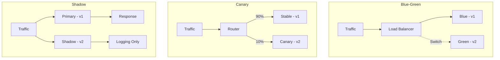

# How to Implement Model Deployment Strategies

Author: [nawazdhandala](https://www.github.com/nawazdhandala)

Tags: MLOps, Model Deployment, Machine Learning, Kubernetes, Blue-Green, Canary, Shadow Deployment

Description: Learn different strategies for deploying ML models to production, including blue-green deployments, canary releases, shadow mode, and progressive rollouts with automatic rollback.

---

Deploying ML models differs from traditional software deployments. Models can fail silently, producing valid outputs that are subtly wrong. Effective deployment strategies let you catch these issues before they affect all users. This guide covers practical approaches to deploying models safely.

## Deployment Strategy Overview



## Blue-Green Deployments

Maintain two identical environments, switching traffic between them.

```python
# deployment/blue_green.py
from dataclasses import dataclass
from typing import Optional, Dict, Any
from enum import Enum
import threading
import time

class DeploymentSlot(Enum):
    BLUE = "blue"
    GREEN = "green"

@dataclass
class ModelDeployment:
    slot: DeploymentSlot
    model_name: str
    model_version: str
    model: Any  # The actual model object
    deployed_at: float
    is_active: bool = False

class BlueGreenDeployer:
    """
    Manage blue-green model deployments.

    Maintains two deployment slots and allows instant switching
    between them with rollback capability.
    """

    def __init__(self):
        self.deployments: Dict[DeploymentSlot, Optional[ModelDeployment]] = {
            DeploymentSlot.BLUE: None,
            DeploymentSlot.GREEN: None
        }
        self.active_slot: DeploymentSlot = DeploymentSlot.BLUE
        self._lock = threading.Lock()

    def deploy(
        self,
        model,
        model_name: str,
        model_version: str
    ) -> DeploymentSlot:
        """
        Deploy a model to the inactive slot.

        Returns the slot where the model was deployed.
        """
        with self._lock:
            # Deploy to inactive slot
            target_slot = self._get_inactive_slot()

            deployment = ModelDeployment(
                slot=target_slot,
                model_name=model_name,
                model_version=model_version,
                model=model,
                deployed_at=time.time(),
                is_active=False
            )

            self.deployments[target_slot] = deployment

            return target_slot

    def switch(self) -> DeploymentSlot:
        """
        Switch traffic to the inactive slot.

        Returns the newly active slot.
        """
        with self._lock:
            # Mark current as inactive
            if self.deployments[self.active_slot]:
                self.deployments[self.active_slot].is_active = False

            # Switch to other slot
            new_active = self._get_inactive_slot()

            if not self.deployments[new_active]:
                raise ValueError("No deployment in target slot")

            self.deployments[new_active].is_active = True
            self.active_slot = new_active

            return new_active

    def rollback(self) -> DeploymentSlot:
        """
        Rollback to the previous deployment.

        Simply switches back to the other slot.
        """
        return self.switch()

    def get_active_model(self):
        """Get the currently active model."""
        deployment = self.deployments[self.active_slot]
        if deployment:
            return deployment.model
        raise ValueError("No active deployment")

    def _get_inactive_slot(self) -> DeploymentSlot:
        """Get the slot that is not currently active."""
        if self.active_slot == DeploymentSlot.BLUE:
            return DeploymentSlot.GREEN
        return DeploymentSlot.BLUE

    def get_status(self) -> Dict:
        """Get current deployment status."""
        return {
            "active_slot": self.active_slot.value,
            "blue": self._deployment_info(DeploymentSlot.BLUE),
            "green": self._deployment_info(DeploymentSlot.GREEN)
        }

    def _deployment_info(self, slot: DeploymentSlot) -> Optional[Dict]:
        deployment = self.deployments[slot]
        if not deployment:
            return None
        return {
            "model_name": deployment.model_name,
            "model_version": deployment.model_version,
            "deployed_at": deployment.deployed_at,
            "is_active": deployment.is_active
        }

# Usage
deployer = BlueGreenDeployer()

# Initial deployment
deployer.deploy(model_v1, "fraud_detector", "1.0.0")
deployer.switch()  # Activate blue

# Deploy new version to green (inactive)
deployer.deploy(model_v2, "fraud_detector", "2.0.0")

# After testing, switch traffic
deployer.switch()  # Now green is active

# If issues arise, rollback
deployer.rollback()  # Back to blue (v1)
```

### Kubernetes Implementation

```yaml
# kubernetes/blue-green-deployment.yaml
apiVersion: v1
kind: Service
metadata:
  name: model-service
spec:
  selector:
    app: model-server
    # This label determines which deployment receives traffic
    deployment: blue
  ports:
    - port: 80
      targetPort: 8080
---
apiVersion: apps/v1
kind: Deployment
metadata:
  name: model-blue
  labels:
    deployment: blue
spec:
  replicas: 3
  selector:
    matchLabels:
      app: model-server
      deployment: blue
  template:
    metadata:
      labels:
        app: model-server
        deployment: blue
    spec:
      containers:
        - name: model-server
          image: model-server:v1.0.0
          ports:
            - containerPort: 8080
          env:
            - name: MODEL_VERSION
              value: "1.0.0"
---
apiVersion: apps/v1
kind: Deployment
metadata:
  name: model-green
  labels:
    deployment: green
spec:
  replicas: 3
  selector:
    matchLabels:
      app: model-server
      deployment: green
  template:
    metadata:
      labels:
        app: model-server
        deployment: green
    spec:
      containers:
        - name: model-server
          image: model-server:v2.0.0
          ports:
            - containerPort: 8080
          env:
            - name: MODEL_VERSION
              value: "2.0.0"
```

```bash
# Switch traffic from blue to green
kubectl patch service model-service -p '{"spec":{"selector":{"deployment":"green"}}}'

# Rollback to blue
kubectl patch service model-service -p '{"spec":{"selector":{"deployment":"blue"}}}'
```

## Canary Deployments

Gradually roll out to a small percentage of traffic.

```python
# deployment/canary.py
from dataclasses import dataclass
from typing import Optional, List, Callable
import random
import time
import threading

@dataclass
class CanaryConfig:
    initial_percentage: float = 5.0
    increment_percentage: float = 10.0
    evaluation_period_seconds: int = 300
    max_percentage: float = 100.0
    rollback_threshold: float = 0.95  # Rollback if metric drops below this

class CanaryDeployer:
    """
    Progressive canary deployment with automatic promotion/rollback.

    Starts with a small percentage of traffic and gradually increases
    based on health metrics.
    """

    def __init__(
        self,
        stable_model,
        stable_version: str,
        metric_evaluator: Callable[[], float]
    ):
        self.stable_model = stable_model
        self.stable_version = stable_version
        self.canary_model = None
        self.canary_version: Optional[str] = None
        self.canary_percentage: float = 0.0
        self.metric_evaluator = metric_evaluator
        self._lock = threading.Lock()
        self._promotion_thread: Optional[threading.Thread] = None

    def deploy_canary(
        self,
        model,
        version: str,
        config: CanaryConfig
    ):
        """
        Start a canary deployment.

        Begins routing a small percentage of traffic to the new model.
        """
        with self._lock:
            self.canary_model = model
            self.canary_version = version
            self.canary_percentage = config.initial_percentage

        # Start automatic promotion thread
        self._promotion_thread = threading.Thread(
            target=self._auto_promote,
            args=(config,),
            daemon=True
        )
        self._promotion_thread.start()

    def get_model(self, user_id: str = None):
        """
        Get model for a request, respecting canary percentage.

        Uses random routing; for consistent assignment use hash-based routing.
        """
        with self._lock:
            if self.canary_model and random.random() * 100 < self.canary_percentage:
                return self.canary_model, self.canary_version, "canary"
            return self.stable_model, self.stable_version, "stable"

    def _auto_promote(self, config: CanaryConfig):
        """Automatically promote or rollback canary based on metrics."""
        while self.canary_percentage < config.max_percentage:
            time.sleep(config.evaluation_period_seconds)

            # Evaluate canary health
            metric_value = self.metric_evaluator()

            if metric_value < config.rollback_threshold:
                print(f"Canary metric {metric_value} below threshold, rolling back")
                self._rollback()
                return

            # Increase canary traffic
            with self._lock:
                self.canary_percentage = min(
                    self.canary_percentage + config.increment_percentage,
                    config.max_percentage
                )
                print(f"Canary promoted to {self.canary_percentage}%")

        # Full promotion
        self._promote()

    def _promote(self):
        """Promote canary to stable."""
        with self._lock:
            self.stable_model = self.canary_model
            self.stable_version = self.canary_version
            self.canary_model = None
            self.canary_version = None
            self.canary_percentage = 0.0
            print(f"Canary {self.stable_version} promoted to stable")

    def _rollback(self):
        """Rollback canary deployment."""
        with self._lock:
            self.canary_model = None
            self.canary_version = None
            self.canary_percentage = 0.0
            print("Canary rolled back")

    def get_status(self) -> dict:
        """Get current deployment status."""
        with self._lock:
            return {
                "stable_version": self.stable_version,
                "canary_version": self.canary_version,
                "canary_percentage": self.canary_percentage
            }

# Metric evaluator that checks model accuracy
def evaluate_canary_accuracy() -> float:
    # Query your metrics store for recent canary accuracy
    # This is a placeholder implementation
    return 0.98

# Usage
deployer = CanaryDeployer(
    stable_model=model_v1,
    stable_version="1.0.0",
    metric_evaluator=evaluate_canary_accuracy
)

# Start canary deployment
deployer.deploy_canary(
    model=model_v2,
    version="2.0.0",
    config=CanaryConfig(
        initial_percentage=5.0,
        increment_percentage=15.0,
        evaluation_period_seconds=600,
        max_percentage=100.0,
        rollback_threshold=0.90
    )
)
```

### Istio Canary Configuration

```yaml
# kubernetes/istio-canary.yaml
apiVersion: networking.istio.io/v1beta1
kind: VirtualService
metadata:
  name: model-service
spec:
  hosts:
    - model-service
  http:
    - match:
        - headers:
            canary:
              exact: "true"
      route:
        - destination:
            host: model-service
            subset: canary
    - route:
        - destination:
            host: model-service
            subset: stable
          weight: 90
        - destination:
            host: model-service
            subset: canary
          weight: 10
---
apiVersion: networking.istio.io/v1beta1
kind: DestinationRule
metadata:
  name: model-service
spec:
  host: model-service
  subsets:
    - name: stable
      labels:
        version: v1
    - name: canary
      labels:
        version: v2
```

## Shadow Deployments

Run the new model in parallel without affecting users.

```python
# deployment/shadow.py
from dataclasses import dataclass
from typing import Any, Optional
import asyncio
import logging
from concurrent.futures import ThreadPoolExecutor

logger = logging.getLogger(__name__)

@dataclass
class ShadowResult:
    primary_prediction: Any
    shadow_prediction: Optional[Any]
    primary_latency_ms: float
    shadow_latency_ms: Optional[float]
    predictions_match: bool

class ShadowDeployer:
    """
    Run shadow model alongside primary without affecting responses.

    All requests go to both models, but only primary response is returned.
    Shadow results are logged for analysis.
    """

    def __init__(
        self,
        primary_model,
        primary_version: str,
        comparison_logger: 'ComparisonLogger'
    ):
        self.primary_model = primary_model
        self.primary_version = primary_version
        self.shadow_model = None
        self.shadow_version: Optional[str] = None
        self.comparison_logger = comparison_logger
        self.executor = ThreadPoolExecutor(max_workers=4)

    def set_shadow(self, model, version: str):
        """Set the shadow model."""
        self.shadow_model = model
        self.shadow_version = version

    def remove_shadow(self):
        """Remove the shadow model."""
        self.shadow_model = None
        self.shadow_version = None

    async def predict(self, features) -> ShadowResult:
        """
        Make prediction with both models.

        Primary prediction is returned immediately.
        Shadow prediction runs concurrently and is logged.
        """
        loop = asyncio.get_event_loop()

        # Run primary prediction
        primary_start = asyncio.get_event_loop().time()
        primary_prediction = await loop.run_in_executor(
            self.executor,
            self.primary_model.predict,
            features
        )
        primary_latency = (asyncio.get_event_loop().time() - primary_start) * 1000

        # Run shadow if configured
        shadow_prediction = None
        shadow_latency = None
        predictions_match = True

        if self.shadow_model:
            try:
                shadow_start = asyncio.get_event_loop().time()
                shadow_prediction = await loop.run_in_executor(
                    self.executor,
                    self.shadow_model.predict,
                    features
                )
                shadow_latency = (asyncio.get_event_loop().time() - shadow_start) * 1000

                # Compare predictions
                predictions_match = self._compare_predictions(
                    primary_prediction,
                    shadow_prediction
                )

                # Log comparison
                self.comparison_logger.log(
                    primary_version=self.primary_version,
                    shadow_version=self.shadow_version,
                    primary_prediction=primary_prediction,
                    shadow_prediction=shadow_prediction,
                    primary_latency_ms=primary_latency,
                    shadow_latency_ms=shadow_latency,
                    match=predictions_match
                )

            except Exception as e:
                logger.error(f"Shadow prediction failed: {e}")

        return ShadowResult(
            primary_prediction=primary_prediction,
            shadow_prediction=shadow_prediction,
            primary_latency_ms=primary_latency,
            shadow_latency_ms=shadow_latency,
            predictions_match=predictions_match
        )

    def _compare_predictions(
        self,
        primary,
        shadow,
        tolerance: float = 0.01
    ) -> bool:
        """Compare predictions within tolerance."""
        if isinstance(primary, (int, float)):
            return abs(primary - shadow) <= tolerance
        return primary == shadow

class ComparisonLogger:
    """Log shadow comparison results for analysis."""

    def __init__(self, db_path: str = "shadow_comparisons.db"):
        import sqlite3
        self.conn = sqlite3.connect(db_path, check_same_thread=False)
        self._init_db()

    def _init_db(self):
        self.conn.execute("""
            CREATE TABLE IF NOT EXISTS comparisons (
                id INTEGER PRIMARY KEY AUTOINCREMENT,
                timestamp TEXT,
                primary_version TEXT,
                shadow_version TEXT,
                primary_prediction REAL,
                shadow_prediction REAL,
                primary_latency_ms REAL,
                shadow_latency_ms REAL,
                match INTEGER
            )
        """)
        self.conn.commit()

    def log(self, **kwargs):
        from datetime import datetime
        self.conn.execute(
            """
            INSERT INTO comparisons
            (timestamp, primary_version, shadow_version, primary_prediction,
             shadow_prediction, primary_latency_ms, shadow_latency_ms, match)
            VALUES (?, ?, ?, ?, ?, ?, ?, ?)
            """,
            (
                datetime.now().isoformat(),
                kwargs['primary_version'],
                kwargs['shadow_version'],
                float(kwargs['primary_prediction']),
                float(kwargs['shadow_prediction']),
                kwargs['primary_latency_ms'],
                kwargs['shadow_latency_ms'],
                1 if kwargs['match'] else 0
            )
        )
        self.conn.commit()

    def get_match_rate(self, shadow_version: str) -> float:
        """Get the match rate for a shadow version."""
        cursor = self.conn.execute(
            """
            SELECT AVG(match) FROM comparisons
            WHERE shadow_version = ?
            """,
            (shadow_version,)
        )
        result = cursor.fetchone()[0]
        return result if result else 0.0

# Usage
comparison_logger = ComparisonLogger()
deployer = ShadowDeployer(
    primary_model=model_v1,
    primary_version="1.0.0",
    comparison_logger=comparison_logger
)

# Add shadow model
deployer.set_shadow(model_v2, "2.0.0")

# Make predictions - only primary affects users
result = await deployer.predict(features)

# Analyze after shadow period
match_rate = comparison_logger.get_match_rate("2.0.0")
print(f"Shadow model match rate: {match_rate:.2%}")
```

## Progressive Rollout Controller

Automated rollout based on metrics.

```python
# deployment/progressive_rollout.py
from dataclasses import dataclass
from typing import List, Callable
from enum import Enum
import time

class RolloutPhase(Enum):
    PENDING = "pending"
    SHADOW = "shadow"
    CANARY = "canary"
    FULL = "full"
    ROLLED_BACK = "rolled_back"

@dataclass
class RolloutStage:
    phase: RolloutPhase
    traffic_percentage: float
    duration_seconds: int
    success_criteria: Callable[[], bool]

class ProgressiveRolloutController:
    """
    Orchestrate a complete progressive rollout.

    Moves through shadow -> canary -> full deployment
    with automatic rollback on failures.
    """

    def __init__(
        self,
        stages: List[RolloutStage],
        on_phase_change: Callable[[RolloutPhase, float], None],
        on_rollback: Callable[[], None]
    ):
        self.stages = stages
        self.on_phase_change = on_phase_change
        self.on_rollback = on_rollback
        self.current_stage_index = -1
        self.current_phase = RolloutPhase.PENDING

    def start(self):
        """Start the progressive rollout."""
        for i, stage in enumerate(self.stages):
            self.current_stage_index = i
            self.current_phase = stage.phase

            # Apply the stage configuration
            self.on_phase_change(stage.phase, stage.traffic_percentage)

            print(f"Rollout stage: {stage.phase.value} at {stage.traffic_percentage}%")

            # Wait for evaluation period
            time.sleep(stage.duration_seconds)

            # Check success criteria
            if not stage.success_criteria():
                print(f"Stage {stage.phase.value} failed criteria, rolling back")
                self._rollback()
                return False

            print(f"Stage {stage.phase.value} passed, proceeding")

        print("Rollout completed successfully")
        self.current_phase = RolloutPhase.FULL
        return True

    def _rollback(self):
        """Execute rollback."""
        self.current_phase = RolloutPhase.ROLLED_BACK
        self.on_rollback()

# Define rollout stages
def create_standard_rollout(
    accuracy_checker: Callable[[], float],
    latency_checker: Callable[[], float]
) -> List[RolloutStage]:
    """Create a standard rollout configuration."""

    return [
        RolloutStage(
            phase=RolloutPhase.SHADOW,
            traffic_percentage=0,  # Shadow doesn't take real traffic
            duration_seconds=3600,  # 1 hour shadow
            success_criteria=lambda: accuracy_checker() > 0.95
        ),
        RolloutStage(
            phase=RolloutPhase.CANARY,
            traffic_percentage=5,
            duration_seconds=1800,  # 30 minutes at 5%
            success_criteria=lambda: (
                accuracy_checker() > 0.93 and
                latency_checker() < 200
            )
        ),
        RolloutStage(
            phase=RolloutPhase.CANARY,
            traffic_percentage=25,
            duration_seconds=1800,  # 30 minutes at 25%
            success_criteria=lambda: (
                accuracy_checker() > 0.93 and
                latency_checker() < 200
            )
        ),
        RolloutStage(
            phase=RolloutPhase.CANARY,
            traffic_percentage=50,
            duration_seconds=3600,  # 1 hour at 50%
            success_criteria=lambda: (
                accuracy_checker() > 0.92 and
                latency_checker() < 250
            )
        ),
        RolloutStage(
            phase=RolloutPhase.FULL,
            traffic_percentage=100,
            duration_seconds=0,  # Immediate
            success_criteria=lambda: True
        )
    ]
```

## Summary

| Strategy | Use Case | Risk Level | Rollback Speed |
|----------|----------|------------|----------------|
| **Blue-Green** | Simple, instant switching | Low | Instant |
| **Canary** | Gradual validation | Medium | Fast |
| **Shadow** | Pre-production validation | Very Low | N/A |
| **Progressive** | Automated multi-stage | Lowest | Automatic |

Choose your deployment strategy based on your risk tolerance and monitoring capabilities. Shadow deployments offer the safest path for validating new models, while canary deployments provide real-world feedback with limited exposure. Blue-green enables instant rollback when issues arise. For maximum safety, combine shadow validation with progressive canary rollouts.
