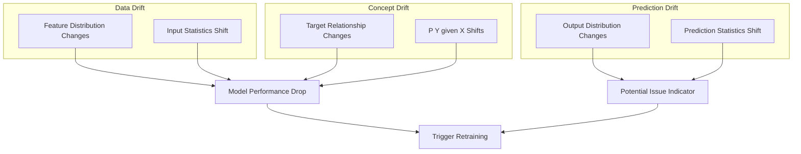

# How to Implement Model Drift Detection

Author: [nawazdhandala](https://www.github.com/nawazdhandala)

Tags: MLOps, Model Drift, Data Drift, Concept Drift, Machine Learning, Monitoring, Statistics

Description: Learn how to detect model drift in production ML systems, covering data drift, concept drift, and prediction drift with statistical tests and monitoring strategies.

---

Model drift occurs when the relationship between inputs and outputs changes over time, causing model performance to degrade. Detecting drift early prevents silent failures where models produce valid-looking but incorrect predictions. This guide covers implementing comprehensive drift detection.

## Types of Drift



## Statistical Drift Detection

### Population Stability Index (PSI)

```python
# drift/psi_detector.py
import numpy as np
from typing import Dict, List, Optional, Tuple
from dataclasses import dataclass
from scipy import stats

@dataclass
class DriftMetrics:
    feature_name: str
    psi: float
    drift_status: str  # "none", "moderate", "significant"
    reference_mean: float
    current_mean: float
    reference_std: float
    current_std: float

class PSIDriftDetector:
    """
    Detect data drift using Population Stability Index.

    PSI measures how much a distribution has shifted from a baseline.
    PSI < 0.1: No significant shift
    PSI 0.1-0.2: Moderate shift
    PSI > 0.2: Significant shift
    """

    def __init__(
        self,
        n_bins: int = 10,
        psi_threshold_moderate: float = 0.1,
        psi_threshold_significant: float = 0.2
    ):
        self.n_bins = n_bins
        self.threshold_moderate = psi_threshold_moderate
        self.threshold_significant = psi_threshold_significant
        self.reference_distributions: Dict[str, Dict] = {}

    def fit_reference(
        self,
        feature_name: str,
        reference_data: np.ndarray
    ):
        """
        Fit reference distribution for a feature.

        Stores bin edges and expected proportions from training data.
        """
        # Calculate bin edges from reference data
        percentiles = np.linspace(0, 100, self.n_bins + 1)
        bin_edges = np.percentile(reference_data, percentiles)

        # Handle duplicate edges
        bin_edges = np.unique(bin_edges)
        if len(bin_edges) < 3:
            # Fall back to equal-width bins
            bin_edges = np.linspace(
                reference_data.min(),
                reference_data.max(),
                self.n_bins + 1
            )

        # Calculate expected proportions
        expected_counts, _ = np.histogram(reference_data, bins=bin_edges)
        expected_proportions = expected_counts / len(reference_data)

        # Store reference distribution
        self.reference_distributions[feature_name] = {
            'bin_edges': bin_edges,
            'expected_proportions': expected_proportions,
            'mean': float(np.mean(reference_data)),
            'std': float(np.std(reference_data))
        }

    def calculate_psi(
        self,
        feature_name: str,
        current_data: np.ndarray
    ) -> DriftMetrics:
        """
        Calculate PSI for a feature against reference.
        """
        if feature_name not in self.reference_distributions:
            raise ValueError(f"No reference for feature: {feature_name}")

        ref = self.reference_distributions[feature_name]

        # Calculate actual proportions
        actual_counts, _ = np.histogram(current_data, bins=ref['bin_edges'])
        actual_proportions = actual_counts / len(current_data)

        # Clip to avoid division by zero
        expected = np.clip(ref['expected_proportions'], 0.0001, 1)
        actual = np.clip(actual_proportions, 0.0001, 1)

        # PSI formula: sum((actual - expected) * ln(actual / expected))
        psi = np.sum((actual - expected) * np.log(actual / expected))

        # Determine drift status
        if psi > self.threshold_significant:
            status = "significant"
        elif psi > self.threshold_moderate:
            status = "moderate"
        else:
            status = "none"

        return DriftMetrics(
            feature_name=feature_name,
            psi=float(psi),
            drift_status=status,
            reference_mean=ref['mean'],
            current_mean=float(np.mean(current_data)),
            reference_std=ref['std'],
            current_std=float(np.std(current_data))
        )

    def check_all_features(
        self,
        current_data: Dict[str, np.ndarray]
    ) -> Dict[str, DriftMetrics]:
        """Check drift for all features."""
        results = {}
        for feature_name, data in current_data.items():
            if feature_name in self.reference_distributions:
                results[feature_name] = self.calculate_psi(feature_name, data)
        return results
```

### Kolmogorov-Smirnov Test

```python
# drift/ks_detector.py
from scipy import stats
import numpy as np
from typing import Dict, Tuple
from collections import deque
from datetime import datetime

@dataclass
class KSResult:
    feature_name: str
    ks_statistic: float
    p_value: float
    drift_detected: bool

class KSDriftDetector:
    """
    Detect drift using Kolmogorov-Smirnov test.

    KS test compares two distributions and returns the maximum
    difference between their CDFs.
    """

    def __init__(
        self,
        significance_level: float = 0.05,
        window_size: int = 1000
    ):
        self.significance_level = significance_level
        self.window_size = window_size
        self.reference_data: Dict[str, np.ndarray] = {}
        self.current_windows: Dict[str, deque] = {}

    def set_reference(self, feature_name: str, data: np.ndarray):
        """Set reference data for a feature."""
        self.reference_data[feature_name] = data
        self.current_windows[feature_name] = deque(maxlen=self.window_size)

    def add_observation(self, feature_name: str, value: float):
        """Add a single observation to the current window."""
        if feature_name in self.current_windows:
            self.current_windows[feature_name].append(value)

    def test_drift(self, feature_name: str) -> KSResult:
        """
        Run KS test comparing current window to reference.
        """
        if feature_name not in self.reference_data:
            raise ValueError(f"No reference for: {feature_name}")

        reference = self.reference_data[feature_name]
        current = np.array(self.current_windows[feature_name])

        if len(current) < 30:  # Minimum sample size
            return KSResult(
                feature_name=feature_name,
                ks_statistic=0.0,
                p_value=1.0,
                drift_detected=False
            )

        # Two-sample KS test
        ks_stat, p_value = stats.ks_2samp(reference, current)

        return KSResult(
            feature_name=feature_name,
            ks_statistic=float(ks_stat),
            p_value=float(p_value),
            drift_detected=p_value < self.significance_level
        )

    def test_all(self) -> Dict[str, KSResult]:
        """Test all features for drift."""
        return {
            name: self.test_drift(name)
            for name in self.reference_data.keys()
        }
```

## Concept Drift Detection

### ADWIN Algorithm

```python
# drift/adwin_detector.py
from collections import deque
import numpy as np
from dataclasses import dataclass
from typing import Optional, Tuple

@dataclass
class ADWINResult:
    drift_detected: bool
    change_point: Optional[int]
    old_mean: float
    new_mean: float
    window_size: int

class ADWINDetector:
    """
    Adaptive Windowing (ADWIN) for concept drift detection.

    Maintains a window of observations and automatically shrinks it
    when drift is detected, keeping only relevant recent data.
    """

    def __init__(self, delta: float = 0.002):
        """
        Initialize ADWIN detector.

        Args:
            delta: Confidence parameter (lower = more sensitive)
        """
        self.delta = delta
        self.window = deque()
        self.total = 0.0
        self.variance = 0.0
        self.width = 0

    def add(self, value: float) -> ADWINResult:
        """
        Add a new value and check for drift.

        Returns drift detection result.
        """
        # Add to window
        self.window.append(value)
        self.total += value
        self.width += 1

        # Update variance (Welford's algorithm)
        if self.width > 1:
            delta = value - (self.total - value) / (self.width - 1)
            self.variance += delta * (value - self.total / self.width)

        # Check for drift
        return self._check_drift()

    def _check_drift(self) -> ADWINResult:
        """Check if drift occurred by comparing subwindows."""
        if self.width < 10:  # Minimum window size
            return ADWINResult(
                drift_detected=False,
                change_point=None,
                old_mean=self.total / max(1, self.width),
                new_mean=self.total / max(1, self.width),
                window_size=self.width
            )

        # Try different split points
        for split in range(1, self.width):
            w0 = split
            w1 = self.width - split

            if w0 < 5 or w1 < 5:  # Minimum subwindow size
                continue

            # Calculate means
            data = list(self.window)
            mean0 = np.mean(data[:split])
            mean1 = np.mean(data[split:])

            # Calculate cut threshold (Hoeffding bound)
            m = 1 / (1/w0 + 1/w1)
            epsilon = np.sqrt(
                (1 / (2 * m)) * np.log(4 / self.delta)
            )

            # Check if difference exceeds threshold
            if abs(mean0 - mean1) > epsilon:
                # Drift detected - shrink window
                self._shrink_window(split)

                return ADWINResult(
                    drift_detected=True,
                    change_point=split,
                    old_mean=float(mean0),
                    new_mean=float(mean1),
                    window_size=self.width
                )

        return ADWINResult(
            drift_detected=False,
            change_point=None,
            old_mean=self.total / self.width,
            new_mean=self.total / self.width,
            window_size=self.width
        )

    def _shrink_window(self, split: int):
        """Remove old data from window after drift detection."""
        for _ in range(split):
            old_val = self.window.popleft()
            self.total -= old_val
            self.width -= 1

        # Recalculate variance
        if self.width > 1:
            data = list(self.window)
            self.variance = np.var(data) * (self.width - 1)
        else:
            self.variance = 0.0
```

### Page-Hinkley Test

```python
# drift/page_hinkley.py
from dataclasses import dataclass
from typing import Optional

@dataclass
class PageHinkleyResult:
    drift_detected: bool
    statistic: float
    threshold: float
    mean: float
    observations: int

class PageHinkleyDetector:
    """
    Page-Hinkley test for detecting changes in mean.

    Detects gradual drift by monitoring cumulative sum of
    differences from running mean.
    """

    def __init__(
        self,
        delta: float = 0.005,
        threshold: float = 50.0,
        alpha: float = 0.9999
    ):
        """
        Initialize Page-Hinkley detector.

        Args:
            delta: Minimum change to detect
            threshold: Detection threshold
            alpha: Forgetting factor for running mean
        """
        self.delta = delta
        self.threshold = threshold
        self.alpha = alpha

        self.running_mean = 0.0
        self.cumulative_sum = 0.0
        self.min_cumulative = 0.0
        self.observations = 0

    def add(self, value: float) -> PageHinkleyResult:
        """
        Add observation and check for drift.
        """
        self.observations += 1

        # Update running mean with forgetting factor
        if self.observations == 1:
            self.running_mean = value
        else:
            self.running_mean = self.alpha * self.running_mean + (1 - self.alpha) * value

        # Update cumulative sum
        self.cumulative_sum += value - self.running_mean - self.delta

        # Track minimum
        if self.cumulative_sum < self.min_cumulative:
            self.min_cumulative = self.cumulative_sum

        # Page-Hinkley statistic
        ph_statistic = self.cumulative_sum - self.min_cumulative

        # Check for drift
        drift_detected = ph_statistic > self.threshold

        if drift_detected:
            self._reset()

        return PageHinkleyResult(
            drift_detected=drift_detected,
            statistic=float(ph_statistic),
            threshold=self.threshold,
            mean=float(self.running_mean),
            observations=self.observations
        )

    def _reset(self):
        """Reset detector after drift detection."""
        self.cumulative_sum = 0.0
        self.min_cumulative = 0.0
```

## Prediction Drift Monitoring

```python
# drift/prediction_drift.py
from collections import deque
from datetime import datetime, timedelta
import numpy as np
from typing import Dict, List

class PredictionDriftMonitor:
    """
    Monitor prediction distribution for drift.

    Tracks prediction statistics over time and alerts when
    the distribution changes significantly.
    """

    def __init__(
        self,
        window_size: int = 10000,
        reference_window_days: int = 7
    ):
        self.window_size = window_size
        self.reference_window_days = reference_window_days

        self.reference_stats: Dict = {}
        self.current_predictions: deque = deque(maxlen=window_size)
        self.prediction_timestamps: deque = deque(maxlen=window_size)

    def set_reference(self, predictions: np.ndarray):
        """Set reference prediction distribution."""
        self.reference_stats = {
            'mean': float(np.mean(predictions)),
            'std': float(np.std(predictions)),
            'percentiles': {
                p: float(np.percentile(predictions, p))
                for p in [5, 25, 50, 75, 95]
            }
        }

    def add_prediction(self, prediction: float):
        """Add a prediction to the monitoring window."""
        self.current_predictions.append(prediction)
        self.prediction_timestamps.append(datetime.now())

    def check_drift(self) -> Dict:
        """
        Check for prediction drift.
        """
        if len(self.current_predictions) < 100:
            return {'status': 'insufficient_data'}

        current = np.array(self.current_predictions)

        # Calculate current statistics
        current_stats = {
            'mean': float(np.mean(current)),
            'std': float(np.std(current)),
            'percentiles': {
                p: float(np.percentile(current, p))
                for p in [5, 25, 50, 75, 95]
            }
        }

        # Compare to reference
        mean_shift = abs(current_stats['mean'] - self.reference_stats['mean'])
        std_ratio = current_stats['std'] / (self.reference_stats['std'] + 1e-10)

        # Calculate z-score of mean shift
        z_score = mean_shift / (self.reference_stats['std'] / np.sqrt(len(current)))

        drift_detected = z_score > 3.0 or std_ratio > 1.5 or std_ratio < 0.67

        return {
            'status': 'drift_detected' if drift_detected else 'stable',
            'mean_shift': float(mean_shift),
            'z_score': float(z_score),
            'std_ratio': float(std_ratio),
            'reference_stats': self.reference_stats,
            'current_stats': current_stats,
            'sample_size': len(current)
        }
```

## Drift Detection Pipeline

```python
# drift/drift_pipeline.py
from dataclasses import dataclass
from typing import Dict, List
from datetime import datetime
import json

@dataclass
class DriftReport:
    timestamp: datetime
    feature_drift: Dict[str, DriftMetrics]
    prediction_drift: Dict
    concept_drift_detected: bool
    overall_status: str
    recommendations: List[str]

class DriftDetectionPipeline:
    """
    Complete drift detection pipeline combining all methods.
    """

    def __init__(
        self,
        psi_detector: PSIDriftDetector,
        ks_detector: KSDriftDetector,
        adwin_detectors: Dict[str, ADWINDetector],
        prediction_monitor: PredictionDriftMonitor
    ):
        self.psi = psi_detector
        self.ks = ks_detector
        self.adwin = adwin_detectors
        self.prediction_monitor = prediction_monitor

    def run_detection(
        self,
        feature_data: Dict[str, np.ndarray],
        recent_predictions: np.ndarray,
        recent_errors: np.ndarray
    ) -> DriftReport:
        """
        Run complete drift detection.
        """
        # Feature drift (PSI)
        feature_drift = self.psi.check_all_features(feature_data)

        # Prediction drift
        for pred in recent_predictions:
            self.prediction_monitor.add_prediction(pred)
        prediction_drift = self.prediction_monitor.check_drift()

        # Concept drift (check error stream)
        concept_drift = False
        for error in recent_errors:
            for name, detector in self.adwin.items():
                result = detector.add(error)
                if result.drift_detected:
                    concept_drift = True

        # Determine overall status
        severe_feature_drift = any(
            d.drift_status == 'significant'
            for d in feature_drift.values()
        )

        if concept_drift or severe_feature_drift:
            status = 'critical'
        elif prediction_drift.get('status') == 'drift_detected':
            status = 'warning'
        elif any(d.drift_status == 'moderate' for d in feature_drift.values()):
            status = 'moderate'
        else:
            status = 'healthy'

        # Generate recommendations
        recommendations = self._generate_recommendations(
            feature_drift, prediction_drift, concept_drift, status
        )

        return DriftReport(
            timestamp=datetime.now(),
            feature_drift=feature_drift,
            prediction_drift=prediction_drift,
            concept_drift_detected=concept_drift,
            overall_status=status,
            recommendations=recommendations
        )

    def _generate_recommendations(
        self,
        feature_drift: Dict,
        prediction_drift: Dict,
        concept_drift: bool,
        status: str
    ) -> List[str]:
        """Generate actionable recommendations."""
        recommendations = []

        if concept_drift:
            recommendations.append(
                "Concept drift detected. Immediate model retraining recommended."
            )

        drifted_features = [
            name for name, d in feature_drift.items()
            if d.drift_status in ['moderate', 'significant']
        ]

        if drifted_features:
            recommendations.append(
                f"Features with drift: {', '.join(drifted_features)}. "
                "Investigate data pipeline for issues."
            )

        if prediction_drift.get('status') == 'drift_detected':
            recommendations.append(
                "Prediction distribution has shifted. "
                "Review recent model performance metrics."
            )

        if status == 'healthy':
            recommendations.append(
                "No significant drift detected. Continue monitoring."
            )

        return recommendations
```

## Summary

| Drift Type | Detection Method | When to Use |
|------------|------------------|-------------|
| **Data Drift** | PSI, KS Test | Feature distribution shifts |
| **Concept Drift** | ADWIN, Page-Hinkley | Target relationship changes |
| **Prediction Drift** | Statistical monitoring | Output distribution shifts |
| **Gradual Drift** | Window-based tests | Slow changes over time |
| **Sudden Drift** | Point detection | Abrupt changes |

Drift detection is essential for maintaining ML model quality in production. Combine multiple detection methods to catch different types of drift, and integrate with your continuous training pipeline to automatically respond when drift is detected.
