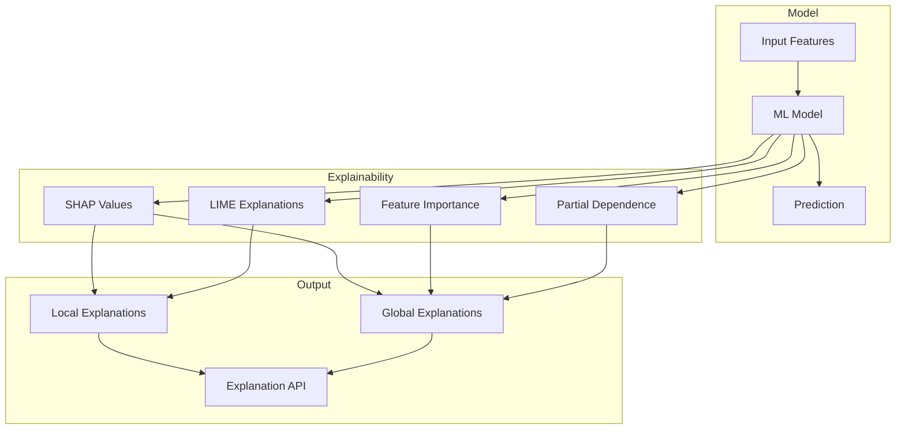

# How to Configure Model Explainability

Author: [nawazdhandala](https://www.github.com/nawazdhandala)

Tags: MLOps, Explainability, SHAP, LIME, Machine Learning, Interpretability, XAI

Description: Learn how to implement model explainability for ML systems using SHAP, LIME, and feature importance techniques. Build interpretable predictions that stakeholders can understand and trust.

---

Model explainability answers the question "why did the model make this prediction?" This is critical for debugging models, building trust with stakeholders, and meeting regulatory requirements in domains like finance and healthcare. This guide covers practical techniques for making ML models interpretable.

## Explainability Architecture



## SHAP Implementation

SHAP (SHapley Additive exPlanations) provides consistent feature attributions based on game theory.

```python
# explainability/shap_explainer.py
import shap
import numpy as np
import pandas as pd
from typing import Dict, List, Any, Optional
from dataclasses import dataclass
import matplotlib.pyplot as plt

@dataclass
class FeatureContribution:
    feature_name: str
    value: float
    contribution: float
    direction: str  # "positive" or "negative"

@dataclass
class Explanation:
    prediction: float
    base_value: float
    contributions: List[FeatureContribution]
    top_positive: List[FeatureContribution]
    top_negative: List[FeatureContribution]

class SHAPExplainer:
    """
    Generate SHAP-based explanations for model predictions.

    Supports tree-based, kernel, and deep learning models.
    """

    def __init__(
        self,
        model,
        background_data: np.ndarray,
        feature_names: List[str],
        model_type: str = "tree"  # "tree", "kernel", or "deep"
    ):
        self.model = model
        self.feature_names = feature_names
        self.model_type = model_type

        # Initialize appropriate explainer
        if model_type == "tree":
            self.explainer = shap.TreeExplainer(model)
        elif model_type == "kernel":
            # Use K-means to summarize background data
            background_summary = shap.kmeans(background_data, 50)
            self.explainer = shap.KernelExplainer(
                model.predict_proba if hasattr(model, 'predict_proba') else model.predict,
                background_summary
            )
        elif model_type == "deep":
            self.explainer = shap.DeepExplainer(model, background_data)
        else:
            raise ValueError(f"Unknown model type: {model_type}")

    def explain_prediction(
        self,
        instance: np.ndarray,
        top_k: int = 5
    ) -> Explanation:
        """
        Generate explanation for a single prediction.

        Args:
            instance: Feature values for one instance
            top_k: Number of top features to include

        Returns:
            Explanation with feature contributions
        """
        # Get SHAP values
        shap_values = self.explainer.shap_values(instance.reshape(1, -1))

        # Handle multi-class case (use positive class)
        if isinstance(shap_values, list):
            shap_values = shap_values[1]  # Positive class

        shap_values = shap_values.flatten()

        # Get prediction and base value
        prediction = self.model.predict_proba(instance.reshape(1, -1))[0][1] \
            if hasattr(self.model, 'predict_proba') \
            else self.model.predict(instance.reshape(1, -1))[0]

        base_value = self.explainer.expected_value
        if isinstance(base_value, list):
            base_value = base_value[1]

        # Build contributions list
        contributions = []
        for i, (name, value, shap_val) in enumerate(
            zip(self.feature_names, instance, shap_values)
        ):
            contributions.append(FeatureContribution(
                feature_name=name,
                value=float(value),
                contribution=float(shap_val),
                direction="positive" if shap_val > 0 else "negative"
            ))

        # Sort by absolute contribution
        sorted_contribs = sorted(
            contributions,
            key=lambda x: abs(x.contribution),
            reverse=True
        )

        # Get top positive and negative
        positive = [c for c in sorted_contribs if c.contribution > 0][:top_k]
        negative = [c for c in sorted_contribs if c.contribution < 0][:top_k]

        return Explanation(
            prediction=float(prediction),
            base_value=float(base_value),
            contributions=sorted_contribs,
            top_positive=positive,
            top_negative=negative
        )

    def explain_batch(
        self,
        instances: np.ndarray
    ) -> np.ndarray:
        """Get SHAP values for multiple instances."""
        return self.explainer.shap_values(instances)

    def global_importance(
        self,
        data: np.ndarray
    ) -> Dict[str, float]:
        """
        Calculate global feature importance from SHAP values.

        Returns mean absolute SHAP value for each feature.
        """
        shap_values = self.explainer.shap_values(data)

        if isinstance(shap_values, list):
            shap_values = shap_values[1]

        importance = np.abs(shap_values).mean(axis=0)

        return {
            name: float(imp)
            for name, imp in zip(self.feature_names, importance)
        }

    def create_summary_plot(
        self,
        data: np.ndarray,
        output_path: str
    ):
        """Generate SHAP summary plot."""
        shap_values = self.explainer.shap_values(data)

        if isinstance(shap_values, list):
            shap_values = shap_values[1]

        plt.figure(figsize=(10, 8))
        shap.summary_plot(
            shap_values,
            data,
            feature_names=self.feature_names,
            show=False
        )
        plt.tight_layout()
        plt.savefig(output_path)
        plt.close()
```

## LIME Implementation

LIME provides local interpretable explanations by approximating the model locally with a simple model.

```python
# explainability/lime_explainer.py
from lime import lime_tabular
import numpy as np
from typing import List, Dict, Any
from dataclasses import dataclass

@dataclass
class LIMEExplanation:
    prediction: float
    prediction_proba: Dict[str, float]
    feature_weights: List[tuple]  # (feature_description, weight)
    intercept: float
    local_prediction: float
    r_squared: float

class LIMEExplainer:
    """
    Generate LIME explanations for tabular data.

    Creates locally faithful linear approximations.
    """

    def __init__(
        self,
        model,
        training_data: np.ndarray,
        feature_names: List[str],
        class_names: List[str] = None,
        categorical_features: List[int] = None
    ):
        self.model = model
        self.feature_names = feature_names
        self.class_names = class_names or ['negative', 'positive']

        # Create LIME explainer
        self.explainer = lime_tabular.LimeTabularExplainer(
            training_data,
            feature_names=feature_names,
            class_names=self.class_names,
            categorical_features=categorical_features,
            mode='classification'
        )

    def explain(
        self,
        instance: np.ndarray,
        num_features: int = 10,
        num_samples: int = 5000
    ) -> LIMEExplanation:
        """
        Generate LIME explanation for a single instance.

        Args:
            instance: Feature values for one instance
            num_features: Number of features in explanation
            num_samples: Number of samples for local approximation

        Returns:
            LIMEExplanation with feature weights
        """
        # Get LIME explanation
        exp = self.explainer.explain_instance(
            instance,
            self.model.predict_proba,
            num_features=num_features,
            num_samples=num_samples
        )

        # Extract feature weights
        feature_weights = exp.as_list()

        # Get prediction
        proba = self.model.predict_proba(instance.reshape(1, -1))[0]
        prediction = int(proba[1] > 0.5)

        return LIMEExplanation(
            prediction=prediction,
            prediction_proba={
                self.class_names[i]: float(p)
                for i, p in enumerate(proba)
            },
            feature_weights=feature_weights,
            intercept=exp.intercept[1],
            local_prediction=exp.local_pred[0],
            r_squared=exp.score
        )

    def explain_in_natural_language(
        self,
        instance: np.ndarray,
        num_features: int = 5
    ) -> str:
        """
        Generate human-readable explanation.
        """
        exp = self.explain(instance, num_features=num_features)

        # Build explanation text
        lines = []
        lines.append(f"Prediction: {self.class_names[exp.prediction]}")
        lines.append(f"Confidence: {exp.prediction_proba[self.class_names[exp.prediction]]:.1%}")
        lines.append("")
        lines.append("Key factors:")

        for feature_desc, weight in exp.feature_weights[:num_features]:
            direction = "increases" if weight > 0 else "decreases"
            lines.append(f"  - {feature_desc} {direction} the prediction")

        return "\n".join(lines)
```

## Feature Importance Analysis

```python
# explainability/feature_importance.py
import numpy as np
import pandas as pd
from typing import Dict, List, Tuple
from sklearn.inspection import permutation_importance
from sklearn.model_selection import cross_val_score

class FeatureImportanceAnalyzer:
    """
    Analyze feature importance using multiple methods.

    Provides both model-intrinsic and model-agnostic importance measures.
    """

    def __init__(self, model, feature_names: List[str]):
        self.model = model
        self.feature_names = feature_names

    def get_intrinsic_importance(self) -> Dict[str, float]:
        """
        Get model's built-in feature importance.

        Works for tree-based models (RF, XGBoost, LightGBM).
        """
        if hasattr(self.model, 'feature_importances_'):
            importance = self.model.feature_importances_
        elif hasattr(self.model, 'coef_'):
            importance = np.abs(self.model.coef_).flatten()
        else:
            raise ValueError("Model doesn't have intrinsic feature importance")

        return {
            name: float(imp)
            for name, imp in zip(self.feature_names, importance)
        }

    def get_permutation_importance(
        self,
        X: np.ndarray,
        y: np.ndarray,
        n_repeats: int = 10
    ) -> Dict[str, Dict[str, float]]:
        """
        Calculate permutation importance.

        Measures how much performance drops when a feature is shuffled.
        """
        result = permutation_importance(
            self.model, X, y,
            n_repeats=n_repeats,
            random_state=42,
            n_jobs=-1
        )

        return {
            name: {
                'importance_mean': float(result.importances_mean[i]),
                'importance_std': float(result.importances_std[i])
            }
            for i, name in enumerate(self.feature_names)
        }

    def get_drop_column_importance(
        self,
        X: np.ndarray,
        y: np.ndarray,
        cv: int = 5
    ) -> Dict[str, float]:
        """
        Calculate drop-column importance.

        Measures performance with each feature removed entirely.
        """
        # Baseline performance
        baseline_score = cross_val_score(
            self.model, X, y, cv=cv, scoring='accuracy'
        ).mean()

        importance = {}
        for i, name in enumerate(self.feature_names):
            # Create dataset without this feature
            X_dropped = np.delete(X, i, axis=1)

            # Need to retrain model (can be slow)
            from sklearn.base import clone
            model_copy = clone(self.model)

            score = cross_val_score(
                model_copy, X_dropped, y, cv=cv, scoring='accuracy'
            ).mean()

            # Importance is drop in performance
            importance[name] = float(baseline_score - score)

        return importance

    def combined_importance(
        self,
        X: np.ndarray,
        y: np.ndarray
    ) -> pd.DataFrame:
        """
        Combine multiple importance measures into a single report.
        """
        intrinsic = self.get_intrinsic_importance()
        permutation = self.get_permutation_importance(X, y)

        rows = []
        for name in self.feature_names:
            rows.append({
                'feature': name,
                'intrinsic_importance': intrinsic.get(name, 0),
                'permutation_importance': permutation[name]['importance_mean'],
                'permutation_std': permutation[name]['importance_std']
            })

        df = pd.DataFrame(rows)
        df['rank_intrinsic'] = df['intrinsic_importance'].rank(ascending=False)
        df['rank_permutation'] = df['permutation_importance'].rank(ascending=False)
        df['avg_rank'] = (df['rank_intrinsic'] + df['rank_permutation']) / 2

        return df.sort_values('avg_rank')
```

## Partial Dependence Analysis

```python
# explainability/partial_dependence.py
import numpy as np
from typing import List, Tuple, Optional
from sklearn.inspection import partial_dependence
import matplotlib.pyplot as plt

class PartialDependenceAnalyzer:
    """
    Analyze partial dependence of predictions on features.

    Shows how the average prediction changes as a feature varies.
    """

    def __init__(self, model, feature_names: List[str]):
        self.model = model
        self.feature_names = feature_names

    def compute_pdp(
        self,
        X: np.ndarray,
        feature: str,
        grid_resolution: int = 50
    ) -> Tuple[np.ndarray, np.ndarray]:
        """
        Compute partial dependence for a single feature.

        Returns:
            Tuple of (feature_values, average_predictions)
        """
        feature_idx = self.feature_names.index(feature)

        result = partial_dependence(
            self.model, X,
            features=[feature_idx],
            grid_resolution=grid_resolution,
            kind='average'
        )

        return result['values'][0], result['average'][0]

    def compute_2d_pdp(
        self,
        X: np.ndarray,
        feature1: str,
        feature2: str,
        grid_resolution: int = 25
    ) -> Tuple[np.ndarray, np.ndarray, np.ndarray]:
        """
        Compute 2D partial dependence for feature interaction.

        Returns:
            Tuple of (feature1_values, feature2_values, predictions_grid)
        """
        idx1 = self.feature_names.index(feature1)
        idx2 = self.feature_names.index(feature2)

        result = partial_dependence(
            self.model, X,
            features=[(idx1, idx2)],
            grid_resolution=grid_resolution,
            kind='average'
        )

        return (
            result['values'][0],
            result['values'][1],
            result['average'][0]
        )

    def plot_pdp(
        self,
        X: np.ndarray,
        feature: str,
        output_path: str,
        show_ice: bool = True
    ):
        """
        Plot partial dependence with optional ICE curves.

        ICE (Individual Conditional Expectation) shows how each
        instance's prediction changes.
        """
        from sklearn.inspection import PartialDependenceDisplay

        feature_idx = self.feature_names.index(feature)

        fig, ax = plt.subplots(figsize=(8, 6))

        display = PartialDependenceDisplay.from_estimator(
            self.model, X,
            features=[feature_idx],
            feature_names=self.feature_names,
            kind='both' if show_ice else 'average',
            subsample=50 if show_ice else None,
            ax=ax
        )

        plt.tight_layout()
        plt.savefig(output_path)
        plt.close()

    def get_interaction_strength(
        self,
        X: np.ndarray,
        feature1: str,
        feature2: str
    ) -> float:
        """
        Measure interaction strength between two features.

        Uses H-statistic: proportion of variance explained by interaction.
        """
        # Compute individual PDPs
        vals1, pdp1 = self.compute_pdp(X, feature1)
        vals2, pdp2 = self.compute_pdp(X, feature2)

        # Compute 2D PDP
        _, _, pdp_2d = self.compute_2d_pdp(X, feature1, feature2)

        # Compute interaction effect
        # Interaction = PDP(x1,x2) - PDP(x1) - PDP(x2)
        pdp1_grid = np.tile(pdp1.reshape(-1, 1), (1, len(pdp2)))
        pdp2_grid = np.tile(pdp2.reshape(1, -1), (len(pdp1), 1))

        interaction = pdp_2d - pdp1_grid - pdp2_grid

        # H-statistic
        h_stat = np.var(interaction) / (np.var(pdp_2d) + 1e-10)

        return float(h_stat)
```

## Explanation API Service

```python
# api/explanation_service.py
from fastapi import FastAPI, HTTPException
from pydantic import BaseModel
from typing import List, Dict, Any

app = FastAPI()

# Initialize explainers (in production, load from model registry)
shap_explainer = None
lime_explainer = None

class ExplanationRequest(BaseModel):
    features: Dict[str, float]
    method: str = "shap"  # "shap" or "lime"
    top_k: int = 5

class ExplanationResponse(BaseModel):
    prediction: float
    confidence: float
    method: str
    top_factors: List[Dict[str, Any]]
    explanation_text: str

@app.post("/explain", response_model=ExplanationResponse)
async def get_explanation(request: ExplanationRequest):
    """Get explanation for a prediction."""
    import numpy as np

    # Convert features to array
    feature_names = list(request.features.keys())
    feature_values = np.array([request.features[f] for f in feature_names])

    if request.method == "shap":
        exp = shap_explainer.explain_prediction(feature_values, top_k=request.top_k)

        top_factors = [
            {
                "feature": c.feature_name,
                "value": c.value,
                "contribution": c.contribution,
                "direction": c.direction
            }
            for c in exp.contributions[:request.top_k]
        ]

        explanation_text = generate_explanation_text(exp)

        return ExplanationResponse(
            prediction=exp.prediction,
            confidence=abs(exp.prediction - 0.5) * 2,
            method="shap",
            top_factors=top_factors,
            explanation_text=explanation_text
        )

    elif request.method == "lime":
        exp = lime_explainer.explain(feature_values, num_features=request.top_k)

        top_factors = [
            {
                "feature": desc,
                "contribution": weight
            }
            for desc, weight in exp.feature_weights
        ]

        return ExplanationResponse(
            prediction=exp.prediction,
            confidence=max(exp.prediction_proba.values()),
            method="lime",
            top_factors=top_factors,
            explanation_text=lime_explainer.explain_in_natural_language(feature_values)
        )

    else:
        raise HTTPException(status_code=400, detail=f"Unknown method: {request.method}")

def generate_explanation_text(exp) -> str:
    """Generate human-readable explanation from SHAP results."""
    lines = []

    if exp.prediction > 0.5:
        lines.append(f"The model predicts POSITIVE with {exp.prediction:.1%} confidence.")
    else:
        lines.append(f"The model predicts NEGATIVE with {1-exp.prediction:.1%} confidence.")

    lines.append("\nMain factors pushing toward positive:")
    for c in exp.top_positive[:3]:
        lines.append(f"  - {c.feature_name}={c.value:.2f} (+{c.contribution:.3f})")

    lines.append("\nMain factors pushing toward negative:")
    for c in exp.top_negative[:3]:
        lines.append(f"  - {c.feature_name}={c.value:.2f} ({c.contribution:.3f})")

    return "\n".join(lines)
```

## Summary

| Method | Type | Best For | Speed |
|--------|------|----------|-------|
| **SHAP** | Global & Local | Accurate attributions | Slow |
| **LIME** | Local | Instance explanations | Medium |
| **Permutation** | Global | Model-agnostic importance | Medium |
| **PDP/ICE** | Global | Feature effect visualization | Fast |

Model explainability builds trust in ML systems. SHAP provides theoretically grounded attributions but can be slow for complex models. LIME offers faster local explanations. Combining multiple methods gives a complete picture of model behavior that satisfies both technical and business stakeholders.
