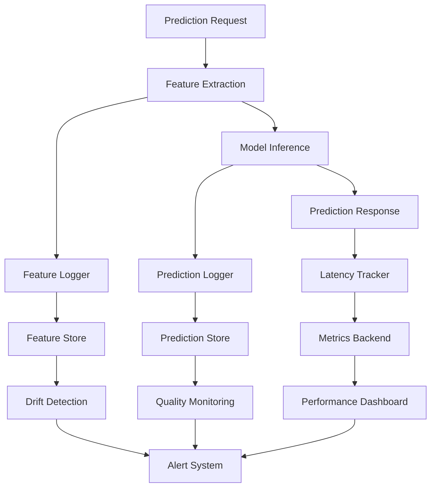

# How to Configure Model Monitoring in Production

Author: [nawazdhandala](https://www.github.com/nawazdhandala)

Tags: MLOps, Model Monitoring, Machine Learning, Production, Observability, Python, Prometheus

Description: Learn how to set up comprehensive model monitoring for ML systems in production, covering performance metrics, data drift detection, prediction quality tracking, and alerting strategies.

---

Machine learning models in production require continuous monitoring to detect degradation, data drift, and unexpected behavior. Unlike traditional software, ML systems can fail silently as the relationship between inputs and outputs changes over time. This guide covers setting up monitoring that catches problems before they impact users.

## Model Monitoring Architecture



## Core Metrics to Track

### Setting Up the Metrics Framework

```python
from prometheus_client import Counter, Histogram, Gauge, CollectorRegistry
from dataclasses import dataclass
from typing import Optional, Dict, Any
import time
import numpy as np

# Create a registry for ML metrics
ml_registry = CollectorRegistry()

# Prediction volume and latency
prediction_counter = Counter(
    'ml_predictions_total',
    'Total number of predictions made',
    ['model_name', 'model_version', 'prediction_type'],
    registry=ml_registry
)

prediction_latency = Histogram(
    'ml_prediction_latency_seconds',
    'Time spent making predictions',
    ['model_name', 'model_version'],
    buckets=[0.01, 0.025, 0.05, 0.1, 0.25, 0.5, 1.0, 2.5],
    registry=ml_registry
)

# Feature statistics
feature_value = Histogram(
    'ml_feature_value',
    'Distribution of feature values',
    ['model_name', 'feature_name'],
    buckets=[-np.inf, -2, -1, -0.5, 0, 0.5, 1, 2, np.inf],
    registry=ml_registry
)

# Prediction distribution
prediction_value = Histogram(
    'ml_prediction_value',
    'Distribution of prediction values',
    ['model_name', 'model_version'],
    buckets=[0.1, 0.2, 0.3, 0.4, 0.5, 0.6, 0.7, 0.8, 0.9, 1.0],
    registry=ml_registry
)

# Model health
model_loaded = Gauge(
    'ml_model_loaded',
    'Whether the model is loaded and ready',
    ['model_name', 'model_version'],
    registry=ml_registry
)

@dataclass
class PredictionMetrics:
    """Container for prediction metrics."""
    model_name: str
    model_version: str
    latency_seconds: float
    features: Dict[str, float]
    prediction: float
    prediction_type: str  # e.g., "batch", "realtime"
```

### Instrumented Model Wrapper

```python
import logging
from functools import wraps
from datetime import datetime

logger = logging.getLogger(__name__)

class MonitoredModel:
    """
    Wrapper that adds monitoring to any ML model.

    Tracks latency, prediction distributions, and feature statistics.
    """

    def __init__(
        self,
        model,
        model_name: str,
        model_version: str,
        feature_names: list
    ):
        self.model = model
        self.model_name = model_name
        self.model_version = model_version
        self.feature_names = feature_names

        # Mark model as loaded
        model_loaded.labels(
            model_name=model_name,
            model_version=model_version
        ).set(1)

    def predict(self, features: np.ndarray, prediction_type: str = "realtime"):
        """
        Make a prediction with full monitoring.

        Args:
            features: Input features as numpy array
            prediction_type: Type of prediction (batch/realtime)

        Returns:
            Model predictions
        """
        start_time = time.time()

        try:
            # Make prediction
            predictions = self.model.predict(features)

            # Record latency
            latency = time.time() - start_time
            prediction_latency.labels(
                model_name=self.model_name,
                model_version=self.model_version
            ).observe(latency)

            # Record prediction count
            prediction_counter.labels(
                model_name=self.model_name,
                model_version=self.model_version,
                prediction_type=prediction_type
            ).inc(len(predictions))

            # Record feature distributions (sample for efficiency)
            self._record_feature_stats(features)

            # Record prediction distribution
            for pred in predictions:
                prediction_value.labels(
                    model_name=self.model_name,
                    model_version=self.model_version
                ).observe(float(pred))

            return predictions

        except Exception as e:
            logger.error(f"Prediction failed: {e}")
            raise

    def _record_feature_stats(self, features: np.ndarray, sample_rate: float = 0.1):
        """Record feature statistics for drift detection."""
        # Sample for efficiency on high-volume systems
        if np.random.random() > sample_rate:
            return

        for i, name in enumerate(self.feature_names):
            for value in features[:, i]:
                feature_value.labels(
                    model_name=self.model_name,
                    feature_name=name
                ).observe(float(value))
```

## Data Drift Detection

Detect when production data distribution differs from training data.

```python
from scipy import stats
from collections import deque
import json

class DriftDetector:
    """
    Detect data drift using statistical tests.

    Compares recent production data against reference distribution
    from training data.
    """

    def __init__(
        self,
        reference_stats: Dict[str, Dict],
        window_size: int = 1000,
        drift_threshold: float = 0.05  # p-value threshold
    ):
        self.reference_stats = reference_stats
        self.window_size = window_size
        self.drift_threshold = drift_threshold

        # Rolling windows for each feature
        self.windows: Dict[str, deque] = {
            name: deque(maxlen=window_size)
            for name in reference_stats.keys()
        }

    def add_observation(self, features: Dict[str, float]):
        """Add a single observation to the rolling windows."""
        for name, value in features.items():
            if name in self.windows:
                self.windows[name].append(value)

    def check_drift(self) -> Dict[str, Dict]:
        """
        Check for drift in all features.

        Returns:
            Dictionary with drift status for each feature
        """
        results = {}

        for name, window in self.windows.items():
            if len(window) < 100:  # Need minimum samples
                results[name] = {"status": "insufficient_data"}
                continue

            current_data = np.array(window)
            ref = self.reference_stats[name]

            # Kolmogorov-Smirnov test for distribution change
            # Compare against reference distribution parameters
            ref_samples = np.random.normal(
                ref["mean"],
                ref["std"],
                size=len(current_data)
            )

            ks_stat, p_value = stats.ks_2samp(current_data, ref_samples)

            # Population Stability Index
            psi = self._calculate_psi(
                current_data,
                ref["mean"],
                ref["std"]
            )

            drift_detected = p_value < self.drift_threshold or psi > 0.2

            results[name] = {
                "status": "drift" if drift_detected else "stable",
                "ks_statistic": ks_stat,
                "p_value": p_value,
                "psi": psi,
                "current_mean": float(np.mean(current_data)),
                "current_std": float(np.std(current_data)),
                "reference_mean": ref["mean"],
                "reference_std": ref["std"]
            }

        return results

    def _calculate_psi(
        self,
        current_data: np.ndarray,
        ref_mean: float,
        ref_std: float,
        bins: int = 10
    ) -> float:
        """
        Calculate Population Stability Index.

        PSI < 0.1: No significant change
        PSI 0.1-0.2: Moderate change
        PSI > 0.2: Significant change
        """
        # Create bins based on reference distribution
        bin_edges = np.linspace(
            ref_mean - 3 * ref_std,
            ref_mean + 3 * ref_std,
            bins + 1
        )

        # Expected distribution (reference)
        expected = np.diff(stats.norm.cdf(bin_edges, ref_mean, ref_std))
        expected = np.clip(expected, 0.001, 1)  # Avoid division by zero

        # Actual distribution (current)
        actual, _ = np.histogram(current_data, bins=bin_edges)
        actual = actual / len(current_data)
        actual = np.clip(actual, 0.001, 1)

        # PSI formula
        psi = np.sum((actual - expected) * np.log(actual / expected))

        return psi

# Usage with reference statistics from training
reference_stats = {
    "feature_age": {"mean": 35.2, "std": 12.5},
    "feature_income": {"mean": 55000, "std": 25000},
    "feature_tenure": {"mean": 5.3, "std": 3.2}
}

drift_detector = DriftDetector(reference_stats)
```

## Prediction Quality Monitoring

Track model accuracy using delayed ground truth labels.

```python
from datetime import datetime, timedelta
import sqlite3
from typing import Optional

class PredictionLogger:
    """
    Log predictions and match with ground truth for quality monitoring.

    Stores predictions with a unique ID, then updates with actual outcomes
    when they become available.
    """

    def __init__(self, db_path: str = "predictions.db"):
        self.conn = sqlite3.connect(db_path, check_same_thread=False)
        self._init_db()

    def _init_db(self):
        """Initialize database tables."""
        self.conn.execute("""
            CREATE TABLE IF NOT EXISTS predictions (
                prediction_id TEXT PRIMARY KEY,
                model_name TEXT,
                model_version TEXT,
                features TEXT,
                prediction REAL,
                predicted_at TIMESTAMP,
                actual_outcome REAL,
                outcome_at TIMESTAMP
            )
        """)
        self.conn.commit()

    def log_prediction(
        self,
        prediction_id: str,
        model_name: str,
        model_version: str,
        features: Dict[str, float],
        prediction: float
    ):
        """Log a prediction for later quality analysis."""
        self.conn.execute(
            """
            INSERT INTO predictions
            (prediction_id, model_name, model_version, features, prediction, predicted_at)
            VALUES (?, ?, ?, ?, ?, ?)
            """,
            (
                prediction_id,
                model_name,
                model_version,
                json.dumps(features),
                prediction,
                datetime.now().isoformat()
            )
        )
        self.conn.commit()

    def record_outcome(self, prediction_id: str, actual_outcome: float):
        """Record the actual outcome for a prediction."""
        self.conn.execute(
            """
            UPDATE predictions
            SET actual_outcome = ?, outcome_at = ?
            WHERE prediction_id = ?
            """,
            (actual_outcome, datetime.now().isoformat(), prediction_id)
        )
        self.conn.commit()

    def get_accuracy_metrics(
        self,
        model_name: str,
        hours: int = 24
    ) -> Dict[str, float]:
        """
        Calculate accuracy metrics for recent predictions with outcomes.
        """
        cutoff = (datetime.now() - timedelta(hours=hours)).isoformat()

        cursor = self.conn.execute(
            """
            SELECT prediction, actual_outcome
            FROM predictions
            WHERE model_name = ?
              AND predicted_at > ?
              AND actual_outcome IS NOT NULL
            """,
            (model_name, cutoff)
        )

        rows = cursor.fetchall()

        if not rows:
            return {"status": "no_data"}

        predictions = np.array([r[0] for r in rows])
        actuals = np.array([r[1] for r in rows])

        # For binary classification (threshold at 0.5)
        pred_binary = (predictions > 0.5).astype(int)
        actual_binary = actuals.astype(int)

        accuracy = np.mean(pred_binary == actual_binary)

        # Calculate precision and recall
        true_positives = np.sum((pred_binary == 1) & (actual_binary == 1))
        false_positives = np.sum((pred_binary == 1) & (actual_binary == 0))
        false_negatives = np.sum((pred_binary == 0) & (actual_binary == 1))

        precision = true_positives / (true_positives + false_positives + 1e-10)
        recall = true_positives / (true_positives + false_negatives + 1e-10)

        return {
            "accuracy": float(accuracy),
            "precision": float(precision),
            "recall": float(recall),
            "sample_count": len(rows)
        }
```

## Alerting Configuration

Set up alerts for model health issues.

```python
from enum import Enum
from typing import Callable, List

class AlertSeverity(Enum):
    INFO = "info"
    WARNING = "warning"
    CRITICAL = "critical"

@dataclass
class Alert:
    name: str
    severity: AlertSeverity
    message: str
    metric_value: float
    threshold: float
    timestamp: datetime

class ModelAlertManager:
    """
    Manage alerts for model monitoring.

    Configurable thresholds for different metrics with
    severity levels and notification callbacks.
    """

    def __init__(self):
        self.thresholds = {}
        self.handlers: List[Callable[[Alert], None]] = []

    def configure_threshold(
        self,
        metric_name: str,
        warning_threshold: float,
        critical_threshold: float,
        comparison: str = "greater"  # "greater" or "less"
    ):
        """Configure alert thresholds for a metric."""
        self.thresholds[metric_name] = {
            "warning": warning_threshold,
            "critical": critical_threshold,
            "comparison": comparison
        }

    def add_handler(self, handler: Callable[[Alert], None]):
        """Add a notification handler."""
        self.handlers.append(handler)

    def check_metric(self, metric_name: str, value: float):
        """Check a metric value against configured thresholds."""
        if metric_name not in self.thresholds:
            return

        config = self.thresholds[metric_name]

        # Determine if threshold is breached
        if config["comparison"] == "greater":
            critical_breach = value > config["critical"]
            warning_breach = value > config["warning"]
        else:
            critical_breach = value < config["critical"]
            warning_breach = value < config["warning"]

        if critical_breach:
            self._fire_alert(
                metric_name,
                AlertSeverity.CRITICAL,
                value,
                config["critical"]
            )
        elif warning_breach:
            self._fire_alert(
                metric_name,
                AlertSeverity.WARNING,
                value,
                config["warning"]
            )

    def _fire_alert(
        self,
        metric_name: str,
        severity: AlertSeverity,
        value: float,
        threshold: float
    ):
        """Fire an alert to all handlers."""
        alert = Alert(
            name=metric_name,
            severity=severity,
            message=f"{metric_name} is {value:.4f}, threshold is {threshold:.4f}",
            metric_value=value,
            threshold=threshold,
            timestamp=datetime.now()
        )

        for handler in self.handlers:
            try:
                handler(alert)
            except Exception as e:
                logger.error(f"Alert handler failed: {e}")

# Configure alerts
alert_manager = ModelAlertManager()

alert_manager.configure_threshold(
    "prediction_latency_p99",
    warning_threshold=0.5,  # 500ms
    critical_threshold=1.0,  # 1 second
    comparison="greater"
)

alert_manager.configure_threshold(
    "model_accuracy",
    warning_threshold=0.85,
    critical_threshold=0.75,
    comparison="less"
)

alert_manager.configure_threshold(
    "drift_psi_max",
    warning_threshold=0.1,
    critical_threshold=0.2,
    comparison="greater"
)

# Add handlers
def slack_handler(alert: Alert):
    # Send to Slack
    logger.info(f"ALERT [{alert.severity.value}]: {alert.message}")

alert_manager.add_handler(slack_handler)
```

## Monitoring Dashboard Metrics

Export metrics for dashboards like Grafana.

```python
from flask import Flask, Response
from prometheus_client import generate_latest, CONTENT_TYPE_LATEST

app = Flask(__name__)

@app.route('/metrics')
def metrics():
    """Expose Prometheus metrics endpoint."""
    return Response(
        generate_latest(ml_registry),
        mimetype=CONTENT_TYPE_LATEST
    )

# Periodic metrics collection
def collect_model_metrics():
    """Collect and export model quality metrics periodically."""
    # Get accuracy from prediction logger
    metrics = prediction_logger.get_accuracy_metrics(
        model_name="fraud_detector",
        hours=24
    )

    if "accuracy" in metrics:
        # Export as gauge
        model_accuracy = Gauge(
            'ml_model_accuracy',
            'Current model accuracy',
            ['model_name', 'window_hours'],
            registry=ml_registry
        )
        model_accuracy.labels(
            model_name="fraud_detector",
            window_hours="24"
        ).set(metrics["accuracy"])

    # Check drift
    drift_results = drift_detector.check_drift()
    max_psi = max(
        r.get("psi", 0)
        for r in drift_results.values()
        if isinstance(r.get("psi"), (int, float))
    )

    # Alert on drift
    alert_manager.check_metric("drift_psi_max", max_psi)
```

## Summary

| Metric Type | What to Track | Alert Threshold |
|-------------|---------------|-----------------|
| **Latency** | p50, p95, p99 prediction time | p99 > 1s |
| **Volume** | Predictions per minute | Drop > 50% |
| **Accuracy** | Rolling accuracy vs baseline | Accuracy < 85% |
| **Drift** | PSI for each feature | PSI > 0.2 |
| **Errors** | Prediction failures | Error rate > 1% |

Model monitoring in production requires tracking both technical performance (latency, errors) and model-specific metrics (accuracy, drift). Setting up comprehensive monitoring catches degradation early and maintains model quality over time.
