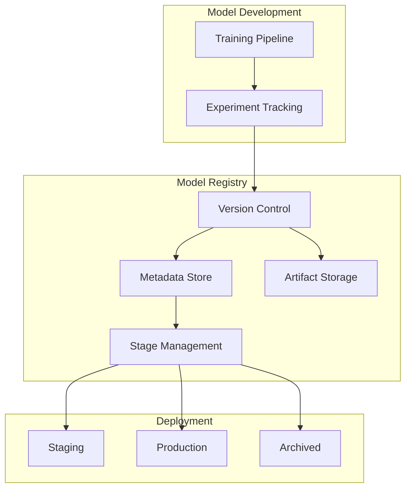

# How to Implement Model Registry

Author: [nawazdhandala](https://www.github.com/nawazdhandala)

Tags: MLOps, Model Registry, Machine Learning, MLflow, Versioning, Model Management

Description: Learn how to implement a model registry for versioning, storing, and managing ML models throughout their lifecycle, with practical examples using MLflow and custom implementations.

---

A model registry serves as the central source of truth for all ML models in your organization. It tracks versions, metadata, lineage, and deployment status, making it possible to reproduce experiments and manage model lifecycles systematically. This guide covers implementing a production-ready model registry.

## Model Registry Architecture



## MLflow Model Registry Setup

### Basic Configuration

```python
# registry/mlflow_setup.py
import mlflow
from mlflow.tracking import MlflowClient
import os

# Configure MLflow tracking server
mlflow.set_tracking_uri(os.environ.get(
    "MLFLOW_TRACKING_URI",
    "http://localhost:5000"
))

# Initialize client for registry operations
client = MlflowClient()

def register_model(
    run_id: str,
    model_name: str,
    artifact_path: str = "model"
) -> str:
    """
    Register a model from an experiment run.

    Args:
        run_id: MLflow run ID containing the model
        model_name: Name for the registered model
        artifact_path: Path within run artifacts

    Returns:
        Model version string
    """
    model_uri = f"runs:/{run_id}/{artifact_path}"

    # Register the model (creates model if not exists)
    result = mlflow.register_model(model_uri, model_name)

    print(f"Registered model {model_name} version {result.version}")

    return result.version

def log_and_register_model(
    model,
    model_name: str,
    metrics: dict,
    params: dict,
    tags: dict = None
) -> str:
    """
    Log a model to MLflow and register it in one operation.
    """
    with mlflow.start_run() as run:
        # Log parameters
        mlflow.log_params(params)

        # Log metrics
        mlflow.log_metrics(metrics)

        # Log tags
        if tags:
            mlflow.set_tags(tags)

        # Log model with signature inference
        signature = mlflow.models.infer_signature(
            model_input=params.get("sample_input"),
            model_output=params.get("sample_output")
        )

        mlflow.sklearn.log_model(
            model,
            artifact_path="model",
            signature=signature,
            registered_model_name=model_name
        )

        return run.info.run_id
```

### Model Stage Management

```python
# registry/stage_management.py
from mlflow.tracking import MlflowClient
from enum import Enum
from typing import Optional

class ModelStage(Enum):
    NONE = "None"
    STAGING = "Staging"
    PRODUCTION = "Production"
    ARCHIVED = "Archived"

class ModelStageManager:
    """
    Manage model lifecycle stages.

    Controls transitions between staging, production, and archived states.
    """

    def __init__(self):
        self.client = MlflowClient()

    def transition_model(
        self,
        model_name: str,
        version: str,
        stage: ModelStage,
        archive_existing: bool = True
    ):
        """
        Transition a model version to a new stage.

        Args:
            model_name: Name of the registered model
            version: Version to transition
            stage: Target stage
            archive_existing: Archive current model in target stage
        """
        # Archive existing model in target stage if requested
        if archive_existing and stage in [ModelStage.STAGING, ModelStage.PRODUCTION]:
            self._archive_current_stage(model_name, stage)

        # Transition to new stage
        self.client.transition_model_version_stage(
            name=model_name,
            version=version,
            stage=stage.value
        )

        print(f"Transitioned {model_name} v{version} to {stage.value}")

    def _archive_current_stage(self, model_name: str, stage: ModelStage):
        """Archive any model currently in the given stage."""
        current_models = self.client.get_latest_versions(
            model_name,
            stages=[stage.value]
        )

        for model in current_models:
            self.client.transition_model_version_stage(
                name=model_name,
                version=model.version,
                stage=ModelStage.ARCHIVED.value
            )
            print(f"Archived {model_name} v{model.version}")

    def get_production_model(self, model_name: str) -> Optional[str]:
        """Get the current production model version."""
        models = self.client.get_latest_versions(
            model_name,
            stages=[ModelStage.PRODUCTION.value]
        )

        if models:
            return models[0].version
        return None

    def get_model_history(self, model_name: str) -> list:
        """Get version history for a model."""
        versions = self.client.search_model_versions(f"name='{model_name}'")

        history = []
        for v in versions:
            history.append({
                "version": v.version,
                "stage": v.current_stage,
                "created_at": v.creation_timestamp,
                "description": v.description,
                "run_id": v.run_id
            })

        return sorted(history, key=lambda x: int(x["version"]), reverse=True)

# Usage
manager = ModelStageManager()

# Promote model to staging
manager.transition_model(
    model_name="fraud_detector",
    version="3",
    stage=ModelStage.STAGING
)

# After testing, promote to production
manager.transition_model(
    model_name="fraud_detector",
    version="3",
    stage=ModelStage.PRODUCTION,
    archive_existing=True
)
```

## Custom Model Registry Implementation

For organizations needing custom functionality beyond MLflow.

```python
# registry/custom_registry.py
from dataclasses import dataclass, field
from datetime import datetime
from typing import Optional, Dict, Any, List
import hashlib
import json
import boto3
from enum import Enum
import sqlite3

class ModelStatus(Enum):
    DRAFT = "draft"
    STAGING = "staging"
    PRODUCTION = "production"
    ARCHIVED = "archived"
    DEPRECATED = "deprecated"

@dataclass
class ModelVersion:
    model_name: str
    version: int
    status: ModelStatus
    artifact_uri: str
    created_at: datetime
    created_by: str
    metrics: Dict[str, float]
    parameters: Dict[str, Any]
    tags: Dict[str, str] = field(default_factory=dict)
    description: str = ""
    artifact_hash: str = ""
    parent_version: Optional[int] = None

@dataclass
class RegisteredModel:
    name: str
    description: str
    created_at: datetime
    created_by: str
    tags: Dict[str, str] = field(default_factory=dict)
    latest_version: int = 0

class ModelRegistry:
    """
    Custom model registry with full versioning and metadata tracking.

    Stores metadata in SQLite and artifacts in S3.
    """

    def __init__(
        self,
        db_path: str = "model_registry.db",
        s3_bucket: str = "ml-model-artifacts"
    ):
        self.db_path = db_path
        self.s3_bucket = s3_bucket
        self.s3 = boto3.client('s3')
        self._init_db()

    def _init_db(self):
        """Initialize database schema."""
        conn = sqlite3.connect(self.db_path)
        conn.execute("""
            CREATE TABLE IF NOT EXISTS registered_models (
                name TEXT PRIMARY KEY,
                description TEXT,
                created_at TEXT,
                created_by TEXT,
                tags TEXT,
                latest_version INTEGER DEFAULT 0
            )
        """)
        conn.execute("""
            CREATE TABLE IF NOT EXISTS model_versions (
                model_name TEXT,
                version INTEGER,
                status TEXT,
                artifact_uri TEXT,
                artifact_hash TEXT,
                created_at TEXT,
                created_by TEXT,
                metrics TEXT,
                parameters TEXT,
                tags TEXT,
                description TEXT,
                parent_version INTEGER,
                PRIMARY KEY (model_name, version),
                FOREIGN KEY (model_name) REFERENCES registered_models(name)
            )
        """)
        conn.commit()
        conn.close()

    def create_model(
        self,
        name: str,
        description: str,
        created_by: str,
        tags: Dict[str, str] = None
    ) -> RegisteredModel:
        """Create a new registered model."""
        model = RegisteredModel(
            name=name,
            description=description,
            created_at=datetime.now(),
            created_by=created_by,
            tags=tags or {}
        )

        conn = sqlite3.connect(self.db_path)
        conn.execute(
            """
            INSERT INTO registered_models (name, description, created_at, created_by, tags)
            VALUES (?, ?, ?, ?, ?)
            """,
            (name, description, model.created_at.isoformat(), created_by, json.dumps(model.tags))
        )
        conn.commit()
        conn.close()

        return model

    def register_version(
        self,
        model_name: str,
        artifact_path: str,
        metrics: Dict[str, float],
        parameters: Dict[str, Any],
        created_by: str,
        tags: Dict[str, str] = None,
        description: str = "",
        parent_version: Optional[int] = None
    ) -> ModelVersion:
        """
        Register a new model version.

        Uploads artifact to S3 and creates metadata entry.
        """
        conn = sqlite3.connect(self.db_path)

        # Get next version number
        cursor = conn.execute(
            "SELECT latest_version FROM registered_models WHERE name = ?",
            (model_name,)
        )
        row = cursor.fetchone()
        if not row:
            raise ValueError(f"Model {model_name} not found")

        new_version = row[0] + 1

        # Calculate artifact hash
        artifact_hash = self._calculate_hash(artifact_path)

        # Upload to S3
        artifact_uri = f"s3://{self.s3_bucket}/{model_name}/v{new_version}/model.pkl"
        self.s3.upload_file(artifact_path, self.s3_bucket, f"{model_name}/v{new_version}/model.pkl")

        # Create version record
        version = ModelVersion(
            model_name=model_name,
            version=new_version,
            status=ModelStatus.DRAFT,
            artifact_uri=artifact_uri,
            created_at=datetime.now(),
            created_by=created_by,
            metrics=metrics,
            parameters=parameters,
            tags=tags or {},
            description=description,
            artifact_hash=artifact_hash,
            parent_version=parent_version
        )

        conn.execute(
            """
            INSERT INTO model_versions
            (model_name, version, status, artifact_uri, artifact_hash, created_at,
             created_by, metrics, parameters, tags, description, parent_version)
            VALUES (?, ?, ?, ?, ?, ?, ?, ?, ?, ?, ?, ?)
            """,
            (
                model_name, new_version, version.status.value, artifact_uri, artifact_hash,
                version.created_at.isoformat(), created_by, json.dumps(metrics),
                json.dumps(parameters), json.dumps(tags or {}), description, parent_version
            )
        )

        # Update latest version
        conn.execute(
            "UPDATE registered_models SET latest_version = ? WHERE name = ?",
            (new_version, model_name)
        )

        conn.commit()
        conn.close()

        return version

    def _calculate_hash(self, file_path: str) -> str:
        """Calculate SHA256 hash of a file."""
        sha256 = hashlib.sha256()
        with open(file_path, 'rb') as f:
            for chunk in iter(lambda: f.read(8192), b''):
                sha256.update(chunk)
        return sha256.hexdigest()

    def get_version(self, model_name: str, version: int) -> Optional[ModelVersion]:
        """Get a specific model version."""
        conn = sqlite3.connect(self.db_path)
        cursor = conn.execute(
            "SELECT * FROM model_versions WHERE model_name = ? AND version = ?",
            (model_name, version)
        )
        row = cursor.fetchone()
        conn.close()

        if not row:
            return None

        return self._row_to_version(row)

    def _row_to_version(self, row) -> ModelVersion:
        """Convert database row to ModelVersion."""
        return ModelVersion(
            model_name=row[0],
            version=row[1],
            status=ModelStatus(row[2]),
            artifact_uri=row[3],
            artifact_hash=row[4],
            created_at=datetime.fromisoformat(row[5]),
            created_by=row[6],
            metrics=json.loads(row[7]),
            parameters=json.loads(row[8]),
            tags=json.loads(row[9]),
            description=row[10],
            parent_version=row[11]
        )

    def update_status(
        self,
        model_name: str,
        version: int,
        new_status: ModelStatus
    ):
        """Update the status of a model version."""
        conn = sqlite3.connect(self.db_path)
        conn.execute(
            "UPDATE model_versions SET status = ? WHERE model_name = ? AND version = ?",
            (new_status.value, model_name, version)
        )
        conn.commit()
        conn.close()

    def get_production_version(self, model_name: str) -> Optional[ModelVersion]:
        """Get the current production version of a model."""
        conn = sqlite3.connect(self.db_path)
        cursor = conn.execute(
            """
            SELECT * FROM model_versions
            WHERE model_name = ? AND status = ?
            ORDER BY version DESC LIMIT 1
            """,
            (model_name, ModelStatus.PRODUCTION.value)
        )
        row = cursor.fetchone()
        conn.close()

        if not row:
            return None
        return self._row_to_version(row)

    def compare_versions(
        self,
        model_name: str,
        version_a: int,
        version_b: int
    ) -> Dict:
        """Compare metrics between two versions."""
        va = self.get_version(model_name, version_a)
        vb = self.get_version(model_name, version_b)

        if not va or not vb:
            raise ValueError("Version not found")

        comparison = {
            "version_a": version_a,
            "version_b": version_b,
            "metrics_comparison": {}
        }

        all_metrics = set(va.metrics.keys()) | set(vb.metrics.keys())
        for metric in all_metrics:
            val_a = va.metrics.get(metric)
            val_b = vb.metrics.get(metric)

            comparison["metrics_comparison"][metric] = {
                "version_a": val_a,
                "version_b": val_b,
                "delta": (val_b - val_a) if val_a and val_b else None,
                "pct_change": ((val_b - val_a) / val_a * 100) if val_a and val_b and val_a != 0 else None
            }

        return comparison
```

## Model Serving from Registry

```python
# serving/registry_serving.py
import mlflow
from mlflow.tracking import MlflowClient
from functools import lru_cache
import threading
import time

class RegistryModelServer:
    """
    Serve models directly from the registry.

    Automatically loads production models and handles updates.
    """

    def __init__(self, model_name: str, refresh_interval: int = 60):
        self.model_name = model_name
        self.refresh_interval = refresh_interval
        self.client = MlflowClient()
        self._model = None
        self._version = None
        self._lock = threading.Lock()

        # Start background refresh
        self._start_refresh_thread()

    def _start_refresh_thread(self):
        """Start background thread to check for model updates."""
        def refresh_loop():
            while True:
                try:
                    self._check_for_updates()
                except Exception as e:
                    print(f"Error checking for updates: {e}")
                time.sleep(self.refresh_interval)

        thread = threading.Thread(target=refresh_loop, daemon=True)
        thread.start()

    def _check_for_updates(self):
        """Check if a new production model is available."""
        versions = self.client.get_latest_versions(
            self.model_name,
            stages=["Production"]
        )

        if not versions:
            return

        latest = versions[0]
        if latest.version != self._version:
            print(f"New production model detected: v{latest.version}")
            self._load_model(latest.version)

    def _load_model(self, version: str):
        """Load a specific model version."""
        model_uri = f"models:/{self.model_name}/{version}"

        with self._lock:
            self._model = mlflow.pyfunc.load_model(model_uri)
            self._version = version

        print(f"Loaded {self.model_name} v{version}")

    def predict(self, data):
        """Make prediction with the current production model."""
        with self._lock:
            if self._model is None:
                raise RuntimeError("No model loaded")
            return self._model.predict(data)

    @property
    def current_version(self) -> str:
        """Get the currently loaded version."""
        return self._version

# Usage
server = RegistryModelServer("fraud_detector")

# Predictions automatically use the latest production model
predictions = server.predict(features)
```

## Model Lineage Tracking

```python
# registry/lineage.py
from dataclasses import dataclass
from typing import List, Optional
import json

@dataclass
class ModelLineage:
    model_name: str
    version: int
    training_dataset: str
    training_dataset_version: str
    feature_set: List[str]
    parent_model: Optional[str]
    parent_version: Optional[int]
    training_job_id: str
    git_commit: str
    dependencies: Dict[str, str]

class LineageTracker:
    """
    Track model lineage for reproducibility and auditing.
    """

    def __init__(self, registry: ModelRegistry):
        self.registry = registry

    def record_lineage(
        self,
        model_name: str,
        version: int,
        lineage: ModelLineage
    ):
        """Record lineage information for a model version."""
        lineage_data = {
            "training_dataset": lineage.training_dataset,
            "training_dataset_version": lineage.training_dataset_version,
            "feature_set": lineage.feature_set,
            "parent_model": lineage.parent_model,
            "parent_version": lineage.parent_version,
            "training_job_id": lineage.training_job_id,
            "git_commit": lineage.git_commit,
            "dependencies": lineage.dependencies
        }

        # Store as tags on the model version
        model_version = self.registry.get_version(model_name, version)
        model_version.tags["lineage"] = json.dumps(lineage_data)

    def get_lineage(self, model_name: str, version: int) -> Optional[ModelLineage]:
        """Get lineage for a model version."""
        model_version = self.registry.get_version(model_name, version)
        if not model_version:
            return None

        lineage_json = model_version.tags.get("lineage")
        if not lineage_json:
            return None

        data = json.loads(lineage_json)
        return ModelLineage(
            model_name=model_name,
            version=version,
            **data
        )

    def get_model_ancestry(self, model_name: str, version: int) -> List[dict]:
        """Get the full ancestry chain of a model."""
        ancestry = []
        current_name = model_name
        current_version = version

        while current_name and current_version:
            lineage = self.get_lineage(current_name, current_version)
            if not lineage:
                break

            ancestry.append({
                "model_name": current_name,
                "version": current_version,
                "git_commit": lineage.git_commit,
                "training_dataset": lineage.training_dataset
            })

            current_name = lineage.parent_model
            current_version = lineage.parent_version

        return ancestry
```

## Summary

| Component | Purpose |
|-----------|---------|
| **Version Control** | Track all model versions with unique IDs |
| **Artifact Storage** | Store model binaries in durable storage |
| **Metadata Store** | Track metrics, parameters, and tags |
| **Stage Management** | Control lifecycle transitions |
| **Lineage Tracking** | Record data and code provenance |
| **Model Serving** | Load models for inference |

A well-implemented model registry provides the foundation for reproducible ML. It answers questions like "what model is in production?", "how did we train it?", and "how does it compare to previous versions?" These capabilities are essential for both debugging production issues and satisfying audit requirements.
