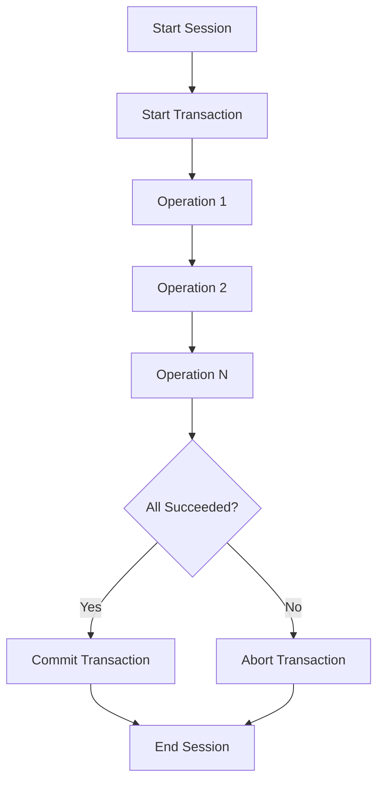

# How to Execute ACID Transactions in MongoDB

Author: [nawazdhandala](https://www.github.com/nawazdhandala)

Tags: MongoDB, Transactions, ACID, Data Integrity, Database

Description: A practical guide to using multi-document ACID transactions in MongoDB, including session management, error handling, and best practices for maintaining data consistency.

---

MongoDB 4.0 introduced multi-document ACID transactions, bringing the same guarantees as traditional relational databases. Before this, you had to design around single-document atomicity or accept eventual consistency. Now you can update multiple documents across collections with all-or-nothing semantics.

## When to Use Transactions

Transactions are essential when multiple operations must succeed or fail together:

- Transferring money between accounts
- Creating related documents (order + order items)
- Updating a document and its audit trail
- Any operation that spans multiple collections

**When NOT to use transactions**:
- Single document updates (already atomic)
- Read-only operations
- Operations that can be eventually consistent

## Basic Transaction Pattern

Here is the standard pattern for running a transaction:

```javascript
const { MongoClient } = require('mongodb');

const client = new MongoClient(uri);

async function transferFunds(fromAccountId, toAccountId, amount) {
  // Start a session
  const session = client.startSession();

  try {
    // Start the transaction
    session.startTransaction({
      readConcern: { level: 'snapshot' },
      writeConcern: { w: 'majority' }
    });

    const accounts = client.db('banking').collection('accounts');

    // Debit from source account
    const debitResult = await accounts.updateOne(
      { _id: fromAccountId, balance: { $gte: amount } },
      { $inc: { balance: -amount } },
      { session }  // Include session in every operation
    );

    if (debitResult.modifiedCount === 0) {
      throw new Error('Insufficient funds or account not found');
    }

    // Credit to destination account
    const creditResult = await accounts.updateOne(
      { _id: toAccountId },
      { $inc: { balance: amount } },
      { session }
    );

    if (creditResult.modifiedCount === 0) {
      throw new Error('Destination account not found');
    }

    // Commit the transaction
    await session.commitTransaction();
    console.log('Transfer completed successfully');

  } catch (error) {
    // Abort on any error
    await session.abortTransaction();
    console.error('Transfer failed:', error.message);
    throw error;

  } finally {
    // Always end the session
    await session.endSession();
  }
}
```

## Transaction Flow



## Using withTransaction Helper

MongoDB drivers provide a convenience method that handles retries automatically:

```javascript
async function createOrderWithItems(orderData, items) {
  const session = client.startSession();

  try {
    // withTransaction handles retries and commits
    await session.withTransaction(async () => {
      const ordersCol = client.db('shop').collection('orders');
      const itemsCol = client.db('shop').collection('order_items');
      const inventoryCol = client.db('shop').collection('inventory');

      // Create the order
      const orderResult = await ordersCol.insertOne({
        ...orderData,
        status: 'pending',
        createdAt: new Date()
      }, { session });

      const orderId = orderResult.insertedId;

      // Insert order items and update inventory
      for (const item of items) {
        // Check and decrement inventory
        const inventoryResult = await inventoryCol.updateOne(
          { productId: item.productId, quantity: { $gte: item.quantity } },
          { $inc: { quantity: -item.quantity } },
          { session }
        );

        if (inventoryResult.modifiedCount === 0) {
          throw new Error(`Insufficient inventory for product ${item.productId}`);
        }

        // Create order item
        await itemsCol.insertOne({
          orderId: orderId,
          productId: item.productId,
          quantity: item.quantity,
          price: item.price
        }, { session });
      }

      return orderId;
    });

  } finally {
    await session.endSession();
  }
}
```

## Read and Write Concerns

Transactions use specific consistency settings:

### Read Concern

Controls what data the transaction sees:

```javascript
session.startTransaction({
  readConcern: { level: 'snapshot' }  // See consistent snapshot
});
```

Options:
- `snapshot`: See data as it existed at transaction start
- `majority`: See data acknowledged by majority of nodes
- `local`: See local node's data (fastest but may see rollbacks)

### Write Concern

Controls when writes are considered successful:

```javascript
session.startTransaction({
  writeConcern: { w: 'majority', j: true }
});
```

Options:
- `w: 'majority'`: Acknowledged by majority (recommended)
- `w: 1`: Acknowledged by primary only
- `j: true`: Wait for journal write

## Handling Transient Errors

Some errors are temporary and can be retried:

```javascript
async function runTransactionWithRetry(session, txnFunc) {
  while (true) {
    try {
      await txnFunc(session);
      return;
    } catch (error) {
      // Retry on transient transaction errors
      if (
        error.hasOwnProperty('errorLabels') &&
        error.errorLabels.includes('TransientTransactionError')
      ) {
        console.log('Transient error, retrying transaction...');
        continue;
      }
      throw error;
    }
  }
}

async function commitWithRetry(session) {
  while (true) {
    try {
      await session.commitTransaction();
      return;
    } catch (error) {
      if (
        error.hasOwnProperty('errorLabels') &&
        error.errorLabels.includes('UnknownTransactionCommitResult')
      ) {
        console.log('Unknown commit result, retrying...');
        continue;
      }
      throw error;
    }
  }
}
```

The `withTransaction` helper handles these retries automatically.

## Cross-Collection Transactions

Transactions can span multiple collections in the same database or across databases:

```javascript
async function processPayment(paymentData) {
  const session = client.startSession();

  try {
    await session.withTransaction(async () => {
      // Collection 1: Create payment record
      await client.db('payments').collection('transactions').insertOne({
        ...paymentData,
        status: 'processing',
        createdAt: new Date()
      }, { session });

      // Collection 2: Update user balance
      await client.db('users').collection('wallets').updateOne(
        { userId: paymentData.userId },
        { $inc: { balance: -paymentData.amount } },
        { session }
      );

      // Collection 3: Update merchant balance
      await client.db('merchants').collection('accounts').updateOne(
        { merchantId: paymentData.merchantId },
        { $inc: { balance: paymentData.amount } },
        { session }
      );

      // Collection 4: Create audit log
      await client.db('audit').collection('payment_logs').insertOne({
        paymentId: paymentData._id,
        action: 'processed',
        timestamp: new Date()
      }, { session });
    });

  } finally {
    await session.endSession();
  }
}
```

## Transaction Limits and Considerations

### Time Limits

Transactions have a default 60-second lifetime:

```javascript
// Increase transaction timeout
session.startTransaction({
  maxCommitTimeMS: 120000  // 2 minutes
});
```

### Size Limits

- Maximum 16MB total size of transaction operations
- Maximum 1000 documents modified in a single transaction

### Performance Impact

Transactions hold locks longer than individual operations:

```javascript
// BAD: Long-running transaction holds locks
await session.withTransaction(async () => {
  await updateUserProfile(session);
  await sendEmailNotification();  // Slow external call
  await updateActivityLog(session);
});

// GOOD: Keep transactions short
await session.withTransaction(async () => {
  await updateUserProfile(session);
  await updateActivityLog(session);
});
await sendEmailNotification();  // Outside transaction
```

## Practical Example: E-commerce Checkout

```javascript
async function checkout(userId, cartId, paymentMethod) {
  const session = client.startSession();
  const db = client.db('ecommerce');

  try {
    const result = await session.withTransaction(async () => {
      // Get cart items
      const cart = await db.collection('carts').findOne(
        { _id: cartId, userId },
        { session }
      );

      if (!cart || cart.items.length === 0) {
        throw new Error('Cart is empty');
      }

      // Calculate total
      let total = 0;
      for (const item of cart.items) {
        // Verify current price and stock
        const product = await db.collection('products').findOne(
          { _id: item.productId },
          { session }
        );

        if (product.stock < item.quantity) {
          throw new Error(`Insufficient stock for ${product.name}`);
        }

        total += product.price * item.quantity;

        // Decrement stock
        await db.collection('products').updateOne(
          { _id: item.productId },
          { $inc: { stock: -item.quantity } },
          { session }
        );
      }

      // Create order
      const order = {
        userId,
        items: cart.items,
        total,
        paymentMethod,
        status: 'confirmed',
        createdAt: new Date()
      };

      const orderResult = await db.collection('orders').insertOne(
        order,
        { session }
      );

      // Clear cart
      await db.collection('carts').updateOne(
        { _id: cartId },
        { $set: { items: [], updatedAt: new Date() } },
        { session }
      );

      return { orderId: orderResult.insertedId, total };
    });

    return result;

  } finally {
    await session.endSession();
  }
}
```

## Transaction Checklist

Before using transactions:

- [ ] MongoDB 4.0+ for replica set transactions
- [ ] MongoDB 4.2+ for sharded cluster transactions
- [ ] Replica set or sharded cluster (not standalone)
- [ ] Application handles `TransientTransactionError`
- [ ] Application handles `UnknownTransactionCommitResult`
- [ ] Transaction operations fit within size limits
- [ ] Transaction completes within time limits
- [ ] External calls moved outside transaction

---

Transactions in MongoDB bring familiar ACID guarantees to document databases. Use them when you need multiple operations to succeed or fail atomically. Keep transactions short, handle transient errors with retries, and remember that good document modeling often reduces the need for transactions in the first place.
