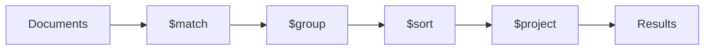

# How to Build Data Transformations with MongoDB Aggregation Pipelines

Author: [nawazdhandala](https://www.github.com/nawazdhandala)

Tags: MongoDB, Aggregation, Data Processing, NoSQL, Database

Description: A practical guide to building data transformations with MongoDB aggregation pipelines, covering stages like $match, $group, $lookup, and $project with real-world examples.

---

MongoDB's aggregation framework is one of its most powerful features. It lets you transform and analyze data directly in the database, reducing the amount of data you need to transfer to your application and eliminating complex client-side processing logic.

## Understanding the Pipeline Concept

An aggregation pipeline is a series of stages. Each stage transforms the documents as they pass through. Think of it like a factory assembly line where each station performs a specific operation.



## Basic Pipeline Stages

Let's start with a sample collection of orders:

```javascript
// Sample data in the 'orders' collection
{
  "_id": ObjectId("..."),
  "customerId": "cust_123",
  "items": [
    { "product": "Widget", "quantity": 2, "price": 15.99 },
    { "product": "Gadget", "quantity": 1, "price": 29.99 }
  ],
  "status": "completed",
  "createdAt": ISODate("2026-01-15T10:30:00Z")
}
```

### $match - Filtering Documents

The $match stage filters documents, similar to the find() method. Always put $match early in your pipeline to reduce the number of documents processed by subsequent stages.

```javascript
// Find all completed orders from January 2026
db.orders.aggregate([
  {
    $match: {
      status: "completed",
      createdAt: {
        $gte: ISODate("2026-01-01T00:00:00Z"),
        $lt: ISODate("2026-02-01T00:00:00Z")
      }
    }
  }
]);
```

### $group - Aggregating Data

The $group stage groups documents by a specified key and can perform calculations on the grouped data.

```javascript
// Calculate total revenue per customer
db.orders.aggregate([
  {
    $match: { status: "completed" }
  },
  {
    $unwind: "$items"  // Flatten the items array
  },
  {
    $group: {
      _id: "$customerId",
      totalSpent: {
        $sum: { $multiply: ["$items.quantity", "$items.price"] }
      },
      orderCount: { $sum: 1 },
      avgOrderValue: {
        $avg: { $multiply: ["$items.quantity", "$items.price"] }
      }
    }
  },
  {
    $sort: { totalSpent: -1 }  // Sort by highest spenders first
  }
]);
```

### $project - Reshaping Documents

The $project stage lets you include, exclude, or compute new fields.

```javascript
// Create a summary view of orders
db.orders.aggregate([
  {
    $project: {
      _id: 0,  // Exclude the _id field
      orderId: "$_id",
      customer: "$customerId",
      itemCount: { $size: "$items" },
      // Calculate total using $reduce for array summation
      total: {
        $reduce: {
          input: "$items",
          initialValue: 0,
          in: {
            $add: [
              "$$value",
              { $multiply: ["$$this.quantity", "$$this.price"] }
            ]
          }
        }
      },
      orderDate: {
        $dateToString: { format: "%Y-%m-%d", date: "$createdAt" }
      }
    }
  }
]);
```

## Working with Arrays

### $unwind - Deconstructing Arrays

The $unwind stage creates a separate document for each element in an array.

```javascript
// Analyze product performance across all orders
db.orders.aggregate([
  { $unwind: "$items" },
  {
    $group: {
      _id: "$items.product",
      totalQuantitySold: { $sum: "$items.quantity" },
      totalRevenue: {
        $sum: { $multiply: ["$items.quantity", "$items.price"] }
      },
      averageQuantityPerOrder: { $avg: "$items.quantity" }
    }
  },
  { $sort: { totalRevenue: -1 } }
]);
```

### $push and $addToSet - Building Arrays

You can rebuild arrays during grouping operations.

```javascript
// Get all products purchased by each customer
db.orders.aggregate([
  { $unwind: "$items" },
  {
    $group: {
      _id: "$customerId",
      // $addToSet creates unique list, $push allows duplicates
      uniqueProducts: { $addToSet: "$items.product" },
      allPurchases: {
        $push: {
          product: "$items.product",
          quantity: "$items.quantity"
        }
      }
    }
  }
]);
```

## Joining Collections with $lookup

The $lookup stage performs a left outer join with another collection.

```javascript
// Join orders with customer details
db.orders.aggregate([
  {
    $lookup: {
      from: "customers",           // The collection to join
      localField: "customerId",    // Field from orders
      foreignField: "_id",         // Field from customers
      as: "customerDetails"        // Output array field
    }
  },
  {
    // $unwind with preserveNullAndEmptyArrays keeps orders
    // even if no matching customer is found
    $unwind: {
      path: "$customerDetails",
      preserveNullAndEmptyArrays: true
    }
  },
  {
    $project: {
      orderId: "$_id",
      customerName: "$customerDetails.name",
      customerEmail: "$customerDetails.email",
      orderTotal: 1,
      status: 1
    }
  }
]);
```

### Pipeline $lookup for Complex Joins

For more control, use the pipeline form of $lookup.

```javascript
// Find orders with their most recent customer address
db.orders.aggregate([
  {
    $lookup: {
      from: "addresses",
      let: { custId: "$customerId" },
      pipeline: [
        {
          $match: {
            $expr: { $eq: ["$customerId", "$$custId"] }
          }
        },
        { $sort: { createdAt: -1 } },
        { $limit: 1 }
      ],
      as: "shippingAddress"
    }
  },
  {
    $unwind: {
      path: "$shippingAddress",
      preserveNullAndEmptyArrays: true
    }
  }
]);
```

## Conditional Logic

### $cond - If-Then-Else

```javascript
// Categorize orders by size
db.orders.aggregate([
  {
    $addFields: {
      orderSize: {
        $cond: {
          if: { $gte: [{ $size: "$items" }, 5] },
          then: "large",
          else: {
            $cond: {
              if: { $gte: [{ $size: "$items" }, 2] },
              then: "medium",
              else: "small"
            }
          }
        }
      }
    }
  }
]);
```

### $switch - Multiple Conditions

```javascript
// Assign order priority based on total value
db.orders.aggregate([
  {
    $addFields: {
      total: {
        $reduce: {
          input: "$items",
          initialValue: 0,
          in: { $add: ["$$value", { $multiply: ["$$this.quantity", "$$this.price"] }] }
        }
      }
    }
  },
  {
    $addFields: {
      priority: {
        $switch: {
          branches: [
            { case: { $gte: ["$total", 1000] }, then: "high" },
            { case: { $gte: ["$total", 100] }, then: "medium" }
          ],
          default: "low"
        }
      }
    }
  }
]);
```

## Practical Example: Sales Dashboard

Here's a complete pipeline that generates a sales dashboard summary.

```javascript
// Generate daily sales report with comparisons
db.orders.aggregate([
  // Step 1: Filter to completed orders in the last 30 days
  {
    $match: {
      status: "completed",
      createdAt: {
        $gte: new Date(Date.now() - 30 * 24 * 60 * 60 * 1000)
      }
    }
  },

  // Step 2: Calculate order totals
  {
    $addFields: {
      orderTotal: {
        $reduce: {
          input: "$items",
          initialValue: 0,
          in: { $add: ["$$value", { $multiply: ["$$this.quantity", "$$this.price"] }] }
        }
      },
      orderDate: {
        $dateToString: { format: "%Y-%m-%d", date: "$createdAt" }
      }
    }
  },

  // Step 3: Group by date
  {
    $group: {
      _id: "$orderDate",
      revenue: { $sum: "$orderTotal" },
      orderCount: { $sum: 1 },
      avgOrderValue: { $avg: "$orderTotal" },
      uniqueCustomers: { $addToSet: "$customerId" }
    }
  },

  // Step 4: Add customer count
  {
    $addFields: {
      uniqueCustomerCount: { $size: "$uniqueCustomers" }
    }
  },

  // Step 5: Clean up output
  {
    $project: {
      _id: 0,
      date: "$_id",
      revenue: { $round: ["$revenue", 2] },
      orderCount: 1,
      avgOrderValue: { $round: ["$avgOrderValue", 2] },
      uniqueCustomerCount: 1
    }
  },

  // Step 6: Sort by date
  { $sort: { date: 1 } }
]);
```

## Performance Tips

### Use Indexes Effectively

Place $match and $sort stages early in the pipeline to take advantage of indexes.

```javascript
// Create an index for common query patterns
db.orders.createIndex({ status: 1, createdAt: -1 });

// This pipeline can use the index
db.orders.aggregate([
  { $match: { status: "completed" } },
  { $sort: { createdAt: -1 } },
  { $limit: 100 },
  // ... rest of pipeline
]);
```

### Limit Data Early

Use $limit and $skip early when you only need a subset of results.

```javascript
// Efficient pagination
db.orders.aggregate([
  { $match: { status: "completed" } },
  { $sort: { createdAt: -1 } },
  { $skip: 20 },
  { $limit: 10 },
  // ... expensive transformations after limiting
]);
```

### Use $project to Reduce Document Size

Remove unnecessary fields early to reduce memory usage.

```javascript
// Keep only what you need
db.orders.aggregate([
  { $match: { status: "completed" } },
  { $project: { customerId: 1, items: 1, createdAt: 1 } },
  // ... rest of pipeline works with smaller documents
]);
```

## Debugging Pipelines

Use $out or $merge to save intermediate results, or add $limit: 1 to test stages individually.

```javascript
// Debug by examining output at each stage
db.orders.aggregate([
  { $match: { status: "completed" } },
  { $limit: 1 }  // Check output of first stage
]).pretty();
```

---

Aggregation pipelines transform MongoDB from a simple document store into a powerful data processing engine. Start simple, add stages incrementally, and always consider index usage for production workloads. The time invested in learning the aggregation framework pays off every time you can avoid pulling large datasets into your application.
