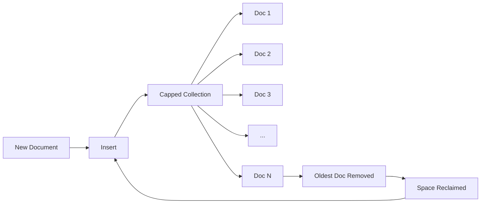

# How to Build Log Buffers with MongoDB Capped Collections

Author: [nawazdhandala](https://www.github.com/nawazdhandala)

Tags: MongoDB, Capped Collections, Logging, Buffers, Performance

Description: Learn how to use MongoDB capped collections to build efficient log buffers, event streams, and circular queues with automatic size management.

---

Capped collections in MongoDB are fixed-size collections that automatically remove the oldest documents when they reach their size limit. They work like circular buffers, making them ideal for logging, caching recent events, and maintaining rolling windows of data without manual cleanup.

## Understanding Capped Collections

Capped collections have several unique properties:

- **Fixed size**: Documents are inserted until the size limit is reached
- **Automatic cleanup**: Oldest documents are removed to make room for new ones
- **Insert order preserved**: Documents maintain insertion order
- **High write throughput**: Simplified storage allocation improves write performance
- **No manual deletion**: You cannot delete individual documents (only drop the whole collection)



## Creating a Capped Collection

```javascript
// Create a capped collection for application logs
// Size is in bytes, max is optional document count limit
await db.createCollection('app_logs', {
  capped: true,
  size: 100 * 1024 * 1024,  // 100 MB maximum size
  max: 1000000              // Optional: max 1 million documents
});

// Verify collection properties
const stats = await db.collection('app_logs').stats();
console.log('Capped:', stats.capped);
console.log('Max size:', stats.maxSize);
console.log('Max docs:', stats.max);

// Create index for efficient queries (optional)
// Note: capped collections have a natural _id index
await db.collection('app_logs').createIndex({ timestamp: 1 });
await db.collection('app_logs').createIndex({ level: 1, timestamp: 1 });
```

## Building an Application Logger

```javascript
// logger.js - MongoDB-backed application logger

class MongoLogger {
  constructor(db, options = {}) {
    this.collection = db.collection(options.collection || 'app_logs');
    this.application = options.application || 'default';
    this.hostname = options.hostname || require('os').hostname();
    this.bufferSize = options.bufferSize || 100;
    this.flushInterval = options.flushInterval || 1000;

    this.buffer = [];
    this.flushTimer = null;

    // Start periodic flush
    this.startFlushTimer();
  }

  // Log levels
  debug(message, meta = {}) { this.log('debug', message, meta); }
  info(message, meta = {}) { this.log('info', message, meta); }
  warn(message, meta = {}) { this.log('warn', message, meta); }
  error(message, meta = {}) { this.log('error', message, meta); }

  log(level, message, meta = {}) {
    const entry = {
      timestamp: new Date(),
      level: level,
      message: message,
      application: this.application,
      hostname: this.hostname,
      ...meta
    };

    // Add to buffer
    this.buffer.push(entry);

    // Flush if buffer is full
    if (this.buffer.length >= this.bufferSize) {
      this.flush();
    }
  }

  async flush() {
    if (this.buffer.length === 0) return;

    const entries = this.buffer.splice(0);  // Clear buffer atomically

    try {
      // Insert all buffered entries at once
      await this.collection.insertMany(entries, { ordered: false });
    } catch (error) {
      // On error, log to console but don't re-buffer to avoid loops
      console.error('Failed to flush logs to MongoDB:', error.message);
    }
  }

  startFlushTimer() {
    this.flushTimer = setInterval(() => {
      this.flush();
    }, this.flushInterval);
  }

  async close() {
    clearInterval(this.flushTimer);
    await this.flush();  // Final flush
  }
}

// Usage
async function setupLogger(db) {
  // Ensure capped collection exists
  const collections = await db.listCollections({ name: 'app_logs' }).toArray();

  if (collections.length === 0) {
    await db.createCollection('app_logs', {
      capped: true,
      size: 50 * 1024 * 1024  // 50 MB
    });
  }

  return new MongoLogger(db, {
    application: 'my-api',
    bufferSize: 50,
    flushInterval: 2000
  });
}

// In your application
const logger = await setupLogger(db);

logger.info('Application started', { port: 3000 });
logger.debug('Processing request', { requestId: 'abc123', path: '/api/users' });
logger.error('Database connection failed', { error: 'Connection refused' });
```

## Querying Log Entries

```javascript
// Query recent logs
async function getRecentLogs(db, options = {}) {
  const {
    level,
    application,
    since,
    limit = 100
  } = options;

  const query = {};

  if (level) {
    query.level = level;
  }

  if (application) {
    query.application = application;
  }

  if (since) {
    query.timestamp = { $gte: since };
  }

  // Use natural sort for insertion order (most efficient for capped)
  // Or sort by timestamp descending for most recent first
  return db.collection('app_logs')
    .find(query)
    .sort({ $natural: -1 })  // Most recent first
    .limit(limit)
    .toArray();
}

// Search logs by message content
async function searchLogs(db, searchTerm, limit = 50) {
  // Create text index first (run once)
  // await db.collection('app_logs').createIndex({ message: 'text' });

  return db.collection('app_logs')
    .find({ $text: { $search: searchTerm } })
    .sort({ timestamp: -1 })
    .limit(limit)
    .toArray();
}

// Aggregate log statistics
async function getLogStats(db, hours = 24) {
  const since = new Date(Date.now() - hours * 60 * 60 * 1000);

  return db.collection('app_logs').aggregate([
    { $match: { timestamp: { $gte: since } } },
    {
      $group: {
        _id: {
          level: '$level',
          hour: { $dateToString: { format: '%Y-%m-%d %H:00', date: '$timestamp' } }
        },
        count: { $sum: 1 }
      }
    },
    {
      $group: {
        _id: '$_id.hour',
        levels: {
          $push: { level: '$_id.level', count: '$count' }
        },
        total: { $sum: '$count' }
      }
    },
    { $sort: { _id: 1 } }
  ]).toArray();
}
```

## Tailable Cursors for Real-Time Streaming

Capped collections support tailable cursors, which keep reading new documents as they are inserted, similar to `tail -f`.

```javascript
// Real-time log streaming with tailable cursor
async function streamLogs(db, callback) {
  const collection = db.collection('app_logs');

  // Start from the current position
  const cursor = collection.find({}, {
    tailable: true,
    awaitData: true,
    // Start from recent documents
    sort: { $natural: -1 },
    limit: 10
  });

  // Process documents as they arrive
  cursor.forEach(doc => {
    callback(doc);
  });

  return cursor;  // Return cursor for later closing
}

// WebSocket integration for live log viewing
const WebSocket = require('ws');

function createLogStreamServer(db, port) {
  const wss = new WebSocket.Server({ port });

  wss.on('connection', async (ws) => {
    console.log('Client connected for log streaming');

    const collection = db.collection('app_logs');

    // Create tailable cursor
    const cursor = collection.find(
      { timestamp: { $gte: new Date() } },  // Only new logs
      { tailable: true, awaitData: true }
    );

    // Stream logs to WebSocket
    const stream = cursor.stream();

    stream.on('data', (doc) => {
      if (ws.readyState === WebSocket.OPEN) {
        ws.send(JSON.stringify({
          timestamp: doc.timestamp,
          level: doc.level,
          message: doc.message,
          meta: doc
        }));
      }
    });

    ws.on('close', () => {
      cursor.close();
      console.log('Client disconnected');
    });

    ws.on('error', (error) => {
      console.error('WebSocket error:', error);
      cursor.close();
    });
  });

  console.log(`Log stream server running on port ${port}`);
  return wss;
}
```

## Event Buffer for Background Processing

Use capped collections as a buffer for events that need background processing.

```javascript
// Event buffer with worker pattern
class EventBuffer {
  constructor(db) {
    this.collection = db.collection('event_buffer');
  }

  async initialize() {
    // Create capped collection if it doesn't exist
    const collections = await this.collection.listCollections({ name: 'event_buffer' }).toArray();

    if (collections.length === 0) {
      await db.createCollection('event_buffer', {
        capped: true,
        size: 10 * 1024 * 1024  // 10 MB buffer
      });
    }
  }

  // Produce events
  async emit(eventType, payload) {
    await this.collection.insertOne({
      type: eventType,
      payload: payload,
      timestamp: new Date(),
      processed: false
    });
  }

  // Consume events with tailable cursor
  async consume(handler) {
    const cursor = this.collection.find(
      { processed: false },
      { tailable: true, awaitData: true }
    );

    for await (const event of cursor) {
      try {
        await handler(event);
        // Note: Can't update documents in capped collection
        // Track processed state elsewhere if needed
      } catch (error) {
        console.error('Event handler error:', error);
      }
    }
  }
}

// Usage
const buffer = new EventBuffer(db);
await buffer.initialize();

// Producer
await buffer.emit('user.created', { userId: '123', email: 'user@example.com' });
await buffer.emit('order.placed', { orderId: 'abc', total: 99.99 });

// Consumer (in separate process)
buffer.consume(async (event) => {
  console.log(`Processing ${event.type}:`, event.payload);

  switch (event.type) {
    case 'user.created':
      await sendWelcomeEmail(event.payload.email);
      break;
    case 'order.placed':
      await notifyWarehouse(event.payload.orderId);
      break;
  }
});
```

## Converting Regular Collection to Capped

```javascript
// Convert existing collection to capped
// WARNING: This locks the collection during conversion
async function convertToCapped(db, collectionName, sizeBytes) {
  await db.command({
    convertToCapped: collectionName,
    size: sizeBytes
  });

  console.log(`Converted ${collectionName} to capped collection`);
}

// For large collections, create new capped and copy recent data
async function migrateToCapped(db, sourceName, targetName, sizeBytes, recentDocs = 10000) {
  // Create new capped collection
  await db.createCollection(targetName, {
    capped: true,
    size: sizeBytes
  });

  // Copy most recent documents
  const source = db.collection(sourceName);
  const target = db.collection(targetName);

  const docs = await source
    .find({})
    .sort({ _id: -1 })
    .limit(recentDocs)
    .toArray();

  // Insert in original order
  docs.reverse();

  if (docs.length > 0) {
    await target.insertMany(docs);
  }

  console.log(`Migrated ${docs.length} documents to ${targetName}`);
}
```

## Capped Collection Limitations

Keep these constraints in mind:

- **No document deletion**: Cannot delete individual documents
- **No document growth**: Updates cannot increase document size
- **No sharding**: Capped collections cannot be sharded
- **Limited indexes**: Some index types are not supported

```javascript
// Workaround: Use TTL index on regular collection for time-based expiration
// This provides similar cleanup behavior with more flexibility
await db.createCollection('flexible_logs');

await db.collection('flexible_logs').createIndex(
  { timestamp: 1 },
  { expireAfterSeconds: 86400 }  // Delete after 24 hours
);

// Unlike capped collections, you can:
// - Delete specific documents
// - Update documents freely
// - Shard the collection
```

## Summary

Capped collections are perfect for:
- Application logs with automatic rotation
- Recent activity feeds
- Event buffers for async processing
- Cache of recent data

Choose capped collections when you need high write throughput and automatic cleanup. Use TTL indexes on regular collections when you need more flexibility with document operations.
