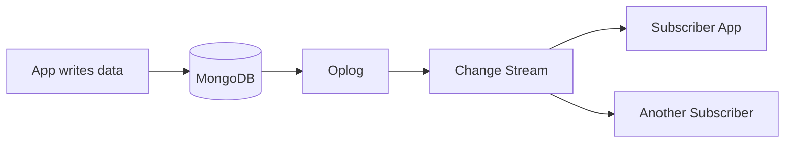

# How to Build Real-Time Sync with MongoDB Change Streams

Author: [nawazdhandala](https://www.github.com/nawazdhandala)

Tags: MongoDB, Change Streams, Real-Time, Event-Driven, Database

Description: Learn how to use MongoDB Change Streams for real-time data synchronization, event-driven architectures, and building reactive applications.

---

Polling a database for changes wastes resources and introduces latency. MongoDB Change Streams let you subscribe to data changes in real time. When a document is inserted, updated, or deleted, your application receives a notification immediately. This enables real-time dashboards, cache invalidation, event-driven microservices, and data synchronization.

## How Change Streams Work

Change Streams use the MongoDB oplog (operation log) to track changes. Your application opens a cursor that receives change events as they occur.



Requirements:
- Replica set or sharded cluster (not standalone)
- MongoDB 3.6+ for collection-level streams
- MongoDB 4.0+ for database and cluster-level streams

## Basic Change Stream Usage

### Watching a Collection

```javascript
const { MongoClient } = require('mongodb');

const client = new MongoClient(uri);

async function watchOrders() {
  await client.connect();
  const collection = client.db('shop').collection('orders');

  // Open change stream
  const changeStream = collection.watch();

  // Listen for changes
  changeStream.on('change', (change) => {
    console.log('Change detected:', change);

    switch (change.operationType) {
      case 'insert':
        console.log('New order:', change.fullDocument);
        break;
      case 'update':
        console.log('Order updated:', change.documentKey._id);
        console.log('Changed fields:', change.updateDescription.updatedFields);
        break;
      case 'delete':
        console.log('Order deleted:', change.documentKey._id);
        break;
    }
  });

  changeStream.on('error', (error) => {
    console.error('Change stream error:', error);
  });
}
```

### Using Async Iterator

```javascript
async function watchWithIterator() {
  const collection = client.db('shop').collection('orders');
  const changeStream = collection.watch();

  // Process changes with for-await
  for await (const change of changeStream) {
    console.log('Received change:', change.operationType);
    await processChange(change);
  }
}
```

## Change Event Structure

Every change event contains these fields:

```javascript
{
  // Unique identifier for this change event
  "_id": { "_data": "..." },

  // Type: insert, update, replace, delete, drop, rename, dropDatabase
  "operationType": "update",

  // When the change occurred
  "clusterTime": Timestamp({ t: 1706180400, i: 1 }),

  // Namespace
  "ns": { "db": "shop", "coll": "orders" },

  // Document identifier
  "documentKey": { "_id": ObjectId("...") },

  // For updates: what changed
  "updateDescription": {
    "updatedFields": { "status": "shipped" },
    "removedFields": [],
    "truncatedArrays": []
  },

  // Full document (if requested)
  "fullDocument": { ... }
}
```

## Filtering Changes

Use aggregation pipeline stages to filter events:

```javascript
// Only watch for specific operation types
const changeStream = collection.watch([
  { $match: { operationType: { $in: ['insert', 'update'] } } }
]);

// Filter by document fields
const changeStream = collection.watch([
  {
    $match: {
      'fullDocument.status': 'pending',
      'fullDocument.amount': { $gt: 1000 }
    }
  }
]);

// Filter by updated fields
const changeStream = collection.watch([
  {
    $match: {
      'updateDescription.updatedFields.status': { $exists: true }
    }
  }
]);
```

### Projecting Fields

```javascript
// Only return specific fields
const changeStream = collection.watch([
  {
    $project: {
      operationType: 1,
      'documentKey._id': 1,
      'fullDocument.orderId': 1,
      'fullDocument.status': 1
    }
  }
]);
```

## Getting the Full Document

By default, update events only include changed fields. Request the full document:

```javascript
const changeStream = collection.watch([], {
  // Get document after the change
  fullDocument: 'updateLookup'
});

// Now update events include fullDocument
changeStream.on('change', (change) => {
  if (change.operationType === 'update') {
    console.log('Full document:', change.fullDocument);
  }
});
```

Options:
- `default`: No full document for updates
- `updateLookup`: Fetch current document (may differ if changed again)
- `whenAvailable`: Return if stored (MongoDB 6.0+)
- `required`: Fail if not available (MongoDB 6.0+)

## Resuming Change Streams

Change streams can resume from where they left off using resume tokens:

```javascript
let resumeToken = null;

async function watchWithResume() {
  const collection = client.db('shop').collection('orders');

  // Start from saved token if available
  const options = resumeToken
    ? { resumeAfter: resumeToken }
    : {};

  const changeStream = collection.watch([], options);

  for await (const change of changeStream) {
    // Save token for each event
    resumeToken = change._id;
    await saveResumeToken(resumeToken);

    await processChange(change);
  }
}

// Persist token to survive restarts
async function saveResumeToken(token) {
  await client.db('app').collection('stream_state').updateOne(
    { _id: 'orders_stream' },
    { $set: { token, updatedAt: new Date() } },
    { upsert: true }
  );
}

async function loadResumeToken() {
  const state = await client.db('app').collection('stream_state')
    .findOne({ _id: 'orders_stream' });
  return state?.token;
}
```

### Resume vs Start Options

```javascript
// Resume from specific token (exact position)
collection.watch([], { resumeAfter: token });

// Start after specific token (next event)
collection.watch([], { startAfter: token });

// Start from specific time
collection.watch([], {
  startAtOperationTime: new Timestamp({ t: 1706180400, i: 1 })
});
```

## Watching Database and Cluster

### Database-Level Changes

```javascript
// Watch all collections in a database
const changeStream = client.db('shop').watch();

changeStream.on('change', (change) => {
  console.log(`Collection ${change.ns.coll}: ${change.operationType}`);
});
```

### Cluster-Level Changes

```javascript
// Watch all databases (requires special permissions)
const changeStream = client.watch();

changeStream.on('change', (change) => {
  console.log(`${change.ns.db}.${change.ns.coll}: ${change.operationType}`);
});
```

## Practical Example: Real-Time Dashboard

```javascript
const WebSocket = require('ws');

async function startDashboardServer() {
  const wss = new WebSocket.Server({ port: 8080 });
  const clients = new Set();

  wss.on('connection', (ws) => {
    clients.add(ws);
    ws.on('close', () => clients.delete(ws));
  });

  await client.connect();
  const ordersStream = client.db('shop').collection('orders').watch([
    { $match: { operationType: { $in: ['insert', 'update'] } } }
  ], { fullDocument: 'updateLookup' });

  ordersStream.on('change', (change) => {
    const message = JSON.stringify({
      type: change.operationType,
      orderId: change.documentKey._id,
      status: change.fullDocument?.status,
      total: change.fullDocument?.total,
      timestamp: new Date()
    });

    // Broadcast to all connected clients
    for (const client of clients) {
      if (client.readyState === WebSocket.OPEN) {
        client.send(message);
      }
    }
  });

  console.log('Dashboard server running on ws://localhost:8080');
}
```

## Practical Example: Cache Invalidation

```javascript
const Redis = require('ioredis');
const redis = new Redis();

async function watchForCacheInvalidation() {
  await client.connect();

  const changeStream = client.db('shop').collection('products').watch([
    { $match: { operationType: { $in: ['update', 'delete', 'replace'] } } }
  ]);

  for await (const change of changeStream) {
    const productId = change.documentKey._id.toString();
    const cacheKey = `product:${productId}`;

    switch (change.operationType) {
      case 'update':
      case 'replace':
        // Invalidate or update cache
        await redis.del(cacheKey);
        console.log(`Cache invalidated for product ${productId}`);
        break;

      case 'delete':
        await redis.del(cacheKey);
        await redis.srem('product:list', productId);
        console.log(`Cache removed for deleted product ${productId}`);
        break;
    }
  }
}
```

## Practical Example: Event-Driven Microservice

```javascript
const amqp = require('amqplib');

async function publishChangesToQueue() {
  const connection = await amqp.connect('amqp://localhost');
  const channel = await connection.createChannel();
  await channel.assertExchange('order_events', 'topic', { durable: true });

  await client.connect();
  const changeStream = client.db('shop').collection('orders').watch([], {
    fullDocument: 'updateLookup'
  });

  for await (const change of changeStream) {
    const routingKey = `order.${change.operationType}`;
    const message = {
      eventId: change._id._data,
      type: change.operationType,
      orderId: change.documentKey._id,
      data: change.fullDocument,
      timestamp: change.clusterTime
    };

    channel.publish(
      'order_events',
      routingKey,
      Buffer.from(JSON.stringify(message)),
      { persistent: true }
    );

    console.log(`Published ${routingKey}`);
  }
}
```

## Error Handling and Resilience

```javascript
async function resilientChangeStream() {
  let resumeToken = await loadResumeToken();

  while (true) {
    try {
      const options = resumeToken ? { resumeAfter: resumeToken } : {};
      const changeStream = collection.watch([], options);

      for await (const change of changeStream) {
        resumeToken = change._id;
        await saveResumeToken(resumeToken);
        await processChange(change);
      }

    } catch (error) {
      if (error.code === 40573) {
        // Resume token expired, start fresh
        console.log('Resume token expired, starting from current time');
        resumeToken = null;
      } else {
        console.error('Change stream error:', error);
      }

      // Wait before reconnecting
      await new Promise(resolve => setTimeout(resolve, 5000));
    }
  }
}
```

## Performance Considerations

1. **Filter early**: Use pipeline stages to reduce events processed
2. **Process quickly**: Slow processing causes backpressure
3. **Use resume tokens**: Enable recovery without reprocessing
4. **Monitor oplog size**: Resume tokens expire when events fall off oplog

```javascript
// Check oplog window
const oplogInfo = await client.db('local').collection('oplog.rs')
  .aggregate([
    { $group: { _id: null, oldest: { $min: '$ts' }, newest: { $max: '$ts' } } }
  ]).toArray();

const windowMs = (oplogInfo[0].newest.getTime() - oplogInfo[0].oldest.getTime()) * 1000;
console.log(`Oplog window: ${windowMs / 3600000} hours`);
```

---

Change Streams transform MongoDB from a passive data store into an active event source. Use them for real-time features, microservice integration, and cache synchronization. Remember to persist resume tokens and handle reconnection gracefully for production deployments.
