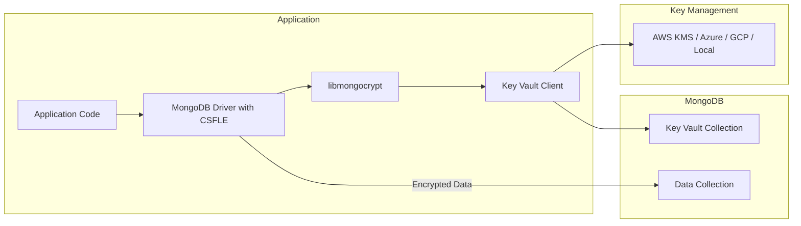

# How to Encrypt Fields with MongoDB Client-Side Encryption

Author: [nawazdhandala](https://www.github.com/nawazdhandala)

Tags: MongoDB, Encryption, Client-Side, Security, Data Protection

Description: Learn how to implement MongoDB Client-Side Field Level Encryption to protect sensitive data before it reaches the database, with practical examples for both automatic and explicit encryption.

---

Client-Side Field Level Encryption (CSFLE) encrypts sensitive fields in your application before sending them to MongoDB. The server never sees the plaintext data, which provides protection against database breaches, unauthorized admin access, and network interception. Even if someone gains access to your database, they cannot read encrypted fields without the encryption keys.

## How CSFLE Works



## Setting Up the Key Vault

First, create a key vault to store data encryption keys (DEKs).

```javascript
const { MongoClient, ClientEncryption } = require('mongodb');

// Local master key for development (use KMS in production!)
const localMasterKey = require('crypto').randomBytes(96);

async function setupKeyVault() {
  const client = new MongoClient('mongodb://localhost:27017');
  await client.connect();

  const keyVaultNamespace = 'encryption.__keyVault';
  const keyVaultDB = client.db('encryption');
  const keyVaultColl = keyVaultDB.collection('__keyVault');

  // Create unique index on keyAltNames
  await keyVaultColl.createIndex(
    { keyAltNames: 1 },
    {
      unique: true,
      partialFilterExpression: { keyAltNames: { $exists: true } }
    }
  );

  // Create ClientEncryption object
  const encryption = new ClientEncryption(client, {
    keyVaultNamespace,
    kmsProviders: {
      local: { key: localMasterKey }
    }
  });

  // Create a data encryption key
  const dataKeyId = await encryption.createDataKey('local', {
    keyAltNames: ['myDataKey']
  });

  console.log('Data Key ID:', dataKeyId.toString('base64'));

  await client.close();
  return dataKeyId;
}
```

## Automatic Encryption with Schema Map

Define which fields to encrypt and how in a JSON schema.

```javascript
const { MongoClient, Binary } = require('mongodb');

// Schema defining encrypted fields
function createEncryptedFieldsSchema(dataKeyId) {
  return {
    bsonType: 'object',
    encryptMetadata: {
      keyId: [dataKeyId]
    },
    properties: {
      // SSN: encrypted, cannot be queried
      ssn: {
        encrypt: {
          bsonType: 'string',
          algorithm: 'AEAD_AES_256_CBC_HMAC_SHA_512-Random'
        }
      },
      // Credit card: encrypted, cannot be queried
      creditCard: {
        encrypt: {
          bsonType: 'object',
          algorithm: 'AEAD_AES_256_CBC_HMAC_SHA_512-Random'
        }
      },
      // Email: encrypted but queryable (deterministic)
      email: {
        encrypt: {
          bsonType: 'string',
          algorithm: 'AEAD_AES_256_CBC_HMAC_SHA_512-Deterministic'
        }
      }
    }
  };
}

async function createEncryptedClient(dataKeyId) {
  const keyVaultNamespace = 'encryption.__keyVault';

  const schemaMap = {
    'mydb.users': createEncryptedFieldsSchema(dataKeyId)
  };

  const client = new MongoClient('mongodb://localhost:27017', {
    autoEncryption: {
      keyVaultNamespace,
      kmsProviders: {
        local: { key: localMasterKey }
      },
      schemaMap,
      // Require encrypted client for these collections
      bypassAutoEncryption: false
    }
  });

  await client.connect();
  return client;
}
```

## Using Automatic Encryption

With automatic encryption configured, the driver handles encryption/decryption transparently.

```javascript
async function demonstrateAutoEncryption() {
  const dataKeyId = await setupKeyVault();
  const client = await createEncryptedClient(dataKeyId);

  const users = client.db('mydb').collection('users');

  // Insert - fields are automatically encrypted
  await users.insertOne({
    name: 'John Doe',                    // Plaintext
    email: 'john@example.com',           // Encrypted (deterministic)
    ssn: '123-45-6789',                  // Encrypted (random)
    creditCard: {                        // Encrypted (random)
      number: '4111111111111111',
      expiry: '12/25',
      cvv: '123'
    },
    createdAt: new Date()                // Plaintext
  });

  // Query by encrypted field (only works with deterministic encryption)
  const user = await users.findOne({ email: 'john@example.com' });
  console.log('Found user:', user);
  // Output shows decrypted values automatically

  // Direct database access shows encrypted values
  const directClient = new MongoClient('mongodb://localhost:27017');
  await directClient.connect();
  const rawUser = await directClient.db('mydb').collection('users').findOne({});
  console.log('Raw document:', rawUser);
  // email, ssn, creditCard appear as Binary/encrypted

  await client.close();
  await directClient.close();
}
```

## Explicit Encryption for More Control

Use explicit encryption when you need fine-grained control over what gets encrypted.

```javascript
async function explicitEncryptionExample() {
  const client = new MongoClient('mongodb://localhost:27017');
  await client.connect();

  const encryption = new ClientEncryption(client, {
    keyVaultNamespace: 'encryption.__keyVault',
    kmsProviders: {
      local: { key: localMasterKey }
    }
  });

  // Explicitly encrypt a value
  const encryptedSSN = await encryption.encrypt(
    '123-45-6789',
    {
      keyAltName: 'myDataKey',
      algorithm: 'AEAD_AES_256_CBC_HMAC_SHA_512-Random'
    }
  );

  // Store encrypted value
  await client.db('mydb').collection('sensitive').insertOne({
    userId: 'user123',
    ssn: encryptedSSN,  // Already encrypted
    notes: 'Regular text'
  });

  // Retrieve and explicitly decrypt
  const doc = await client.db('mydb').collection('sensitive').findOne({
    userId: 'user123'
  });

  const decryptedSSN = await encryption.decrypt(doc.ssn);
  console.log('Decrypted SSN:', decryptedSSN);

  await client.close();
}
```

## Using AWS KMS for Production

Replace local keys with AWS KMS for production deployments.

```javascript
async function setupWithAWSKMS() {
  // AWS credentials
  const kmsProviders = {
    aws: {
      accessKeyId: process.env.AWS_ACCESS_KEY_ID,
      secretAccessKey: process.env.AWS_SECRET_ACCESS_KEY
    }
  };

  // Master key configuration
  const masterKey = {
    key: 'arn:aws:kms:us-east-1:123456789012:key/abcd1234-ab12-cd34-ef56-abcdef123456',
    region: 'us-east-1'
  };

  const client = new MongoClient('mongodb://localhost:27017');
  await client.connect();

  const encryption = new ClientEncryption(client, {
    keyVaultNamespace: 'encryption.__keyVault',
    kmsProviders
  });

  // Create data key with AWS KMS
  const dataKeyId = await encryption.createDataKey('aws', {
    masterKey,
    keyAltNames: ['productionKey']
  });

  console.log('Created AWS KMS data key:', dataKeyId);

  // Use this key ID in your schema map
  return dataKeyId;
}

// Client configuration for AWS KMS
const autoEncryptionOptions = {
  keyVaultNamespace: 'encryption.__keyVault',
  kmsProviders: {
    aws: {
      accessKeyId: process.env.AWS_ACCESS_KEY_ID,
      secretAccessKey: process.env.AWS_SECRET_ACCESS_KEY
    }
  },
  schemaMap: {
    'mydb.users': userSchema
  }
};
```

## Encryption Algorithms

MongoDB CSFLE offers two encryption algorithms:

**Deterministic (AEAD_AES_256_CBC_HMAC_SHA_512-Deterministic)**
- Same plaintext always produces same ciphertext
- Enables equality queries on encrypted fields
- Use for: email lookup, finding by ID
- Risk: Pattern analysis if values repeat frequently

**Random (AEAD_AES_256_CBC_HMAC_SHA_512-Random)**
- Same plaintext produces different ciphertext each time
- Cannot query encrypted field
- More secure against pattern analysis
- Use for: SSN, credit cards, medical records

```javascript
const schemaWithBothAlgorithms = {
  bsonType: 'object',
  properties: {
    // Queryable - use deterministic
    accountNumber: {
      encrypt: {
        keyId: [dataKeyId],
        bsonType: 'string',
        algorithm: 'AEAD_AES_256_CBC_HMAC_SHA_512-Deterministic'
      }
    },
    // Not queryable - use random for better security
    taxId: {
      encrypt: {
        keyId: [dataKeyId],
        bsonType: 'string',
        algorithm: 'AEAD_AES_256_CBC_HMAC_SHA_512-Random'
      }
    }
  }
};
```

## Python Implementation

```python
from pymongo import MongoClient
from pymongo.encryption import ClientEncryption, Algorithm
from pymongo.encryption_options import AutoEncryptionOpts
from bson.codec_options import CodecOptions
from bson import Binary
import os

# Local master key (use KMS in production)
local_master_key = os.urandom(96)

def setup_encryption():
    # Key vault setup
    client = MongoClient('mongodb://localhost:27017')

    key_vault_namespace = 'encryption.__keyVault'

    client_encryption = ClientEncryption(
        kms_providers={'local': {'key': local_master_key}},
        key_vault_namespace=key_vault_namespace,
        key_vault_client=client,
        codec_options=CodecOptions()
    )

    # Create data key
    data_key_id = client_encryption.create_data_key(
        'local',
        key_alt_names=['pythonKey']
    )

    return data_key_id

def create_encrypted_client(data_key_id):
    # Schema for automatic encryption
    json_schema = {
        'bsonType': 'object',
        'properties': {
            'ssn': {
                'encrypt': {
                    'keyId': [data_key_id],
                    'bsonType': 'string',
                    'algorithm': Algorithm.AEAD_AES_256_CBC_HMAC_SHA_512_Random
                }
            }
        }
    }

    auto_encryption_opts = AutoEncryptionOpts(
        kms_providers={'local': {'key': local_master_key}},
        key_vault_namespace='encryption.__keyVault',
        schema_map={'mydb.users': json_schema}
    )

    return MongoClient(
        'mongodb://localhost:27017',
        auto_encryption_opts=auto_encryption_opts
    )

# Usage
data_key = setup_encryption()
client = create_encrypted_client(data_key)

# Insert with automatic encryption
client.mydb.users.insert_one({
    'name': 'Jane Doe',
    'ssn': '987-65-4321'  # Automatically encrypted
})

# Read with automatic decryption
user = client.mydb.users.find_one({'name': 'Jane Doe'})
print(f"SSN: {user['ssn']}")  # Automatically decrypted
```

## Key Rotation

Periodically rotate data encryption keys for security.

```javascript
async function rotateDataKey(encryption, oldKeyAltName, newKeyAltName) {
  // Create new data key
  const newKeyId = await encryption.createDataKey('aws', {
    masterKey: {
      key: process.env.AWS_KMS_KEY_ARN,
      region: 'us-east-1'
    },
    keyAltNames: [newKeyAltName]
  });

  console.log('Created new key:', newKeyId);

  // Re-encrypt existing data with new key
  // This requires reading, decrypting with old key, encrypting with new key
  const client = encryption._client;
  const collection = client.db('mydb').collection('users');

  const cursor = collection.find({});

  for await (const doc of cursor) {
    // Decrypt with old key (automatic if using encrypted client)
    const plaintext = doc.ssn;

    // Encrypt with new key
    const newEncrypted = await encryption.encrypt(plaintext, {
      keyAltName: newKeyAltName,
      algorithm: 'AEAD_AES_256_CBC_HMAC_SHA_512-Random'
    });

    // Update document
    await collection.updateOne(
      { _id: doc._id },
      { $set: { ssn: newEncrypted } }
    );
  }

  console.log('Key rotation complete');
}
```

## Best Practices

**Key Management:**
- Use a cloud KMS (AWS, Azure, GCP) for production
- Store master keys separately from MongoDB
- Implement key rotation procedures

**Field Selection:**
- Only encrypt truly sensitive fields (performance cost)
- Use deterministic encryption sparingly
- Random encryption for highly sensitive data

**Application Design:**
- Handle encryption errors gracefully
- Test with both encrypted and unencrypted clients
- Document which fields are encrypted

```javascript
// Error handling for encryption failures
async function safeInsert(collection, document) {
  try {
    return await collection.insertOne(document);
  } catch (error) {
    if (error.message.includes('encryption')) {
      console.error('Encryption failed:', error.message);
      // Log without sensitive data
      throw new Error('Failed to secure data for storage');
    }
    throw error;
  }
}
```

## Summary

Client-Side Field Level Encryption provides defense-in-depth for sensitive data:

- Data is encrypted before leaving your application
- MongoDB server never sees plaintext sensitive fields
- Use deterministic encryption only when you need to query the field
- Use AWS/Azure/GCP KMS for production key management
- Plan for key rotation from the start

CSFLE adds complexity but provides protection that server-side encryption cannot match. Use it for data that would cause significant harm if exposed.
