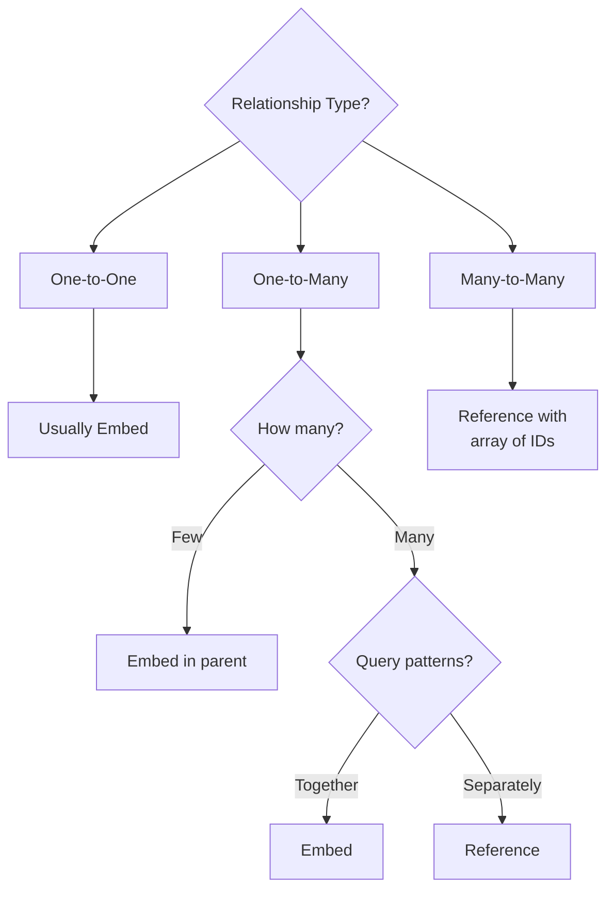

# How to Model Relationships in MongoDB

Author: [nawazdhandala](https://www.github.com/nawazdhandala)

Tags: MongoDB, Data Modeling, Schema Design, NoSQL, Database Architecture

Description: Learn how to model one-to-one, one-to-many, and many-to-many relationships in MongoDB, with practical guidance on when to embed versus reference documents.

---

MongoDB does not enforce relationships like relational databases do, but your data still has relationships. Users have orders. Orders have items. Items belong to categories. How you model these relationships affects query performance, data integrity, and application complexity. The key decision is whether to embed related data or reference it.

## The Embedding vs Referencing Decision



## One-to-One Relationships

When one document has exactly one related document.

### Embedding (Recommended)

```javascript
// User with profile - embedded
{
  _id: ObjectId("..."),
  email: "user@example.com",
  password: "hashed_password",
  profile: {
    firstName: "John",
    lastName: "Doe",
    avatar: "https://...",
    bio: "Software developer",
    location: "New York"
  },
  settings: {
    theme: "dark",
    notifications: true,
    language: "en"
  }
}
```

**Embed when:**
- Data is always accessed together
- Related document is not shared with others
- Combined document stays under 16MB limit

### Referencing (When Necessary)

```javascript
// User document
{
  _id: ObjectId("user_1"),
  email: "user@example.com",
  profileId: ObjectId("profile_1")  // Reference
}

// Separate profile collection
{
  _id: ObjectId("profile_1"),
  userId: ObjectId("user_1"),
  firstName: "John",
  lastName: "Doe",
  avatar: "https://..."
}
```

**Reference when:**
- Related document is very large
- You need to query the related document independently
- The related document might be shared (rare for 1:1)

## One-to-Many Relationships

One parent document has multiple child documents.

### Pattern 1: Embed Array (Few Children)

Best for small, bounded arrays that are accessed with the parent.

```javascript
// Order with embedded items (few items per order)
{
  _id: ObjectId("order_1"),
  customerId: ObjectId("customer_1"),
  status: "shipped",
  items: [
    {
      productId: ObjectId("prod_1"),
      name: "Widget",
      quantity: 2,
      price: 15.99
    },
    {
      productId: ObjectId("prod_2"),
      name: "Gadget",
      quantity: 1,
      price: 29.99
    }
  ],
  total: 61.97,
  createdAt: ISODate("2026-01-25T10:00:00Z")
}
```

**Advantages:**
- Single query retrieves everything
- Atomic updates to parent and children
- No joins needed

**Use when:**
- Array is bounded (e.g., items per order, addresses per user)
- Children are always accessed with parent
- Array will not grow indefinitely

### Pattern 2: Child References (Many Children)

Store references in the parent when you need to query children separately.

```javascript
// Blog post with comment IDs
{
  _id: ObjectId("post_1"),
  title: "MongoDB Data Modeling",
  content: "...",
  commentIds: [
    ObjectId("comment_1"),
    ObjectId("comment_2"),
    ObjectId("comment_3")
  ]
}

// Comments collection
{
  _id: ObjectId("comment_1"),
  postId: ObjectId("post_1"),  // Back-reference for queries
  author: "Jane",
  text: "Great post!",
  createdAt: ISODate("2026-01-25T12:00:00Z")
}
```

Query with $lookup:

```javascript
db.posts.aggregate([
  { $match: { _id: ObjectId("post_1") } },
  {
    $lookup: {
      from: "comments",
      localField: "commentIds",
      foreignField: "_id",
      as: "comments"
    }
  }
]);
```

### Pattern 3: Parent Reference (Very Many Children)

Store reference to parent in each child. Best for unbounded relationships.

```javascript
// Blog post (no comment references)
{
  _id: ObjectId("post_1"),
  title: "MongoDB Data Modeling",
  content: "...",
  commentCount: 1523  // Denormalized count
}

// Comments reference the post
{
  _id: ObjectId("comment_1"),
  postId: ObjectId("post_1"),  // Parent reference
  author: "Jane",
  text: "Great post!",
  createdAt: ISODate("2026-01-25T12:00:00Z")
}

// Index for efficient queries
db.comments.createIndex({ postId: 1, createdAt: -1 });

// Get comments for a post
db.comments.find({ postId: ObjectId("post_1") })
  .sort({ createdAt: -1 })
  .limit(20);
```

**Use when:**
- Children can number in thousands or more
- Children are often queried independently
- Children might belong to different parents over time

## Many-to-Many Relationships

Both sides can have multiple related documents.

### Pattern 1: Array of References

```javascript
// Student document
{
  _id: ObjectId("student_1"),
  name: "Alice",
  enrolledCourseIds: [
    ObjectId("course_1"),
    ObjectId("course_2"),
    ObjectId("course_3")
  ]
}

// Course document
{
  _id: ObjectId("course_1"),
  title: "Introduction to MongoDB",
  enrolledStudentIds: [
    ObjectId("student_1"),
    ObjectId("student_2")
  ]
}
```

Query students in a course:

```javascript
db.students.find({
  enrolledCourseIds: ObjectId("course_1")
});
```

Query courses for a student:

```javascript
db.courses.find({
  enrolledStudentIds: ObjectId("student_1")
});
```

**Note:** Keeping both arrays synchronized requires careful application logic.

### Pattern 2: Junction Collection

For relationships with metadata or very large cardinality:

```javascript
// Students collection
{
  _id: ObjectId("student_1"),
  name: "Alice"
}

// Courses collection
{
  _id: ObjectId("course_1"),
  title: "Introduction to MongoDB"
}

// Enrollments junction collection
{
  _id: ObjectId("enrollment_1"),
  studentId: ObjectId("student_1"),
  courseId: ObjectId("course_1"),
  enrolledAt: ISODate("2026-01-15T00:00:00Z"),
  grade: "A",
  status: "completed"
}

// Indexes for both directions
db.enrollments.createIndex({ studentId: 1, courseId: 1 }, { unique: true });
db.enrollments.createIndex({ courseId: 1 });
```

Query with aggregation:

```javascript
// Get student with all courses
db.students.aggregate([
  { $match: { _id: ObjectId("student_1") } },
  {
    $lookup: {
      from: "enrollments",
      localField: "_id",
      foreignField: "studentId",
      as: "enrollments"
    }
  },
  {
    $lookup: {
      from: "courses",
      localField: "enrollments.courseId",
      foreignField: "_id",
      as: "courses"
    }
  }
]);
```

## Denormalization Strategies

### Duplicate Frequently Accessed Data

```javascript
// Order with denormalized product names and prices
// (original product might change, but order should reflect purchase-time values)
{
  _id: ObjectId("order_1"),
  items: [
    {
      productId: ObjectId("prod_1"),
      // Denormalized at purchase time
      name: "Widget Pro",
      price: 15.99,
      quantity: 2
    }
  ]
}
```

### Computed Fields

```javascript
// Maintain computed counts
{
  _id: ObjectId("post_1"),
  title: "MongoDB Guide",
  commentCount: 42,      // Updated when comments change
  likeCount: 128,        // Updated when likes change
  lastActivityAt: ISODate("2026-01-25T15:30:00Z")
}

// Update count when adding comment
db.posts.updateOne(
  { _id: postId },
  {
    $inc: { commentCount: 1 },
    $set: { lastActivityAt: new Date() }
  }
);
```

### Materialized Views

Pre-compute complex aggregations:

```javascript
// Real-time: Calculate user stats on demand (slow)
db.orders.aggregate([
  { $match: { customerId: userId } },
  { $group: { _id: null, totalSpent: { $sum: "$total" }, orderCount: { $sum: 1 } } }
]);

// Better: Maintain materialized view
{
  _id: ObjectId("user_1"),
  email: "user@example.com",
  stats: {
    totalOrders: 47,
    totalSpent: 2341.52,
    lastOrderDate: ISODate("2026-01-20T00:00:00Z")
  }
}

// Update stats when order is placed
db.users.updateOne(
  { _id: customerId },
  {
    $inc: { "stats.totalOrders": 1, "stats.totalSpent": orderTotal },
    $set: { "stats.lastOrderDate": new Date() }
  }
);
```

## Practical Example: E-commerce Schema

```javascript
// Products collection
{
  _id: ObjectId("prod_1"),
  name: "Wireless Headphones",
  slug: "wireless-headphones",
  price: 79.99,
  categoryIds: [ObjectId("cat_1"), ObjectId("cat_2")],  // Many-to-many
  inventory: {
    quantity: 150,
    warehouse: "us-east"
  },
  ratings: {
    average: 4.5,
    count: 234
  }
}

// Categories collection (self-referential for hierarchy)
{
  _id: ObjectId("cat_1"),
  name: "Electronics",
  slug: "electronics",
  parentId: null,  // Root category
  path: ["electronics"],
  productCount: 1250
}

{
  _id: ObjectId("cat_2"),
  name: "Audio",
  slug: "audio",
  parentId: ObjectId("cat_1"),
  path: ["electronics", "audio"],
  productCount: 324
}

// Orders collection
{
  _id: ObjectId("order_1"),
  orderNumber: "ORD-2026-001234",
  customerId: ObjectId("user_1"),
  status: "shipped",

  // Denormalized customer info at order time
  shippingAddress: {
    name: "John Doe",
    street: "123 Main St",
    city: "New York",
    state: "NY",
    zip: "10001"
  },

  // Embedded items with denormalized product data
  items: [
    {
      productId: ObjectId("prod_1"),
      sku: "WH-001",
      name: "Wireless Headphones",  // Snapshot at purchase
      price: 79.99,                  // Price at purchase
      quantity: 1
    }
  ],

  subtotal: 79.99,
  tax: 7.12,
  shipping: 5.99,
  total: 93.10,

  createdAt: ISODate("2026-01-25T10:00:00Z"),
  updatedAt: ISODate("2026-01-25T14:30:00Z")
}

// Users collection
{
  _id: ObjectId("user_1"),
  email: "john@example.com",
  profile: {
    firstName: "John",
    lastName: "Doe"
  },
  addresses: [  // Embedded array of addresses
    {
      id: "addr_1",
      type: "shipping",
      street: "123 Main St",
      city: "New York",
      state: "NY",
      zip: "10001",
      isDefault: true
    }
  ],
  stats: {
    orderCount: 12,
    totalSpent: 1234.56,
    lastOrderDate: ISODate("2026-01-25T10:00:00Z")
  }
}
```

## Decision Framework

| Factor | Embed | Reference |
|--------|-------|-----------|
| Data accessed together | Yes | No |
| Data changes frequently | Reference | Embed if small |
| Array is bounded | Embed | Reference if unbounded |
| Need atomic updates | Embed | Requires transactions |
| Document size | Small (<16MB) | Large |
| Query patterns | Single collection | Multiple collections |

---

Good MongoDB schema design requires understanding your access patterns. Embed for data accessed together, reference for independently queried data, and denormalize strategically for read performance. The right model depends on how your application uses the data, not just how the data is logically related.
