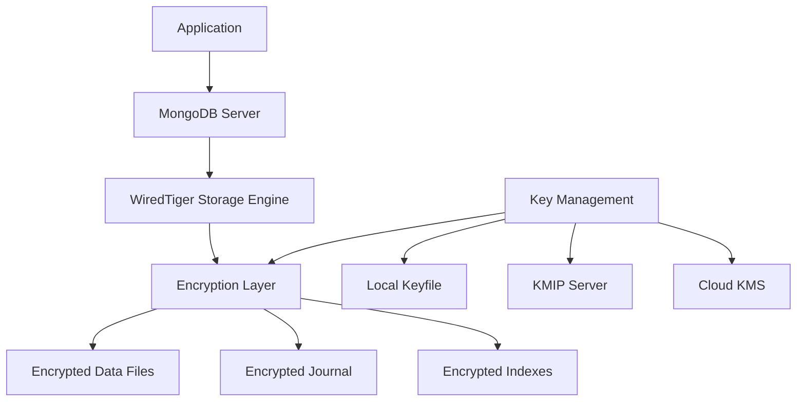

# How to Enable Encryption at Rest in MongoDB

Author: [nawazdhandala](https://www.github.com/nawazdhandala)

Tags: MongoDB, Encryption, Security, Data Protection, Enterprise

Description: Learn how to configure encryption at rest in MongoDB to protect data stored on disk, including key management options and step-by-step setup instructions.

---

Encryption at rest protects your MongoDB data when it is stored on disk. Even if an attacker gains physical access to your storage drives or backup files, they cannot read the data without the encryption keys. This is a critical security layer for compliance with regulations like GDPR, HIPAA, and PCI-DSS.

## How Encryption at Rest Works in MongoDB

MongoDB Enterprise and MongoDB Atlas support native encryption at rest using the WiredTiger storage engine. The encryption happens at the storage layer, meaning all data files, journals, and indexes are encrypted transparently.



## Encryption Methods Available

MongoDB supports several key management approaches:

1. **Local Keyfile**: Simplest setup, key stored in a file on disk
2. **KMIP**: Integration with Key Management Interoperability Protocol servers
3. **Cloud KMS**: AWS KMS, Azure Key Vault, or Google Cloud KMS

## Setting Up Local Keyfile Encryption

For development or simpler deployments, local keyfile encryption provides basic protection.

```bash
# Generate a 32-byte encryption key
# This key must be stored securely and backed up
openssl rand -base64 32 > /etc/mongodb/encryption-keyfile

# Set strict permissions on the keyfile
# MongoDB requires the keyfile to be readable only by the mongodb user
chmod 600 /etc/mongodb/encryption-keyfile
chown mongodb:mongodb /etc/mongodb/encryption-keyfile
```

Configure MongoDB to use the keyfile:

```yaml
# /etc/mongod.conf
# MongoDB configuration with encryption at rest enabled

storage:
  dbPath: /var/lib/mongodb
  journal:
    enabled: true

  # WiredTiger encryption configuration
  wiredTiger:
    engineConfig:
      # Enable encryption at rest
      encryptionCipherMode: AES256-CBC
      encryptionKeyFile: /etc/mongodb/encryption-keyfile

security:
  # Enable authorization for additional security
  authorization: enabled

  # Encryption key rotation interval (optional)
  # encryptionKeyRotationIntervalSec: 86400
```

Restart MongoDB to apply changes:

```bash
# Restart MongoDB service
sudo systemctl restart mongod

# Verify encryption is enabled
mongosh --eval "db.serverStatus().wiredTiger.encryptionAtRest"
```

## Configuring KMIP Integration

For production environments, integrate with a KMIP server for centralized key management.

```yaml
# /etc/mongod.conf
# KMIP configuration for enterprise key management

storage:
  dbPath: /var/lib/mongodb
  wiredTiger:
    engineConfig:
      # Use KMIP for key management
      encryptionCipherMode: AES256-CBC

security:
  # KMIP server connection settings
  kmip:
    serverName: kmip.example.com
    port: 5696

    # TLS certificates for KMIP connection
    clientCertificateFile: /etc/mongodb/kmip-client.pem
    serverCAFile: /etc/mongodb/kmip-ca.pem

    # Key identifier (optional, for specific key)
    keyIdentifier: "mongodb-encryption-key-prod"
```

## AWS KMS Integration

When running on AWS, integrate with AWS Key Management Service for managed encryption keys.

```yaml
# /etc/mongod.conf
# AWS KMS configuration

storage:
  wiredTiger:
    engineConfig:
      encryptionCipherMode: AES256-CBC

security:
  # AWS KMS configuration
  kms:
    aws:
      # KMS key ARN
      keyId: "arn:aws:kms:us-east-1:123456789:key/abc123-def456"
      # AWS region
      region: "us-east-1"
      # Optional: specify credentials file
      # accessKeyId and secretAccessKey can also be environment variables
```

Set up AWS credentials for MongoDB:

```bash
# Option 1: Environment variables
export AWS_ACCESS_KEY_ID="your-access-key"
export AWS_SECRET_ACCESS_KEY="your-secret-key"

# Option 2: IAM role (recommended for EC2 instances)
# Attach an IAM role with KMS permissions to the EC2 instance

# Required IAM permissions for the role
# {
#   "Version": "2012-10-17",
#   "Statement": [
#     {
#       "Effect": "Allow",
#       "Action": [
#         "kms:Decrypt",
#         "kms:Encrypt",
#         "kms:GenerateDataKey"
#       ],
#       "Resource": "arn:aws:kms:us-east-1:123456789:key/abc123-def456"
#     }
#   ]
# }
```

## Verifying Encryption Status

After enabling encryption, verify it is working correctly.

```javascript
// Connect to MongoDB and check encryption status
const status = db.serverStatus();

// Check WiredTiger encryption settings
print("Encryption at rest status:");
printjson(status.wiredTiger.encryptionAtRest);

// Expected output for enabled encryption:
// {
//   "cipher": "AES256-CBC",
//   "enabled": true,
//   "keySource": "kmip" // or "keyfile"
// }
```

Verify data files are encrypted:

```bash
# Attempt to read data file directly (should show encrypted/unreadable content)
hexdump -C /var/lib/mongodb/collection-*.wt | head -20

# Without encryption, you would see readable strings
# With encryption, output appears as random bytes
```

## Encrypting Existing Data

If you have an existing MongoDB deployment, you need to perform a migration to enable encryption.

```bash
# Step 1: Take a backup of your existing data
mongodump --uri="mongodb://localhost:27017" --out=/backup/pre-encryption

# Step 2: Stop the MongoDB instance
sudo systemctl stop mongod

# Step 3: Generate encryption key (if using local keyfile)
openssl rand -base64 32 > /etc/mongodb/encryption-keyfile
chmod 600 /etc/mongodb/encryption-keyfile

# Step 4: Update configuration with encryption settings
# Edit /etc/mongod.conf as shown above

# Step 5: Remove existing data files
rm -rf /var/lib/mongodb/*

# Step 6: Start MongoDB with encryption enabled
sudo systemctl start mongod

# Step 7: Restore data (now encrypted)
mongorestore --uri="mongodb://localhost:27017" /backup/pre-encryption
```

## Key Rotation

Regular key rotation is a security best practice. MongoDB supports master key rotation without downtime.

```javascript
// Rotate the encryption key (requires enterprise)
// This re-encrypts the internal keystore with a new master key
// Data files themselves use internal keys that remain unchanged

// For KMIP:
// 1. Generate new key in KMIP server
// 2. Update MongoDB configuration with new key identifier
// 3. Run key rotation command:

db.adminCommand({
  rotateMasterKey: 1
});

// Verify rotation succeeded
db.adminCommand({ serverStatus: 1 }).wiredTiger.encryptionAtRest
```

For automated key rotation:

```bash
#!/bin/bash
# key-rotation.sh
# Automated key rotation script

# Generate new keyfile
NEW_KEY=$(openssl rand -base64 32)
echo "$NEW_KEY" > /etc/mongodb/encryption-keyfile.new
chmod 600 /etc/mongodb/encryption-keyfile.new

# Perform rolling rotation across replica set members
# This is simplified - production scripts need more error handling

for host in mongo1 mongo2 mongo3; do
  echo "Rotating key on $host"

  # Copy new keyfile
  scp /etc/mongodb/encryption-keyfile.new $host:/etc/mongodb/encryption-keyfile.new

  # Trigger rotation
  ssh $host "mongosh --eval 'db.adminCommand({rotateMasterKey: 1})'"

  # Wait for member to catch up
  sleep 30
done

echo "Key rotation complete"
```

## Backup Considerations

Encrypted backups require special handling.

```bash
# mongodump creates unencrypted backups by default
# The data is decrypted during export

# For encrypted backups, encrypt the dump files separately
mongodump --uri="mongodb://localhost:27017" --archive | \
  gpg --symmetric --cipher-algo AES256 -o /backup/mongodb-backup.gpg

# Restore encrypted backup
gpg --decrypt /backup/mongodb-backup.gpg | \
  mongorestore --uri="mongodb://localhost:27017" --archive
```

## Performance Impact

Encryption at rest adds some CPU overhead, but modern processors with AES-NI instructions make this minimal.

```javascript
// Benchmark write performance with and without encryption
// Typical overhead: 5-10% for write-heavy workloads

function benchmarkWrites(iterations) {
  const collection = db.benchmark;
  const start = new Date();

  for (let i = 0; i < iterations; i++) {
    collection.insertOne({
      index: i,
      data: 'x'.repeat(1000),
      timestamp: new Date()
    });
  }

  const duration = new Date() - start;
  print(`${iterations} writes in ${duration}ms`);
  print(`Throughput: ${(iterations / duration * 1000).toFixed(0)} ops/sec`);

  // Cleanup
  collection.drop();
}

// Run benchmark
benchmarkWrites(10000);
```

## Common Issues and Solutions

**MongoDB fails to start after enabling encryption:**
- Verify keyfile permissions (600, owned by mongodb user)
- Check keyfile content is exactly 32 bytes base64 encoded
- Review MongoDB logs: `journalctl -u mongod -n 100`

**KMIP connection failures:**
- Verify TLS certificates are valid and not expired
- Check network connectivity to KMIP server
- Ensure KMIP server has the key available

**Performance degradation:**
- Verify CPU supports AES-NI: `grep aes /proc/cpuinfo`
- Monitor CPU usage during high load
- Consider hardware upgrades if CPU becomes bottleneck

## Summary

Encryption at rest is essential for protecting sensitive data. Start with local keyfile encryption for development, then move to KMIP or cloud KMS for production. Remember that encryption at rest protects data on disk but not data in transit or in memory. Combine with TLS encryption and proper access controls for comprehensive security.
