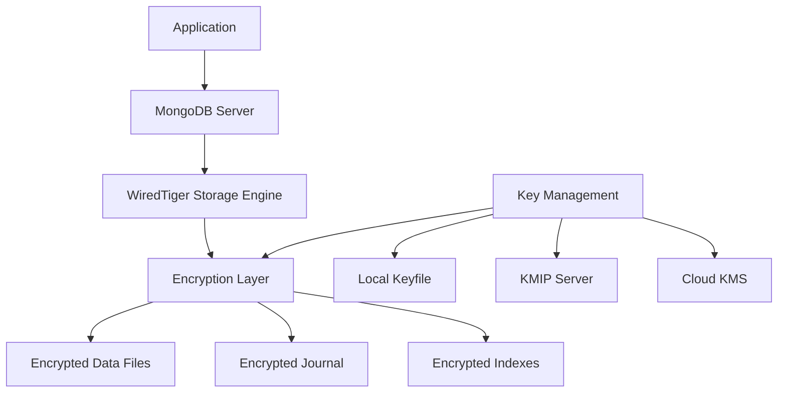

# How to Enable Encryption at Rest in MongoDB

Author: [nawazdhandala](https://www.github.com/nawazdhandala)

Tags: MongoDB, Encryption, Security, Data Protection, Enterprise

Description: Learn how to configure encryption at rest in MongoDB to protect data stored on disk, including key management options and step-by-step setup instructions.

---

Encryption at rest protects your MongoDB data when it is stored on disk. Even if an attacker gains physical access to your storage drives or backup files, they cannot read the data without the encryption keys. This is a critical security layer for compliance with regulations like GDPR, HIPAA, and PCI-DSS.

## How Encryption at Rest Works in MongoDB

MongoDB Enterprise supports native encryption at rest using the WiredTiger storage engine. MongoDB Atlas encrypts cluster storage and snapshot volumes at rest by default, and can add database-level encryption with customer-managed keys. For the self-managed encrypted storage engine, the encryption happens at the storage layer, meaning data files, journals, and indexes are encrypted transparently.


```mermaid
graph TB
    A[Application] --> B[MongoDB Server]
    B --> C[WiredTiger Storage Engine]
    C --> D[Encryption Layer]
    D --> E[Encrypted Data Files]
    D --> F[Encrypted Journal]
    D --> G[Encrypted Indexes]
    H[Key Management] --> D
    H --> I[Local Keyfile]
    H --> J[KMIP Server]
    H --> K[Cloud KMS]
```

## Encryption Methods Available

MongoDB supports several key management approaches, depending on where you run it:

1. **Local Keyfile**: Simplest self-managed setup, key stored in a file on disk
2. **KMIP**: Self-managed integration with Key Management Interoperability Protocol servers
3. **Cloud KMS**: Atlas customer-managed keys with AWS KMS, Azure Key Vault, or Google Cloud KMS

## Setting Up Local Keyfile Encryption

For development or simpler deployments, local keyfile encryption provides basic protection.

```bash
# Generate a 32-byte encryption key

# This key must be stored securely and backed up
openssl rand -base64 32 > /etc/mongodb/encryption-keyfile

# Set strict permissions on the keyfile
# MongoDB requires the keyfile to be readable only by the mongodb user
chmod 600 /etc/mongodb/encryption-keyfile
chown mongodb:mongodb /etc/mongodb/encryption-keyfile
```

Configure MongoDB to use the keyfile:

```yaml
# /etc/mongod.conf
# MongoDB configuration with encryption at rest enabled

storage:
  dbPath: /var/lib/mongodb
  journal:
    enabled: true

security:
  # Enable authorization for additional security
  authorization: enabled

  # Enable encryption at rest (MongoDB Enterprise only)
  enableEncryption: true

  # Cipher mode for encryption at rest
  encryptionCipherMode: AES256-CBC

  # Path to the local keyfile for encryption
  encryptionKeyFile: /etc/mongodb/encryption-keyfile

```

Restart MongoDB to apply changes:

```bash
# Restart MongoDB service
sudo systemctl restart mongod

# Verify MongoDB started with encryption enabled
mongosh --eval "db.serverCmdLineOpts().parsed.security"
```

## Configuring KMIP Integration

For production environments, integrate with a KMIP server for centralized key management.

```yaml
# /etc/mongod.conf
# KMIP configuration for enterprise key management

storage:
  dbPath: /var/lib/mongodb

security:
  # Enable encryption at rest (MongoDB Enterprise only)
  enableEncryption: true

  # Use KMIP for key management
  encryptionCipherMode: AES256-CBC

  # KMIP server connection settings
  kmip:
    serverName: kmip.example.com
    port: 5696

    # TLS certificates for KMIP connection
    clientCertificateFile: /etc/mongodb/kmip-client.pem
    serverCAFile: /etc/mongodb/kmip-ca.pem

    # Key identifier (optional, for specific key)
    keyIdentifier: "mongodb-encryption-key-prod"
```

## AWS KMS Integration

When running in MongoDB Atlas on AWS, you can add customer-managed encryption keys with AWS KMS. Atlas manages the underlying cluster configuration; you do not configure AWS KMS by adding a `security.kms.aws` block to `mongod.conf` on a self-managed server.

Set up AWS KMS access for Atlas:

```bash
# Create an AWS KMS key and grant Atlas the required KMS permissions.
# In Atlas, enable Encryption at Rest using Customer Key Management
# and provide the AWS IAM role or access credentials requested by Atlas.
#
# The IAM policy needs permissions such as:
# {
#   "Version": "2012-10-17",
#   "Statement": [
#     {
#       "Effect": "Allow",
#       "Action": [
#         "kms:DescribeKey",
#         "kms:Decrypt",
#         "kms:Encrypt"
#       ],
#       "Resource": "arn:aws:kms:us-east-1:123456789:key/abc123-def456"
#     }
#   ]
# }
```

## Verifying Encryption Status

After enabling encryption, verify it is working correctly.

```javascript
// Connect to MongoDB and check startup configuration
const options = db.serverCmdLineOpts();

// Check encryption settings passed to mongod
print("Encryption at rest configuration:");
printjson(options.parsed.security);

// Expected output for enabled encryption:
// {
//   "enableEncryption": true,
//   "encryptionCipherMode": "AES256-CBC",
//   "encryptionKeyFile": "/etc/mongodb/encryption-keyfile"
//   // or "kmip": { ... }
// }
```

You can also check the MongoDB log for a successful encryption key manager initialization message.

Verify data files are encrypted:

```bash
# Attempt to read data file directly (should show encrypted/unreadable content)
hexdump -C /var/lib/mongodb/collection-*.wt | head -20

# Without encryption, you would see readable strings
# With encryption, output appears as random bytes
```

## Encrypting Existing Data

If you have an existing MongoDB deployment, you need to perform a migration to enable encryption.

```bash
# Step 1: Take a backup of your existing data
mongodump --uri="mongodb://localhost:27017" --out=/backup/pre-encryption

# Step 2: Stop the MongoDB instance
sudo systemctl stop mongod

# Step 3: Generate encryption key (if using local keyfile)
openssl rand -base64 32 > /etc/mongodb/encryption-keyfile
chmod 600 /etc/mongodb/encryption-keyfile
chown mongodb:mongodb /etc/mongodb/encryption-keyfile

# Step 4: Update configuration with encryption settings
# Edit /etc/mongod.conf as shown above

# Step 5: Remove existing data files
rm -rf /var/lib/mongodb/*

# Step 6: Start MongoDB with encryption enabled
sudo systemctl start mongod

# Step 7: Restore data (now encrypted)
mongorestore --uri="mongodb://localhost:27017" /backup/pre-encryption
```

## Key Rotation

Regular key rotation is a security best practice. MongoDB supports KMIP master key rotation by rotating one replica set member at a time.

```yaml
# /etc/mongod.conf
# Temporarily add this to one replica set member at a time for KMIP rotation

security:
  enableEncryption: true
  kmip:
    rotateMasterKey: true
    serverName: kmip.example.com
    port: 5696
    clientCertificateFile: /etc/mongodb/kmip-client.pem
    serverCAFile: /etc/mongodb/kmip-ca.pem
    # Optional: update keyIdentifier to an existing new KMIP key
    # keyIdentifier: "mongodb-encryption-key-prod-v2"
```

This re-encrypts the internal keystore with a new master key. The database keys are otherwise left unchanged, so MongoDB does not re-encrypt the entire data set.

For KMIP master key rotation:

1. Restart one secondary with `security.kmip.rotateMasterKey: true`
2. After rotation succeeds, `mongod` exits
3. Remove `security.kmip.rotateMasterKey` and restart the member normally
4. Repeat for the remaining secondaries
5. Step down the primary and rotate the old primary after it becomes a secondary

Key rotation is not available for local key management. If your use case requires key rotation, use KMIP.

For a rolling KMIP rotation helper:

```bash
#!/bin/bash
# kmip-rotation.sh
# Rolling KMIP master key rotation helper

# Perform rolling rotation across replica set members
# This is simplified - production scripts need more error handling

for host in mongo2 mongo3; do
  echo "Rotating key on $host"

  # Add security.kmip.rotateMasterKey: true to this member's mongod.conf
  ssh $host "sudo systemctl restart mongod"

  # mongod exits after successful rotation; remove rotateMasterKey and restart
  ssh $host "sudo systemctl start mongod"

  # Wait for member to catch up
  sleep 30
done

echo "Step down the primary, then rotate the old primary after it becomes secondary"
```

## Backup Considerations

Encrypted backups require special handling.

```bash
# mongodump creates unencrypted backups by default
# The data is decrypted during export

# For encrypted backups, encrypt the dump files separately
mongodump --uri="mongodb://localhost:27017" --archive | \
  gpg --symmetric --cipher-algo AES256 -o /backup/mongodb-backup.gpg

# Restore encrypted backup
gpg --decrypt /backup/mongodb-backup.gpg | \
  mongorestore --uri="mongodb://localhost:27017" --archive
```

## Performance Impact

Encryption at rest adds some CPU overhead, but modern processors with AES-NI instructions make this minimal.

```javascript
// Benchmark write performance with and without encryption
// Typical overhead: 5-10% for write-heavy workloads

function benchmarkWrites(iterations) {
  const collection = db.benchmark;
  const start = new Date();

  for (let i = 0; i < iterations; i++) {
    collection.insertOne({
      index: i,
      data: 'x'.repeat(1000),
      timestamp: new Date()
    });
  }

  const duration = new Date() - start;
  print(`${iterations} writes in ${duration}ms`);
  print(`Throughput: ${(iterations / duration * 1000).toFixed(0)} ops/sec`);

  // Cleanup
  collection.drop();
}

// Run benchmark
benchmarkWrites(10000);
```

## Common Issues and Solutions

**MongoDB fails to start after enabling encryption:**
- Verify keyfile permissions (600, owned by mongodb user)
- Check that the keyfile is base64 encoded and only readable by the owner of the `mongod` process
- Review MongoDB logs: `journalctl -u mongod -n 100`

**KMIP connection failures:**
- Verify TLS certificates are valid and not expired
- Check network connectivity to KMIP server
- Ensure KMIP server has the key available

**Performance degradation:**
- Verify CPU supports AES-NI: `grep aes /proc/cpuinfo`
- Monitor CPU usage during high load
- Consider hardware upgrades if CPU becomes bottleneck

## Summary

Encryption at rest is essential for protecting sensitive data. Start with local keyfile encryption for development, then move to KMIP for self-managed production deployments or Atlas cloud KMS for Atlas deployments. Remember that encryption at rest protects data on disk but not data in transit or in memory. Combine with TLS encryption and proper access controls for comprehensive security.
