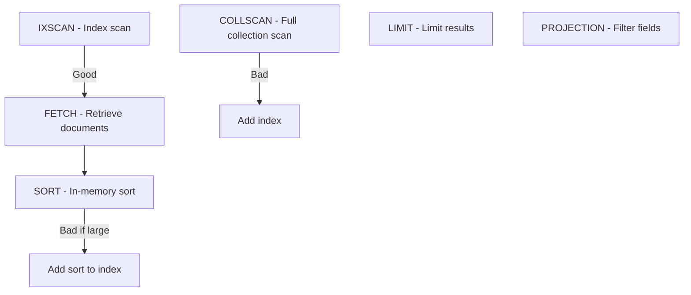

# How to Fix Slow Queries with MongoDB explain()

Author: [nawazdhandala](https://www.github.com/nawazdhandala)

Tags: MongoDB, Performance, Query Optimization, Indexes, Database

Description: Learn how to use MongoDB's explain() method to diagnose and fix slow queries, understand query execution plans, and optimize database performance.

---

When a MongoDB query takes longer than expected, guessing at the problem wastes time. The explain() method shows you exactly what MongoDB does when executing a query, from index selection to document scanning. This information tells you whether you need a new index, need to restructure your query, or have a problem with data modeling.

## Running explain()

Add explain() to any query to see its execution plan:

```javascript
// Basic explain
db.orders.find({ customerId: "cust_123" }).explain();

// Detailed statistics with executionStats
db.orders.find({ customerId: "cust_123" }).explain("executionStats");

// Full information including rejected plans
db.orders.find({ customerId: "cust_123" }).explain("allPlansExecution");
```

For aggregation pipelines:

```javascript
db.orders.explain("executionStats").aggregate([
  { $match: { status: "pending" } },
  { $group: { _id: "$customerId", total: { $sum: "$amount" } } }
]);
```

## Understanding the Output

The explain output contains nested objects. Here are the key fields to examine:

### queryPlanner Section

```javascript
{
  "queryPlanner": {
    "namespace": "mydb.orders",
    "indexFilterSet": false,
    "parsedQuery": { "customerId": { "$eq": "cust_123" } },
    "winningPlan": {
      "stage": "FETCH",
      "inputStage": {
        "stage": "IXSCAN",
        "keyPattern": { "customerId": 1 },
        "indexName": "customerId_1"
      }
    },
    "rejectedPlans": []
  }
}
```

Key fields:
- **winningPlan**: The execution plan MongoDB chose
- **stage**: The type of operation (IXSCAN, COLLSCAN, FETCH, etc.)
- **rejectedPlans**: Other plans MongoDB considered

### executionStats Section

```javascript
{
  "executionStats": {
    "executionSuccess": true,
    "nReturned": 25,
    "executionTimeMillis": 3,
    "totalKeysExamined": 25,
    "totalDocsExamined": 25,
    "executionStages": {
      "stage": "FETCH",
      "nReturned": 25,
      "docsExamined": 25,
      "inputStage": {
        "stage": "IXSCAN",
        "nReturned": 25,
        "keysExamined": 25
      }
    }
  }
}
```

Key metrics:
- **nReturned**: Documents returned to client
- **totalKeysExamined**: Index entries scanned
- **totalDocsExamined**: Documents fetched from disk
- **executionTimeMillis**: Query execution time

## Identifying Problems

### Problem 1: Collection Scan (COLLSCAN)

The worst case scenario. MongoDB scans every document in the collection.

```javascript
// Query without matching index
db.orders.find({ status: "pending" }).explain("executionStats");

// Bad output shows COLLSCAN
{
  "winningPlan": {
    "stage": "COLLSCAN",  // No index used!
    "filter": { "status": { "$eq": "pending" } }
  },
  "executionStats": {
    "nReturned": 100,
    "totalDocsExamined": 1000000  // Scanned all documents
  }
}
```

**Fix**: Create an index on the queried field.

```javascript
db.orders.createIndex({ status: 1 });
```

### Problem 2: High Ratio of Examined to Returned

Even with an index, you might scan more than necessary.

```javascript
{
  "executionStats": {
    "nReturned": 10,
    "totalDocsExamined": 50000  // Examined 50k to return 10!
  }
}
```

This happens with unselective indexes or multi-field queries where the index only covers one field.

**Fix**: Create a compound index matching your query.

```javascript
// Query filters on status and sorts by date
db.orders.find({ status: "pending" }).sort({ createdAt: -1 });

// Create compound index in query order
db.orders.createIndex({ status: 1, createdAt: -1 });
```

### Problem 3: SORT Stage with No Index

In-memory sorts are expensive, especially for large result sets.

```javascript
{
  "winningPlan": {
    "stage": "SORT",  // In-memory sort
    "sortPattern": { "createdAt": -1 },
    "inputStage": {
      "stage": "COLLSCAN"
    }
  }
}
```

**Fix**: Include sort fields in the index.

```javascript
// This index supports both filter and sort
db.orders.createIndex({ status: 1, createdAt: -1 });

// Now the plan shows no SORT stage
{
  "winningPlan": {
    "stage": "FETCH",
    "inputStage": {
      "stage": "IXSCAN",
      "keyPattern": { "status": 1, "createdAt": -1 }
    }
  }
}
```

### Problem 4: Blocked Sort Warning

MongoDB has a 100MB limit for in-memory sorts. Exceeding this fails the query.

```javascript
{
  "executionStats": {
    "executionSuccess": false,
    "errorMessage": "Sort exceeded memory limit"
  }
}
```

**Fix**: Add an index to avoid in-memory sorting, or use allowDiskUse for aggregations.

```javascript
// Allow disk use for large aggregation sorts
db.orders.aggregate([
  { $sort: { createdAt: -1 } }
], { allowDiskUse: true });
```

## Reading Execution Stages

Common stages and what they mean:



Stage explanations:
- **COLLSCAN**: Scanning all documents, needs index
- **IXSCAN**: Using an index, good
- **FETCH**: Retrieving full documents from index keys
- **SORT**: In-memory sorting, can be slow
- **LIMIT**: Limiting output, can stop execution early
- **PROJECTION_COVERED**: Returning data from index only, very fast

## Covered Queries

A covered query returns data entirely from the index without fetching documents:

```javascript
// Create an index with all needed fields
db.orders.createIndex({ customerId: 1, status: 1, amount: 1 });

// Query only indexed fields with projection
db.orders.find(
  { customerId: "cust_123" },
  { _id: 0, status: 1, amount: 1 }  // Project only indexed fields
).explain("executionStats");

// Perfect output shows no FETCH
{
  "winningPlan": {
    "stage": "PROJECTION_COVERED",
    "inputStage": {
      "stage": "IXSCAN"
    }
  },
  "executionStats": {
    "totalDocsExamined": 0  // No documents fetched!
  }
}
```

## Analyzing Aggregation Pipelines

Each stage in an aggregation has its own execution plan:

```javascript
db.orders.explain("executionStats").aggregate([
  { $match: { status: "completed" } },
  { $group: { _id: "$customerId", total: { $sum: "$amount" } } },
  { $sort: { total: -1 } },
  { $limit: 10 }
]);
```

Check the first $match stage. If it shows COLLSCAN, add an index on status.

## Query Optimizer Hints

Force MongoDB to use a specific index when the optimizer chooses wrong:

```javascript
// Force specific index
db.orders.find({ status: "pending", region: "us-east" })
  .hint({ status: 1, region: 1 })
  .explain("executionStats");

// Force collection scan (for testing)
db.orders.find({ status: "pending" })
  .hint({ $natural: 1 })
  .explain("executionStats");
```

## Practical Debugging Workflow

### Step 1: Identify Slow Queries

Enable the profiler to log slow queries:

```javascript
// Log queries taking more than 100ms
db.setProfilingLevel(1, { slowms: 100 });

// View slow queries
db.system.profile.find().sort({ ts: -1 }).limit(10);
```

### Step 2: Run explain on the Query

```javascript
// Copy the query from profiler and run explain
db.orders.find({ status: "pending", customerId: "cust_123" })
  .explain("executionStats");
```

### Step 3: Analyze the Results

Check these metrics:
1. Is there a COLLSCAN? Add an index.
2. Is totalDocsExamined much higher than nReturned? Improve index selectivity.
3. Is there an in-memory SORT? Add sort fields to index.
4. Is executionTimeMillis high despite good plan? Check server resources.

### Step 4: Create or Modify Index

```javascript
// Create compound index based on query pattern
db.orders.createIndex({ status: 1, customerId: 1 });

// Verify improvement
db.orders.find({ status: "pending", customerId: "cust_123" })
  .explain("executionStats");
```

### Step 5: Monitor Ongoing Performance

```javascript
// Check index usage statistics
db.orders.aggregate([
  { $indexStats: {} }
]);

// Remove unused indexes
db.orders.dropIndex("unused_index_name");
```

## Key Metrics Quick Reference

| Metric | Good Value | Problem Indicator |
|--------|-----------|-------------------|
| stage | IXSCAN | COLLSCAN |
| totalDocsExamined | Close to nReturned | Much higher than nReturned |
| executionTimeMillis | < 100ms for UI | > 1000ms |
| SORT stage | None | Present with large data |

---

The explain() method removes guesswork from query optimization. Run it regularly on your critical queries, watch for collection scans, and match your indexes to your query patterns. A few minutes spent analyzing explain output saves hours of debugging slow application performance.
