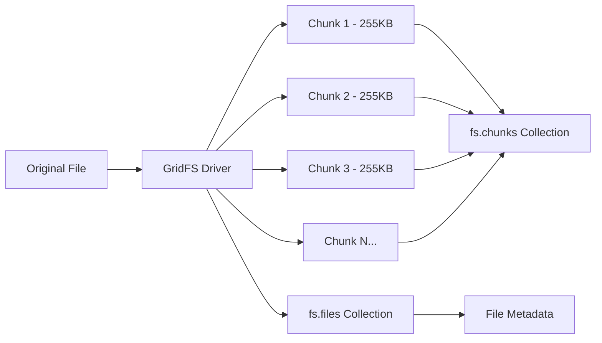

# How to Store Large Files with MongoDB GridFS

Author: [nawazdhandala](https://www.github.com/nawazdhandala)

Tags: MongoDB, GridFS, File Storage, Binary Data, Node.js

Description: Learn how to use MongoDB GridFS to store and retrieve files larger than 16MB, with streaming support and practical examples for building file storage systems.

---

MongoDB documents have a 16MB size limit, which works fine for most data but falls short when you need to store images, videos, or large documents. GridFS solves this by splitting files into chunks and storing them across two collections, letting you store files of any size while keeping all the benefits of MongoDB's replication and sharding.

## How GridFS Works

GridFS stores files using two collections:

- `fs.files`: Metadata about each file (filename, size, upload date, content type)
- `fs.chunks`: Binary chunks of file data, typically 255KB each

When you upload a file, GridFS splits it into chunks and stores references in the files collection. Reading reverses this process, assembling chunks back into the original file.



## Setting Up GridFS in Node.js

```javascript
const { MongoClient, GridFSBucket } = require('mongodb');
const fs = require('fs');
const path = require('path');

// Connect to MongoDB and create GridFS bucket
async function setupGridFS() {
  const client = new MongoClient('mongodb://localhost:27017');
  await client.connect();

  const db = client.db('filestore');

  // Create a GridFS bucket with custom options
  const bucket = new GridFSBucket(db, {
    bucketName: 'uploads',      // Collection prefix (default: 'fs')
    chunkSizeBytes: 1024 * 255  // Chunk size in bytes (default: 255KB)
  });

  return { client, bucket, db };
}
```

## Uploading Files to GridFS

GridFS supports both streaming and buffer-based uploads. Streaming is preferred for large files because it does not load the entire file into memory.

```javascript
const { MongoClient, GridFSBucket, ObjectId } = require('mongodb');
const fs = require('fs');

async function uploadFile(bucket, filePath, metadata = {}) {
  const filename = path.basename(filePath);

  // Create an upload stream with metadata
  const uploadStream = bucket.openUploadStream(filename, {
    // Custom metadata stored with the file
    metadata: {
      ...metadata,
      uploadedAt: new Date(),
      originalPath: filePath
    },
    // Content type for proper serving
    contentType: getContentType(filename)
  });

  // Pipe the file to GridFS
  const fileStream = fs.createReadStream(filePath);

  return new Promise((resolve, reject) => {
    fileStream
      .pipe(uploadStream)
      .on('error', reject)
      .on('finish', () => {
        console.log(`File uploaded with ID: ${uploadStream.id}`);
        resolve(uploadStream.id);
      });
  });
}

// Helper to determine content type from extension
function getContentType(filename) {
  const ext = path.extname(filename).toLowerCase();
  const types = {
    '.pdf': 'application/pdf',
    '.jpg': 'image/jpeg',
    '.jpeg': 'image/jpeg',
    '.png': 'image/png',
    '.gif': 'image/gif',
    '.mp4': 'video/mp4',
    '.zip': 'application/zip',
    '.json': 'application/json'
  };
  return types[ext] || 'application/octet-stream';
}

// Upload from buffer (useful for API endpoints)
async function uploadFromBuffer(bucket, buffer, filename, metadata = {}) {
  const uploadStream = bucket.openUploadStream(filename, {
    metadata: {
      ...metadata,
      uploadedAt: new Date(),
      size: buffer.length
    },
    contentType: getContentType(filename)
  });

  return new Promise((resolve, reject) => {
    uploadStream.end(buffer, (error) => {
      if (error) reject(error);
      else resolve(uploadStream.id);
    });
  });
}
```

## Downloading Files from GridFS

```javascript
// Download file to disk
async function downloadFile(bucket, fileId, destinationPath) {
  const downloadStream = bucket.openDownloadStream(new ObjectId(fileId));
  const writeStream = fs.createWriteStream(destinationPath);

  return new Promise((resolve, reject) => {
    downloadStream
      .pipe(writeStream)
      .on('error', reject)
      .on('finish', () => {
        console.log(`File downloaded to: ${destinationPath}`);
        resolve(destinationPath);
      });
  });
}

// Download by filename instead of ID
async function downloadByFilename(bucket, filename, destinationPath) {
  const downloadStream = bucket.openDownloadStreamByName(filename);
  const writeStream = fs.createWriteStream(destinationPath);

  return new Promise((resolve, reject) => {
    downloadStream
      .pipe(writeStream)
      .on('error', (error) => {
        // Handle file not found
        if (error.code === 'ENOENT') {
          reject(new Error(`File not found: ${filename}`));
        } else {
          reject(error);
        }
      })
      .on('finish', resolve);
  });
}

// Stream file to HTTP response (for web servers)
function streamToResponse(bucket, fileId, res) {
  const downloadStream = bucket.openDownloadStream(new ObjectId(fileId));

  downloadStream.on('error', (error) => {
    console.error('Stream error:', error);
    res.status(404).send('File not found');
  });

  // Pipe directly to response for efficient memory usage
  downloadStream.pipe(res);
}
```

## Express.js File Server with GridFS

Here is a complete example of a file server using Express and GridFS.

```javascript
const express = require('express');
const { MongoClient, GridFSBucket, ObjectId } = require('mongodb');
const multer = require('multer');
const { Readable } = require('stream');

const app = express();
const upload = multer({ storage: multer.memoryStorage() });

let bucket;

// Initialize MongoDB connection and GridFS
async function initializeDatabase() {
  const client = new MongoClient('mongodb://localhost:27017');
  await client.connect();
  const db = client.db('fileserver');
  bucket = new GridFSBucket(db, { bucketName: 'files' });
  console.log('GridFS bucket initialized');
}

// Upload endpoint
app.post('/upload', upload.single('file'), async (req, res) => {
  if (!req.file) {
    return res.status(400).json({ error: 'No file provided' });
  }

  try {
    const { originalname, buffer, mimetype } = req.file;

    // Create readable stream from buffer
    const readableStream = new Readable();
    readableStream.push(buffer);
    readableStream.push(null);

    // Upload to GridFS
    const uploadStream = bucket.openUploadStream(originalname, {
      contentType: mimetype,
      metadata: {
        uploadedBy: req.headers['x-user-id'] || 'anonymous',
        uploadedAt: new Date()
      }
    });

    readableStream.pipe(uploadStream);

    uploadStream.on('finish', () => {
      res.json({
        fileId: uploadStream.id.toString(),
        filename: originalname,
        size: buffer.length
      });
    });

    uploadStream.on('error', (error) => {
      console.error('Upload error:', error);
      res.status(500).json({ error: 'Upload failed' });
    });

  } catch (error) {
    console.error('Upload error:', error);
    res.status(500).json({ error: 'Upload failed' });
  }
});

// Download endpoint
app.get('/files/:id', async (req, res) => {
  try {
    const fileId = new ObjectId(req.params.id);

    // Get file metadata first
    const files = await bucket.find({ _id: fileId }).toArray();
    if (files.length === 0) {
      return res.status(404).json({ error: 'File not found' });
    }

    const file = files[0];

    // Set appropriate headers
    res.set({
      'Content-Type': file.contentType || 'application/octet-stream',
      'Content-Length': file.length,
      'Content-Disposition': `attachment; filename="${file.filename}"`
    });

    // Stream file to response
    const downloadStream = bucket.openDownloadStream(fileId);
    downloadStream.pipe(res);

  } catch (error) {
    console.error('Download error:', error);
    res.status(500).json({ error: 'Download failed' });
  }
});

// List files endpoint
app.get('/files', async (req, res) => {
  try {
    const files = await bucket.find({}).toArray();
    const fileList = files.map(f => ({
      id: f._id.toString(),
      filename: f.filename,
      size: f.length,
      contentType: f.contentType,
      uploadDate: f.uploadDate,
      metadata: f.metadata
    }));
    res.json(fileList);
  } catch (error) {
    res.status(500).json({ error: 'Failed to list files' });
  }
});

// Delete file endpoint
app.delete('/files/:id', async (req, res) => {
  try {
    const fileId = new ObjectId(req.params.id);
    await bucket.delete(fileId);
    res.json({ message: 'File deleted successfully' });
  } catch (error) {
    console.error('Delete error:', error);
    res.status(500).json({ error: 'Delete failed' });
  }
});

// Start server
initializeDatabase().then(() => {
  app.listen(3000, () => {
    console.log('File server running on port 3000');
  });
});
```

## Range Requests for Video Streaming

For video files, you need to support HTTP range requests to enable seeking and efficient streaming.

```javascript
app.get('/stream/:id', async (req, res) => {
  try {
    const fileId = new ObjectId(req.params.id);

    // Get file metadata
    const files = await bucket.find({ _id: fileId }).toArray();
    if (files.length === 0) {
      return res.status(404).send('File not found');
    }

    const file = files[0];
    const fileSize = file.length;

    // Parse range header
    const range = req.headers.range;

    if (range) {
      // Handle range request for partial content
      const parts = range.replace(/bytes=/, '').split('-');
      const start = parseInt(parts[0], 10);
      const end = parts[1] ? parseInt(parts[1], 10) : fileSize - 1;
      const chunkSize = end - start + 1;

      res.status(206);
      res.set({
        'Content-Range': `bytes ${start}-${end}/${fileSize}`,
        'Accept-Ranges': 'bytes',
        'Content-Length': chunkSize,
        'Content-Type': file.contentType || 'video/mp4'
      });

      // Stream only the requested range
      const downloadStream = bucket.openDownloadStream(fileId, {
        start: start,
        end: end + 1
      });
      downloadStream.pipe(res);

    } else {
      // No range requested, send entire file
      res.set({
        'Content-Length': fileSize,
        'Content-Type': file.contentType || 'video/mp4',
        'Accept-Ranges': 'bytes'
      });

      const downloadStream = bucket.openDownloadStream(fileId);
      downloadStream.pipe(res);
    }

  } catch (error) {
    console.error('Stream error:', error);
    res.status(500).send('Streaming failed');
  }
});
```

## Python GridFS Example

```python
from pymongo import MongoClient
import gridfs
from bson.objectid import ObjectId

# Initialize GridFS
client = MongoClient('mongodb://localhost:27017')
db = client.filestore
fs = gridfs.GridFS(db)

# Upload a file
def upload_file(filepath, metadata=None):
    with open(filepath, 'rb') as f:
        file_id = fs.put(
            f,
            filename=filepath.split('/')[-1],
            metadata=metadata or {}
        )
    print(f'Uploaded file with ID: {file_id}')
    return file_id

# Download a file
def download_file(file_id, destination):
    grid_out = fs.get(ObjectId(file_id))
    with open(destination, 'wb') as f:
        f.write(grid_out.read())
    print(f'Downloaded to: {destination}')

# Find files by metadata
def find_files_by_type(content_type):
    for grid_out in fs.find({'contentType': content_type}):
        print(f'{grid_out.filename}: {grid_out.length} bytes')

# Delete a file
def delete_file(file_id):
    fs.delete(ObjectId(file_id))
    print(f'Deleted file: {file_id}')
```

## GridFS Best Practices

**Use streaming for large files**: Never load entire files into memory. Always use streams for upload and download.

**Index the chunks collection**: GridFS creates indexes automatically, but verify they exist for performance.

**Set appropriate chunk sizes**: The default 255KB works well for most cases. Larger chunks reduce metadata overhead but increase memory usage during operations.

**Clean up orphaned chunks**: If uploads fail midway, orphaned chunks can accumulate. Periodically clean them.

```javascript
// Clean up orphaned chunks
async function cleanupOrphanedChunks(db) {
  const filesCollection = db.collection('fs.files');
  const chunksCollection = db.collection('fs.chunks');

  // Find all valid file IDs
  const validIds = await filesCollection.distinct('_id');

  // Delete chunks not belonging to any file
  const result = await chunksCollection.deleteMany({
    files_id: { $nin: validIds }
  });

  console.log(`Deleted ${result.deletedCount} orphaned chunks`);
}
```

## When to Use GridFS vs External Storage

GridFS is ideal when you need:
- Files replicated alongside your data
- Atomic operations with other documents
- Simple deployment without additional services

Consider external storage (S3, GCS) when you need:
- CDN integration for global distribution
- Cost-effective storage for very large files (50GB+)
- Direct browser uploads without proxying through your server

GridFS keeps your architecture simple, but evaluate your specific requirements for file size, access patterns, and infrastructure complexity.
