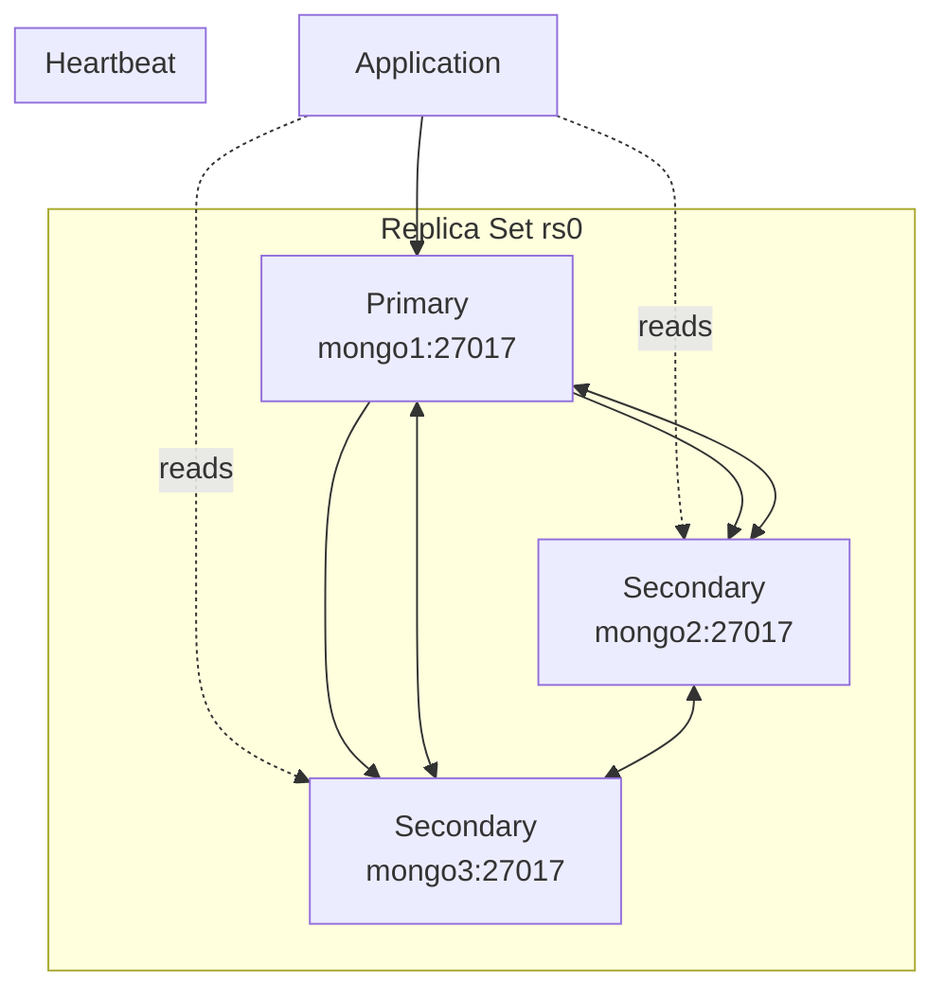

# How to Build MongoDB Clusters for 99.99% Availability

Author: [nawazdhandala](https://www.github.com/nawazdhandala)

Tags: MongoDB, High Availability, Replica Sets, Clustering, DevOps

Description: Learn how to architect MongoDB deployments for 99.99% uptime with replica sets, proper member distribution, automated failover, and disaster recovery strategies.

---

Achieving 99.99% availability (about 52 minutes of downtime per year) requires careful planning across hardware, network, and application layers. MongoDB replica sets provide the foundation, but reaching true high availability demands attention to member placement, monitoring, and failover handling.

## Replica Set Fundamentals

A replica set consists of multiple mongod instances maintaining the same data. One member is primary (handles writes), others are secondaries (replicate data and can handle reads).



## Minimum Configuration for High Availability

```javascript
// Initialize a 3-member replica set
// Run on the first member:
rs.initiate({
  _id: "rs0",
  members: [
    { _id: 0, host: "mongo1.example.com:27017", priority: 2 },  // Preferred primary
    { _id: 1, host: "mongo2.example.com:27017", priority: 1 },
    { _id: 2, host: "mongo3.example.com:27017", priority: 1 }
  ]
});

// Verify configuration
rs.status();
rs.conf();
```

## Member Distribution Across Zones

For true high availability, distribute members across failure domains.

```javascript
// 5-member replica set across 3 availability zones
rs.initiate({
  _id: "production",
  members: [
    // Zone A - 2 members
    { _id: 0, host: "mongo-a1.example.com:27017", priority: 2,
      tags: { zone: "a", dc: "east" } },
    { _id: 1, host: "mongo-a2.example.com:27017", priority: 1,
      tags: { zone: "a", dc: "east" } },

    // Zone B - 2 members
    { _id: 2, host: "mongo-b1.example.com:27017", priority: 1,
      tags: { zone: "b", dc: "east" } },
    { _id: 3, host: "mongo-b2.example.com:27017", priority: 1,
      tags: { zone: "b", dc: "east" } },

    // Zone C - 1 arbiter (tie-breaker, no data)
    { _id: 4, host: "mongo-c1.example.com:27017", priority: 0,
      arbiterOnly: true, tags: { zone: "c", dc: "west" } }
  ],
  settings: {
    // Custom write concerns for zone-aware durability
    getLastErrorModes: {
      multiZone: { zone: 2 }  // Require acknowledgment from 2 zones
    }
  }
});
```

## Geo-Distributed Replica Set

For global applications, spread members across regions.

```javascript
// Cross-region replica set configuration
rs.initiate({
  _id: "global",
  members: [
    // US East - Primary region
    { _id: 0, host: "mongo-use1.example.com:27017", priority: 10,
      tags: { region: "us-east", role: "primary-candidate" } },
    { _id: 1, host: "mongo-use2.example.com:27017", priority: 5,
      tags: { region: "us-east", role: "secondary" } },

    // US West
    { _id: 2, host: "mongo-usw1.example.com:27017", priority: 3,
      tags: { region: "us-west", role: "secondary" } },

    // Europe
    { _id: 3, host: "mongo-eu1.example.com:27017", priority: 1,
      tags: { region: "europe", role: "secondary" } },

    // Hidden member for backups (never becomes primary)
    { _id: 4, host: "mongo-backup.example.com:27017", priority: 0,
      hidden: true, tags: { role: "backup" } }
  ],
  settings: {
    // Election timeout - increase for cross-region latency
    electionTimeoutMillis: 15000,

    // Heartbeat frequency
    heartbeatTimeoutSecs: 10
  }
});
```

## Connection String for High Availability

```javascript
// Connection string with all replica set members
const uri = 'mongodb://mongo1:27017,mongo2:27017,mongo3:27017/mydb?replicaSet=rs0' +
  '&readPreference=secondaryPreferred' +
  '&w=majority' +
  '&retryWrites=true' +
  '&retryReads=true';

const client = new MongoClient(uri, {
  // Connection pool settings
  maxPoolSize: 50,
  minPoolSize: 10,

  // Timeouts for failover scenarios
  serverSelectionTimeoutMS: 30000,  // Time to find available server
  socketTimeoutMS: 45000,           // Socket operation timeout

  // Write concern for durability
  writeConcern: {
    w: 'majority',
    wtimeout: 10000
  }
});
```

## Monitoring Replica Set Health

```javascript
// Health check script
async function checkReplicaSetHealth(client) {
  const admin = client.db('admin');

  // Get replica set status
  const status = await admin.command({ replSetGetStatus: 1 });

  const health = {
    name: status.set,
    members: [],
    issues: []
  };

  let primaryCount = 0;
  let healthySecondaries = 0;

  for (const member of status.members) {
    const memberHealth = {
      host: member.name,
      state: member.stateStr,
      healthy: member.health === 1,
      lagSeconds: 0
    };

    // Calculate replication lag
    if (member.stateStr === 'PRIMARY') {
      primaryCount++;
      memberHealth.isPrimary = true;
    } else if (member.stateStr === 'SECONDARY') {
      healthySecondaries++;
      const primary = status.members.find(m => m.stateStr === 'PRIMARY');
      if (primary && member.optime && primary.optime) {
        memberHealth.lagSeconds =
          (primary.optime.ts.getTime() - member.optime.ts.getTime()) / 1000;
      }
    }

    health.members.push(memberHealth);

    // Flag issues
    if (!memberHealth.healthy) {
      health.issues.push(`${member.name} is unhealthy`);
    }
    if (memberHealth.lagSeconds > 10) {
      health.issues.push(`${member.name} lag: ${memberHealth.lagSeconds}s`);
    }
  }

  // Check for critical issues
  if (primaryCount === 0) {
    health.issues.push('NO PRIMARY - cluster cannot accept writes');
    health.critical = true;
  }
  if (primaryCount > 1) {
    health.issues.push('MULTIPLE PRIMARIES - split brain detected');
    health.critical = true;
  }
  if (healthySecondaries < 1) {
    health.issues.push('No healthy secondaries - reduced fault tolerance');
  }

  health.status = health.critical ? 'CRITICAL' :
                  health.issues.length > 0 ? 'WARNING' : 'HEALTHY';

  return health;
}

// Run health check
const health = await checkReplicaSetHealth(client);
console.log(JSON.stringify(health, null, 2));
```

## Automated Failover Testing

```javascript
// Test failover handling in your application
async function testFailover(client) {
  const collection = client.db('test').collection('failover_test');

  console.log('Starting failover test...');

  // Write continuously while triggering failover
  let writeCount = 0;
  let failedWrites = 0;
  let retries = 0;

  const writeLoop = async () => {
    for (let i = 0; i < 1000; i++) {
      try {
        await collection.insertOne({
          sequence: i,
          timestamp: new Date()
        });
        writeCount++;
      } catch (error) {
        if (error.message.includes('not primary') ||
            error.message.includes('node is recovering')) {
          failedWrites++;
          retries++;
          // Wait and retry
          await new Promise(r => setTimeout(r, 100));
          i--;  // Retry this iteration
        } else {
          throw error;
        }
      }

      await new Promise(r => setTimeout(r, 10));
    }
  };

  // Trigger failover after 2 seconds (do this manually or via script)
  setTimeout(async () => {
    console.log('Stepping down primary...');
    try {
      await client.db('admin').command({ replSetStepDown: 60 });
    } catch (e) {
      // Expected - connection will close
    }
  }, 2000);

  await writeLoop();

  console.log(`Writes completed: ${writeCount}`);
  console.log(`Failed writes: ${failedWrites}`);
  console.log(`Total retries: ${retries}`);
}
```

## Handling Failover in Applications

```javascript
// Resilient MongoDB client wrapper
class ResilientMongoClient {
  constructor(uri, options = {}) {
    this.uri = uri;
    this.options = {
      serverSelectionTimeoutMS: 30000,
      retryWrites: true,
      retryReads: true,
      ...options
    };
    this.client = null;
  }

  async connect() {
    this.client = new MongoClient(this.uri, this.options);

    // Monitor connection events
    this.client.on('serverHeartbeatFailed', (event) => {
      console.warn('Heartbeat failed:', event.failure.message);
    });

    this.client.on('topologyDescriptionChanged', (event) => {
      const newPrimary = [...event.newDescription.servers.values()]
        .find(s => s.type === 'RSPrimary');

      if (newPrimary) {
        console.log('Primary changed to:', newPrimary.address);
      }
    });

    await this.client.connect();
    return this;
  }

  db(name) {
    return this.client.db(name);
  }

  // Wrapped operation with automatic retry
  async withRetry(operation, maxRetries = 3) {
    let lastError;

    for (let attempt = 1; attempt <= maxRetries; attempt++) {
      try {
        return await operation();
      } catch (error) {
        lastError = error;

        const isRetryable =
          error.message.includes('not primary') ||
          error.message.includes('node is recovering') ||
          error.message.includes('socket was closed') ||
          error.code === 11600;  // InterruptedAtShutdown

        if (isRetryable && attempt < maxRetries) {
          const delay = Math.min(100 * Math.pow(2, attempt), 5000);
          console.log(`Retrying after ${delay}ms (attempt ${attempt})`);
          await new Promise(r => setTimeout(r, delay));
          continue;
        }

        throw error;
      }
    }

    throw lastError;
  }

  async close() {
    await this.client.close();
  }
}

// Usage
const client = new ResilientMongoClient(uri);
await client.connect();

// Operations automatically retry on failover
await client.withRetry(async () => {
  await client.db('mydb').collection('orders').insertOne({
    orderId: '12345',
    total: 99.99
  });
});
```

## Backup and Disaster Recovery

```bash
# Regular backups from hidden secondary
mongodump --host mongo-backup.example.com:27017 \
  --readPreference=secondary \
  --out=/backup/$(date +%Y%m%d_%H%M%S)

# Point-in-time recovery with oplog
mongodump --host mongo-backup.example.com:27017 \
  --oplog \
  --out=/backup/pitr_$(date +%Y%m%d)

# Restore to specific point in time
mongorestore --oplogReplay \
  --oplogLimit="Timestamp(1234567890, 1)" \
  /backup/pitr_20240125
```

## Maintenance Without Downtime

```javascript
// Rolling restart procedure
async function rollingRestart(members) {
  for (const member of members) {
    console.log(`Restarting ${member.host}...`);

    // Step 1: If this is primary, step down first
    if (member.isPrimary) {
      await member.db.admin().command({ replSetStepDown: 120 });
      await sleep(10000);  // Wait for election
    }

    // Step 2: Stop the mongod process (SSH/systemctl)
    await execOnHost(member.host, 'systemctl restart mongod');

    // Step 3: Wait for member to rejoin and sync
    await waitForMemberHealthy(member.host, 120000);

    console.log(`${member.host} restarted and healthy`);
  }
}

async function waitForMemberHealthy(host, timeoutMs) {
  const start = Date.now();

  while (Date.now() - start < timeoutMs) {
    const status = await getReplicaSetStatus();
    const member = status.members.find(m => m.name.includes(host));

    if (member && member.health === 1 &&
        (member.stateStr === 'PRIMARY' || member.stateStr === 'SECONDARY')) {
      return true;
    }

    await sleep(2000);
  }

  throw new Error(`Timeout waiting for ${host} to become healthy`);
}
```

## Summary

Building 99.99% availability requires multiple layers:

- **Replica sets**: Minimum 3 members, preferably 5 for maintenance flexibility
- **Geographic distribution**: Spread members across availability zones or regions
- **Proper client configuration**: Retry writes, appropriate timeouts, read preferences
- **Monitoring**: Track replication lag, member health, and failover events
- **Testing**: Regularly test failover scenarios in staging
- **Backups**: Hidden member for consistent backups without affecting production

Remember that high availability is not just about MongoDB configuration. Your application must handle connection failures and retries gracefully to achieve true uptime goals.
