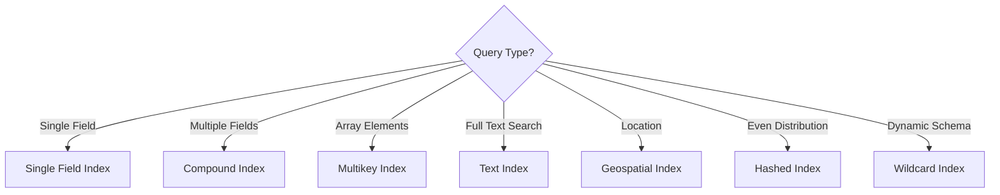

# How to Choose Between Index Types in MongoDB

Author: [nawazdhandala](https://www.github.com/nawazdhandala)

Tags: MongoDB, Indexes, Performance, Database, Query Optimization

Description: A guide to MongoDB index types including single field, compound, multikey, text, geospatial, and hashed indexes, with practical examples for choosing the right index for your use case.

---

Indexes make queries fast, but the wrong index type can hurt performance or fail to help at all. MongoDB offers several index types, each designed for specific query patterns. Understanding when to use each type is essential for building performant applications.

## Single Field Indexes

The simplest index type. Good for queries that filter or sort on one field.

```javascript
// Create single field index
db.users.createIndex({ email: 1 });  // Ascending
db.users.createIndex({ createdAt: -1 });  // Descending

// These queries use the email index
db.users.find({ email: "user@example.com" });
db.users.find({ email: { $in: ["a@example.com", "b@example.com"] } });

// Sorting works regardless of direction
db.users.find().sort({ createdAt: 1 });  // Uses index
db.users.find().sort({ createdAt: -1 });  // Uses index
```

**When to use**: Single field queries, simple sorts, unique constraints.

## Compound Indexes

Indexes on multiple fields. Order matters.

```javascript
// Create compound index
db.orders.createIndex({ customerId: 1, createdAt: -1, status: 1 });

// These queries use the index (prefix rule)
db.orders.find({ customerId: "c123" });  // Uses index
db.orders.find({ customerId: "c123", createdAt: { $gt: date } });  // Uses index
db.orders.find({ customerId: "c123" }).sort({ createdAt: -1 });  // Uses index

// These queries DO NOT use the index well
db.orders.find({ status: "pending" });  // Cannot skip customerId
db.orders.find({ createdAt: { $gt: date } });  // Cannot skip customerId
```

### The ESR Rule for Compound Indexes

Order fields in compound indexes by:
1. **E**quality - Fields with exact match first
2. **S**ort - Fields used for sorting second
3. **R**ange - Fields with range queries last

```javascript
// Query pattern
db.orders.find({
  status: "completed",      // Equality
  createdAt: { $gt: date }  // Range
}).sort({ amount: -1 });    // Sort

// Optimal index following ESR rule
db.orders.createIndex({ status: 1, amount: -1, createdAt: 1 });
```

## Multikey Indexes

Automatically created when indexing array fields. Each array element gets its own index entry.

```javascript
// Document with array
{
  _id: 1,
  title: "Blog Post",
  tags: ["mongodb", "database", "tutorial"]
}

// Create index on array field
db.posts.createIndex({ tags: 1 });

// Query any array element
db.posts.find({ tags: "mongodb" });  // Uses index
db.posts.find({ tags: { $in: ["mongodb", "redis"] } });  // Uses index
```

### Compound Multikey Limitations

Only one array field can be indexed in a compound index:

```javascript
// This works - one array field
db.inventory.createIndex({ item: 1, sizes: 1 });

// This fails - two array fields
db.inventory.createIndex({ sizes: 1, colors: 1 });  // Error!
```

**When to use**: Tags, categories, any array you query with $in or $elemMatch.

## Text Indexes

Full-text search with stemming, stop words, and relevance scoring.

```javascript
// Create text index on multiple fields with weights
db.articles.createIndex(
  { title: "text", content: "text", tags: "text" },
  { weights: { title: 10, tags: 5, content: 1 } }
);

// Search for text
db.articles.find({ $text: { $search: "mongodb tutorial" } });

// With relevance score
db.articles.find(
  { $text: { $search: "mongodb tutorial" } },
  { score: { $meta: "textScore" } }
).sort({ score: { $meta: "textScore" } });

// Phrase search
db.articles.find({ $text: { $search: "\"replica set\"" } });

// Exclude terms
db.articles.find({ $text: { $search: "mongodb -tutorial" } });
```

### Text Index Languages

```javascript
// Specify language for proper stemming
db.articles.createIndex(
  { content: "text" },
  { default_language: "spanish" }
);

// Per-document language
{
  content: "Hola mundo",
  language: "spanish"
}
```

**When to use**: Search features, finding documents by keyword. Not suitable for autocomplete (use wildcard indexes instead).

## Geospatial Indexes

For location-based queries.

### 2dsphere Index (Spherical Geometry)

For earth-like coordinates (longitude/latitude):

```javascript
// Store location in GeoJSON format
{
  name: "Central Park",
  location: {
    type: "Point",
    coordinates: [-73.968285, 40.785091]  // [longitude, latitude]
  }
}

// Create 2dsphere index
db.places.createIndex({ location: "2dsphere" });

// Find places within radius
db.places.find({
  location: {
    $nearSphere: {
      $geometry: {
        type: "Point",
        coordinates: [-73.9712, 40.7831]
      },
      $maxDistance: 5000  // 5km in meters
    }
  }
});

// Find places within polygon
db.places.find({
  location: {
    $geoWithin: {
      $geometry: {
        type: "Polygon",
        coordinates: [[
          [-74.0, 40.7], [-73.9, 40.7],
          [-73.9, 40.8], [-74.0, 40.8],
          [-74.0, 40.7]
        ]]
      }
    }
  }
});
```

### 2d Index (Flat Plane)

For flat coordinate systems like game maps:

```javascript
// Simple coordinate pairs
{ location: [50, 30] }

db.game.createIndex({ location: "2d" });

db.game.find({
  location: {
    $near: [50, 30],
    $maxDistance: 10
  }
});
```

**When to use**: Store locators, delivery apps, any location-based search.

## Hashed Indexes

Hash the field value for even distribution in sharded clusters:

```javascript
// Create hashed index
db.users.createIndex({ "userId": "hashed" });

// Good for equality queries
db.users.find({ userId: "user_12345" });  // Uses index

// Cannot use for range queries
db.users.find({ userId: { $gt: "user_1" } });  // Cannot use index
```

**When to use**: Shard keys where you need even distribution and do not need range queries.

## Wildcard Indexes

Index all fields or fields matching a pattern. Useful for dynamic schemas.

```javascript
// Index all fields in a subdocument
db.products.createIndex({ "attributes.$**": 1 });

// Query any attribute field
db.products.find({ "attributes.color": "red" });
db.products.find({ "attributes.size": "large" });

// Index all fields in entire document
db.logs.createIndex({ "$**": 1 });
```

### Wildcard Exclusions

```javascript
// Index everything except specific fields
db.products.createIndex(
  { "$**": 1 },
  { wildcardProjection: { price: 0, _id: 0 } }
);
```

**When to use**: Flexible schemas, user-defined attributes, when you cannot predict query patterns.

## TTL Indexes

Automatically delete documents after a time period:

```javascript
// Delete documents 24 hours after createdAt
db.sessions.createIndex(
  { createdAt: 1 },
  { expireAfterSeconds: 86400 }
);

// Delete at specific time using expireAt field
db.tasks.createIndex(
  { expireAt: 1 },
  { expireAfterSeconds: 0 }
);

// Document with explicit expiration
{
  task: "Send reminder",
  expireAt: ISODate("2026-01-26T10:00:00Z")
}
```

**When to use**: Sessions, cache entries, temporary data, logs with retention policies.

## Partial Indexes

Index only documents matching a filter:

```javascript
// Only index active users
db.users.createIndex(
  { email: 1 },
  { partialFilterExpression: { isActive: true } }
);

// Index only non-null values
db.contacts.createIndex(
  { phone: 1 },
  { partialFilterExpression: { phone: { $exists: true } } }
);
```

Queries must include the filter condition to use the index:

```javascript
// Uses the partial index
db.users.find({ email: "test@example.com", isActive: true });

// Does NOT use the partial index
db.users.find({ email: "test@example.com" });
```

**When to use**: Large collections where you only query a subset, reducing index size and maintenance cost.

## Sparse Indexes

Only index documents that have the indexed field:

```javascript
// Only documents with secondaryEmail are indexed
db.users.createIndex(
  { secondaryEmail: 1 },
  { sparse: true }
);
```

Queries on sparse fields must exist to use the index:

```javascript
// Uses sparse index
db.users.find({ secondaryEmail: "backup@example.com" });

// Sort might not return all documents
db.users.find().sort({ secondaryEmail: 1 });  // Excludes docs without field
```

**When to use**: Optional fields, data migration scenarios. Prefer partial indexes for more control.

## Index Comparison Summary



| Index Type | Best For | Avoid When |
|------------|----------|------------|
| Single Field | Simple queries | Multi-field filters |
| Compound | Multi-field queries | Order not matching queries |
| Multikey | Array queries | Multiple array fields |
| Text | Keyword search | Autocomplete, exact match |
| 2dsphere | Geographic data | Flat coordinates |
| Hashed | Sharding | Range queries needed |
| Wildcard | Unknown schema | Known query patterns |
| TTL | Automatic expiration | Data retention required |
| Partial | Subset queries | Full collection queries |

---

Choose indexes based on your actual query patterns, not theoretical coverage. Use explain() to verify your indexes are being used. Remember that each index adds write overhead and storage cost. Monitor index usage with $indexStats and drop indexes that are not helping.
