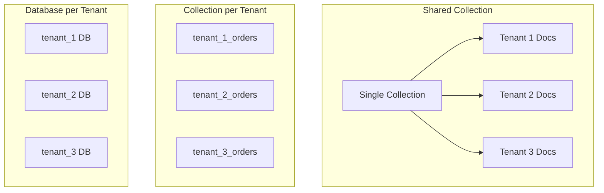

# How to Design Multi-Tenant Schemas in MongoDB

Author: [nawazdhandala](https://www.github.com/nawazdhandala)

Tags: MongoDB, Multi-Tenant, Schema Design, SaaS, Architecture

Description: Learn different approaches to designing multi-tenant schemas in MongoDB, including shared collections, tenant databases, and hybrid strategies with their trade-offs.

---

Multi-tenant applications serve multiple customers (tenants) from a single codebase. The database design determines how data is isolated, how well the system scales, and how easy it is to manage individual tenants. MongoDB offers several approaches, each with distinct trade-offs.

## Multi-Tenancy Approaches

There are three primary patterns for multi-tenant MongoDB schemas:



## Approach 1: Shared Collection with Tenant ID

All tenants share the same collections with a `tenantId` field for isolation.

```javascript
// Document structure with tenant identifier
const orderDocument = {
  _id: ObjectId("..."),
  tenantId: "acme-corp",        // Tenant identifier
  orderNumber: "ORD-12345",
  customer: {
    name: "John Doe",
    email: "john@acme.com"
  },
  items: [
    { product: "Widget", quantity: 10, price: 29.99 }
  ],
  total: 299.90,
  createdAt: new Date()
};

// CRITICAL: Create compound indexes with tenantId first
// This ensures queries for a specific tenant are efficient
await db.collection('orders').createIndex({ tenantId: 1, createdAt: -1 });
await db.collection('orders').createIndex({ tenantId: 1, orderNumber: 1 }, { unique: true });
await db.collection('orders').createIndex({ tenantId: 1, "customer.email": 1 });
```

Query pattern with tenant isolation:

```javascript
// Repository pattern that enforces tenant isolation
class OrderRepository {
  constructor(db, tenantId) {
    this.collection = db.collection('orders');
    this.tenantId = tenantId;
  }

  // All queries automatically include tenant filter
  async find(filter, options = {}) {
    return this.collection.find(
      { ...filter, tenantId: this.tenantId },
      options
    ).toArray();
  }

  async findOne(filter) {
    return this.collection.findOne({
      ...filter,
      tenantId: this.tenantId
    });
  }

  async insert(doc) {
    // Automatically set tenantId on insert
    return this.collection.insertOne({
      ...doc,
      tenantId: this.tenantId,
      createdAt: new Date()
    });
  }

  async update(filter, update) {
    // Ensure updates only affect tenant's documents
    return this.collection.updateMany(
      { ...filter, tenantId: this.tenantId },
      update
    );
  }

  async delete(filter) {
    return this.collection.deleteMany({
      ...filter,
      tenantId: this.tenantId
    });
  }

  // Aggregation with tenant scope
  async aggregate(pipeline) {
    // Prepend tenant filter to pipeline
    const scopedPipeline = [
      { $match: { tenantId: this.tenantId } },
      ...pipeline
    ];
    return this.collection.aggregate(scopedPipeline).toArray();
  }
}

// Usage in request handler
app.get('/api/orders', async (req, res) => {
  const tenantId = req.headers['x-tenant-id'];  // From auth middleware
  const repo = new OrderRepository(db, tenantId);

  const orders = await repo.find({
    createdAt: { $gte: new Date('2024-01-01') }
  });

  res.json(orders);
});
```

## Approach 2: Database per Tenant

Each tenant gets their own database, providing strong isolation.

```javascript
// Tenant database manager
class TenantDatabaseManager {
  constructor(client) {
    this.client = client;
    this.dbCache = new Map();
  }

  // Get database for a specific tenant
  getDatabase(tenantId) {
    // Sanitize tenant ID for use as database name
    const dbName = `tenant_${tenantId.replace(/[^a-zA-Z0-9]/g, '_')}`;

    if (!this.dbCache.has(dbName)) {
      const db = this.client.db(dbName);
      this.dbCache.set(dbName, db);
    }

    return this.dbCache.get(dbName);
  }

  // Initialize a new tenant database with indexes and default data
  async provisionTenant(tenantId) {
    const db = this.getDatabase(tenantId);

    // Create collections with indexes
    await db.collection('orders').createIndex({ orderNumber: 1 }, { unique: true });
    await db.collection('orders').createIndex({ createdAt: -1 });
    await db.collection('customers').createIndex({ email: 1 }, { unique: true });

    // Insert default settings
    await db.collection('settings').insertOne({
      _id: 'config',
      timezone: 'UTC',
      currency: 'USD',
      createdAt: new Date()
    });

    console.log(`Provisioned database for tenant: ${tenantId}`);
  }

  // Remove a tenant database
  async deprovisionTenant(tenantId) {
    const db = this.getDatabase(tenantId);
    await db.dropDatabase();
    this.dbCache.delete(`tenant_${tenantId}`);
    console.log(`Dropped database for tenant: ${tenantId}`);
  }

  // List all tenant databases
  async listTenants() {
    const adminDb = this.client.db('admin');
    const dbs = await adminDb.admin().listDatabases();
    return dbs.databases
      .filter(db => db.name.startsWith('tenant_'))
      .map(db => db.name.replace('tenant_', ''));
  }
}

// Express middleware for tenant database selection
function tenantMiddleware(manager) {
  return (req, res, next) => {
    const tenantId = req.headers['x-tenant-id'];

    if (!tenantId) {
      return res.status(400).json({ error: 'Tenant ID required' });
    }

    // Attach tenant database to request
    req.db = manager.getDatabase(tenantId);
    req.tenantId = tenantId;
    next();
  };
}

// Usage
const manager = new TenantDatabaseManager(client);
app.use(tenantMiddleware(manager));

app.get('/api/orders', async (req, res) => {
  // req.db is already scoped to the tenant
  const orders = await req.db.collection('orders').find({}).toArray();
  res.json(orders);
});
```

## Approach 3: Hybrid with Sharding

For large-scale deployments, use sharding with tenant ID as the shard key.

```javascript
// Enable sharding on the database
sh.enableSharding("saas_app");

// Shard collections by tenantId for distribution
sh.shardCollection("saas_app.orders", { tenantId: "hashed" });
sh.shardCollection("saas_app.customers", { tenantId: "hashed" });

// Or use ranged sharding for tenant isolation
// This keeps each tenant's data on fewer shards
sh.shardCollection("saas_app.events", { tenantId: 1, createdAt: 1 });
```

Zone sharding for dedicated resources:

```javascript
// Create zones for premium tenants
sh.addShardTag("shard0", "premium");
sh.addShardTag("shard1", "premium");
sh.addShardTag("shard2", "standard");
sh.addShardTag("shard3", "standard");

// Assign premium tenants to premium shards
sh.addTagRange(
  "saas_app.orders",
  { tenantId: "enterprise-1" },
  { tenantId: "enterprise-2" },
  "premium"
);

// Standard tenants go to standard shards
sh.addTagRange(
  "saas_app.orders",
  { tenantId: MinKey },
  { tenantId: "enterprise-1" },
  "standard"
);
```

## Comparing Approaches

| Aspect | Shared Collection | Database per Tenant | Sharded |
|--------|------------------|--------------------|---------|
| Isolation | Application-level | Database-level | Configurable |
| Complexity | Low | Medium | High |
| Index overhead | Higher | Lower | Distributed |
| Scaling tenants | Easy | Medium | Easy |
| Per-tenant backup | Hard | Easy | Medium |
| Resource limits | Shared | Independent | Configurable |
| Onboarding time | Instant | Minutes | Instant |

## Data Isolation Middleware

Regardless of approach, enforce isolation at the application level.

```javascript
// Middleware that prevents cross-tenant data access
class TenantGuard {
  constructor(db, tenantId) {
    this.db = db;
    this.tenantId = tenantId;

    // Wrap collection to enforce tenant isolation
    return new Proxy(this, {
      get: (target, prop) => {
        if (prop === 'collection') {
          return (name) => new TenantScopedCollection(
            target.db.collection(name),
            target.tenantId
          );
        }
        return target[prop];
      }
    });
  }
}

class TenantScopedCollection {
  constructor(collection, tenantId) {
    this.collection = collection;
    this.tenantId = tenantId;
  }

  // Override all methods to include tenant filter
  find(filter = {}) {
    return this.collection.find({ ...filter, tenantId: this.tenantId });
  }

  findOne(filter = {}) {
    return this.collection.findOne({ ...filter, tenantId: this.tenantId });
  }

  insertOne(doc) {
    if (doc.tenantId && doc.tenantId !== this.tenantId) {
      throw new Error('Cannot insert document for different tenant');
    }
    return this.collection.insertOne({ ...doc, tenantId: this.tenantId });
  }

  updateOne(filter, update, options) {
    return this.collection.updateOne(
      { ...filter, tenantId: this.tenantId },
      update,
      options
    );
  }

  updateMany(filter, update, options) {
    return this.collection.updateMany(
      { ...filter, tenantId: this.tenantId },
      update,
      options
    );
  }

  deleteOne(filter) {
    return this.collection.deleteOne({ ...filter, tenantId: this.tenantId });
  }

  deleteMany(filter) {
    return this.collection.deleteMany({ ...filter, tenantId: this.tenantId });
  }

  countDocuments(filter = {}) {
    return this.collection.countDocuments({ ...filter, tenantId: this.tenantId });
  }

  aggregate(pipeline) {
    // Ensure first stage filters by tenant
    const scopedPipeline = [
      { $match: { tenantId: this.tenantId } },
      ...pipeline
    ];
    return this.collection.aggregate(scopedPipeline);
  }
}
```

## Tenant Metrics and Usage Tracking

Track per-tenant metrics for billing and capacity planning.

```javascript
// Record tenant usage
async function recordUsage(db, tenantId, metric, value) {
  const today = new Date().toISOString().split('T')[0];

  await db.collection('tenant_usage').updateOne(
    { tenantId, date: today },
    {
      $inc: { [metric]: value },
      $setOnInsert: { tenantId, date: today, createdAt: new Date() }
    },
    { upsert: true }
  );
}

// Middleware to track API calls
function usageTrackingMiddleware(db) {
  return async (req, res, next) => {
    const tenantId = req.tenantId;

    // Track API call
    await recordUsage(db, tenantId, 'apiCalls', 1);

    // Track response size after response is sent
    res.on('finish', async () => {
      const bytes = parseInt(res.get('Content-Length') || 0);
      await recordUsage(db, tenantId, 'bytesTransferred', bytes);
    });

    next();
  };
}

// Get tenant usage summary
async function getTenantUsage(db, tenantId, startDate, endDate) {
  return db.collection('tenant_usage').aggregate([
    {
      $match: {
        tenantId,
        date: { $gte: startDate, $lte: endDate }
      }
    },
    {
      $group: {
        _id: '$tenantId',
        totalApiCalls: { $sum: '$apiCalls' },
        totalBytes: { $sum: '$bytesTransferred' },
        totalDocuments: { $sum: '$documentsCreated' },
        days: { $sum: 1 }
      }
    }
  ]).toArray();
}
```

## Choosing the Right Approach

**Use Shared Collections when:**
- You have many small tenants
- Data isolation requirements are moderate
- You need fast tenant onboarding
- Cross-tenant analytics are needed

**Use Database per Tenant when:**
- Regulatory compliance requires strong isolation
- Tenants need independent backup/restore
- Per-tenant resource limits are required
- You have fewer, larger tenants

**Use Sharding when:**
- You have extreme scale requirements
- Some tenants need dedicated resources
- Geographic data distribution is needed

Start simple with shared collections, then migrate high-value tenants to dedicated databases as needed. The hybrid approach gives you flexibility without over-engineering from the start.
