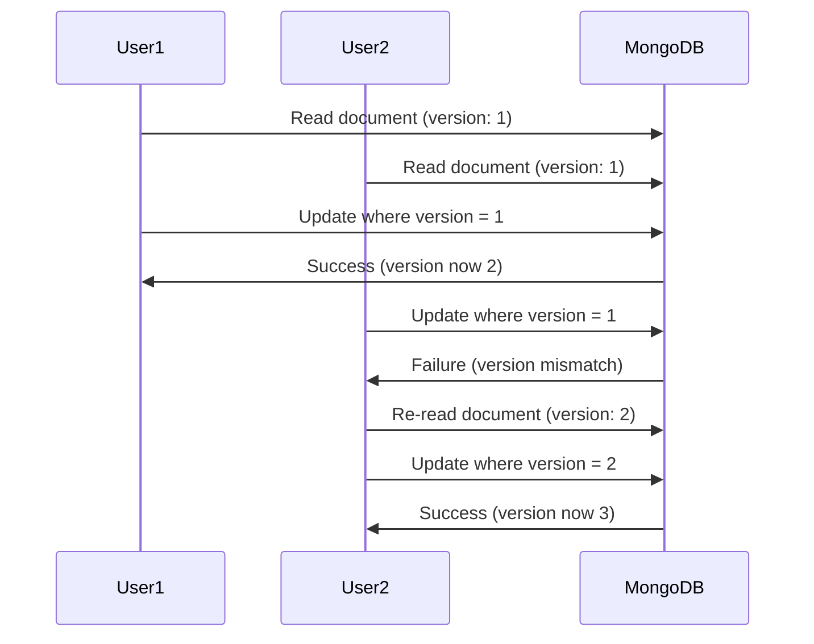

# How to Implement Optimistic Locking in MongoDB

Author: [nawazdhandala](https://www.github.com/nawazdhandala)

Tags: MongoDB, Optimistic Locking, Concurrency, Transactions, Version Control

Description: Learn how to implement optimistic locking in MongoDB to handle concurrent updates safely using version fields and atomic operations.

---

When multiple users or processes try to update the same document simultaneously, you risk overwriting changes. Optimistic locking solves this by tracking document versions and rejecting updates that are based on stale data. Unlike pessimistic locking, which blocks other operations, optimistic locking allows concurrent reads and only fails at write time if conflicts occur.

## How Optimistic Locking Works



## Basic Version Field Implementation

```javascript
// Add a version field to track document changes
const productSchema = {
  _id: ObjectId("..."),
  name: "Widget Pro",
  price: 29.99,
  stock: 100,
  __v: 1  // Version field
};

// Optimistic update - only succeeds if version matches
async function updateProduct(collection, productId, updates, currentVersion) {
  const result = await collection.findOneAndUpdate(
    {
      _id: productId,
      __v: currentVersion  // Only update if version matches
    },
    {
      $set: updates,
      $inc: { __v: 1 }  // Increment version on success
    },
    {
      returnDocument: 'after'
    }
  );

  if (!result) {
    throw new Error('Concurrent modification detected - please retry');
  }

  return result;
}

// Usage
async function modifyProductPrice(collection, productId, newPrice) {
  // Step 1: Read current document
  const product = await collection.findOne({ _id: productId });

  if (!product) {
    throw new Error('Product not found');
  }

  // Step 2: Attempt optimistic update
  try {
    const updated = await updateProduct(
      collection,
      productId,
      { price: newPrice },
      product.__v
    );
    console.log('Update successful:', updated);
    return updated;
  } catch (error) {
    if (error.message.includes('Concurrent modification')) {
      // Step 3: Handle conflict - could retry or notify user
      console.log('Conflict detected, re-reading document');
      const fresh = await collection.findOne({ _id: productId });
      // Decide: retry automatically or return conflict to user
      throw new Error(`Price was updated by another user to ${fresh.price}`);
    }
    throw error;
  }
}
```

## Generic Optimistic Locking Repository

```javascript
// Reusable repository with optimistic locking support
class OptimisticRepository {
  constructor(collection, versionField = '__v') {
    this.collection = collection;
    this.versionField = versionField;
  }

  async findById(id) {
    return this.collection.findOne({ _id: id });
  }

  async save(document) {
    if (!document._id) {
      // New document - insert with version 1
      document[this.versionField] = 1;
      const result = await this.collection.insertOne(document);
      return { ...document, _id: result.insertedId };
    }

    // Existing document - optimistic update
    const currentVersion = document[this.versionField];

    if (currentVersion === undefined) {
      throw new Error('Document missing version field for optimistic locking');
    }

    const { _id, [this.versionField]: version, ...updateData } = document;

    const result = await this.collection.findOneAndUpdate(
      {
        _id: _id,
        [this.versionField]: currentVersion
      },
      {
        $set: updateData,
        $inc: { [this.versionField]: 1 }
      },
      {
        returnDocument: 'after'
      }
    );

    if (!result) {
      throw new OptimisticLockError(
        `Document ${_id} was modified by another process`
      );
    }

    return result;
  }

  async delete(id, currentVersion) {
    const result = await this.collection.deleteOne({
      _id: id,
      [this.versionField]: currentVersion
    });

    if (result.deletedCount === 0) {
      throw new OptimisticLockError(
        `Document ${id} was modified or already deleted`
      );
    }

    return true;
  }
}

// Custom error class for lock failures
class OptimisticLockError extends Error {
  constructor(message) {
    super(message);
    this.name = 'OptimisticLockError';
    this.retryable = true;
  }
}
```

## Automatic Retry with Exponential Backoff

```javascript
// Retry wrapper for optimistic operations
async function withOptimisticRetry(operation, options = {}) {
  const {
    maxRetries = 3,
    baseDelayMs = 50,
    maxDelayMs = 1000
  } = options;

  let lastError;

  for (let attempt = 1; attempt <= maxRetries; attempt++) {
    try {
      return await operation();
    } catch (error) {
      if (error.name === 'OptimisticLockError' && attempt < maxRetries) {
        lastError = error;

        // Exponential backoff with jitter
        const delay = Math.min(
          baseDelayMs * Math.pow(2, attempt - 1) + Math.random() * 50,
          maxDelayMs
        );

        console.log(`Optimistic lock conflict, retry ${attempt}/${maxRetries} after ${delay}ms`);
        await new Promise(resolve => setTimeout(resolve, delay));
        continue;
      }
      throw error;
    }
  }

  throw lastError;
}

// Usage with automatic retry
async function updateInventory(repo, productId, quantityDelta) {
  return withOptimisticRetry(async () => {
    const product = await repo.findById(productId);

    if (!product) {
      throw new Error('Product not found');
    }

    const newStock = product.stock + quantityDelta;

    if (newStock < 0) {
      throw new Error('Insufficient stock');
    }

    product.stock = newStock;
    return repo.save(product);
  });
}
```

## Using Timestamps Instead of Numeric Versions

```javascript
// Use lastModified timestamp as version
const documentWithTimestamp = {
  _id: ObjectId("..."),
  name: "Widget",
  updatedAt: new Date()  // Acts as version
};

async function updateWithTimestamp(collection, id, updates, lastKnownUpdate) {
  const now = new Date();

  const result = await collection.findOneAndUpdate(
    {
      _id: id,
      updatedAt: lastKnownUpdate  // Match exact timestamp
    },
    {
      $set: {
        ...updates,
        updatedAt: now
      }
    },
    {
      returnDocument: 'after'
    }
  );

  if (!result) {
    throw new OptimisticLockError('Document was modified since last read');
  }

  return result;
}

// Timestamp approach advantages:
// - Shows when document was last modified
// - Useful for caching and sync scenarios
// - Can compare to client's cached version

// Numeric version advantages:
// - More compact in queries
// - Easier to reason about sequence
// - No timezone/precision issues
```

## Conditional Updates with Business Logic

```javascript
// Combine optimistic locking with business rule validation
class OrderService {
  constructor(db) {
    this.orders = db.collection('orders');
    this.inventory = db.collection('inventory');
  }

  async confirmOrder(orderId, expectedVersion) {
    // Use session for multi-document consistency
    const session = this.orders.client.startSession();

    try {
      await session.withTransaction(async () => {
        // Step 1: Lock order with version check
        const order = await this.orders.findOneAndUpdate(
          {
            _id: orderId,
            status: 'pending',
            __v: expectedVersion
          },
          {
            $set: { status: 'processing' },
            $inc: { __v: 1 }
          },
          { session, returnDocument: 'after' }
        );

        if (!order) {
          throw new OptimisticLockError(
            'Order was modified or is no longer pending'
          );
        }

        // Step 2: Decrement inventory with optimistic check
        for (const item of order.items) {
          const inventoryUpdate = await this.inventory.findOneAndUpdate(
            {
              productId: item.productId,
              stock: { $gte: item.quantity }  // Sufficient stock check
            },
            {
              $inc: {
                stock: -item.quantity,
                __v: 1
              }
            },
            { session, returnDocument: 'after' }
          );

          if (!inventoryUpdate) {
            throw new Error(`Insufficient stock for ${item.productId}`);
          }
        }

        // Step 3: Mark order confirmed
        await this.orders.updateOne(
          { _id: orderId },
          {
            $set: { status: 'confirmed', confirmedAt: new Date() },
            $inc: { __v: 1 }
          },
          { session }
        );
      });

      return { success: true };

    } catch (error) {
      if (error.name === 'OptimisticLockError') {
        return { success: false, reason: 'conflict', message: error.message };
      }
      throw error;

    } finally {
      await session.endSession();
    }
  }
}
```

## Handling Conflicts in the UI

```javascript
// Express endpoint with conflict resolution
app.put('/api/products/:id', async (req, res) => {
  const { id } = req.params;
  const { name, price, description, __v: clientVersion } = req.body;

  try {
    // Attempt optimistic update
    const updated = await repo.save({
      _id: new ObjectId(id),
      name,
      price,
      description,
      __v: clientVersion
    });

    res.json(updated);

  } catch (error) {
    if (error.name === 'OptimisticLockError') {
      // Return current state so client can resolve
      const current = await repo.findById(new ObjectId(id));

      res.status(409).json({
        error: 'conflict',
        message: 'Document was modified by another user',
        currentDocument: current,
        yourChanges: { name, price, description }
      });
      return;
    }

    res.status(500).json({ error: error.message });
  }
});

// Client-side conflict resolution
async function saveProduct(product) {
  const response = await fetch(`/api/products/${product._id}`, {
    method: 'PUT',
    headers: { 'Content-Type': 'application/json' },
    body: JSON.stringify(product)
  });

  if (response.status === 409) {
    const conflict = await response.json();

    // Show user both versions
    const resolution = await showConflictDialog({
      yours: conflict.yourChanges,
      theirs: conflict.currentDocument
    });

    if (resolution.action === 'overwrite') {
      // Retry with current version
      return saveProduct({
        ...product,
        __v: conflict.currentDocument.__v
      });
    } else if (resolution.action === 'merge') {
      // Apply merged changes
      return saveProduct({
        ...resolution.mergedDocument,
        __v: conflict.currentDocument.__v
      });
    }
    // else: user cancelled
    return null;
  }

  return response.json();
}
```

## Performance Considerations

```javascript
// Index the version field for efficient optimistic updates
await collection.createIndex({ _id: 1, __v: 1 });

// For high-contention scenarios, consider:
// 1. Reducing the scope of locked data
// 2. Using finer-grained version fields

const finegrainedDocument = {
  _id: ObjectId("..."),
  metadata: {
    name: "Product",
    __v: 1  // Version just for metadata
  },
  pricing: {
    price: 99.99,
    currency: "USD",
    __v: 1  // Separate version for pricing
  },
  inventory: {
    stock: 100,
    __v: 1  // Separate version for inventory
  }
};

// Update pricing without conflicting with inventory changes
async function updatePricing(collection, productId, newPrice, pricingVersion) {
  return collection.findOneAndUpdate(
    {
      _id: productId,
      'pricing.__v': pricingVersion
    },
    {
      $set: { 'pricing.price': newPrice },
      $inc: { 'pricing.__v': 1 }
    },
    { returnDocument: 'after' }
  );
}
```

## Summary

Optimistic locking prevents lost updates without blocking concurrent reads:

- Add a version field (`__v` or `updatedAt`) to documents
- Include version in update filter conditions
- Increment version on each successful update
- Handle conflicts with retry or user notification
- Use transactions when multiple documents need consistent versions

Start simple with a single version field, then consider finer-grained versioning if specific fields have high contention.
