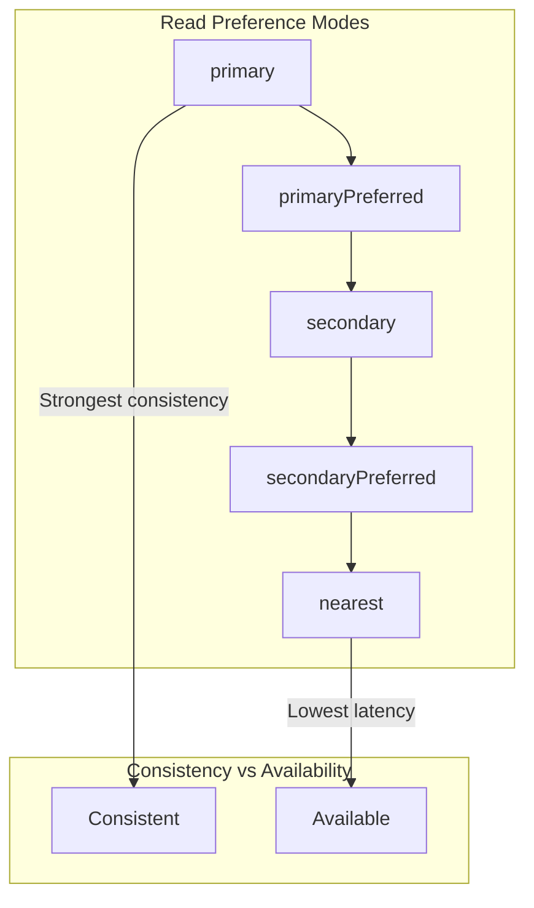

# How to Balance Consistency with Read Preferences in MongoDB

Author: [nawazdhandala](https://www.github.com/nawazdhandala)

Tags: MongoDB, Read Preferences, Consistency, Replica Sets, Performance

Description: Learn how to configure MongoDB read preferences to balance consistency, availability, and latency across replica set members with practical examples.

---

In a MongoDB replica set, you have one primary that handles writes and multiple secondaries that replicate data. Read preferences control which members handle read operations, letting you trade consistency for availability and latency. Understanding these trade-offs is essential for building reliable applications.

## Read Preference Modes

MongoDB offers five read preference modes:



| Mode | Reads From | Consistency | Use Case |
|------|-----------|-------------|----------|
| primary | Primary only | Strong | Financial transactions |
| primaryPreferred | Primary, fallback to secondary | Strong (usually) | Read-heavy with fallback |
| secondary | Secondaries only | Eventual | Analytics, reporting |
| secondaryPreferred | Secondaries, fallback to primary | Eventual (usually) | Distributed reads |
| nearest | Lowest latency member | Eventual | Geo-distributed apps |

## Configuring Read Preferences

```javascript
const { MongoClient, ReadPreference } = require('mongodb');

// Connection-level read preference
const client = new MongoClient('mongodb://localhost:27017,localhost:27018,localhost:27019/mydb?replicaSet=rs0', {
  readPreference: ReadPreference.SECONDARY_PREFERRED
});

// Database-level read preference
const db = client.db('mydb', {
  readPreference: ReadPreference.SECONDARY
});

// Collection-level read preference
const collection = db.collection('logs', {
  readPreference: ReadPreference.NEAREST
});

// Query-level read preference (most specific)
const results = await collection.find({ status: 'active' })
  .readPreference(ReadPreference.PRIMARY)
  .toArray();
```

## Read Preference with Tags

Tags allow routing reads to specific replica set members based on location, hardware, or purpose.

```javascript
// Replica set configuration with member tags
// Run on primary:
rs.reconfig({
  _id: "rs0",
  members: [
    { _id: 0, host: "mongo1:27017", tags: { dc: "east", role: "primary" } },
    { _id: 1, host: "mongo2:27017", tags: { dc: "east", role: "analytics" } },
    { _id: 2, host: "mongo3:27017", tags: { dc: "west", role: "disaster-recovery" } }
  ]
});

// Read from analytics node
const analyticsPreference = new ReadPreference(
  ReadPreference.SECONDARY,
  [{ role: "analytics" }]
);

const analyticsDb = client.db('mydb', {
  readPreference: analyticsPreference
});

// Read from same datacenter
const localPreference = new ReadPreference(
  ReadPreference.SECONDARY_PREFERRED,
  [{ dc: "east" }]  // Prefer east datacenter
);

// Multiple tag sets (fallback order)
const geoPreference = new ReadPreference(
  ReadPreference.NEAREST,
  [
    { dc: "east" },     // First choice: east datacenter
    { dc: "west" },     // Fallback: west datacenter
    {}                  // Last resort: any member
  ]
);
```

## Handling Stale Reads

With non-primary read preferences, you may read data that is slightly behind the primary.

```javascript
// maxStalenessSeconds prevents reading from lagging secondaries
const freshSecondary = new ReadPreference(
  ReadPreference.SECONDARY_PREFERRED,
  [],  // No tags
  { maxStalenessSeconds: 90 }  // Max 90 seconds behind primary
);

// Minimum value is 90 seconds (or your heartbeat interval + 10s)
// Set based on your tolerance for stale data

const collection = db.collection('inventory', {
  readPreference: freshSecondary
});

// For critical reads, verify data freshness
async function getInventoryWithFreshness(productId) {
  const collection = db.collection('inventory');

  // Read from primary for accurate count
  const primary = await collection.findOne(
    { _id: productId },
    { readPreference: ReadPreference.PRIMARY }
  );

  // Compare with secondary for consistency check
  const secondary = await collection.findOne(
    { _id: productId },
    { readPreference: ReadPreference.SECONDARY }
  );

  // Warn if data differs significantly
  if (primary && secondary && primary.quantity !== secondary.quantity) {
    console.warn(`Stale secondary data detected for ${productId}`);
  }

  return primary;
}
```

## Read Preference Patterns by Use Case

```javascript
// Pattern 1: Financial transactions - always read from primary
class AccountService {
  constructor(db) {
    // Force primary for all account operations
    this.collection = db.collection('accounts', {
      readPreference: ReadPreference.PRIMARY
    });
  }

  async getBalance(accountId) {
    const account = await this.collection.findOne({ _id: accountId });
    return account?.balance || 0;
  }

  async transfer(fromId, toId, amount) {
    // Both read and write use primary - fully consistent
    const session = this.client.startSession();
    try {
      await session.withTransaction(async () => {
        await this.collection.updateOne(
          { _id: fromId, balance: { $gte: amount } },
          { $inc: { balance: -amount } },
          { session }
        );
        await this.collection.updateOne(
          { _id: toId },
          { $inc: { balance: amount } },
          { session }
        );
      });
    } finally {
      await session.endSession();
    }
  }
}

// Pattern 2: Analytics dashboard - read from secondaries
class AnalyticsService {
  constructor(db) {
    // Analytics can tolerate slight delays
    this.collection = db.collection('events', {
      readPreference: new ReadPreference(
        ReadPreference.SECONDARY,
        [{ role: 'analytics' }],  // Dedicated analytics node
        { maxStalenessSeconds: 300 }  // Up to 5 minutes stale is OK
      )
    });
  }

  async getDailyStats(date) {
    return this.collection.aggregate([
      { $match: { date: date } },
      { $group: { _id: '$type', count: { $sum: 1 } } }
    ]).toArray();
  }
}

// Pattern 3: Global application - read from nearest
class ContentService {
  constructor(db) {
    // Content can be slightly stale, prioritize latency
    this.collection = db.collection('content', {
      readPreference: ReadPreference.NEAREST
    });
  }

  async getArticle(slug) {
    // User gets content from geographically closest node
    return this.collection.findOne({ slug: slug });
  }
}

// Pattern 4: High availability - prefer secondary with primary fallback
class CatalogService {
  constructor(db) {
    this.collection = db.collection('products', {
      readPreference: ReadPreference.SECONDARY_PREFERRED
    });
  }

  async searchProducts(query) {
    // If all secondaries are down, falls back to primary
    return this.collection.find({ $text: { $search: query } }).toArray();
  }
}
```

## Monitoring Read Distribution

```javascript
// Check which member handled your read
async function traceRead(collection, query) {
  const explanation = await collection.find(query).explain('executionStats');

  console.log('Read executed on:', explanation.serverInfo?.host);
  console.log('Execution time:', explanation.executionStats.executionTimeMillis, 'ms');

  return explanation;
}

// Monitor read distribution across replica set
async function getReadDistribution(db) {
  const serverStatus = await db.admin().serverStatus();

  // Get metrics per operation type
  const opcounters = serverStatus.opcounters;
  console.log('Operations on this member:');
  console.log(`  Queries: ${opcounters.query}`);
  console.log(`  Inserts: ${opcounters.insert}`);
  console.log(`  Updates: ${opcounters.update}`);

  // Check replica set status
  const replStatus = await db.admin().replSetGetStatus();
  console.log('\nReplica set members:');
  replStatus.members.forEach(member => {
    console.log(`  ${member.name}: ${member.stateStr}`);
    if (member.optime) {
      console.log(`    Optime: ${member.optime.ts}`);
    }
  });
}
```

## Causal Consistency with Read Preferences

When reading from secondaries, use causal consistency to ensure read-your-writes semantics.

```javascript
// Enable causal consistency for session
const session = client.startSession({ causalConsistency: true });

try {
  const collection = db.collection('orders');

  // Write to primary
  const result = await collection.insertOne(
    { customerId: 'abc', total: 99.99, status: 'pending' },
    { session }
  );

  // Read from secondary - guaranteed to see the write we just made
  const order = await collection.findOne(
    { _id: result.insertedId },
    {
      session,
      readPreference: ReadPreference.SECONDARY
    }
  );

  console.log('Order confirmed:', order);

} finally {
  await session.endSession();
}
```

## Best Practices

**Match read preference to data requirements:**
- Financial data: `primary` only
- User-facing content: `secondaryPreferred` or `nearest`
- Analytics: `secondary` with dedicated node tags

**Always set maxStalenessSeconds:**
- Prevents reads from severely lagging members
- Minimum 90 seconds, set based on your tolerance

**Use tags for workload isolation:**
- Separate analytics from production reads
- Route reads by geographic location

**Monitor replication lag:**
- High lag indicates secondaries are overloaded
- Consider adding capacity or adjusting read distribution

```javascript
// Check replication lag
async function checkReplicationLag(db) {
  const status = await db.admin().replSetGetStatus();
  const primary = status.members.find(m => m.stateStr === 'PRIMARY');

  if (!primary) {
    console.error('No primary found!');
    return;
  }

  const primaryOptime = primary.optime.ts.getTime();

  status.members.forEach(member => {
    if (member.stateStr === 'SECONDARY') {
      const secondaryOptime = member.optime.ts.getTime();
      const lagMs = primaryOptime - secondaryOptime;
      console.log(`${member.name}: ${lagMs}ms behind primary`);

      if (lagMs > 10000) {
        console.warn(`WARNING: ${member.name} has high replication lag`);
      }
    }
  });
}
```

## Summary

Read preferences let you optimize for your application's specific needs:

- Use `primary` for strong consistency requirements
- Use `secondaryPreferred` for high availability reads
- Use `secondary` with tags for analytics workloads
- Use `nearest` for latency-sensitive global applications
- Always consider maxStalenessSeconds to prevent stale reads
- Enable causal consistency when you need read-your-writes semantics

Start with `primaryPreferred` as a safe default, then optimize based on actual requirements and observed patterns.
