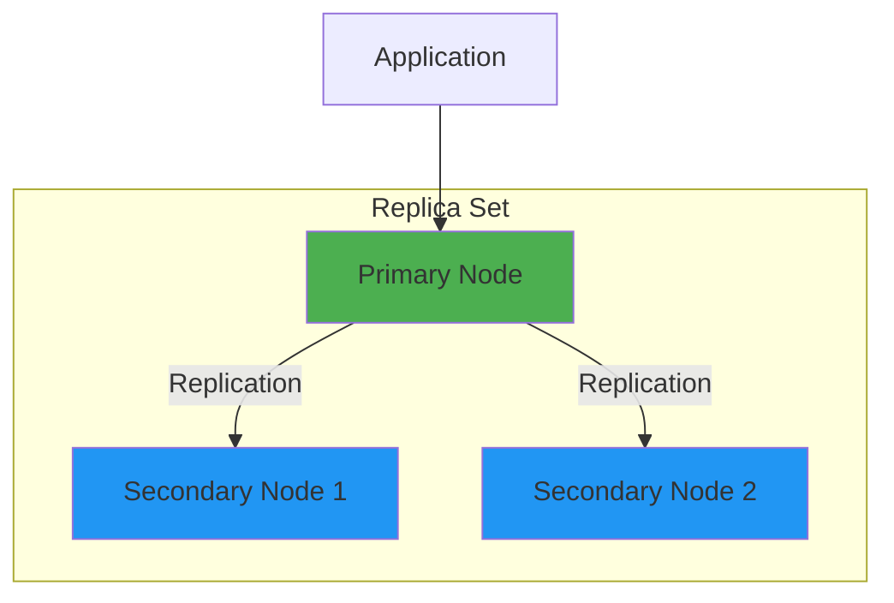
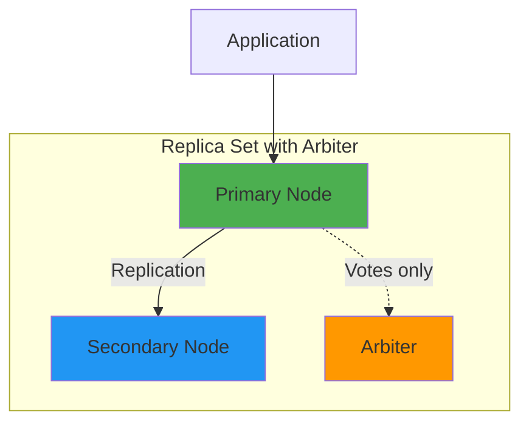

# How to Set Up MongoDB Replica Sets with Failover

Author: [nawazdhandala](https://www.github.com/nawazdhandala)

Tags: MongoDB, Replica Sets, High Availability, Failover, Database

Description: A complete guide to setting up MongoDB replica sets for high availability, including configuration, automatic failover, and monitoring strategies.

---

A standalone MongoDB instance is a single point of failure. If that server goes down, your application goes down with it. Replica sets solve this by maintaining multiple copies of your data across different servers, with automatic failover when the primary node becomes unavailable.

## How Replica Sets Work

A replica set consists of multiple MongoDB instances that maintain the same data. One member is the primary, handling all write operations. The other members are secondaries that replicate data from the primary.



When the primary fails, the secondaries hold an election. The secondary with the most recent data and highest priority becomes the new primary. This happens automatically, typically within 10-12 seconds.

## Setting Up a Three-Node Replica Set

For this example, we'll set up a replica set across three servers. In production, always use an odd number of members to ensure clear election outcomes.

### Step 1: Configure Each MongoDB Instance

On each server, modify the MongoDB configuration file:

```yaml
# /etc/mongod.conf on server 1 (mongo1.example.com)
storage:
  dbPath: /var/lib/mongodb

net:
  port: 27017
  bindIp: 0.0.0.0  # Allow connections from any IP

replication:
  replSetName: "rs0"  # Must be the same on all members

security:
  keyFile: /etc/mongodb/keyfile  # For internal authentication
```

Repeat on the other two servers with the same configuration.

### Step 2: Create the Keyfile for Authentication

All replica set members must authenticate with each other. Create a keyfile:

```bash
# Generate a keyfile with random bytes
openssl rand -base64 756 > /etc/mongodb/keyfile

# Set proper permissions (MongoDB requires 400 or 600)
chmod 400 /etc/mongodb/keyfile
chown mongodb:mongodb /etc/mongodb/keyfile
```

Copy this same keyfile to all replica set members.

### Step 3: Start MongoDB on All Servers

```bash
# On each server
sudo systemctl start mongod
sudo systemctl enable mongod
```

### Step 4: Initialize the Replica Set

Connect to one of the servers and initialize the replica set:

```javascript
// Connect to mongo1
mongosh "mongodb://mongo1.example.com:27017"

// Initialize the replica set
rs.initiate({
  _id: "rs0",
  members: [
    { _id: 0, host: "mongo1.example.com:27017", priority: 2 },
    { _id: 1, host: "mongo2.example.com:27017", priority: 1 },
    { _id: 2, host: "mongo3.example.com:27017", priority: 1 }
  ]
});
```

The server with priority 2 will be preferred as primary during elections.

### Step 5: Verify the Replica Set Status

```javascript
// Check replica set status
rs.status();

// You should see output like:
{
  "set": "rs0",
  "members": [
    {
      "_id": 0,
      "name": "mongo1.example.com:27017",
      "stateStr": "PRIMARY",
      "health": 1
    },
    {
      "_id": 1,
      "name": "mongo2.example.com:27017",
      "stateStr": "SECONDARY",
      "health": 1
    },
    {
      "_id": 2,
      "name": "mongo3.example.com:27017",
      "stateStr": "SECONDARY",
      "health": 1
    }
  ]
}
```

## Connecting Your Application

Update your connection string to include all replica set members:

```javascript
// Node.js with MongoDB driver
const { MongoClient } = require('mongodb');

const uri = "mongodb://mongo1.example.com:27017,mongo2.example.com:27017,mongo3.example.com:27017/?replicaSet=rs0";

const client = new MongoClient(uri, {
  // The driver will automatically discover the primary
  readPreference: 'primaryPreferred',

  // Retry writes on network errors
  retryWrites: true,

  // Wait up to 30 seconds for a new primary during failover
  serverSelectionTimeoutMS: 30000
});

async function connect() {
  try {
    await client.connect();
    console.log("Connected to replica set");
  } catch (error) {
    console.error("Connection failed:", error);
  }
}
```

## Understanding Failover

When the primary becomes unavailable, the remaining members hold an election.

### Election Process

1. A secondary detects the primary is unreachable
2. It waits for the election timeout (default: 10 seconds)
3. Eligible secondaries request votes from other members
4. The member with the majority of votes becomes primary

### Testing Failover

You can manually trigger a failover to test your application's resilience:

```javascript
// Connect to the current primary
mongosh "mongodb://mongo1.example.com:27017"

// Force the primary to step down
// This triggers an election among secondaries
rs.stepDown();

// Optionally specify how long it should not be eligible
// to become primary again (in seconds)
rs.stepDown(60);
```

### Monitoring Failover in Your Application

```javascript
// Node.js - Listen for topology changes
client.on('serverDescriptionChanged', (event) => {
  console.log('Server changed:', event.address);
  console.log('New description:', event.newDescription.type);
});

client.on('topologyDescriptionChanged', (event) => {
  const newPrimary = Array.from(event.newDescription.servers.values())
    .find(server => server.type === 'RSPrimary');

  if (newPrimary) {
    console.log('New primary:', newPrimary.address);
  }
});
```

## Adding an Arbiter

If you can only afford two data-bearing nodes, add an arbiter. An arbiter participates in elections but holds no data.

```javascript
// Add an arbiter to an existing replica set
rs.addArb("arbiter.example.com:27017");
```

An arbiter should run on a separate server from the data-bearing members.



## Hidden and Delayed Members

### Hidden Members

Hidden members replicate data but are invisible to applications. They are useful for dedicated backup or reporting servers.

```javascript
// Add a hidden member
rs.add({
  host: "hidden.example.com:27017",
  priority: 0,        // Cannot become primary
  hidden: true        // Invisible to applications
});
```

### Delayed Members

Delayed members replicate with a time lag, providing protection against accidental data deletion.

```javascript
// Add a member with 1-hour delay
rs.add({
  host: "delayed.example.com:27017",
  priority: 0,
  hidden: true,
  secondaryDelaySecs: 3600  // 1 hour delay
});
```

## Read Preferences

Control where your application reads data from:

```javascript
// Read from primary only (default)
const cursor = collection.find({}).readPreference('primary');

// Read from secondaries to reduce load on primary
const cursor = collection.find({}).readPreference('secondary');

// Read from nearest member by network latency
const cursor = collection.find({}).readPreference('nearest');

// Prefer primary but use secondary if unavailable
const cursor = collection.find({}).readPreference('primaryPreferred');
```

Choose based on your consistency requirements. Reading from secondaries may return stale data.

## Write Concern for Durability

Write concern specifies how many replica set members must acknowledge a write:

```javascript
// Wait for write to reach majority of members
await collection.insertOne(
  { name: "Important Document" },
  { writeConcern: { w: "majority", wtimeout: 5000 } }
);

// Write acknowledged only by primary (faster but less safe)
await collection.insertOne(
  { name: "Less Critical" },
  { writeConcern: { w: 1 } }
);
```

## Monitoring Replica Set Health

### Basic Health Check Script

```javascript
// health-check.js
const status = rs.status();

status.members.forEach(member => {
  const lag = member.optimeDate
    ? (status.members[0].optimeDate - member.optimeDate) / 1000
    : 0;

  console.log(`${member.name}: ${member.stateStr}`);
  console.log(`  Health: ${member.health === 1 ? 'OK' : 'FAIL'}`);
  console.log(`  Replication Lag: ${lag} seconds`);
});
```

### Key Metrics to Monitor

- **Replication lag**: Time difference between primary and secondaries
- **Oplog window**: How far back the oplog extends
- **Election events**: Frequency of primary changes
- **Member health**: Up/down status of each member

```javascript
// Check oplog size and time range
const oplog = db.getSiblingDB('local').oplog.rs;
const first = oplog.find().sort({ $natural: 1 }).limit(1).next();
const last = oplog.find().sort({ $natural: -1 }).limit(1).next();

const oplogHours = (last.ts.getTime() - first.ts.getTime()) / 3600;
console.log(`Oplog window: ${oplogHours.toFixed(2)} hours`);
```

## Common Issues and Solutions

### Split Brain Prevention

MongoDB prevents split brain by requiring a majority vote. With three members, you need at least two for a primary election.

### Network Partition Handling

If the primary is isolated, it steps down. The majority partition elects a new primary.

### Recovering a Failed Member

```bash
# If a member falls too far behind, it needs a full resync
# Stop the member and remove its data
sudo systemctl stop mongod
rm -rf /var/lib/mongodb/*

# Start it again - it will perform initial sync
sudo systemctl start mongod
```

---

Replica sets are essential for production MongoDB deployments. They provide automatic failover, data redundancy, and read scaling. Start with three members, monitor replication lag, and test failover before you need it. Your users will never notice when a server fails because the replica set handles it automatically.
