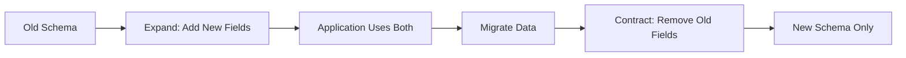

# How to Migrate MongoDB Schemas with Zero Downtime

Author: [nawazdhandala](https://www.github.com/nawazdhandala)

Tags: MongoDB, Schema Migration, Zero Downtime, Database, DevOps

Description: Learn strategies for migrating MongoDB schemas without application downtime, including field renaming, data transformations, and rollback procedures.

---

Schema changes in production databases can be risky. A poorly planned migration can cause application errors, data corruption, or extended downtime. MongoDB's flexible schema makes migrations easier than relational databases, but you still need a solid strategy to make changes safely while your application continues serving traffic.

## The Expand-Contract Pattern

The safest approach to schema migration follows the expand-contract pattern:

1. **Expand**: Add new fields or structures alongside existing ones
2. **Migrate**: Gradually move data to the new format
3. **Contract**: Remove old fields once migration is complete



## Example: Renaming a Field

Suppose you need to rename `userName` to `username` across millions of documents.

```javascript
// WRONG: Direct rename causes issues for running applications
// db.users.updateMany({}, { $rename: { "userName": "username" } })

// RIGHT: Expand-Contract approach

// Step 1: Expand - Application writes to both fields
// Update application code to write both fields on any update
async function updateUser(userId, updates) {
  const doc = {};

  // During migration, write to both old and new field names
  if (updates.username !== undefined) {
    doc.username = updates.username;
    doc.userName = updates.username;  // Keep old field in sync
  }

  await db.collection('users').updateOne(
    { _id: userId },
    { $set: doc }
  );
}

// Application reads with fallback
async function getDisplayName(userId) {
  const user = await db.collection('users').findOne({ _id: userId });
  // Read new field, fall back to old field
  return user.username || user.userName;
}
```

## Batch Migration Script

Run data migration in the background without locking the collection.

```javascript
// migrate-username-field.js
// Migrates userName to username in batches

const BATCH_SIZE = 1000;
const DELAY_MS = 100;  // Delay between batches to reduce load

async function migrateUsernames() {
  const collection = db.collection('users');

  let migratedCount = 0;
  let lastId = null;

  while (true) {
    // Find documents with old field but missing new field
    const query = {
      userName: { $exists: true },
      username: { $exists: false }
    };

    // Use _id for pagination (more efficient than skip)
    if (lastId) {
      query._id = { $gt: lastId };
    }

    const batch = await collection
      .find(query)
      .sort({ _id: 1 })
      .limit(BATCH_SIZE)
      .toArray();

    if (batch.length === 0) {
      break;  // Migration complete
    }

    // Migrate each document in the batch
    const bulkOps = batch.map(doc => ({
      updateOne: {
        filter: { _id: doc._id },
        update: { $set: { username: doc.userName } }
      }
    }));

    await collection.bulkWrite(bulkOps, { ordered: false });

    migratedCount += batch.length;
    lastId = batch[batch.length - 1]._id;

    console.log(`Migrated ${migratedCount} documents...`);

    // Delay to prevent overwhelming the database
    await new Promise(resolve => setTimeout(resolve, DELAY_MS));
  }

  console.log(`Migration complete. Total: ${migratedCount} documents`);
}

migrateUsernames().catch(console.error);
```

## Contract Phase: Removing Old Fields

After all documents are migrated and application code no longer reads the old field:

```javascript
// verify-migration.js
// Verify migration is complete before cleanup

async function verifyMigration() {
  const collection = db.collection('users');

  // Count documents missing the new field
  const missingNew = await collection.countDocuments({
    username: { $exists: false }
  });

  // Count documents with old field
  const hasOld = await collection.countDocuments({
    userName: { $exists: true }
  });

  console.log(`Documents missing 'username': ${missingNew}`);
  console.log(`Documents with 'userName': ${hasOld}`);

  if (missingNew === 0) {
    console.log('Migration verified complete. Safe to remove old field.');
    return true;
  }

  console.log('Migration incomplete. Do not proceed with cleanup.');
  return false;
}

// cleanup-old-field.js
// Remove the deprecated field after verification

async function removeOldField() {
  const collection = db.collection('users');

  // Remove in batches to avoid long-running operations
  let removed = 0;

  while (true) {
    const result = await collection.updateMany(
      { userName: { $exists: true } },
      { $unset: { userName: "" } },
      { limit: 1000 }
    );

    if (result.modifiedCount === 0) break;
    removed += result.modifiedCount;
    console.log(`Removed old field from ${removed} documents`);

    await new Promise(resolve => setTimeout(resolve, 100));
  }

  console.log('Cleanup complete');
}
```

## Adding New Required Fields

When adding a field that must have a value:

```javascript
// Step 1: Add field with default value
// Deploy application code that provides default when field is missing

function getUser(doc) {
  return {
    id: doc._id,
    email: doc.email,
    // New field with fallback default
    preferences: doc.preferences || {
      theme: 'light',
      notifications: true
    }
  };
}

// Step 2: Backfill existing documents
async function backfillPreferences() {
  const collection = db.collection('users');

  const defaultPrefs = {
    theme: 'light',
    notifications: true
  };

  let updated = 0;

  while (true) {
    const result = await collection.updateMany(
      { preferences: { $exists: false } },
      { $set: { preferences: defaultPrefs } },
      { limit: 1000 }
    );

    if (result.modifiedCount === 0) break;
    updated += result.modifiedCount;

    await new Promise(r => setTimeout(r, 100));
  }

  console.log(`Backfilled ${updated} documents`);
}
```

## Changing Field Types

Type changes require extra care since both old and new types may exist during migration.

```javascript
// Example: Migrate 'createdAt' from string to Date

// Step 1: Application handles both types during reads
function parseCreatedAt(doc) {
  const created = doc.createdAt;

  if (created instanceof Date) {
    return created;
  }

  if (typeof created === 'string') {
    return new Date(created);
  }

  return null;
}

// Step 2: Migrate data in batches
async function migrateCreatedAtToDate() {
  const collection = db.collection('posts');

  let migrated = 0;
  let lastId = null;

  while (true) {
    // Find documents where createdAt is a string
    const query = {
      createdAt: { $type: 'string' }
    };

    if (lastId) {
      query._id = { $gt: lastId };
    }

    const batch = await collection
      .find(query)
      .sort({ _id: 1 })
      .limit(500)
      .toArray();

    if (batch.length === 0) break;

    const bulkOps = batch.map(doc => ({
      updateOne: {
        filter: { _id: doc._id },
        update: {
          $set: { createdAt: new Date(doc.createdAt) }
        }
      }
    }));

    await collection.bulkWrite(bulkOps, { ordered: false });

    migrated += batch.length;
    lastId = batch[batch.length - 1]._id;

    console.log(`Migrated ${migrated} documents`);
    await new Promise(r => setTimeout(r, 100));
  }

  console.log('Type migration complete');
}
```

## Schema Validation During Migration

Use MongoDB's schema validation to enforce constraints once migration is complete.

```javascript
// Add schema validation after migration
async function addSchemaValidation() {
  await db.command({
    collMod: 'users',
    validator: {
      $jsonSchema: {
        bsonType: 'object',
        required: ['email', 'username', 'createdAt'],
        properties: {
          email: {
            bsonType: 'string',
            pattern: '^[a-zA-Z0-9._%+-]+@[a-zA-Z0-9.-]+\\.[a-zA-Z]{2,}$'
          },
          username: {
            bsonType: 'string',
            minLength: 3,
            maxLength: 50
          },
          createdAt: {
            bsonType: 'date'
          },
          preferences: {
            bsonType: 'object',
            properties: {
              theme: { enum: ['light', 'dark'] },
              notifications: { bsonType: 'bool' }
            }
          }
        }
      }
    },
    // Warn on validation failures but allow writes
    // Change to 'error' once you confirm all data is valid
    validationAction: 'warn'
  });

  console.log('Schema validation enabled');
}
```

## Rollback Strategy

Always plan for rollback before starting a migration.

```javascript
// Track migration state
async function recordMigrationState(migrationId, state) {
  await db.collection('_migrations').updateOne(
    { _id: migrationId },
    {
      $set: {
        state: state,
        updatedAt: new Date()
      },
      $push: {
        history: {
          state: state,
          timestamp: new Date()
        }
      }
    },
    { upsert: true }
  );
}

// Rollback function for username migration
async function rollbackUsernameMigration() {
  const collection = db.collection('users');

  // Restore userName from username where it was migrated
  let rolledBack = 0;

  while (true) {
    const batch = await collection
      .find({
        username: { $exists: true },
        userName: { $exists: false }
      })
      .limit(1000)
      .toArray();

    if (batch.length === 0) break;

    const bulkOps = batch.map(doc => ({
      updateOne: {
        filter: { _id: doc._id },
        update: {
          $set: { userName: doc.username },
          $unset: { username: '' }
        }
      }
    }));

    await collection.bulkWrite(bulkOps, { ordered: false });
    rolledBack += batch.length;

    console.log(`Rolled back ${rolledBack} documents`);
    await new Promise(r => setTimeout(r, 100));
  }

  await recordMigrationState('username-migration', 'rolled_back');
  console.log('Rollback complete');
}
```

## Migration Checklist

Before running any migration:

1. **Backup**: Take a full backup before starting
2. **Test**: Run migration on a copy of production data first
3. **Monitor**: Watch error rates and performance during migration
4. **Batch size**: Start with small batches, increase if stable
5. **Delays**: Add delays between batches to prevent overload
6. **Rollback plan**: Document and test rollback procedure
7. **Verification**: Validate data after migration completes

```javascript
// Pre-migration checklist script
async function preMigrationCheck() {
  const checks = [];

  // Check replica set health
  try {
    const replStatus = rs.status();
    const unhealthy = replStatus.members.filter(
      m => m.health !== 1 || m.stateStr === 'RECOVERING'
    );
    checks.push({
      name: 'Replica Set Health',
      passed: unhealthy.length === 0,
      message: unhealthy.length > 0 ? `${unhealthy.length} unhealthy members` : 'OK'
    });
  } catch (e) {
    checks.push({ name: 'Replica Set Health', passed: true, message: 'Standalone' });
  }

  // Check current operations
  const currentOps = db.currentOp({ active: true, secs_running: { $gt: 60 } });
  checks.push({
    name: 'Long Running Operations',
    passed: currentOps.inprog.length === 0,
    message: `${currentOps.inprog.length} operations running >60s`
  });

  // Check disk space
  const stats = db.serverStatus();
  checks.push({
    name: 'Connection Availability',
    passed: stats.connections.available > 100,
    message: `${stats.connections.available} connections available`
  });

  console.log('\n=== Pre-Migration Checks ===');
  checks.forEach(c => {
    const status = c.passed ? 'PASS' : 'FAIL';
    console.log(`[${status}] ${c.name}: ${c.message}`);
  });

  const allPassed = checks.every(c => c.passed);
  console.log(`\nReady to migrate: ${allPassed ? 'YES' : 'NO'}`);
  return allPassed;
}
```

## Summary

Zero-downtime schema migrations require planning and patience:

- Use the expand-contract pattern to avoid breaking running applications
- Migrate data in small batches with delays to prevent database overload
- Keep both old and new schemas working during the transition period
- Always have a tested rollback procedure ready
- Verify migration completeness before removing old fields
- Add schema validation after migration to prevent regression

Take your time with migrations. A slow, careful migration beats a fast one that causes an outage.
