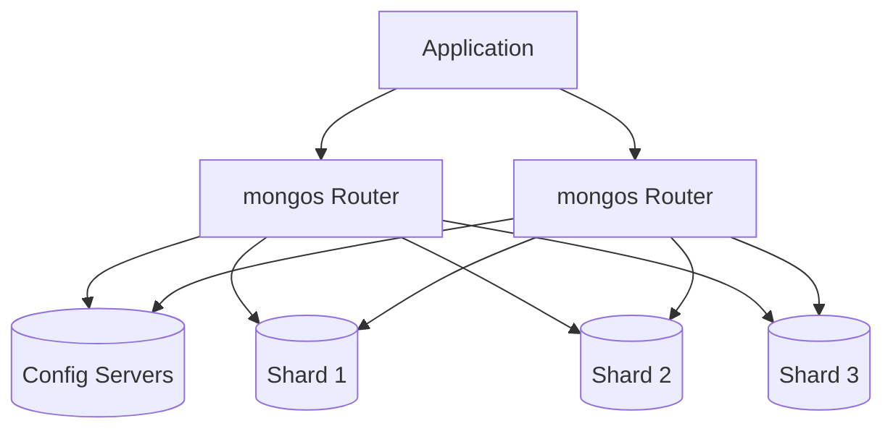

# How to Scale MongoDB with Hash and Range Sharding

Author: [nawazdhandala](https://www.github.com/nawazdhandala)

Tags: MongoDB, Sharding, Scalability, Database, Distributed Systems

Description: Learn how to horizontally scale MongoDB using sharding, including when to use hash versus range sharding, shard key selection, and cluster setup.

---

When your MongoDB database outgrows a single server, sharding lets you distribute data across multiple machines. Each shard holds a portion of the data, and the cluster works together to handle queries. The key decision is how to split the data, and that depends on whether you use hash or range sharding.

## Understanding Sharding Architecture

A sharded cluster consists of three components:



- **Shards**: Each shard stores a subset of the data. Each shard is typically a replica set.
- **Config Servers**: Store metadata about which data lives on which shard.
- **Query Routers (mongos)**: Route client requests to the appropriate shards.

## Hash Sharding vs Range Sharding

The shard key determines how documents are distributed. You have two strategies:

### Range Sharding

Documents are distributed based on value ranges. Documents with similar shard key values end up on the same shard.

```javascript
// Range sharding on timestamp
// Documents close in time are stored together
{
  _id: ObjectId("..."),
  createdAt: ISODate("2026-01-15"),  // Shard key
  data: "..."
}
```

**Pros:**
- Efficient range queries (find all documents between dates)
- Good for data with natural ordering

**Cons:**
- Can create hotspots if writes concentrate on recent values
- Uneven distribution if data is skewed

### Hash Sharding

MongoDB hashes the shard key value and distributes based on the hash. This spreads documents evenly regardless of their actual values.

```javascript
// Hash sharding on userId
// Users are spread randomly across shards
{
  _id: ObjectId("..."),
  userId: "user_12345",  // Shard key (hashed)
  data: "..."
}
```

**Pros:**
- Even data distribution
- Prevents write hotspots

**Cons:**
- Range queries must hit all shards
- Cannot do targeted queries on ranges

## Setting Up a Sharded Cluster

### Step 1: Deploy Config Servers

Config servers must be a replica set:

```bash
# On each config server (3 servers minimum)
mongod --configsvr --replSet configReplSet --port 27019 \
  --dbpath /data/configdb --bind_ip 0.0.0.0
```

Initialize the config replica set:

```javascript
// Connect to one config server
mongosh "mongodb://config1.example.com:27019"

rs.initiate({
  _id: "configReplSet",
  configsvr: true,
  members: [
    { _id: 0, host: "config1.example.com:27019" },
    { _id: 1, host: "config2.example.com:27019" },
    { _id: 2, host: "config3.example.com:27019" }
  ]
});
```

### Step 2: Deploy Shard Replica Sets

Each shard should be a replica set:

```bash
# Shard 1 members
mongod --shardsvr --replSet shard1 --port 27018 \
  --dbpath /data/shard1 --bind_ip 0.0.0.0
```

Initialize each shard replica set:

```javascript
// Connect to shard 1 primary
mongosh "mongodb://shard1a.example.com:27018"

rs.initiate({
  _id: "shard1",
  members: [
    { _id: 0, host: "shard1a.example.com:27018" },
    { _id: 1, host: "shard1b.example.com:27018" },
    { _id: 2, host: "shard1c.example.com:27018" }
  ]
});
```

Repeat for additional shards.

### Step 3: Start Query Routers

```bash
mongos --configdb configReplSet/config1.example.com:27019,config2.example.com:27019,config3.example.com:27019 \
  --port 27017 --bind_ip 0.0.0.0
```

### Step 4: Add Shards to the Cluster

Connect to a mongos router and add the shards:

```javascript
// Connect to mongos
mongosh "mongodb://router1.example.com:27017"

// Add shards
sh.addShard("shard1/shard1a.example.com:27018,shard1b.example.com:27018,shard1c.example.com:27018");
sh.addShard("shard2/shard2a.example.com:27018,shard2b.example.com:27018,shard2c.example.com:27018");
sh.addShard("shard3/shard3a.example.com:27018,shard3b.example.com:27018,shard3c.example.com:27018");

// Verify
sh.status();
```

## Enabling Sharding on a Collection

### Hash Sharding Example

```javascript
// Enable sharding on the database
sh.enableSharding("myapp");

// Create a hashed index on the shard key
db.users.createIndex({ "userId": "hashed" });

// Shard the collection using hash sharding
sh.shardCollection("myapp.users", { "userId": "hashed" });
```

### Range Sharding Example

```javascript
// Enable sharding on the database
sh.enableSharding("analytics");

// Create a regular index on the shard key
db.events.createIndex({ "timestamp": 1 });

// Shard the collection using range sharding
sh.shardCollection("analytics.events", { "timestamp": 1 });
```

## Choosing the Right Shard Key

The shard key is the most important decision in sharding. You cannot change it later without recreating the collection.

### Good Shard Key Characteristics

1. **High Cardinality**: Many unique values for even distribution
2. **Write Distribution**: Writes spread across shards
3. **Query Isolation**: Common queries target few shards

### Compound Shard Keys

Often, a compound shard key works better than a single field:

```javascript
// Good: Compound key combining tenant and timestamp
sh.shardCollection("logs.entries", { "tenantId": 1, "timestamp": 1 });
```

This enables:
- Targeted queries by tenant (all tenant data on limited shards)
- Range queries within a tenant
- Better write distribution than timestamp alone

### Shard Key Anti-Patterns

```javascript
// BAD: Monotonically increasing key causes hotspots
sh.shardCollection("myapp.orders", { "_id": 1 });  // ObjectId is sequential

// BAD: Low cardinality key causes unbalanced chunks
sh.shardCollection("myapp.users", { "country": 1 });  // Only ~200 countries

// BAD: Random hash when you need range queries
sh.shardCollection("analytics.events", { "eventId": "hashed" });  // Cannot query ranges
```

## Practical Example: Multi-Tenant Application

For a SaaS application with multiple tenants:

```javascript
// Enable sharding
sh.enableSharding("saas");

// Compound shard key: tenant + hashed user ID
// This groups tenant data while distributing users within tenant
db.users.createIndex({ "tenantId": 1, "userId": "hashed" });
sh.shardCollection("saas.users", { "tenantId": 1, "userId": "hashed" });

// For logs: tenant + time range
db.logs.createIndex({ "tenantId": 1, "timestamp": 1 });
sh.shardCollection("saas.logs", { "tenantId": 1, "timestamp": 1 });
```

## Monitoring and Managing Shards

### Check Data Distribution

```javascript
// View shard distribution
db.users.getShardDistribution();

// Output shows chunks and data per shard
// Look for imbalances
```

### View Chunk Distribution

```javascript
// See all chunks for a collection
use config
db.chunks.find({ ns: "myapp.users" }).forEach(chunk => {
  print(`Shard: ${chunk.shard}, Range: ${JSON.stringify(chunk.min)} to ${JSON.stringify(chunk.max)}`);
});
```

### Manual Chunk Splitting

MongoDB automatically splits chunks, but you can do it manually:

```javascript
// Split a chunk at a specific value
sh.splitAt("myapp.users", { "userId": "user_50000" });

// Split a chunk in half
sh.splitFind("myapp.users", { "userId": "user_50000" });
```

### Balancer Management

The balancer moves chunks between shards to maintain even distribution:

```javascript
// Check balancer status
sh.getBalancerState();

// Enable/disable balancer
sh.startBalancer();
sh.stopBalancer();

// Set balancer window (run only during off-peak)
db.settings.update(
  { _id: "balancer" },
  { $set: { activeWindow: { start: "02:00", stop: "06:00" } } },
  { upsert: true }
);
```

## Zone Sharding for Data Locality

Zone sharding lets you control where data lives, useful for compliance or latency.

```javascript
// Add zones to shards
sh.addShardToZone("shard1", "US");
sh.addShardToZone("shard2", "EU");

// Define zone ranges
sh.updateZoneKeyRange(
  "myapp.users",
  { "region": "us-east" },
  { "region": "us-west\uffff" },
  "US"
);

sh.updateZoneKeyRange(
  "myapp.users",
  { "region": "eu-west" },
  { "region": "eu-west\uffff" },
  "EU"
);
```

## Connection String for Sharded Cluster

Applications connect to mongos routers, not directly to shards:

```javascript
// Node.js connection to sharded cluster
const uri = "mongodb://router1.example.com:27017,router2.example.com:27017/?readPreference=secondaryPreferred";

const client = new MongoClient(uri, {
  retryWrites: true,
  w: "majority"
});
```

## Common Sharding Mistakes

1. **Sharding too early**: Sharding adds complexity. Start with replica set and shard when needed.

2. **Wrong shard key**: Cannot be changed. Test with production-like data before committing.

3. **Ignoring the balancer**: Monitor balancer operations and schedule during low traffic.

4. **Not accounting for queries**: If most queries need all shards, you lose sharding benefits.

---

Sharding is powerful but complex. Choose hash sharding when you need even write distribution and do not need range queries. Choose range sharding when your queries naturally span ranges. Most importantly, pick your shard key carefully because changing it later requires recreating the entire collection.
