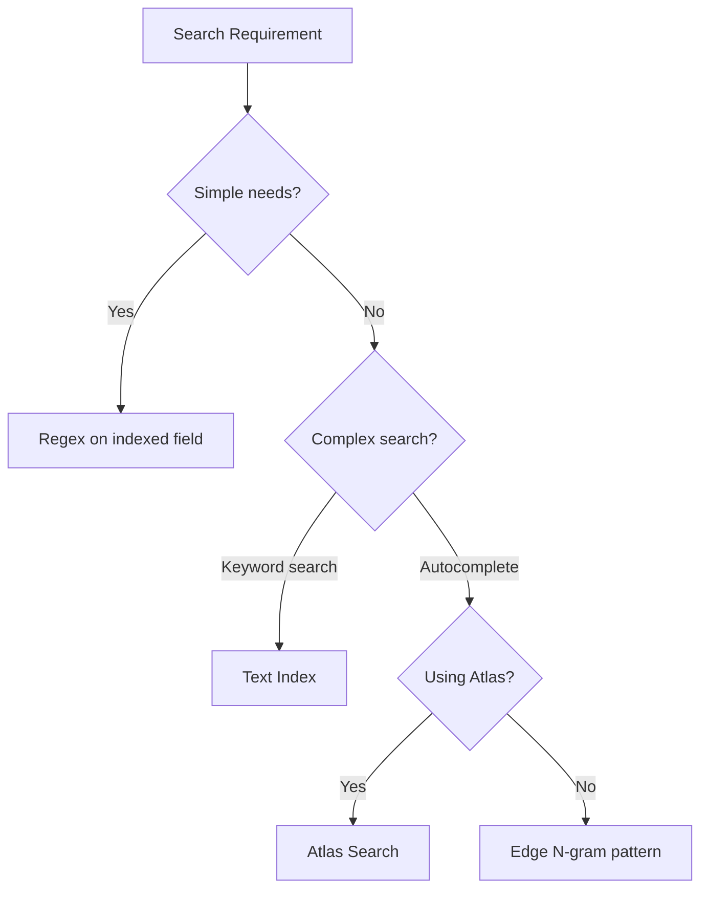

# How to Build Autocomplete with MongoDB Text Indexes

Author: [nawazdhandala](https://www.github.com/nawazdhandala)

Tags: MongoDB, Text Search, Autocomplete, Search, Database

Description: Learn how to implement autocomplete and search-as-you-type functionality using MongoDB text indexes, Atlas Search, and regex patterns.

---

Users expect instant search results as they type. Building autocomplete requires understanding MongoDB's text search capabilities and their limitations. Text indexes work for keyword search but not true prefix matching. For real autocomplete, you need different approaches depending on your MongoDB setup.

## Understanding the Options

MongoDB offers several approaches for search functionality:



## Method 1: Regex with Standard Indexes

For simple autocomplete on small collections, regex with a standard index works:

```javascript
// Create standard index on the search field
db.products.createIndex({ name: 1 });

// Prefix search with regex (case-insensitive)
async function autocomplete(prefix) {
  const regex = new RegExp(`^${escapeRegex(prefix)}`, 'i');
  return await db.products
    .find({ name: regex })
    .limit(10)
    .project({ name: 1, _id: 0 })
    .toArray();
}

// Escape special regex characters
function escapeRegex(string) {
  return string.replace(/[.*+?^${}()|[\]\\]/g, '\\$&');
}

// Usage
await autocomplete('iph');
// Returns: [{ name: "iPhone 15" }, { name: "iPhone 14 Pro" }]
```

**Limitations**:
- Only efficient for prefix searches (`^pattern`)
- Case-insensitive regex cannot use index efficiently
- Does not handle typos or fuzzy matching

### Optimizing Regex Search

Create a lowercase version of the field for case-insensitive prefix matching:

```javascript
// Store normalized version
db.products.insertOne({
  name: "iPhone 15 Pro Max",
  nameLower: "iphone 15 pro max"  // Normalized for search
});

// Index the normalized field
db.products.createIndex({ nameLower: 1 });

// Search with normalized input
async function autocomplete(prefix) {
  const normalizedPrefix = prefix.toLowerCase();
  return await db.products
    .find({ nameLower: { $regex: `^${escapeRegex(normalizedPrefix)}` } })
    .limit(10)
    .project({ name: 1, _id: 0 })
    .toArray();
}
```

## Method 2: Text Indexes for Keyword Search

Text indexes provide full-text search with stemming and stop words:

```javascript
// Create text index
db.products.createIndex({
  name: "text",
  description: "text",
  tags: "text"
}, {
  weights: {
    name: 10,      // Name matches are most important
    tags: 5,       // Tags are second
    description: 1 // Description is least important
  }
});

// Search with text query
async function searchProducts(query) {
  return await db.products
    .find(
      { $text: { $search: query } },
      { score: { $meta: "textScore" } }
    )
    .sort({ score: { $meta: "textScore" } })
    .limit(10)
    .toArray();
}

// Usage
await searchProducts("wireless headphones");
```

### Text Search Features

```javascript
// Phrase search (exact phrase)
db.products.find({ $text: { $search: '"wireless charging"' } });

// Exclude terms
db.products.find({ $text: { $search: 'phone -case' } });

// Multiple terms (OR by default)
db.products.find({ $text: { $search: 'laptop computer notebook' } });
```

**Limitations for autocomplete**:
- No prefix matching ("iph" does not match "iphone")
- Word boundaries matter
- Better for full keyword search than type-ahead

## Method 3: Edge N-gram Pattern

For true autocomplete without Atlas, store searchable prefixes:

```javascript
// Generate edge n-grams
function generateEdgeNgrams(text, minLength = 2) {
  const words = text.toLowerCase().split(/\s+/);
  const ngrams = new Set();

  for (const word of words) {
    for (let i = minLength; i <= word.length; i++) {
      ngrams.add(word.substring(0, i));
    }
  }

  return Array.from(ngrams);
}

// Store with n-grams
db.products.insertOne({
  name: "iPhone 15 Pro",
  searchNgrams: generateEdgeNgrams("iPhone 15 Pro")
  // searchNgrams: ["ip", "iph", "ipho", "iphon", "iphone", "15", "pr", "pro"]
});

// Create index on n-grams
db.products.createIndex({ searchNgrams: 1 });

// Autocomplete query
async function autocomplete(prefix) {
  const normalizedPrefix = prefix.toLowerCase();
  return await db.products
    .find({ searchNgrams: normalizedPrefix })
    .limit(10)
    .project({ name: 1, _id: 0 })
    .toArray();
}
```

### Maintaining N-grams on Updates

```javascript
// Middleware or trigger to update n-grams
async function updateProduct(id, newName) {
  await db.products.updateOne(
    { _id: id },
    {
      $set: {
        name: newName,
        searchNgrams: generateEdgeNgrams(newName)
      }
    }
  );
}
```

## Method 4: MongoDB Atlas Search

Atlas Search provides the most powerful autocomplete using Apache Lucene:

### Create Atlas Search Index

In the Atlas UI or via API, create an index with autocomplete mapping:

```json
{
  "mappings": {
    "dynamic": false,
    "fields": {
      "name": [
        {
          "type": "string"
        },
        {
          "type": "autocomplete",
          "tokenization": "edgeGram",
          "minGrams": 2,
          "maxGrams": 15,
          "foldDiacritics": true
        }
      ],
      "category": {
        "type": "string"
      }
    }
  }
}
```

### Query with Atlas Search

```javascript
async function atlasAutocomplete(prefix, category = null) {
  const searchStage = {
    $search: {
      index: "products_autocomplete",
      compound: {
        must: [
          {
            autocomplete: {
              query: prefix,
              path: "name",
              fuzzy: {
                maxEdits: 1,  // Allow one typo
                prefixLength: 2
              }
            }
          }
        ]
      }
    }
  };

  // Optional category filter
  if (category) {
    searchStage.$search.compound.filter = [
      { text: { query: category, path: "category" } }
    ];
  }

  return await db.products.aggregate([
    searchStage,
    { $limit: 10 },
    {
      $project: {
        name: 1,
        category: 1,
        score: { $meta: "searchScore" }
      }
    }
  ]).toArray();
}

// Usage with typo tolerance
await atlasAutocomplete("iphne");  // Still matches "iPhone"
```

### Highlighting Matches

```javascript
async function searchWithHighlights(query) {
  return await db.products.aggregate([
    {
      $search: {
        index: "products_autocomplete",
        autocomplete: {
          query: query,
          path: "name"
        },
        highlight: {
          path: "name"
        }
      }
    },
    { $limit: 10 },
    {
      $project: {
        name: 1,
        highlights: { $meta: "searchHighlights" }
      }
    }
  ]).toArray();
}

// Returns highlights showing matched portions
// { name: "iPhone 15", highlights: [{ path: "name", texts: [{ value: "iPh", type: "hit" }, ...] }] }
```

## Combining Approaches

Build a comprehensive search feature:

```javascript
async function search(query, options = {}) {
  const { category, limit = 10, page = 1 } = options;
  const skip = (page - 1) * limit;

  // For short queries, use autocomplete
  if (query.length < 4) {
    return await autocompleteSearch(query, category, limit);
  }

  // For longer queries, use full-text search
  return await fullTextSearch(query, category, limit, skip);
}

async function autocompleteSearch(prefix, category, limit) {
  const filter = { searchNgrams: prefix.toLowerCase() };
  if (category) filter.category = category;

  return await db.products
    .find(filter)
    .limit(limit)
    .project({ name: 1, category: 1, price: 1 })
    .toArray();
}

async function fullTextSearch(query, category, limit, skip) {
  const filter = { $text: { $search: query } };
  if (category) filter.category = category;

  return await db.products
    .find(filter, { score: { $meta: "textScore" } })
    .sort({ score: { $meta: "textScore" } })
    .skip(skip)
    .limit(limit)
    .project({ name: 1, category: 1, price: 1, score: { $meta: "textScore" } })
    .toArray();
}
```

## Performance Optimization

### Debounce Client Requests

Do not query on every keystroke:

```javascript
// Client-side debouncing
let debounceTimer;

function onSearchInput(query) {
  clearTimeout(debounceTimer);
  debounceTimer = setTimeout(() => {
    fetchAutocomplete(query);
  }, 150);  // Wait 150ms after last keystroke
}
```

### Cache Common Prefixes

```javascript
const cache = new Map();
const CACHE_TTL = 60000;  // 1 minute

async function cachedAutocomplete(prefix) {
  const cacheKey = prefix.toLowerCase();

  if (cache.has(cacheKey)) {
    const { results, timestamp } = cache.get(cacheKey);
    if (Date.now() - timestamp < CACHE_TTL) {
      return results;
    }
  }

  const results = await autocomplete(prefix);
  cache.set(cacheKey, { results, timestamp: Date.now() });
  return results;
}
```

### Limit Index Size with Partial Indexes

```javascript
// Only index products that should appear in search
db.products.createIndex(
  { searchNgrams: 1 },
  {
    partialFilterExpression: {
      isActive: true,
      inStock: true
    }
  }
);
```

## Complete API Example

```javascript
const express = require('express');
const app = express();

app.get('/api/autocomplete', async (req, res) => {
  try {
    const { q, category } = req.query;

    if (!q || q.length < 2) {
      return res.json({ results: [] });
    }

    const results = await cachedAutocomplete(q, category);

    res.json({
      results: results.map(r => ({
        id: r._id,
        name: r.name,
        category: r.category
      }))
    });
  } catch (error) {
    console.error('Autocomplete error:', error);
    res.status(500).json({ error: 'Search failed' });
  }
});
```

---

The right autocomplete approach depends on your setup. Use regex for simple prefix matching on small collections, edge n-grams for self-hosted MongoDB with true prefix search, and Atlas Search for the most powerful experience with fuzzy matching and typo tolerance. Whichever method you choose, implement client-side debouncing and server-side caching to keep searches fast.
