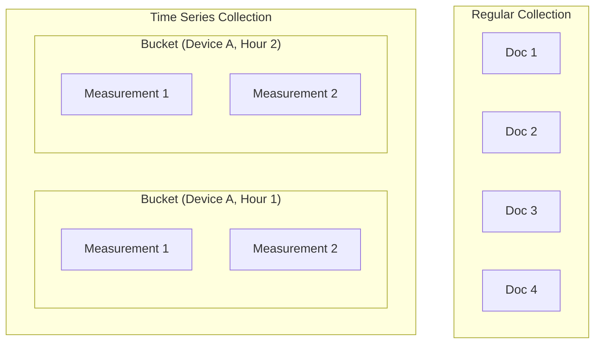

# How to Store Time Series Data in MongoDB

Author: [nawazdhandala](https://www.github.com/nawazdhandala)

Tags: MongoDB, Time Series, IoT, Metrics, Database, Analytics

Description: Learn how to use MongoDB time series collections for efficient storage and querying of time-stamped data, including IoT metrics, application logs, and financial data.

---

Time series data has unique characteristics: it arrives sequentially, usually with high volume, and queries typically focus on time ranges. MongoDB 5.0 introduced native time series collections that automatically optimize storage and query performance for this pattern.

## Understanding Time Series Collections

Time series collections store data differently from regular collections. MongoDB groups documents by time and metadata, compresses them together, and creates internal indexes optimized for time-based queries.



Benefits:
- Automatic bucketing and compression (up to 90% storage reduction)
- Optimized indexes for time-based queries
- Simplified data lifecycle management with TTL
- Standard MongoDB query language works

## Creating a Time Series Collection

### Basic Time Series Collection

```javascript
// Create collection for IoT sensor data
db.createCollection("sensor_readings", {
  timeseries: {
    timeField: "timestamp",      // Required: field containing timestamp
    metaField: "metadata",       // Optional: field for grouping (device ID, location)
    granularity: "seconds"       // Optional: seconds, minutes, hours
  },
  expireAfterSeconds: 86400 * 30  // Optional: auto-delete after 30 days
});
```

### Granularity Options

Choose based on your measurement frequency:

- `seconds`: Measurements every few seconds (IoT sensors)
- `minutes`: Measurements every few minutes (system metrics)
- `hours`: Measurements every hour or less frequent (daily reports)

```javascript
// High-frequency IoT data
db.createCollection("iot_telemetry", {
  timeseries: {
    timeField: "ts",
    metaField: "device",
    granularity: "seconds"
  }
});

// System metrics collected every minute
db.createCollection("system_metrics", {
  timeseries: {
    timeField: "timestamp",
    metaField: "host",
    granularity: "minutes"
  }
});

// Daily financial data
db.createCollection("stock_prices", {
  timeseries: {
    timeField: "date",
    metaField: "symbol",
    granularity: "hours"
  }
});
```

## Document Structure

### Recommended Schema

```javascript
// Good: metadata field as object with identifying information
{
  timestamp: ISODate("2026-01-25T10:30:00Z"),
  metadata: {
    deviceId: "sensor_001",
    location: "warehouse_a",
    type: "temperature"
  },
  value: 23.5,
  unit: "celsius"
}

// Good: multiple measurements in one document
{
  timestamp: ISODate("2026-01-25T10:30:00Z"),
  metadata: {
    deviceId: "sensor_001",
    location: "warehouse_a"
  },
  temperature: 23.5,
  humidity: 65.2,
  pressure: 1013.25
}
```

### Inserting Data

```javascript
// Single insert
db.sensor_readings.insertOne({
  timestamp: new Date(),
  metadata: {
    deviceId: "sensor_001",
    location: "warehouse_a"
  },
  temperature: 23.5,
  humidity: 65.2
});

// Bulk insert for efficiency
db.sensor_readings.insertMany([
  {
    timestamp: new Date("2026-01-25T10:00:00Z"),
    metadata: { deviceId: "sensor_001", location: "warehouse_a" },
    temperature: 22.1
  },
  {
    timestamp: new Date("2026-01-25T10:01:00Z"),
    metadata: { deviceId: "sensor_001", location: "warehouse_a" },
    temperature: 22.3
  },
  {
    timestamp: new Date("2026-01-25T10:02:00Z"),
    metadata: { deviceId: "sensor_001", location: "warehouse_a" },
    temperature: 22.5
  }
]);
```

## Querying Time Series Data

### Basic Time Range Query

```javascript
// Get readings from last hour
db.sensor_readings.find({
  timestamp: {
    $gte: new Date(Date.now() - 60 * 60 * 1000),
    $lt: new Date()
  }
});

// Filter by device and time range
db.sensor_readings.find({
  "metadata.deviceId": "sensor_001",
  timestamp: {
    $gte: ISODate("2026-01-25T00:00:00Z"),
    $lt: ISODate("2026-01-26T00:00:00Z")
  }
});
```

### Aggregation Pipelines

```javascript
// Average temperature per hour for a device
db.sensor_readings.aggregate([
  {
    $match: {
      "metadata.deviceId": "sensor_001",
      timestamp: {
        $gte: ISODate("2026-01-25T00:00:00Z"),
        $lt: ISODate("2026-01-26T00:00:00Z")
      }
    }
  },
  {
    $group: {
      _id: {
        $dateTrunc: {
          date: "$timestamp",
          unit: "hour"
        }
      },
      avgTemperature: { $avg: "$temperature" },
      maxTemperature: { $max: "$temperature" },
      minTemperature: { $min: "$temperature" },
      count: { $sum: 1 }
    }
  },
  { $sort: { _id: 1 } }
]);
```

### Window Functions for Rolling Averages

```javascript
// Calculate rolling 5-minute average
db.sensor_readings.aggregate([
  {
    $match: {
      "metadata.deviceId": "sensor_001",
      timestamp: { $gte: ISODate("2026-01-25T10:00:00Z") }
    }
  },
  { $sort: { timestamp: 1 } },
  {
    $setWindowFields: {
      partitionBy: "$metadata.deviceId",
      sortBy: { timestamp: 1 },
      output: {
        rollingAvg: {
          $avg: "$temperature",
          window: {
            range: [-5, 0],
            unit: "minute"
          }
        }
      }
    }
  }
]);
```

### Downsampling Data

```javascript
// Downsample to daily averages
db.sensor_readings.aggregate([
  {
    $match: {
      timestamp: {
        $gte: ISODate("2026-01-01T00:00:00Z"),
        $lt: ISODate("2026-02-01T00:00:00Z")
      }
    }
  },
  {
    $group: {
      _id: {
        deviceId: "$metadata.deviceId",
        date: { $dateTrunc: { date: "$timestamp", unit: "day" } }
      },
      avgTemp: { $avg: "$temperature" },
      avgHumidity: { $avg: "$humidity" },
      samples: { $sum: 1 }
    }
  },
  {
    $merge: {
      into: "daily_summaries",
      on: "_id",
      whenMatched: "replace",
      whenNotMatched: "insert"
    }
  }
]);
```

## Secondary Indexes

Time series collections automatically create an index on the time field. Add secondary indexes for common query patterns:

```javascript
// Index for filtering by device
db.sensor_readings.createIndex({ "metadata.deviceId": 1, timestamp: -1 });

// Compound index for location-based queries
db.sensor_readings.createIndex({
  "metadata.location": 1,
  "metadata.type": 1,
  timestamp: -1
});
```

## Data Lifecycle Management

### Automatic TTL

Set expiration when creating the collection:

```javascript
db.createCollection("logs", {
  timeseries: {
    timeField: "timestamp",
    metaField: "source",
    granularity: "seconds"
  },
  expireAfterSeconds: 86400 * 7  // Delete after 7 days
});
```

### Modify TTL on Existing Collection

```javascript
db.runCommand({
  collMod: "logs",
  expireAfterSeconds: 86400 * 14  // Change to 14 days
});
```

### Manual Cleanup

```javascript
// Delete old data manually
db.sensor_readings.deleteMany({
  timestamp: { $lt: ISODate("2025-01-01T00:00:00Z") }
});
```

## Practical Example: Application Metrics

```javascript
// Create collection for application metrics
db.createCollection("app_metrics", {
  timeseries: {
    timeField: "timestamp",
    metaField: "meta",
    granularity: "seconds"
  },
  expireAfterSeconds: 86400 * 30
});

// Insert request metrics
async function recordMetric(endpoint, statusCode, responseTimeMs) {
  await db.app_metrics.insertOne({
    timestamp: new Date(),
    meta: {
      service: "api-gateway",
      endpoint: endpoint,
      method: "GET"
    },
    statusCode: statusCode,
    responseTimeMs: responseTimeMs
  });
}

// Dashboard query: Request rate and latency by endpoint
db.app_metrics.aggregate([
  {
    $match: {
      timestamp: {
        $gte: new Date(Date.now() - 60 * 60 * 1000)  // Last hour
      }
    }
  },
  {
    $group: {
      _id: {
        endpoint: "$meta.endpoint",
        minute: { $dateTrunc: { date: "$timestamp", unit: "minute" } }
      },
      requestCount: { $sum: 1 },
      avgLatency: { $avg: "$responseTimeMs" },
      p95Latency: {
        $percentile: {
          input: "$responseTimeMs",
          p: [0.95],
          method: "approximate"
        }
      },
      errorCount: {
        $sum: { $cond: [{ $gte: ["$statusCode", 400] }, 1, 0] }
      }
    }
  },
  { $sort: { "_id.minute": -1 } }
]);
```

## Practical Example: IoT Sensor Platform

```javascript
// Create collection for sensor data
db.createCollection("iot_data", {
  timeseries: {
    timeField: "ts",
    metaField: "sensor",
    granularity: "seconds"
  }
});

// Index for efficient device lookups
db.iot_data.createIndex({ "sensor.deviceId": 1 });

// Insert from IoT device
function recordSensorData(deviceId, readings) {
  return db.iot_data.insertOne({
    ts: new Date(),
    sensor: {
      deviceId: deviceId,
      type: readings.type,
      firmware: readings.firmware
    },
    ...readings.values
  });
}

// Alert query: Find devices with temperature above threshold
db.iot_data.aggregate([
  {
    $match: {
      ts: { $gte: new Date(Date.now() - 5 * 60 * 1000) },  // Last 5 minutes
      temperature: { $gt: 80 }  // Threshold
    }
  },
  {
    $group: {
      _id: "$sensor.deviceId",
      maxTemp: { $max: "$temperature" },
      avgTemp: { $avg: "$temperature" },
      samples: { $sum: 1 }
    }
  },
  {
    $match: { samples: { $gte: 3 } }  // At least 3 readings above threshold
  }
]);
```

## Performance Tips

### Batch Inserts

```javascript
// Instead of many single inserts
for (const reading of readings) {
  await db.sensor_readings.insertOne(reading);  // Slow
}

// Use bulk insert
await db.sensor_readings.insertMany(readings);  // Fast
```

### Query Optimization

```javascript
// Always include time range in queries
// BAD: Scans all data
db.sensor_readings.find({ "metadata.deviceId": "sensor_001" });

// GOOD: Uses time-based bucketing
db.sensor_readings.find({
  "metadata.deviceId": "sensor_001",
  timestamp: { $gte: ISODate("2026-01-25T00:00:00Z") }
});
```

### Storage Analysis

```javascript
// Check collection storage stats
db.sensor_readings.stats();

// View bucket information (internal collection)
db.system.buckets.sensor_readings.stats();
```

---

Time series collections in MongoDB simplify storing and querying time-stamped data. The automatic bucketing and compression significantly reduce storage costs, while the optimized indexes make time-range queries fast. Design your schema with the metadata field for grouping, choose the right granularity, and always include time ranges in your queries for best performance.
