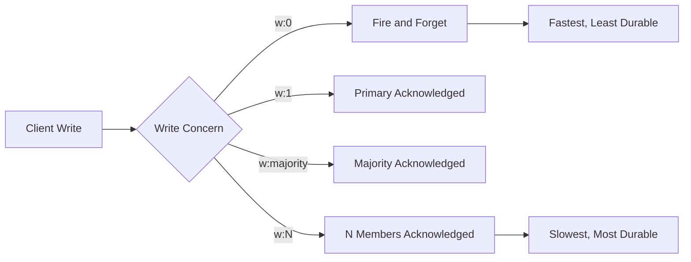

# How to Choose Write Concern Levels in MongoDB

Author: [nawazdhandala](https://www.github.com/nawazdhandala)

Tags: MongoDB, Write Concern, Durability, Replica Set, Consistency

Description: Learn how to configure MongoDB write concern levels to balance durability, performance, and availability based on your application requirements.

---

Write concern determines how many replica set members must acknowledge a write before MongoDB considers it successful. Choosing the right write concern is about balancing data durability against write latency. Too weak, and you risk data loss; too strong, and your application slows down.

## Understanding Write Concern Levels


```mermaid
graph LR
    A[Client Write] --> B{Write Concern}
    B --> |w:0| C[Fire and Forget]
    B --> |w:1| D[Primary Acknowledged]
    B --> |w:majority| E[Majority Acknowledged]
    B --> |w:N| F[N Members Acknowledged]

    C --> G[Fastest, Least Durable]
    F --> H[Slowest, Most Durable]
```

| Write Concern | Acknowledged By | Durability | Latency | Use Case |
|--------------|-----------------|------------|---------|----------|
| w: 0 | None | Lowest | Lowest | Fire-and-forget logging |
| w: 1 | Primary only | Low | Low | Non-critical data |
| w: "majority" | Majority of voting members | High | Medium | Default for most apps |
| w: N | Primary plus enough data-bearing secondaries to reach N members | Configurable | Higher | Custom requirements |

## Configuring Write Concern

```javascript
const { MongoClient } = require('mongodb');

// Connection-level write concern
const client = new MongoClient('mongodb://localhost:27017/mydb?replicaSet=rs0', {
  writeConcern: {
    w: 'majority',
    journal: true,     // Wait for journal write
    wtimeoutMS: 5000   // Timeout in milliseconds
  }
});

// Database-level write concern
const db = client.db('mydb', {
  writeConcern: { w: 'majority', wtimeoutMS: 5000, journal: true }
});

// Collection-level write concern
const collection = db.collection('orders', {
  writeConcern: { w: 'majority', journal: true }
});

// Operation-level write concern (most specific)
await collection.insertOne(
  { orderId: '12345', total: 99.99 },
  { writeConcern: { w: 2, wtimeoutMS: 3000 } }
);
```

## Write Concern Options Explained

```javascript
// w: Number - wait for N members to acknowledge
// w: 1 means primary only (default if not specified)
await collection.insertOne(doc, { writeConcern: { w: 1 } });

// w: "majority" - wait for majority of voting members
// This is the recommended default for most applications
await collection.insertOne(doc, { writeConcern: { w: 'majority' } });

// journal: true - wait for journal write
// Survives a mongod restart, but can still roll back after failover
await collection.insertOne(doc, { writeConcern: { w: 1, journal: true } });

// wtimeoutMS: milliseconds - maximum time to wait
// Prevents indefinite blocking if members are unavailable
await collection.insertOne(doc, {
  writeConcern: { w: 'majority', wtimeoutMS: 5000 }
});

// w: 0 - no acknowledgment (fire and forget)
// Use only when you truly don't care about write success
await collection.insertOne(doc, { writeConcern: { w: 0 } });
```

## Write Concern Patterns by Use Case

```javascript
// Pattern 1: Financial transactions - maximum durability
class PaymentService {
  constructor(db) {
    this.collection = db.collection('payments', {
      writeConcern: {
        w: 'majority',
        journal: true,  // Journal for crash recovery
        wtimeoutMS: 10000 // Allow more time for important writes
      }
    });
  }

  async processPayment(payment) {
    const result = await this.collection.insertOne(payment);
    // Guaranteed: majority of members have the data in their journals
    return result.insertedId;
  }
}

// Pattern 2: Session data - balance speed and durability
class SessionService {
  constructor(db) {
    this.collection = db.collection('sessions', {
      writeConcern: {
        w: 1,        // Primary acknowledgment only
        journal: false // Memory is fine, journals add latency
      }
    });
  }

  async createSession(userId) {
    // Session loss is annoying but not catastrophic
    await this.collection.insertOne({
      userId,
      createdAt: new Date(),
      expiresAt: new Date(Date.now() + 24 * 60 * 60 * 1000)
    });
  }
}

// Pattern 3: Metrics/Logging - prioritize throughput
class MetricsService {
  constructor(db) {
    this.collection = db.collection('metrics', {
      writeConcern: { w: 0 }  // Fire and forget
    });
  }

  async recordMetric(metric) {
    // Missing a few metrics is acceptable
    // This gives maximum write throughput
    try {
      await this.collection.insertOne(metric);
    } catch (e) {
      // Silently ignore - we chose w:0 intentionally
    }
  }
}

// Pattern 4: User data - strong consistency with timeout
class UserService {
  constructor(db) {
    this.collection = db.collection('users', {
      writeConcern: {
        w: 'majority',
        wtimeoutMS: 5000
      }
    });
  }

  async createUser(userData) {
    try {
      return await this.collection.insertOne(userData);
    } catch (error) {
      if (error.code === 64) {  // MongoWriteConcernError
        // Majority not reached within timeout
        // Data may still exist on primary
        throw new Error('Write timeout - please retry');
      }
      throw error;
    }
  }
}
```

## Handling Write Concern Errors

```javascript
const { ObjectId } = require('mongodb');

async function safeWrite(collection, document, options = {}) {
  const documentToInsert = { _id: new ObjectId(), ...document };
  const writeConcern = {
    w: 'majority',
    wtimeoutMS: 5000,
    ...options.writeConcern
  };

  try {
    const result = await collection.insertOne(documentToInsert, { writeConcern });
    return { success: true, id: result.insertedId };

  } catch (error) {
    // MongoWriteConcernError: write succeeded on primary but concern not met
    if (error.code === 64 || error.name === 'MongoWriteConcernError') {
      console.warn('Write concern not met:', error.message);

      // The primary write succeeded, but replication guarantees were not met
      return {
        success: true,
        id: documentToInsert._id,
        warning: 'Write concern timeout - data may not be fully replicated'
      };
    }

    // WriteError: write failed entirely
    if (error.code === 11000) {
      throw new Error('Duplicate key error');
    }

    throw error;
  }
}

// Retry with degraded write concern only for idempotent writes
async function writeWithFallback(collection, document) {
  const documentToInsert = { _id: new ObjectId(), ...document };

  try {
    // Try with majority first
    return await collection.insertOne(documentToInsert, {
      writeConcern: { w: 'majority', wtimeoutMS: 3000 }
    });
  } catch (error) {
    if (error.code === 64) {
      console.warn('Majority unavailable, falling back to w:1');

      // The original insert may already exist on the primary, so preserve _id
      return await collection.replaceOne(
        { _id: documentToInsert._id },
        documentToInsert,
        {
          upsert: true,
          writeConcern: { w: 1 }
        }
      );
    }

    if (error.code === 11000) {
      return {
        acknowledged: true,
        insertedId: documentToInsert._id,
        warning: 'Document already existed after write concern timeout'
      };
    }

    throw error;
  }
}
```

## Write Concern with Transactions

```javascript
// Transactions use the transaction-level write concern at commit time
async function transferFunds(client, fromAccount, toAccount, amount) {
  const session = client.startSession();

  // Transaction-level write concern
  const transactionOptions = {
    writeConcern: { w: 'majority', journal: true },
    readConcern: { level: 'majority' }
  };

  try {
    await session.withTransaction(async () => {
      const accounts = client.db('bank').collection('accounts');

      // Deduct from source
      await accounts.updateOne(
        { _id: fromAccount, balance: { $gte: amount } },
        { $inc: { balance: -amount } },
        { session }
      );

      // Add to destination
      await accounts.updateOne(
        { _id: toAccount },
        { $inc: { balance: amount } },
        { session }
      );

    }, transactionOptions);

    console.log('Transfer committed with majority write concern');

  } finally {
    await session.endSession();
  }
}
```

## Monitoring Write Concern Performance

```javascript
// Track write concern latency
async function measureWriteLatency(collection) {
  const concerns = [
    { w: 0 },
    { w: 1 },
    { w: 'majority' },
    { w: 'majority', journal: true }
  ];

  const results = [];

  for (const wc of concerns) {
    const times = [];

    for (let i = 0; i < 100; i++) {
      const start = process.hrtime.bigint();

      await collection.insertOne(
        { test: true, timestamp: new Date() },
        { writeConcern: wc }
      );

      const duration = Number(process.hrtime.bigint() - start) / 1_000_000;
      times.push(duration);
    }

    const avg = times.reduce((a, b) => a + b, 0) / times.length;
    const p99 = times.sort((a, b) => a - b)[Math.floor(times.length * 0.99)];

    results.push({
      writeConcern: JSON.stringify(wc),
      avgMs: avg.toFixed(2),
      p99Ms: p99.toFixed(2)
    });
  }

  console.table(results);

  // Cleanup
  await collection.deleteMany({ test: true });
}
```

## Custom Write Concern Tags

Use tags to require acknowledgment from specific members.

```javascript
// Configure replica set with custom write concern
// Run on primary:
const conf = rs.conf();

conf.members[0].tags = { dc: "east" };
conf.members[1].tags = { dc: "east" };
conf.members[2].tags = { dc: "west" };
conf.settings = {
  ...conf.settings,
  getLastErrorModes: {
    ...conf.settings.getLastErrorModes,
    // Custom write concern: must acknowledge in both datacenters
    multiDC: { dc: 2 }
  }
};

rs.reconfig(conf);

// Use custom write concern
await collection.insertOne(document, {
  writeConcern: { w: 'multiDC', wtimeoutMS: 10000 }
});

// This ensures the write is acknowledged by members with two distinct
// dc tag values before returning
```

## Best Practices

**Choose write concern based on data importance:**
- Critical data: `w: "majority"` with `journal: true`
- Important data: `w: "majority"` without explicit journal
- Non-critical data: `w: 1` is often sufficient
- Ephemeral data: `w: 0` for maximum throughput

**Always set wtimeoutMS:**
- Prevents indefinite blocking
- 5000ms is a reasonable starting point
- Adjust based on network latency and replica set size

**Handle write concern errors gracefully:**
- Timeout errors don't mean write failed
- Implement appropriate retry logic
- Consider fallback to weaker concerns for availability

**Monitor replication lag:**
- High lag increases write concern latency
- May indicate need for capacity or network improvements

```javascript
// Production-ready write helper
async function durableWrite(collection, document, options = {}) {
  const {
    retries = 3,
    retryDelay = 100,
    writeConcern = { w: 'majority', wtimeoutMS: 5000 }
  } = options;

  let lastError;

  for (let attempt = 1; attempt <= retries; attempt++) {
    try {
      return await collection.insertOne(document, { writeConcern });
    } catch (error) {
      lastError = error;

      if (error.code === 64) {
        throw error;
      }

      if (error.code !== 11000 && attempt < retries) {
        console.warn(`Write failed, retry ${attempt}/${retries}`);
        await new Promise(r => setTimeout(r, retryDelay * attempt));
        continue;
      }

      throw error;
    }
  }

  throw lastError;
}
```

## Summary

Write concern is the dial between durability and performance:

- `w: "majority"` should be your default for important data
- Add `journal: true` when data must survive crashes
- Always set `wtimeoutMS` to prevent indefinite blocking
- Use `w: 0` only for truly disposable data
- Handle write concern errors appropriately since timeouts do not mean failure

Match your write concern to the actual importance of each piece of data rather than applying one setting everywhere.
