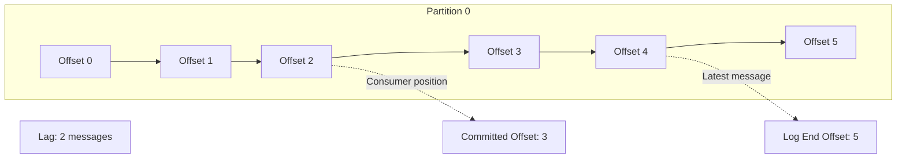

# How to Monitor Consumer Lag in Kafka

Author: [nawazdhandala](https://www.github.com/nawazdhandala)

Tags: Kafka, Monitoring, Consumer Lag, Observability, Prometheus

Description: Learn how to monitor Kafka consumer lag effectively using built-in tools, JMX metrics, and Prometheus exporters, plus strategies for alerting and troubleshooting lag issues in production.

---

Consumer lag is the most important metric for Kafka operational health. It tells you how far behind your consumers are from the latest messages. Growing lag means messages are piling up faster than you can process them. This guide covers how to monitor lag and what to do when it grows.

## Understanding Consumer Lag

Lag is calculated per partition as the difference between the log end offset (latest message) and the consumer's committed offset.



A lag of 2 means the consumer has 2 messages to process before catching up.

## Using kafka-consumer-groups CLI

The quickest way to check lag is the built-in CLI tool:

```bash
# Describe a consumer group and show lag
kafka-consumer-groups.sh --bootstrap-server kafka:9092 \
    --group order-processor \
    --describe

# Output:
# GROUP           TOPIC     PARTITION  CURRENT-OFFSET  LOG-END-OFFSET  LAG    CONSUMER-ID                                     HOST            CLIENT-ID
# order-processor orders    0          15000           15050           50     consumer-1-abc123                               /10.0.0.5       consumer-1
# order-processor orders    1          12000           12000           0      consumer-2-def456                               /10.0.0.6       consumer-2
# order-processor orders    2          18000           19500           1500   consumer-3-ghi789                               /10.0.0.7       consumer-3

# Show all consumer groups
kafka-consumer-groups.sh --bootstrap-server kafka:9092 --list

# Show lag for all groups (useful for monitoring scripts)
kafka-consumer-groups.sh --bootstrap-server kafka:9092 \
    --all-groups \
    --describe
```

## JMX Metrics for Consumer Lag

Kafka exposes lag metrics via JMX. Enable JMX on your consumers:

```bash
# Start consumer with JMX enabled
export KAFKA_JMX_OPTS="-Dcom.sun.management.jmxremote \
  -Dcom.sun.management.jmxremote.port=9999 \
  -Dcom.sun.management.jmxremote.authenticate=false \
  -Dcom.sun.management.jmxremote.ssl=false"

java -jar my-consumer.jar
```

Key JMX metrics to monitor:

| MBean | Attribute | Description |
|-------|-----------|-------------|
| `kafka.consumer:type=consumer-fetch-manager-metrics,client-id=*` | `records-lag-max` | Maximum lag across all partitions |
| `kafka.consumer:type=consumer-fetch-manager-metrics,client-id=*,topic=*,partition=*` | `records-lag` | Lag for specific partition |
| `kafka.consumer:type=consumer-fetch-manager-metrics,client-id=*` | `records-consumed-rate` | Messages consumed per second |
| `kafka.consumer:type=consumer-coordinator-metrics,client-id=*` | `assigned-partitions` | Number of assigned partitions |

## Prometheus Monitoring with kafka_exporter

The kafka_exporter project provides Prometheus metrics for consumer lag.

```yaml
# docker-compose.yml
services:
  kafka-exporter:
    image: danielqsj/kafka-exporter:latest
    command:
      - '--kafka.server=kafka1:9092'
      - '--kafka.server=kafka2:9092'
      - '--kafka.server=kafka3:9092'
      - '--topic.filter=.*'
      - '--group.filter=.*'
    ports:
      - "9308:9308"
```

Useful Prometheus queries:

```promql
# Total lag per consumer group
sum by (consumergroup) (kafka_consumergroup_lag)

# Lag per topic and partition
kafka_consumergroup_lag{consumergroup="order-processor"}

# Rate of lag change (positive means falling behind)
rate(kafka_consumergroup_lag[5m])

# Consumer groups with lag over 10000
kafka_consumergroup_lag > 10000

# Topics with no active consumers
kafka_topic_partition_current_offset unless on(topic)
  kafka_consumergroup_current_offset
```

## Burrow: LinkedIn's Lag Monitoring Tool

Burrow provides advanced lag evaluation with built-in anomaly detection.

```yaml
# burrow.toml
[general]
pidfile = "/var/run/burrow.pid"
stdout-logfile = "/var/log/burrow/burrow.out"

[logging]
filename = "/var/log/burrow/burrow.log"
level = "info"

[zookeeper]
servers = ["zk1:2181", "zk2:2181", "zk3:2181"]
timeout = 6
root-path = "/burrow"

[client-profile.kafka-cluster]
client-id = "burrow-client"
kafka-version = "2.8.0"

[cluster.production]
class-name = "kafka"
servers = ["kafka1:9092", "kafka2:9092", "kafka3:9092"]
client-profile = "kafka-cluster"
topic-refresh = 60
offset-refresh = 30

[consumer.production]
class-name = "kafka"
cluster = "production"
servers = ["kafka1:9092", "kafka2:9092"]
client-profile = "kafka-cluster"
group-denylist = "^console-consumer-"
start-latest = false

[httpserver.default]
address = ":8000"
```

Query Burrow's REST API:

```bash
# List consumer groups
curl http://burrow:8000/v3/kafka/production/consumer

# Get lag status for a group
curl http://burrow:8000/v3/kafka/production/consumer/order-processor/lag

# Response includes status: OK, WARNING, ERROR, or STOP
{
  "status": "OK",
  "complete": 1.0,
  "partitions": [
    {
      "topic": "orders",
      "partition": 0,
      "status": "OK",
      "start": {"offset": 15000, "timestamp": 1706200000000, "lag": 50},
      "end": {"offset": 15050, "timestamp": 1706200060000, "lag": 0}
    }
  ]
}
```

## Building a Lag Monitor in Java

Create a custom lag monitor using the AdminClient:

```java
import org.apache.kafka.clients.admin.*;
import org.apache.kafka.clients.consumer.OffsetAndMetadata;
import org.apache.kafka.common.TopicPartition;
import java.util.*;
import java.util.concurrent.*;

public class LagMonitor {

    private final AdminClient adminClient;
    private final ScheduledExecutorService scheduler;

    public LagMonitor(Properties adminProps) {
        this.adminClient = AdminClient.create(adminProps);
        this.scheduler = Executors.newScheduledThreadPool(1);
    }

    public void startMonitoring(String groupId, long intervalSeconds) {
        scheduler.scheduleAtFixedRate(
            () -> checkLag(groupId),
            0,
            intervalSeconds,
            TimeUnit.SECONDS
        );
    }

    private void checkLag(String groupId) {
        try {
            // Get consumer group offsets
            ListConsumerGroupOffsetsResult offsetsResult =
                adminClient.listConsumerGroupOffsets(groupId);
            Map<TopicPartition, OffsetAndMetadata> consumerOffsets =
                offsetsResult.partitionsToOffsetAndMetadata().get();

            if (consumerOffsets.isEmpty()) {
                System.out.println("No offsets found for group: " + groupId);
                return;
            }

            // Get end offsets for all partitions
            Set<TopicPartition> partitions = consumerOffsets.keySet();
            Map<TopicPartition, ListOffsetsResult.ListOffsetsResultInfo> endOffsets =
                adminClient.listOffsets(
                    partitions.stream().collect(
                        Collectors.toMap(tp -> tp, tp -> OffsetSpec.latest())
                    )
                ).all().get();

            // Calculate and report lag
            long totalLag = 0;
            for (TopicPartition tp : partitions) {
                long consumerOffset = consumerOffsets.get(tp).offset();
                long endOffset = endOffsets.get(tp).offset();
                long lag = endOffset - consumerOffset;
                totalLag += lag;

                System.out.printf("  %s-%d: offset=%d, end=%d, lag=%d%n",
                    tp.topic(), tp.partition(), consumerOffset, endOffset, lag);

                // Alert on high lag
                if (lag > 10000) {
                    alertHighLag(groupId, tp, lag);
                }
            }

            System.out.printf("Group %s total lag: %d%n", groupId, totalLag);

            // Export to metrics system
            exportMetrics(groupId, totalLag);

        } catch (Exception e) {
            System.err.println("Error checking lag: " + e.getMessage());
        }
    }

    private void alertHighLag(String groupId, TopicPartition tp, long lag) {
        // Send alert via your alerting system
        System.err.printf("ALERT: High lag for %s on %s-%d: %d messages%n",
            groupId, tp.topic(), tp.partition(), lag);
    }

    private void exportMetrics(String groupId, long totalLag) {
        // Export to Prometheus, StatsD, etc.
    }

    public void stop() {
        scheduler.shutdown();
        adminClient.close();
    }

    public static void main(String[] args) {
        Properties props = new Properties();
        props.put(AdminClientConfig.BOOTSTRAP_SERVERS_CONFIG, "kafka:9092");

        LagMonitor monitor = new LagMonitor(props);
        monitor.startMonitoring("order-processor", 30);

        // Keep running until interrupted
        Runtime.getRuntime().addShutdownHook(new Thread(monitor::stop));
    }
}
```

## Alerting Strategy

Set up tiered alerts based on lag severity:

```yaml
# Prometheus alerting rules
groups:
  - name: kafka-consumer-lag
    rules:
      # Warning: Lag growing but manageable
      - alert: KafkaConsumerLagWarning
        expr: kafka_consumergroup_lag > 5000
        for: 5m
        labels:
          severity: warning
        annotations:
          summary: "Consumer lag above 5000"
          description: "Consumer group {{ $labels.consumergroup }} has lag of {{ $value }} on {{ $labels.topic }}"

      # Critical: Lag is significant
      - alert: KafkaConsumerLagCritical
        expr: kafka_consumergroup_lag > 50000
        for: 5m
        labels:
          severity: critical
        annotations:
          summary: "Consumer lag critical"
          description: "Consumer group {{ $labels.consumergroup }} has lag of {{ $value }} on {{ $labels.topic }}"

      # Lag is growing continuously
      - alert: KafkaConsumerLagGrowing
        expr: rate(kafka_consumergroup_lag[10m]) > 100
        for: 15m
        labels:
          severity: warning
        annotations:
          summary: "Consumer lag continuously growing"
          description: "Lag for {{ $labels.consumergroup }} growing at {{ $value }} messages/second"

      # Consumer group has stopped
      - alert: KafkaConsumerGroupInactive
        expr: changes(kafka_consumergroup_current_offset[10m]) == 0 AND kafka_consumergroup_lag > 0
        for: 10m
        labels:
          severity: critical
        annotations:
          summary: "Consumer group appears stuck"
          description: "Consumer group {{ $labels.consumergroup }} has not committed offsets in 10 minutes"
```

## Troubleshooting High Lag

When lag grows, investigate these common causes:

### 1. Slow Processing
```bash
# Check consumer processing time
# Add timing metrics in your consumer code

# Look for slow database queries, API calls, etc.
```

### 2. Insufficient Consumers
```bash
# Check partition count vs consumer count
kafka-topics.sh --bootstrap-server kafka:9092 --describe --topic orders

# If consumers < partitions, add more consumers
```

### 3. Rebalancing Issues
```bash
# Check for frequent rebalances in consumer logs
grep -i "rebalance" /var/log/consumer.log

# Increase session.timeout.ms and max.poll.interval.ms if needed
```

### 4. Network or Broker Issues
```bash
# Check broker health
kafka-broker-api-versions.sh --bootstrap-server kafka:9092

# Check network latency
ping kafka-broker
```

### 5. Producer Spike
```bash
# Check producer throughput
kafka-run-class.sh kafka.tools.GetOffsetShell \
  --broker-list kafka:9092 \
  --topic orders \
  --time -1
```

## Grafana Dashboard

Key panels for a consumer lag dashboard:

1. **Total Lag by Consumer Group** - Stacked area chart
2. **Lag per Partition** - Heatmap showing hot partitions
3. **Lag Rate of Change** - Line chart (positive = falling behind)
4. **Consumer Throughput** - Messages consumed per second
5. **Consumer Group Status** - Table with lag, partitions, members

---

Consumer lag monitoring is essential for Kafka operations. Use the built-in CLI for quick checks, deploy kafka_exporter or Burrow for continuous monitoring, and set up tiered alerts to catch issues before they become critical. When lag grows, systematically check processing speed, consumer count, rebalancing frequency, and broker health to identify the root cause.
