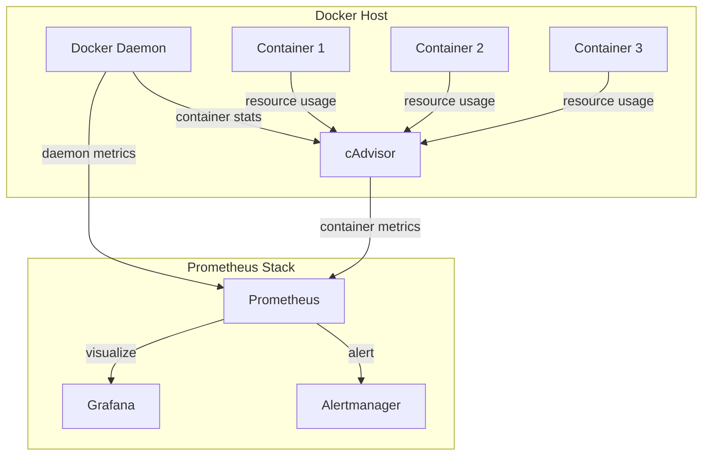

# How to Monitor Docker with Prometheus

Author: [nawazdhandala](https://www.github.com/nawazdhandala)

Tags: Prometheus, Docker, cAdvisor, Container Monitoring, Metrics, Resource Usage, Observability, DevOps

Description: Learn how to monitor Docker containers with Prometheus using cAdvisor and Docker Engine metrics. This guide covers setup, key metrics, alerting rules, and dashboard examples for container monitoring.

---

## Docker Monitoring Options

Prometheus can collect Docker metrics from multiple sources:

- **cAdvisor**: Detailed container resource metrics (CPU, memory, network, filesystem)
- **Docker Engine metrics**: Daemon-level metrics (containers, images, storage)
- **Application metrics**: Metrics exposed by applications inside containers

This guide focuses on cAdvisor for container metrics and Docker Engine for daemon metrics.

## Setting Up cAdvisor

cAdvisor (Container Advisor) provides container users with an understanding of resource usage and performance characteristics of their running containers.

### Docker Compose Setup

```yaml
# docker-compose.yml
version: '3.8'

services:
  cadvisor:
    image: gcr.io/cadvisor/cadvisor:latest
    container_name: cadvisor
    privileged: true
    ports:
      - "8080:8080"
    volumes:
      # Required for cAdvisor to access container data
      - /:/rootfs:ro
      - /var/run:/var/run:ro
      - /sys:/sys:ro
      - /var/lib/docker/:/var/lib/docker:ro
      - /dev/disk/:/dev/disk:ro
    devices:
      - /dev/kmsg
    restart: unless-stopped

  prometheus:
    image: prom/prometheus:latest
    container_name: prometheus
    ports:
      - "9090:9090"
    volumes:
      - ./prometheus.yml:/etc/prometheus/prometheus.yml
      - prometheus_data:/prometheus
    command:
      - '--config.file=/etc/prometheus/prometheus.yml'
      - '--storage.tsdb.path=/prometheus'
    restart: unless-stopped
    depends_on:
      - cadvisor

  grafana:
    image: grafana/grafana:latest
    container_name: grafana
    ports:
      - "3000:3000"
    environment:
      - GF_SECURITY_ADMIN_PASSWORD=admin
    volumes:
      - grafana_data:/var/lib/grafana
    restart: unless-stopped
    depends_on:
      - prometheus

volumes:
  prometheus_data:
  grafana_data:
```

### Prometheus Configuration

```yaml
# prometheus.yml
global:
  scrape_interval: 15s
  evaluation_interval: 15s

scrape_configs:
  # Scrape cAdvisor for container metrics
  - job_name: 'cadvisor'
    static_configs:
      - targets: ['cadvisor:8080']
    # Relabel to extract container name
    metric_relabel_configs:
      - source_labels: [container_label_com_docker_compose_service]
        target_label: service
      - source_labels: [container_label_com_docker_compose_project]
        target_label: project

  # Scrape Prometheus itself
  - job_name: 'prometheus'
    static_configs:
      - targets: ['localhost:9090']
```

## Enabling Docker Engine Metrics

Docker Engine can expose its own metrics. Enable this in the Docker daemon configuration.

```json
// /etc/docker/daemon.json
{
  "metrics-addr": "0.0.0.0:9323",
  "experimental": true
}
```

Restart Docker after modifying the configuration:

```bash
sudo systemctl restart docker
```

Add Docker Engine to Prometheus:

```yaml
# prometheus.yml - Add Docker Engine scrape config
scrape_configs:
  - job_name: 'docker'
    static_configs:
      - targets: ['localhost:9323']
```

## Key Container Metrics

### CPU Metrics

```promql
# CPU usage per container (percentage of total CPU)
sum(rate(container_cpu_usage_seconds_total{name!=""}[5m])) by (name) * 100

# CPU usage by container (cores)
sum(rate(container_cpu_usage_seconds_total{name!=""}[5m])) by (name)

# CPU throttling (indicates resource limits being hit)
sum(rate(container_cpu_cfs_throttled_seconds_total[5m])) by (name)

# CPU throttling percentage
sum(rate(container_cpu_cfs_throttled_periods_total[5m])) by (name) /
sum(rate(container_cpu_cfs_periods_total[5m])) by (name) * 100
```

### Memory Metrics

```promql
# Current memory usage per container
container_memory_usage_bytes{name!=""}

# Memory usage percentage of limit
container_memory_usage_bytes{name!=""} /
container_spec_memory_limit_bytes{name!=""} * 100

# Memory working set (more accurate than usage)
container_memory_working_set_bytes{name!=""}

# Memory cache (can be reclaimed)
container_memory_cache{name!=""}

# Memory RSS (actual process memory)
container_memory_rss{name!=""}
```

### Network Metrics

```promql
# Network received bytes per second
sum(rate(container_network_receive_bytes_total{name!=""}[5m])) by (name)

# Network transmitted bytes per second
sum(rate(container_network_transmit_bytes_total{name!=""}[5m])) by (name)

# Network errors received
sum(rate(container_network_receive_errors_total{name!=""}[5m])) by (name)

# Network packets dropped
sum(rate(container_network_receive_packets_dropped_total{name!=""}[5m])) by (name)
```

### Filesystem Metrics

```promql
# Filesystem usage per container
container_fs_usage_bytes{name!=""}

# Filesystem limit
container_fs_limit_bytes{name!=""}

# Filesystem usage percentage
container_fs_usage_bytes{name!=""} /
container_fs_limit_bytes{name!=""} * 100

# Filesystem reads per second
sum(rate(container_fs_reads_total{name!=""}[5m])) by (name)

# Filesystem writes per second
sum(rate(container_fs_writes_total{name!=""}[5m])) by (name)
```

## Monitoring Architecture



## Alerting Rules for Docker

```yaml
# docker_alerts.yml
groups:
  - name: docker_container_alerts
    rules:
      # Container CPU usage high
      - alert: ContainerHighCPU
        expr: |
          sum(rate(container_cpu_usage_seconds_total{name!=""}[5m])) by (name) > 0.8
        for: 5m
        labels:
          severity: warning
        annotations:
          summary: "Container {{ $labels.name }} high CPU usage"
          description: |
            Container {{ $labels.name }} CPU usage is above 80%
            Current value: {{ $value | humanizePercentage }}

      # Container memory usage high
      - alert: ContainerHighMemory
        expr: |
          container_memory_usage_bytes{name!=""} /
          container_spec_memory_limit_bytes{name!=""} > 0.9
        for: 5m
        labels:
          severity: warning
        annotations:
          summary: "Container {{ $labels.name }} high memory usage"
          description: |
            Container {{ $labels.name }} memory usage is above 90%
            Current value: {{ $value | humanizePercentage }}

      # Container being OOM killed
      - alert: ContainerOOMKilled
        expr: |
          increase(container_oom_events_total{name!=""}[5m]) > 0
        labels:
          severity: critical
        annotations:
          summary: "Container {{ $labels.name }} OOM killed"
          description: |
            Container {{ $labels.name }} has been OOM killed.

      # Container CPU throttling
      - alert: ContainerCPUThrottling
        expr: |
          sum(rate(container_cpu_cfs_throttled_periods_total{name!=""}[5m])) by (name) /
          sum(rate(container_cpu_cfs_periods_total{name!=""}[5m])) by (name) > 0.5
        for: 5m
        labels:
          severity: warning
        annotations:
          summary: "Container {{ $labels.name }} CPU throttling"
          description: |
            Container {{ $labels.name }} is being throttled more than 50% of the time.

      # Container not running
      - alert: ContainerDown
        expr: |
          absent(container_start_time_seconds{name="important-service"})
        for: 1m
        labels:
          severity: critical
        annotations:
          summary: "Container important-service is not running"

      # Container restart loop
      - alert: ContainerRestartLoop
        expr: |
          increase(container_start_time_seconds{name!=""}[1h]) > 5
        labels:
          severity: warning
        annotations:
          summary: "Container {{ $labels.name }} restarting frequently"
          description: |
            Container {{ $labels.name }} has restarted {{ $value }} times in the last hour.

  - name: docker_daemon_alerts
    rules:
      # Docker daemon not healthy
      - alert: DockerDaemonNotHealthy
        expr: up{job="docker"} == 0
        for: 5m
        labels:
          severity: critical
        annotations:
          summary: "Docker daemon is not responding"

      # High number of stopped containers
      - alert: TooManyStoppedContainers
        expr: |
          engine_daemon_container_states_containers{state="stopped"} > 20
        for: 15m
        labels:
          severity: warning
        annotations:
          summary: "Too many stopped containers"
          description: |
            There are {{ $value }} stopped containers. Consider cleanup.
```

## Recording Rules for Performance

```yaml
# docker_recording_rules.yml
groups:
  - name: docker_recording_rules
    interval: 30s
    rules:
      # Pre-calculate CPU usage
      - record: container:cpu:usage_rate5m
        expr: |
          sum(rate(container_cpu_usage_seconds_total{name!=""}[5m])) by (name)

      # Pre-calculate memory usage percentage
      - record: container:memory:usage_ratio
        expr: |
          container_memory_usage_bytes{name!=""} /
          container_spec_memory_limit_bytes{name!=""}

      # Pre-calculate network throughput
      - record: container:network:receive_rate5m
        expr: |
          sum(rate(container_network_receive_bytes_total{name!=""}[5m])) by (name)

      - record: container:network:transmit_rate5m
        expr: |
          sum(rate(container_network_transmit_bytes_total{name!=""}[5m])) by (name)

      # Total containers by state
      - record: docker:containers:by_state
        expr: |
          sum by (state) (engine_daemon_container_states_containers)
```

## Multi-Host Monitoring

For multiple Docker hosts, configure Prometheus to scrape cAdvisor from each host:

```yaml
# prometheus.yml - Multi-host configuration
scrape_configs:
  - job_name: 'cadvisor'
    static_configs:
      - targets:
          - 'docker-host-1:8080'
          - 'docker-host-2:8080'
          - 'docker-host-3:8080'
        labels:
          cluster: production

    relabel_configs:
      # Extract hostname for labeling
      - source_labels: [__address__]
        regex: '([^:]+):\d+'
        target_label: docker_host
        replacement: '${1}'

  # Or use file-based service discovery
  - job_name: 'cadvisor-dynamic'
    file_sd_configs:
      - files:
          - /etc/prometheus/docker_hosts.yml
        refresh_interval: 30s
```

```yaml
# /etc/prometheus/docker_hosts.yml
- targets:
    - 'docker-host-1:8080'
  labels:
    environment: production
    datacenter: us-east

- targets:
    - 'docker-host-2:8080'
  labels:
    environment: production
    datacenter: us-west
```

## Grafana Dashboard Panels

Create a comprehensive Docker monitoring dashboard:

```json
{
  "panels": [
    {
      "title": "Container CPU Usage",
      "type": "timeseries",
      "targets": [
        {
          "expr": "sum(rate(container_cpu_usage_seconds_total{name!=\"\"}[5m])) by (name) * 100",
          "legendFormat": "{{name}}"
        }
      ]
    },
    {
      "title": "Container Memory Usage",
      "type": "timeseries",
      "targets": [
        {
          "expr": "container_memory_usage_bytes{name!=\"\"} / 1024 / 1024",
          "legendFormat": "{{name}}"
        }
      ]
    },
    {
      "title": "Container Network I/O",
      "type": "timeseries",
      "targets": [
        {
          "expr": "sum(rate(container_network_receive_bytes_total{name!=\"\"}[5m])) by (name)",
          "legendFormat": "{{name}} - received"
        },
        {
          "expr": "sum(rate(container_network_transmit_bytes_total{name!=\"\"}[5m])) by (name) * -1",
          "legendFormat": "{{name}} - transmitted"
        }
      ]
    },
    {
      "title": "Containers by State",
      "type": "piechart",
      "targets": [
        {
          "expr": "engine_daemon_container_states_containers",
          "legendFormat": "{{state}}"
        }
      ]
    }
  ]
}
```

## Best Practices

1. **Limit cAdvisor scope**: Exclude system containers from monitoring if not needed
2. **Use resource limits**: Set memory and CPU limits so metrics show meaningful percentages
3. **Label containers consistently**: Use Docker labels for service identification
4. **Monitor the monitoring**: Set up alerts for cAdvisor and Prometheus health
5. **Retention planning**: Container metrics can be high volume; plan storage accordingly
6. **Clean up stopped containers**: Reduce noise by removing old stopped containers

## Filtering Container Metrics

Reduce cardinality by filtering unwanted containers:

```yaml
# prometheus.yml - Filter specific containers
metric_relabel_configs:
  # Only keep metrics from specific containers
  - source_labels: [name]
    regex: '(app|api|worker|db).*'
    action: keep

  # Or exclude system containers
  - source_labels: [name]
    regex: '(cadvisor|prometheus|grafana).*'
    action: drop

  # Drop unused metrics
  - source_labels: [__name__]
    regex: 'container_tasks_state'
    action: drop
```

## Conclusion

Docker monitoring with Prometheus provides deep visibility into container resource usage and health. cAdvisor handles container-level metrics while Docker Engine metrics provide daemon-level insights. Combine these with well-designed alerts and dashboards to keep your containerized applications running smoothly. Focus on the metrics that drive operational decisions: CPU throttling, memory limits, network errors, and container lifecycle events.
