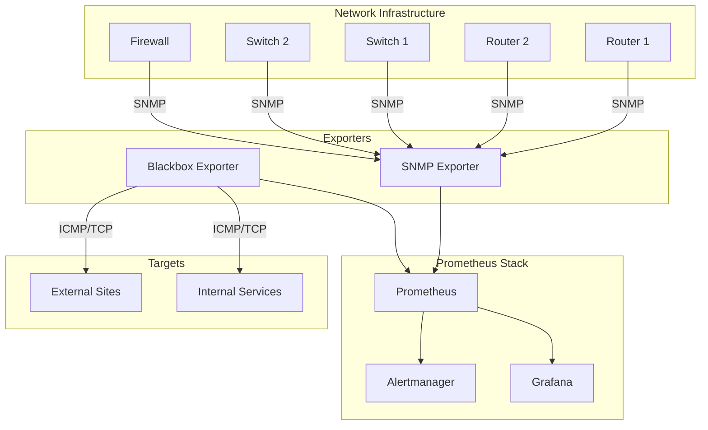

# How to Monitor Networks with Prometheus

Author: [nawazdhandala](https://www.github.com/nawazdhandala)

Tags: Prometheus, Network Monitoring, SNMP, Blackbox Exporter, Network Devices, Bandwidth, Latency, Observability

Description: Learn how to monitor networks with Prometheus using SNMP Exporter and Blackbox Exporter. This guide covers router and switch monitoring, bandwidth tracking, latency measurement, and alerting for network infrastructure.

---

## Network Monitoring with Prometheus

Network monitoring with Prometheus involves collecting metrics from network devices and measuring network connectivity. Two main approaches exist:

- **SNMP Exporter**: Collects metrics from routers, switches, and other SNMP-enabled devices
- **Blackbox Exporter**: Probes endpoints to measure connectivity, latency, and availability

Together, these tools provide comprehensive visibility into your network infrastructure.

## Setting Up SNMP Exporter

SNMP Exporter translates SNMP data into Prometheus metrics. It requires a configuration file (generator output) that defines which SNMP OIDs to collect.

### Installation

```bash
# Download SNMP Exporter
wget https://github.com/prometheus/snmp_exporter/releases/download/v0.25.0/snmp_exporter-0.25.0.linux-amd64.tar.gz
tar xvfz snmp_exporter-0.25.0.linux-amd64.tar.gz
sudo mv snmp_exporter-0.25.0.linux-amd64/snmp_exporter /usr/local/bin/

# Download the default snmp.yml configuration
wget https://raw.githubusercontent.com/prometheus/snmp_exporter/main/snmp.yml
```

### Docker Deployment

```yaml
# docker-compose.yml
version: '3.8'

services:
  snmp-exporter:
    image: prom/snmp-exporter:latest
    container_name: snmp-exporter
    ports:
      - "9116:9116"
    volumes:
      - ./snmp.yml:/etc/snmp_exporter/snmp.yml
    command:
      - '--config.file=/etc/snmp_exporter/snmp.yml'
    restart: unless-stopped

  prometheus:
    image: prom/prometheus:latest
    container_name: prometheus
    ports:
      - "9090:9090"
    volumes:
      - ./prometheus.yml:/etc/prometheus/prometheus.yml
    depends_on:
      - snmp-exporter
```

### Prometheus Configuration for SNMP

```yaml
# prometheus.yml
scrape_configs:
  # SNMP Exporter itself
  - job_name: 'snmp-exporter'
    static_configs:
      - targets: ['snmp-exporter:9116']

  # Network switches using if_mib module
  - job_name: 'snmp-switches'
    static_configs:
      - targets:
          - '192.168.1.1'    # Core switch
          - '192.168.1.2'    # Distribution switch 1
          - '192.168.1.3'    # Distribution switch 2
        labels:
          device_type: switch
    metrics_path: /snmp
    params:
      module: [if_mib]
      auth: [public_v2]
    relabel_configs:
      - source_labels: [__address__]
        target_label: __param_target
      - source_labels: [__param_target]
        target_label: instance
      - target_label: __address__
        replacement: snmp-exporter:9116

  # Routers using if_mib module
  - job_name: 'snmp-routers'
    static_configs:
      - targets:
          - '192.168.1.254'  # Edge router
          - '10.0.0.1'       # Core router
        labels:
          device_type: router
    metrics_path: /snmp
    params:
      module: [if_mib]
      auth: [public_v2]
    relabel_configs:
      - source_labels: [__address__]
        target_label: __param_target
      - source_labels: [__param_target]
        target_label: instance
      - target_label: __address__
        replacement: snmp-exporter:9116
```

## Generating Custom SNMP Configuration

For custom MIBs or specific OIDs, use the SNMP Exporter generator:

```yaml
# generator.yml - Custom SNMP configuration
modules:
  # Cisco devices
  cisco_switch:
    walk:
      - ifTable
      - ifXTable
      - 1.3.6.1.4.1.9.2.1  # Cisco local
      - 1.3.6.1.4.1.9.9.109  # Cisco CPU
      - 1.3.6.1.4.1.9.9.48   # Cisco memory
    lookups:
      - source_indexes: [ifIndex]
        lookup: ifAlias
      - source_indexes: [ifIndex]
        lookup: ifDescr
      - source_indexes: [ifIndex]
        lookup: ifName
    overrides:
      ifAlias:
        type: DisplayString
      ifDescr:
        type: DisplayString
      ifName:
        type: DisplayString

  # Generic network devices
  network_device:
    walk:
      - sysUpTime
      - sysName
      - sysDescr
      - ifTable
      - ifXTable
    lookups:
      - source_indexes: [ifIndex]
        lookup: ifDescr
    overrides:
      ifDescr:
        type: DisplayString

auths:
  public_v2:
    version: 2
    community: public

  private_v2:
    version: 2
    community: private

  secure_v3:
    version: 3
    username: snmpuser
    security_level: authPriv
    auth_protocol: SHA
    auth_password: authpass123
    priv_protocol: AES
    priv_password: privpass123
```

Generate the configuration:

```bash
# Install generator
go install github.com/prometheus/snmp_exporter/generator@latest

# Generate snmp.yml from generator.yml
generator generate
```

## Key SNMP Metrics

### Interface Metrics

```promql
# Interface status (1 = up, 2 = down)
ifOperStatus

# Interface throughput - inbound (bits/sec)
rate(ifHCInOctets[5m]) * 8

# Interface throughput - outbound (bits/sec)
rate(ifHCOutOctets[5m]) * 8

# Interface errors inbound
rate(ifInErrors[5m])

# Interface errors outbound
rate(ifOutErrors[5m])

# Interface discards (drops)
rate(ifInDiscards[5m])
rate(ifOutDiscards[5m])

# Interface utilization percentage (requires knowing interface speed)
rate(ifHCInOctets[5m]) * 8 / ifHighSpeed / 1000000 * 100
```

### Device Metrics

```promql
# System uptime
sysUpTime / 100 / 60 / 60 / 24  # Convert to days

# CPU utilization (Cisco)
cpmCPUTotal5minRev

# Memory utilization (Cisco)
ciscoMemoryPoolUsed / (ciscoMemoryPoolUsed + ciscoMemoryPoolFree) * 100
```

## Network Connectivity Monitoring

Use Blackbox Exporter for connectivity testing:

```yaml
# blackbox.yml
modules:
  icmp_probe:
    prober: icmp
    timeout: 5s
    icmp:
      preferred_ip_protocol: ip4

  tcp_connect:
    prober: tcp
    timeout: 5s

  dns_probe:
    prober: dns
    timeout: 5s
    dns:
      query_name: example.com
      query_type: A
```

```yaml
# prometheus.yml - Blackbox Exporter for network probes
scrape_configs:
  # ICMP ping monitoring
  - job_name: 'network-ping'
    metrics_path: /probe
    params:
      module: [icmp_probe]
    static_configs:
      - targets:
          - '8.8.8.8'           # Google DNS
          - '1.1.1.1'           # Cloudflare DNS
          - '192.168.1.1'       # Gateway
          - 'isp-router.example.com'
        labels:
          probe_type: icmp
    relabel_configs:
      - source_labels: [__address__]
        target_label: __param_target
      - source_labels: [__param_target]
        target_label: instance
      - target_label: __address__
        replacement: blackbox-exporter:9115

  # TCP port connectivity
  - job_name: 'network-tcp'
    metrics_path: /probe
    params:
      module: [tcp_connect]
    static_configs:
      - targets:
          - 'db.example.com:5432'
          - 'cache.example.com:6379'
          - 'api.example.com:443'
        labels:
          probe_type: tcp
    relabel_configs:
      - source_labels: [__address__]
        target_label: __param_target
      - source_labels: [__param_target]
        target_label: instance
      - target_label: __address__
        replacement: blackbox-exporter:9115
```

## Network Monitoring Architecture



## Alerting Rules for Network Monitoring

```yaml
# network_alerts.yml
groups:
  - name: network_device_alerts
    rules:
      # Network device down
      - alert: NetworkDeviceDown
        expr: up{job=~"snmp-.*"} == 0
        for: 5m
        labels:
          severity: critical
        annotations:
          summary: "Network device {{ $labels.instance }} is down"

      # Interface down
      - alert: NetworkInterfaceDown
        expr: ifOperStatus == 2
        for: 5m
        labels:
          severity: warning
        annotations:
          summary: "Interface {{ $labels.ifDescr }} on {{ $labels.instance }} is down"

      # High interface utilization
      - alert: HighInterfaceUtilization
        expr: |
          rate(ifHCInOctets[5m]) * 8 / ifHighSpeed / 1000000 * 100 > 80
          or
          rate(ifHCOutOctets[5m]) * 8 / ifHighSpeed / 1000000 * 100 > 80
        for: 15m
        labels:
          severity: warning
        annotations:
          summary: "High utilization on {{ $labels.ifDescr }}"
          description: |
            Interface {{ $labels.ifDescr }} on {{ $labels.instance }}
            is at {{ $value | printf "%.1f" }}% utilization.

      # Interface errors
      - alert: NetworkInterfaceErrors
        expr: |
          rate(ifInErrors[5m]) > 10 or rate(ifOutErrors[5m]) > 10
        for: 10m
        labels:
          severity: warning
        annotations:
          summary: "Interface errors on {{ $labels.ifDescr }}"
          description: |
            Interface {{ $labels.ifDescr }} on {{ $labels.instance }}
            is experiencing errors.

      # High packet drops
      - alert: NetworkPacketDrops
        expr: |
          rate(ifInDiscards[5m]) > 100 or rate(ifOutDiscards[5m]) > 100
        for: 10m
        labels:
          severity: warning
        annotations:
          summary: "Packet drops on {{ $labels.ifDescr }}"

  - name: network_connectivity_alerts
    rules:
      # Host unreachable
      - alert: HostUnreachable
        expr: probe_success{job="network-ping"} == 0
        for: 3m
        labels:
          severity: critical
        annotations:
          summary: "Host {{ $labels.instance }} is unreachable"
          description: "ICMP probe to {{ $labels.instance }} is failing."

      # High latency
      - alert: HighNetworkLatency
        expr: probe_duration_seconds{job="network-ping"} > 0.5
        for: 10m
        labels:
          severity: warning
        annotations:
          summary: "High latency to {{ $labels.instance }}"
          description: "Latency is {{ $value | printf \"%.0f\" }}ms"

      # DNS resolution failing
      - alert: DNSResolutionFailed
        expr: probe_success{job="network-dns"} == 0
        for: 5m
        labels:
          severity: critical
        annotations:
          summary: "DNS resolution failing for {{ $labels.instance }}"

      # TCP connection failing
      - alert: TCPConnectionFailed
        expr: probe_success{job="network-tcp"} == 0
        for: 5m
        labels:
          severity: critical
        annotations:
          summary: "TCP connection to {{ $labels.instance }} failing"
```

## Recording Rules for Network Metrics

```yaml
# network_recording_rules.yml
groups:
  - name: network_recording
    interval: 30s
    rules:
      # Interface throughput in bits/sec
      - record: interface:throughput_in:rate5m
        expr: |
          rate(ifHCInOctets[5m]) * 8

      - record: interface:throughput_out:rate5m
        expr: |
          rate(ifHCOutOctets[5m]) * 8

      # Total device throughput
      - record: device:throughput_in:rate5m
        expr: |
          sum by (instance) (rate(ifHCInOctets[5m]) * 8)

      - record: device:throughput_out:rate5m
        expr: |
          sum by (instance) (rate(ifHCOutOctets[5m]) * 8)

      # Interface utilization
      - record: interface:utilization_in:percent
        expr: |
          rate(ifHCInOctets[5m]) * 8 / ifHighSpeed / 1000000 * 100

      - record: interface:utilization_out:percent
        expr: |
          rate(ifHCOutOctets[5m]) * 8 / ifHighSpeed / 1000000 * 100

      # Error rate
      - record: interface:error_rate:rate5m
        expr: |
          rate(ifInErrors[5m]) + rate(ifOutErrors[5m])

      # Ping latency
      - record: network:ping_latency:seconds
        expr: |
          probe_duration_seconds{job="network-ping"}
```

## Grafana Dashboard Queries

```promql
# Panel: Interface Throughput
rate(ifHCInOctets{instance="$device"}[5m]) * 8
rate(ifHCOutOctets{instance="$device"}[5m]) * 8 * -1  # Negative for visual

# Panel: Top 10 Interfaces by Utilization
topk(10, interface:utilization_in:percent)

# Panel: Interface Status Table
ifOperStatus * on(ifIndex) group_left(ifDescr) ifDescr

# Panel: Device Uptime
sysUpTime{instance="$device"} / 100 / 60 / 60 / 24

# Panel: Network Latency Heatmap
histogram_quantile(0.99, probe_duration_seconds{job="network-ping"})

# Panel: Connectivity Status
probe_success{job="network-ping"}
```

## Multi-Site Network Monitoring

For distributed networks, deploy exporters at each site:

```yaml
# prometheus.yml - Multi-site monitoring
scrape_configs:
  - job_name: 'snmp-datacenter-east'
    static_configs:
      - targets: ['192.168.10.1', '192.168.10.2']
        labels:
          site: datacenter-east
    metrics_path: /snmp
    params:
      module: [if_mib]
    relabel_configs:
      - source_labels: [__address__]
        target_label: __param_target
      - source_labels: [__param_target]
        target_label: instance
      - target_label: __address__
        replacement: snmp-exporter-east:9116

  - job_name: 'snmp-datacenter-west'
    static_configs:
      - targets: ['192.168.20.1', '192.168.20.2']
        labels:
          site: datacenter-west
    metrics_path: /snmp
    params:
      module: [if_mib]
    relabel_configs:
      - source_labels: [__address__]
        target_label: __param_target
      - source_labels: [__param_target]
        target_label: instance
      - target_label: __address__
        replacement: snmp-exporter-west:9116
```

## Best Practices

1. **Use SNMPv3 in production**: SNMPv2c communities are sent in cleartext
2. **Filter interfaces**: Exclude loopback and management interfaces from utilization alerts
3. **Set appropriate thresholds**: Network utilization alerts should match your capacity planning
4. **Monitor from multiple locations**: Detect asymmetric routing issues
5. **Correlate metrics**: Combine SNMP data with ping latency for root cause analysis
6. **Document your network**: Label devices with location, purpose, and ownership

## Conclusion

Network monitoring with Prometheus provides visibility into device health, interface utilization, and connectivity. SNMP Exporter collects device metrics while Blackbox Exporter measures connectivity from the user perspective. Combine these data sources with well-designed alerts to catch network issues before they impact users.
