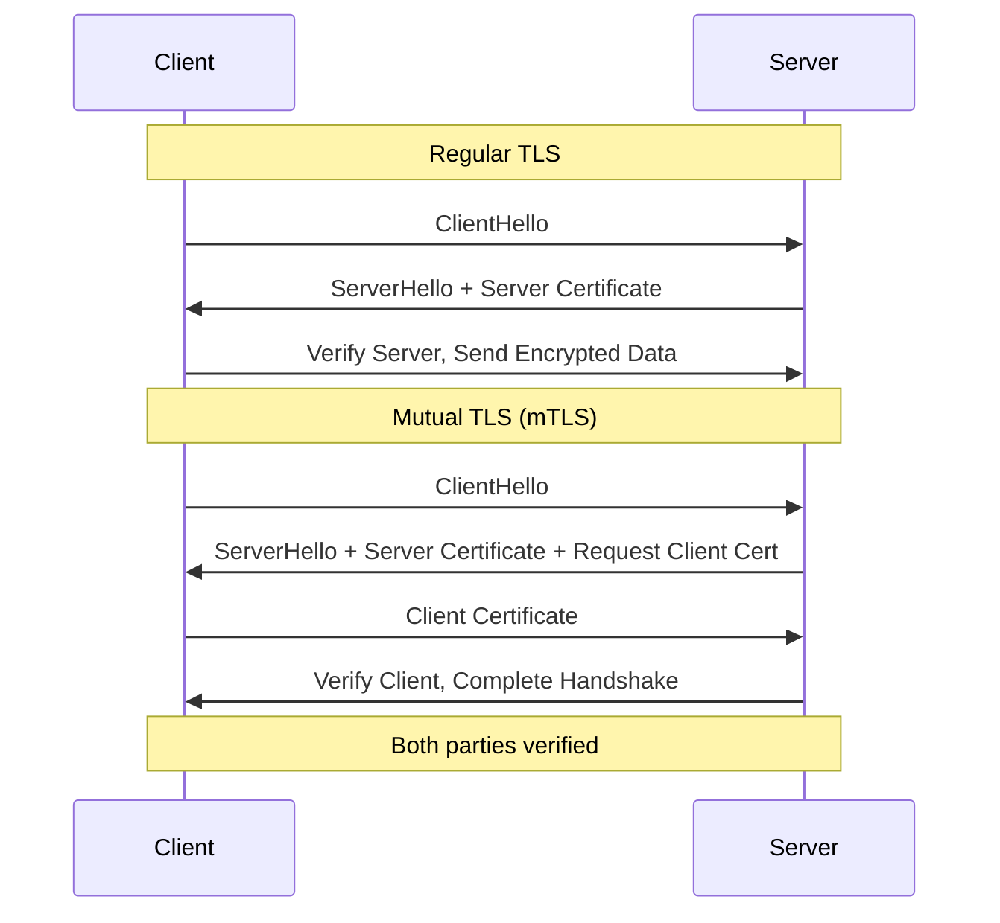

# How to Configure mTLS for Services

Author: [nawazdhandala](https://www.github.com/nawazdhandala)

Tags: mTLS, Security, TLS, Certificates, Kubernetes, Microservices

Description: A hands-on guide to implementing mutual TLS (mTLS) for service-to-service communication, covering certificate management, configuration for various frameworks, and automation with cert-manager.

---

Mutual TLS (mTLS) ensures both the client and server authenticate each other using certificates. Unlike regular TLS where only the server presents a certificate, mTLS requires both parties to prove their identity. This guide covers practical mTLS implementation for microservices.

## Understanding mTLS



## Certificate Authority Setup

### Create a Private CA with OpenSSL

```bash
#!/bin/bash
# setup-ca.sh - Create a private Certificate Authority

# Create directory structure
mkdir -p ca/{certs,crl,newcerts,private,csr}
chmod 700 ca/private
touch ca/index.txt
echo 1000 > ca/serial

# CA configuration file
cat > ca/openssl.cnf << 'EOF'
[ca]
default_ca = CA_default

[CA_default]
dir               = ./ca
certs             = $dir/certs
crl_dir           = $dir/crl
new_certs_dir     = $dir/newcerts
database          = $dir/index.txt
serial            = $dir/serial
private_key       = $dir/private/ca.key
certificate       = $dir/certs/ca.crt
crl               = $dir/crl/ca.crl
default_md        = sha256
default_days      = 365
policy            = policy_strict

[policy_strict]
countryName             = match
stateOrProvinceName     = match
organizationName        = match
organizationalUnitName  = optional
commonName              = supplied
emailAddress            = optional

[req]
default_bits        = 4096
distinguished_name  = req_distinguished_name
string_mask         = utf8only
default_md          = sha256
x509_extensions     = v3_ca

[req_distinguished_name]
countryName                     = Country Name
stateOrProvinceName             = State
localityName                    = Locality
organizationName                = Organization
organizationalUnitName          = Organizational Unit
commonName                      = Common Name

[v3_ca]
subjectKeyIdentifier = hash
authorityKeyIdentifier = keyid:always,issuer
basicConstraints = critical, CA:true, pathlen:1
keyUsage = critical, digitalSignature, cRLSign, keyCertSign

[server_cert]
basicConstraints = CA:FALSE
nsCertType = server
subjectKeyIdentifier = hash
authorityKeyIdentifier = keyid,issuer
keyUsage = critical, digitalSignature, keyEncipherment
extendedKeyUsage = serverAuth

[client_cert]
basicConstraints = CA:FALSE
nsCertType = client
subjectKeyIdentifier = hash
authorityKeyIdentifier = keyid,issuer
keyUsage = critical, digitalSignature
extendedKeyUsage = clientAuth
EOF

# Generate CA private key
openssl genrsa -out ca/private/ca.key 4096
chmod 400 ca/private/ca.key

# Generate CA certificate
openssl req -config ca/openssl.cnf \
    -key ca/private/ca.key \
    -new -x509 -days 3650 -sha256 \
    -extensions v3_ca \
    -out ca/certs/ca.crt \
    -subj "/C=US/ST=California/L=San Francisco/O=MyOrg/CN=MyOrg Root CA"

echo "CA created successfully"
echo "CA Certificate: ca/certs/ca.crt"
echo "CA Private Key: ca/private/ca.key"
```

### Generate Service Certificates

```bash
#!/bin/bash
# generate-service-cert.sh - Generate certificate for a service

SERVICE_NAME=$1
SERVICE_DNS=$2

if [ -z "$SERVICE_NAME" ] || [ -z "$SERVICE_DNS" ]; then
    echo "Usage: $0 <service-name> <service-dns>"
    exit 1
fi

# Generate private key
openssl genrsa -out ${SERVICE_NAME}.key 2048

# Create certificate signing request
openssl req -new \
    -key ${SERVICE_NAME}.key \
    -out ${SERVICE_NAME}.csr \
    -subj "/C=US/ST=California/L=San Francisco/O=MyOrg/CN=${SERVICE_NAME}"

# Create extensions file for SAN
cat > ${SERVICE_NAME}.ext << EOF
basicConstraints = CA:FALSE
nsCertType = server, client
subjectKeyIdentifier = hash
authorityKeyIdentifier = keyid,issuer
keyUsage = critical, digitalSignature, keyEncipherment
extendedKeyUsage = serverAuth, clientAuth
subjectAltName = @alt_names

[alt_names]
DNS.1 = ${SERVICE_DNS}
DNS.2 = ${SERVICE_NAME}
DNS.3 = ${SERVICE_NAME}.default.svc.cluster.local
DNS.4 = localhost
IP.1 = 127.0.0.1
EOF

# Sign the certificate with CA
openssl x509 -req \
    -in ${SERVICE_NAME}.csr \
    -CA ca/certs/ca.crt \
    -CAkey ca/private/ca.key \
    -CAcreateserial \
    -out ${SERVICE_NAME}.crt \
    -days 365 \
    -sha256 \
    -extfile ${SERVICE_NAME}.ext

echo "Certificate generated for ${SERVICE_NAME}"
echo "Certificate: ${SERVICE_NAME}.crt"
echo "Private Key: ${SERVICE_NAME}.key"

# Clean up
rm ${SERVICE_NAME}.csr ${SERVICE_NAME}.ext
```

## cert-manager for Kubernetes

### Install cert-manager

```bash
# Install cert-manager
kubectl apply -f https://github.com/cert-manager/cert-manager/releases/download/v1.13.0/cert-manager.yaml

# Wait for deployment
kubectl wait --for=condition=Available deployment --all -n cert-manager --timeout=120s
```

### Create Internal CA Issuer

```yaml
# ca-issuer.yaml
apiVersion: v1
kind: Secret
metadata:
  name: ca-key-pair
  namespace: cert-manager
data:
  tls.crt: <base64-encoded-ca-cert>
  tls.key: <base64-encoded-ca-key>

---
apiVersion: cert-manager.io/v1
kind: ClusterIssuer
metadata:
  name: internal-ca-issuer
spec:
  ca:
    secretName: ca-key-pair

---
# Alternative: Self-signed issuer for testing
apiVersion: cert-manager.io/v1
kind: ClusterIssuer
metadata:
  name: selfsigned-issuer
spec:
  selfSigned: {}
```

### Request Certificates for Services

```yaml
# service-certificate.yaml
apiVersion: cert-manager.io/v1
kind: Certificate
metadata:
  name: api-service-cert
  namespace: default
spec:
  secretName: api-service-tls
  duration: 2160h  # 90 days
  renewBefore: 360h  # Renew 15 days before expiry
  privateKey:
    algorithm: RSA
    size: 2048
  usages:
    - server auth
    - client auth
  dnsNames:
    - api
    - api.default.svc
    - api.default.svc.cluster.local
  issuerRef:
    name: internal-ca-issuer
    kind: ClusterIssuer

---
apiVersion: cert-manager.io/v1
kind: Certificate
metadata:
  name: database-service-cert
  namespace: default
spec:
  secretName: database-service-tls
  duration: 2160h
  renewBefore: 360h
  privateKey:
    algorithm: RSA
    size: 2048
  usages:
    - server auth
    - client auth
  dnsNames:
    - database
    - database.default.svc
    - database.default.svc.cluster.local
  issuerRef:
    name: internal-ca-issuer
    kind: ClusterIssuer
```

## Go mTLS Server and Client

### mTLS Server

```go
package main

import (
    "crypto/tls"
    "crypto/x509"
    "fmt"
    "io/ioutil"
    "log"
    "net/http"
)

func main() {
    // Load server certificate and key
    serverCert, err := tls.LoadX509KeyPair("server.crt", "server.key")
    if err != nil {
        log.Fatalf("Failed to load server certificate: %v", err)
    }

    // Load CA certificate for client verification
    caCert, err := ioutil.ReadFile("ca.crt")
    if err != nil {
        log.Fatalf("Failed to load CA certificate: %v", err)
    }

    caCertPool := x509.NewCertPool()
    caCertPool.AppendCertsFromPEM(caCert)

    // Configure TLS
    tlsConfig := &tls.Config{
        Certificates: []tls.Certificate{serverCert},
        ClientAuth:   tls.RequireAndVerifyClientCert,
        ClientCAs:    caCertPool,
        MinVersion:   tls.VersionTLS13,
    }

    // Create server
    server := &http.Server{
        Addr:      ":8443",
        TLSConfig: tlsConfig,
    }

    // Handler that shows client certificate info
    http.HandleFunc("/", func(w http.ResponseWriter, r *http.Request) {
        if r.TLS != nil && len(r.TLS.PeerCertificates) > 0 {
            clientCert := r.TLS.PeerCertificates[0]
            fmt.Fprintf(w, "Hello %s!\n", clientCert.Subject.CommonName)
            fmt.Fprintf(w, "Client Organization: %s\n", clientCert.Subject.Organization)
        } else {
            fmt.Fprintf(w, "No client certificate provided\n")
        }
    })

    log.Println("Starting mTLS server on :8443")
    log.Fatal(server.ListenAndServeTLS("", ""))
}
```

### mTLS Client

```go
package main

import (
    "crypto/tls"
    "crypto/x509"
    "fmt"
    "io/ioutil"
    "log"
    "net/http"
)

func main() {
    // Load client certificate and key
    clientCert, err := tls.LoadX509KeyPair("client.crt", "client.key")
    if err != nil {
        log.Fatalf("Failed to load client certificate: %v", err)
    }

    // Load CA certificate for server verification
    caCert, err := ioutil.ReadFile("ca.crt")
    if err != nil {
        log.Fatalf("Failed to load CA certificate: %v", err)
    }

    caCertPool := x509.NewCertPool()
    caCertPool.AppendCertsFromPEM(caCert)

    // Configure TLS
    tlsConfig := &tls.Config{
        Certificates: []tls.Certificate{clientCert},
        RootCAs:      caCertPool,
        MinVersion:   tls.VersionTLS13,
    }

    // Create HTTP client with mTLS
    client := &http.Client{
        Transport: &http.Transport{
            TLSClientConfig: tlsConfig,
        },
    }

    // Make request
    resp, err := client.Get("https://server:8443/")
    if err != nil {
        log.Fatalf("Request failed: %v", err)
    }
    defer resp.Body.Close()

    body, _ := ioutil.ReadAll(resp.Body)
    fmt.Printf("Response: %s\n", body)
}
```

## Python mTLS

```python
# mtls_server.py
import ssl
from flask import Flask, request

app = Flask(__name__)

@app.route('/')
def hello():
    # Access client certificate info
    client_cert = request.environ.get('peercert')
    if client_cert:
        subject = dict(x[0] for x in client_cert['subject'])
        return f"Hello {subject.get('commonName', 'Unknown')}!"
    return "No client certificate"

if __name__ == '__main__':
    # Configure SSL context
    context = ssl.SSLContext(ssl.PROTOCOL_TLS_SERVER)
    context.verify_mode = ssl.CERT_REQUIRED
    context.load_cert_chain('server.crt', 'server.key')
    context.load_verify_locations('ca.crt')

    app.run(host='0.0.0.0', port=8443, ssl_context=context)
```

```python
# mtls_client.py
import requests
import ssl

# Create custom SSL context
session = requests.Session()
session.cert = ('client.crt', 'client.key')
session.verify = 'ca.crt'

response = session.get('https://server:8443/')
print(response.text)
```

## Nginx mTLS Configuration

```nginx
# /etc/nginx/sites-available/mtls.conf

server {
    listen 443 ssl http2;
    server_name api.example.com;

    # Server certificate
    ssl_certificate /etc/nginx/ssl/server.crt;
    ssl_certificate_key /etc/nginx/ssl/server.key;

    # Client certificate verification
    ssl_client_certificate /etc/nginx/ssl/ca.crt;
    ssl_verify_client on;
    ssl_verify_depth 2;

    # TLS configuration
    ssl_protocols TLSv1.3;
    ssl_prefer_server_ciphers off;

    # Optional: CRL checking
    # ssl_crl /etc/nginx/ssl/crl.pem;

    location / {
        # Pass client certificate info to backend
        proxy_set_header X-Client-Cert-DN $ssl_client_s_dn;
        proxy_set_header X-Client-Cert-Serial $ssl_client_serial;
        proxy_set_header X-Client-Cert-Verify $ssl_client_verify;

        proxy_pass http://backend:8080;
    }

    # Reject if client certificate is invalid
    if ($ssl_client_verify != SUCCESS) {
        return 403;
    }
}
```

## Kubernetes Pod Configuration

```yaml
# mtls-deployment.yaml
apiVersion: apps/v1
kind: Deployment
metadata:
  name: api
spec:
  replicas: 3
  selector:
    matchLabels:
      app: api
  template:
    metadata:
      labels:
        app: api
    spec:
      containers:
        - name: api
          image: api:latest
          ports:
            - containerPort: 8443
          env:
            - name: TLS_CERT_FILE
              value: /etc/tls/tls.crt
            - name: TLS_KEY_FILE
              value: /etc/tls/tls.key
            - name: TLS_CA_FILE
              value: /etc/tls/ca.crt
          volumeMounts:
            - name: tls-certs
              mountPath: /etc/tls
              readOnly: true
      volumes:
        - name: tls-certs
          projected:
            sources:
              - secret:
                  name: api-service-tls
                  items:
                    - key: tls.crt
                      path: tls.crt
                    - key: tls.key
                      path: tls.key
                    - key: ca.crt
                      path: ca.crt

---
apiVersion: v1
kind: Service
metadata:
  name: api
spec:
  ports:
    - port: 8443
      targetPort: 8443
      protocol: TCP
  selector:
    app: api
```

## Certificate Rotation

```bash
#!/bin/bash
# rotate-certs.sh - Automated certificate rotation

NAMESPACE="default"
SECRET_NAME="api-service-tls"
CERT_NAME="api-service-cert"

echo "=== Checking Certificate Status ==="
kubectl get certificate $CERT_NAME -n $NAMESPACE

# Trigger manual renewal
echo "=== Triggering Certificate Renewal ==="
kubectl cert-manager renew $CERT_NAME -n $NAMESPACE

# Wait for renewal
sleep 10

# Verify new certificate
echo "=== Verifying New Certificate ==="
kubectl get secret $SECRET_NAME -n $NAMESPACE -o jsonpath='{.data.tls\.crt}' | \
    base64 -d | \
    openssl x509 -noout -dates

# Rolling restart to pick up new certs
echo "=== Rolling Restart Deployment ==="
kubectl rollout restart deployment/api -n $NAMESPACE
kubectl rollout status deployment/api -n $NAMESPACE

echo "Certificate rotation complete"
```

## Testing mTLS

```bash
#!/bin/bash
# test-mtls.sh

SERVER="https://api.example.com:8443"

echo "=== Test without client certificate (should fail) ==="
curl -v --cacert ca.crt $SERVER 2>&1 | grep -E "(SSL|error|HTTP)"

echo -e "\n=== Test with valid client certificate ==="
curl -v --cacert ca.crt --cert client.crt --key client.key $SERVER

echo -e "\n=== Test with invalid client certificate (should fail) ==="
curl -v --cacert ca.crt --cert invalid.crt --key invalid.key $SERVER 2>&1 | grep -E "(SSL|error)"

echo -e "\n=== Verify certificate details ==="
openssl s_client -connect api.example.com:8443 \
    -cert client.crt -key client.key -CAfile ca.crt \
    </dev/null 2>/dev/null | openssl x509 -noout -subject -issuer
```

---

mTLS provides strong authentication for service-to-service communication. Use cert-manager in Kubernetes for automated certificate lifecycle management, and ensure certificates have short validity periods with automatic rotation. The overhead of mTLS is minimal compared to the security benefits, especially when using TLS 1.3.
