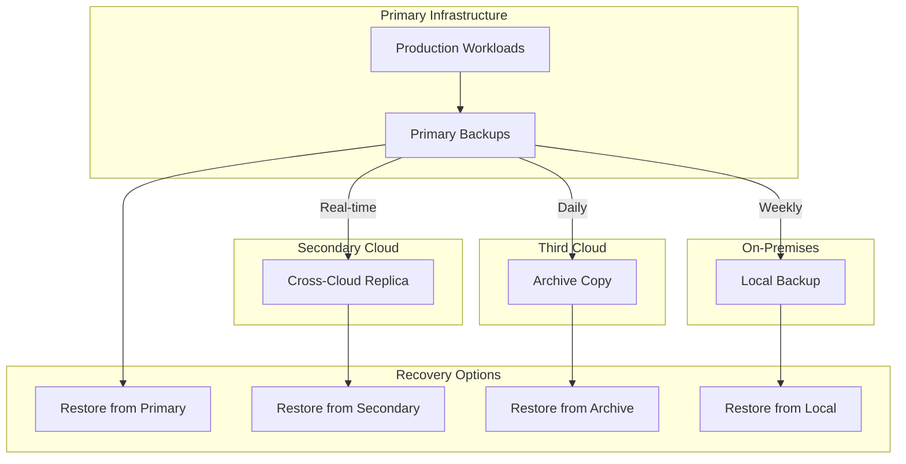

# How to Configure Multi-Cloud Backup Strategies

Author: [nawazdhandala](https://www.github.com/nawazdhandala)

Tags: Multi-Cloud, Backup, Disaster Recovery, AWS, Azure, GCP

Description: Learn how to implement multi-cloud backup strategies that protect against provider-level failures, covering cross-cloud replication, tool selection, and operational considerations.

---

Single-cloud backup strategies have a critical blind spot: cloud provider failures. While rare, major cloud outages do happen, and when they do, your backups stored in the same provider become inaccessible. Multi-cloud backup strategies distribute backup copies across providers, ensuring data remains recoverable even during catastrophic cloud failures.

This guide covers implementing backup strategies that span multiple cloud providers.

## Why Multi-Cloud Backups?

Multi-cloud backups address risks that single-cloud approaches cannot:

1. **Provider outages:** Major cloud failures affect all services in a region or provider
2. **Account lockouts:** Billing issues or security incidents can lock you out entirely
3. **Provider exit:** Business or technical decisions may require leaving a provider
4. **Compliance requirements:** Some regulations require geographic or provider diversity
5. **Negotiating leverage:** Avoiding lock-in provides better pricing power

The tradeoffs include increased complexity, higher costs, and operational overhead from managing multiple platforms.

## Multi-Cloud Architecture



## Tool Selection for Multi-Cloud

Choose backup tools that work across providers:

| Tool | AWS | Azure | GCP | On-Prem | Best For |
|------|-----|-------|-----|---------|----------|
| Restic | Yes | Yes | Yes | Yes | File-level backups |
| Rclone | Yes | Yes | Yes | Yes | Cloud-to-cloud sync |
| Velero | Yes | Yes | Yes | Yes | Kubernetes backups |
| Duplicity | Yes | Yes | Yes | Yes | Encrypted backups |
| Borg | Via rclone | Via rclone | Via rclone | Yes | Deduplicated backups |

### Rclone Configuration

Rclone provides a unified interface for cloud storage:

```bash
# Configure AWS S3
rclone config create aws-backups s3 \
    provider=AWS \
    access_key_id=$AWS_ACCESS_KEY \
    secret_access_key=$AWS_SECRET_KEY \
    region=us-east-1

# Configure Azure Blob
rclone config create azure-backups azureblob \
    account=$AZURE_ACCOUNT \
    key=$AZURE_KEY

# Configure Google Cloud Storage
rclone config create gcs-backups gcs \
    project_number=$GCP_PROJECT \
    service_account_file=/path/to/credentials.json

# List configured remotes
rclone listremotes
```

## Cross-Cloud Replication

### AWS to Azure Replication

```bash
#!/bin/bash
# aws-to-azure-sync.sh

set -euo pipefail

SOURCE="aws-backups:company-backups"
DEST="azure-backups:backup-container"
LOG_FILE="/var/log/cross-cloud-sync.log"

log() {
    echo "[$(date '+%Y-%m-%d %H:%M:%S')] $1" | tee -a "$LOG_FILE"
}

log "Starting AWS to Azure sync"

rclone sync "$SOURCE" "$DEST" \
    --progress \
    --transfers 8 \
    --checkers 16 \
    --log-file "$LOG_FILE" \
    --log-level INFO \
    --stats 1m

log "Sync completed"

# Verify sync
AWS_COUNT=$(rclone size "$SOURCE" --json | jq '.count')
AZURE_COUNT=$(rclone size "$DEST" --json | jq '.count')

if [ "$AWS_COUNT" != "$AZURE_COUNT" ]; then
    log "WARNING: Object counts differ (AWS: $AWS_COUNT, Azure: $AZURE_COUNT)"
fi
```

### Real-Time Cross-Cloud Replication

For near-real-time replication, use event-driven approaches:

```python
#!/usr/bin/env python3
# cross_cloud_replicator.py

import boto3
import json
from azure.storage.blob import BlobServiceClient

def lambda_handler(event, context):
    """AWS Lambda function to replicate S3 objects to Azure."""

    s3 = boto3.client('s3')

    azure_connection_string = get_secret('azure-backup-connection')
    azure_client = BlobServiceClient.from_connection_string(azure_connection_string)
    azure_container = azure_client.get_container_client('backup-replica')

    for record in event['Records']:
        bucket = record['s3']['bucket']['name']
        key = record['s3']['object']['key']

        print(f"Replicating {bucket}/{key} to Azure")

        # Download from S3
        response = s3.get_object(Bucket=bucket, Key=key)
        data = response['Body'].read()

        # Upload to Azure
        blob_client = azure_container.get_blob_client(key)
        blob_client.upload_blob(data, overwrite=True)

        print(f"Successfully replicated {key}")

    return {'statusCode': 200}

def get_secret(secret_name):
    """Retrieve secret from AWS Secrets Manager."""
    client = boto3.client('secretsmanager')
    response = client.get_secret_value(SecretId=secret_name)
    return response['SecretString']
```

## Multi-Cloud Backup Script

Comprehensive backup to multiple providers:

```bash
#!/bin/bash
# multi-cloud-backup.sh

set -euo pipefail

BACKUP_NAME="backup-$(date +%Y%m%d-%H%M%S)"
BACKUP_DIR="/tmp/$BACKUP_NAME"
LOG_FILE="/var/log/multi-cloud-backup.log"

# Cloud destinations
AWS_BUCKET="s3://company-backups-primary"
AZURE_CONTAINER="azure-backups:backup-container"
GCS_BUCKET="gcs-backups:company-backups"

log() {
    echo "[$(date '+%Y-%m-%d %H:%M:%S')] $1" | tee -a "$LOG_FILE"
}

cleanup() {
    rm -rf "$BACKUP_DIR"
}
trap cleanup EXIT

log "Starting multi-cloud backup"

# Create backup
mkdir -p "$BACKUP_DIR"

log "Creating database backup"
pg_dump -h localhost -U backup -Fc production > "$BACKUP_DIR/database.dump"

log "Creating file backup"
tar -czf "$BACKUP_DIR/files.tar.gz" /var/www/app

# Upload to primary (AWS)
log "Uploading to AWS S3"
aws s3 cp --recursive "$BACKUP_DIR" "${AWS_BUCKET}/${BACKUP_NAME}/"

# Upload to secondary (Azure)
log "Uploading to Azure Blob"
rclone copy "$BACKUP_DIR" "${AZURE_CONTAINER}/${BACKUP_NAME}/" \
    --transfers 4

# Upload to tertiary (GCP)
log "Uploading to Google Cloud Storage"
rclone copy "$BACKUP_DIR" "${GCS_BUCKET}/${BACKUP_NAME}/" \
    --transfers 4

# Verify uploads
log "Verifying backups"

AWS_SIZE=$(aws s3 ls --recursive "${AWS_BUCKET}/${BACKUP_NAME}/" --summarize | grep "Total Size" | awk '{print $3}')
AZURE_SIZE=$(rclone size "${AZURE_CONTAINER}/${BACKUP_NAME}" --json | jq '.bytes')
GCS_SIZE=$(rclone size "${GCS_BUCKET}/${BACKUP_NAME}" --json | jq '.bytes')

log "Backup sizes - AWS: $AWS_SIZE, Azure: $AZURE_SIZE, GCS: $GCS_SIZE"

# Update latest marker in all locations
echo "$BACKUP_NAME" | aws s3 cp - "${AWS_BUCKET}/LATEST"
echo "$BACKUP_NAME" | rclone rcat "${AZURE_CONTAINER}/LATEST"
echo "$BACKUP_NAME" | rclone rcat "${GCS_BUCKET}/LATEST"

log "Multi-cloud backup completed successfully"
```

## Kubernetes Multi-Cloud Backup with Velero

Configure Velero for multiple backup locations:

```bash
# Install Velero with multiple backup locations
velero install \
    --provider aws \
    --plugins velero/velero-plugin-for-aws:v1.9.0 \
    --bucket primary-backups \
    --backup-location-config region=us-east-1 \
    --secret-file ./aws-credentials

# Add Azure backup location
velero backup-location create azure-backup \
    --provider azure \
    --bucket backup-container \
    --config resourceGroup=backup-rg,storageAccount=backupstorage \
    --credential=azure-credentials=cloud

# Add GCS backup location
velero backup-location create gcs-backup \
    --provider gcp \
    --bucket gcs-backups \
    --credential=gcs-credentials=cloud
```

Create backups to multiple locations:

```yaml
# multi-location-schedule.yaml
apiVersion: velero.io/v1
kind: Schedule
metadata:
  name: daily-multi-cloud
  namespace: velero
spec:
  schedule: "0 2 * * *"
  template:
    includedNamespaces:
      - production
    storageLocation: default
    ttl: 168h  # 7 days
---
apiVersion: velero.io/v1
kind: Schedule
metadata:
  name: daily-azure-replica
  namespace: velero
spec:
  schedule: "0 3 * * *"  # 1 hour after primary
  template:
    includedNamespaces:
      - production
    storageLocation: azure-backup
    ttl: 336h  # 14 days
```

## Disaster Recovery Across Clouds

### Cross-Cloud Recovery Procedure

```bash
#!/bin/bash
# cross-cloud-restore.sh

set -euo pipefail

PRIMARY_SOURCE="aws-backups:company-backups"
SECONDARY_SOURCE="azure-backups:backup-container"
TERTIARY_SOURCE="gcs-backups:company-backups"

RESTORE_DIR="/tmp/restore-$(date +%s)"

log() {
    echo "[$(date '+%Y-%m-%d %H:%M:%S')] $1"
}

check_source_available() {
    local source="$1"
    log "Checking availability of $source"

    if rclone lsd "$source" > /dev/null 2>&1; then
        return 0
    else
        return 1
    fi
}

get_latest_backup() {
    local source="$1"
    rclone cat "${source}/LATEST" 2>/dev/null || echo ""
}

restore_from_source() {
    local source="$1"
    local backup_name="$2"

    log "Restoring from ${source}/${backup_name}"

    mkdir -p "$RESTORE_DIR"
    rclone copy "${source}/${backup_name}" "$RESTORE_DIR/" \
        --progress \
        --transfers 8

    # Verify download
    if [ -f "$RESTORE_DIR/database.dump" ]; then
        log "Database backup found"
    else
        log "ERROR: Database backup missing"
        return 1
    fi

    return 0
}

# Try sources in order of preference
log "Starting cross-cloud restore"

for source in "$PRIMARY_SOURCE" "$SECONDARY_SOURCE" "$TERTIARY_SOURCE"; do
    log "Trying source: $source"

    if check_source_available "$source"; then
        LATEST=$(get_latest_backup "$source")

        if [ -n "$LATEST" ]; then
            if restore_from_source "$source" "$LATEST"; then
                log "Successfully restored from $source"
                break
            fi
        fi
    fi

    log "Source $source unavailable, trying next..."
done

if [ ! -d "$RESTORE_DIR" ] || [ -z "$(ls -A $RESTORE_DIR)" ]; then
    log "CRITICAL: All backup sources failed"
    exit 1
fi

log "Restore completed to $RESTORE_DIR"
```

## Cost Management

Track and optimize multi-cloud backup costs:

```python
#!/usr/bin/env python3
# multi_cloud_cost_analyzer.py

import boto3
import subprocess
import json

def get_aws_storage_cost(bucket_name):
    """Calculate AWS S3 storage cost."""

    s3 = boto3.client('s3')
    paginator = s3.get_paginator('list_objects_v2')

    total_size = 0
    for page in paginator.paginate(Bucket=bucket_name):
        for obj in page.get('Contents', []):
            total_size += obj['Size']

    size_gb = total_size / (1024**3)

    # Simplified cost calculation (actual costs vary by storage class)
    cost = size_gb * 0.023  # Standard storage

    return {'size_gb': size_gb, 'monthly_cost': cost}

def get_azure_storage_cost(container_name):
    """Calculate Azure Blob storage cost using rclone."""

    result = subprocess.run(
        ['rclone', 'size', f'azure-backups:{container_name}', '--json'],
        capture_output=True,
        text=True
    )

    data = json.loads(result.stdout)
    size_gb = data['bytes'] / (1024**3)
    cost = size_gb * 0.0184  # Hot tier

    return {'size_gb': size_gb, 'monthly_cost': cost}

def get_gcs_storage_cost(bucket_name):
    """Calculate GCS storage cost using rclone."""

    result = subprocess.run(
        ['rclone', 'size', f'gcs-backups:{bucket_name}', '--json'],
        capture_output=True,
        text=True
    )

    data = json.loads(result.stdout)
    size_gb = data['bytes'] / (1024**3)
    cost = size_gb * 0.020  # Standard storage

    return {'size_gb': size_gb, 'monthly_cost': cost}

def generate_cost_report():
    """Generate multi-cloud backup cost report."""

    report = {
        'aws': get_aws_storage_cost('company-backups-primary'),
        'azure': get_azure_storage_cost('backup-container'),
        'gcs': get_gcs_storage_cost('company-backups')
    }

    total_size = sum(p['size_gb'] for p in report.values())
    total_cost = sum(p['monthly_cost'] for p in report.values())

    print("=== Multi-Cloud Backup Cost Report ===\n")

    for provider, data in report.items():
        print(f"{provider.upper()}:")
        print(f"  Storage: {data['size_gb']:.2f} GB")
        print(f"  Monthly Cost: ${data['monthly_cost']:.2f}")
        print()

    print(f"Total Storage: {total_size:.2f} GB")
    print(f"Total Monthly Cost: ${total_cost:.2f}")

    # Cost optimization suggestions
    print("\n=== Optimization Suggestions ===")

    if report['aws']['size_gb'] > 100:
        glacier_savings = report['aws']['monthly_cost'] - (report['aws']['size_gb'] * 0.004)
        print(f"- Move AWS backups >90 days to Glacier: Save ${glacier_savings:.2f}/month")

    if report['azure']['size_gb'] > 100:
        archive_savings = report['azure']['monthly_cost'] - (report['azure']['size_gb'] * 0.00099)
        print(f"- Move Azure backups >90 days to Archive: Save ${archive_savings:.2f}/month")

if __name__ == "__main__":
    generate_cost_report()
```

## Monitoring Multi-Cloud Backups

Create unified monitoring:

```yaml
# prometheus-rules.yaml
groups:
  - name: multi-cloud-backup-alerts
    rules:
      - alert: AWSBackupMissing
        expr: time() - aws_backup_last_success_timestamp > 90000
        for: 10m
        labels:
          severity: critical
          provider: aws
        annotations:
          summary: "AWS backup missing"

      - alert: AzureBackupMissing
        expr: time() - azure_backup_last_success_timestamp > 100000
        for: 10m
        labels:
          severity: critical
          provider: azure
        annotations:
          summary: "Azure backup replica missing"

      - alert: GCSBackupMissing
        expr: time() - gcs_backup_last_success_timestamp > 100000
        for: 10m
        labels:
          severity: warning
          provider: gcs
        annotations:
          summary: "GCS backup replica missing"

      - alert: CrossCloudSyncLag
        expr: >
          abs(aws_backup_last_success_timestamp - azure_backup_last_success_timestamp) > 7200
        for: 30m
        labels:
          severity: warning
        annotations:
          summary: "Cross-cloud sync lag exceeds 2 hours"
```

## Best Practices

1. **Prioritize providers.** Define primary, secondary, and tertiary providers for both backup and recovery.

2. **Use provider-agnostic tools.** Restic and rclone reduce provider lock-in and simplify operations.

3. **Test cross-cloud recovery.** Quarterly drills should include restoring from non-primary providers.

4. **Monitor all locations.** Alert on backup failures in any provider, not just primary.

5. **Optimize costs per tier.** Use hot storage for primary, cool/archive for replicas.

6. **Document provider-specific procedures.** Recovery steps differ between providers.

## Wrapping Up

Multi-cloud backup strategies provide resilience against provider-level failures that single-cloud approaches cannot address. The added complexity is justified when your recovery requirements demand protection against cloud provider outages. Start with async replication to a secondary provider, add monitoring for all locations, and test recovery from each provider regularly. The goal is confidence that you can recover regardless of which provider is experiencing problems.
